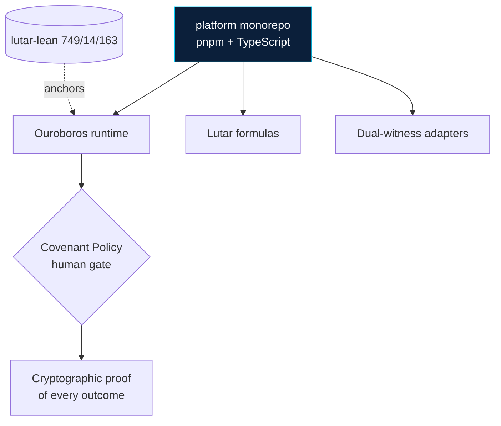

> **SZL Holdings** · Doctrine v11 · Λ = Conjecture 1 (advisory, never "green"/theorem) · canonical [a-11-oy.com](https://a-11-oy.com)

# GitHub Surface Map

<!-- series-a-badges (Doctrine v11) -->
  
  
  
  
  

This document explains every file and directory under `.github/` so contributors and reviewers know what each piece does and when to touch it.

---

## Architecture

See also: [product surfaces](https://github.com/szl-holdings/platform/tree/main/artifacts) · [API spec](https://github.com/szl-holdings/platform/tree/main/docs). SLSA L1 honest; Doctrine v11.

## Quick Reference

| Path | Purpose | Change when |
|------|---------|-------------|
| `.github/BRANCH_PROTECTION.md` | Step-by-step GitHub UI settings for branch protection, merge rules, environments, secrets, and Dependabot | CI job names change or new environments are added |
| `.github/CODEOWNERS` | Maps path patterns to required reviewers | New directories added or ownership changes |
| `.github/copilot-instructions.md` | Copilot coding-assistant instructions scoped to this repo | Coding conventions change |
| `.github/dependabot.yml` | Automated dependency update schedules for npm, pip, docker, and GitHub Actions | New package ecosystems added or PR-limit policy changes |
| `.github/profile/README.md` | Public GitHub organization profile (visible at github.com/szl-holdings) | Platform branding, product names, or links change |
| `.github/PULL_REQUEST_TEMPLATE.md` | Default PR description template with type, affected surfaces, and quality checklist | Required CI checks or quality gates change |
| `.github/RELEASE_TEMPLATE.md` | Release notes template used by the `release.yml` workflow | Release format changes |
| `.github/ISSUE_TEMPLATE/` | Structured issue forms (bug, feature, security redirect) | New issue categories needed |
| `.github/assets/` | Images used by `.github/profile/README.md` | Brand assets updated |
| `.github/instructions/` | Editor-level AI coding instructions (gitignored from public mirror) | Internal tooling only |
| `.github/workflows/` | All GitHub Actions workflows | CI/CD pipeline changes |

---

## Workflows

### Core CI (required for every PR)

| Workflow | Trigger | Required Check | Purpose |
|----------|---------|----------------|---------|
| `ci.yml` | PR + push to `main`/`master` | `CI Gate` | Aggregate gate: lint, typecheck, test, build, integration tests, secret scan, readiness smoke, proof-chain, route security |
| `ci.yml` | PR + push to `main`/`master` | `Readiness Gate (smoke:product-mode)` | Product-mode API smoke test surfaced separately for fast PR visibility |
| `e2e.yml` | PR + push to `main`/`master` | `E2E Gate` | Full Playwright matrix across all artifact surfaces + axe-core a11y |
| `dependency-review.yml` | PR only | `dependency-review` | OSS vulnerability scan on changed dependencies |
| `codeql.yml` | PR + push + weekly schedule | `analyze` | GitHub CodeQL static analysis (JavaScript/TypeScript) |

### Security (advisory / scheduled)

| Workflow | Trigger | Purpose |
|----------|---------|---------|
| `security.yml` | PR + push | Dependency vulnerability scan + SBOM generation |
| `secret-scan-scheduled.yml` | Daily 06:17 UTC + `.gitleaks.toml` changes | Full-history Gitleaks scan against `main`; uploads SARIF to Security tab and opens triage issue on findings |
| `secret-scan.yml` | PR only | PR-diff Gitleaks scan using `.gitleaks.toml` |

### Build & Quality (advisory)

| Workflow | Trigger | Purpose |
|----------|---------|---------|
| `lighthouse.yml` | PR + push | Lighthouse CI performance/a11y/SEO scores — **advisory only** (`continue-on-error: true`; not a blocking required check) |
| `readme-qa.yml` | PR + push | Validates README image paths, badge workflow names, and link integrity |
| `verify-source-of-truth.yml` | PR + push | Checks canonical doc sources are in sync |
| `audit-full.yml` | Manual dispatch | Full audit suite (mocks, routes, deps, copy, design) |
| `commitlint.yml` | PR | Enforces Conventional Commits format |
| `a11y.yml` | PR + push | Axe-core accessibility checks (advisory) |
| `build.yml` | PR + push | Explicit per-artifact build validation |

### Release & Deploy

| Workflow | Trigger | Purpose |
|----------|---------|---------|
| `release.yml` | Push to `main` | Determines semver bump from commit prefixes, creates Git tag, publishes GitHub Release |
| `deploy-staging.yml` | Push to `main` | Deploys to `staging` environment automatically |
| `deploy-production.yml` | Published release | Deploys to `production` environment (requires reviewer approval) |
| `container-publish.yml` | Published release | Builds and publishes Docker images |
| `npm-publish.yml` | Published release | Publishes public packages to npm |

### Operations

| Workflow | Trigger | Purpose |
|----------|---------|---------|
| `backup.yml` | Nightly cron | Database backup and remote upload (Azure Blob). Failure triggers the `backup-upload-stalled` runbook in `INCIDENT_RESPONSE.md` |
| `uptime-monitor.yml` | Scheduled + manual | Checks production endpoints are reachable |
| `prism-counsel-ci.yml` | PR + push | CI for the legacy PRISM Counsel domain API routes (retained for backward compat) |

---

## Issue Templates

| File | Type | Notes |
|------|------|-------|
| `ISSUE_TEMPLATE/bug_report.yml` | Bug report | Structured form: surface, severity, repro steps, environment |
| `ISSUE_TEMPLATE/feature_request.yml` | Feature request | Structured form: problem statement, proposed solution, priority |
| `ISSUE_TEMPLATE/security_report.md` | Security disclosure | Redirects to `security@szlholdings.com` — do not open public issues for vulnerabilities |
| `ISSUE_TEMPLATE/config.yml` | Template config | Disables blank issues; routes security reports off-Issues to email |

---

## Dependency Update Policy

Dependabot is configured in `dependabot.yml` with the following schedule and limits:

| Ecosystem | Directories | Schedule | PR Limit | Grouping |
|-----------|------------|----------|----------|---------|
| `npm` | Root (all pnpm workspaces) | Weekly (Mon 09:00 ET) | 10 | React, Vite, testing, TypeScript, UI, DB, TanStack |
| `pip` | `workers/substrate-python`, `services/substrate-py-workers`, `services/lyte-metrics-store`, `scripts/media` | Weekly (Mon 09:00 ET) | 3 per dir | None (low volume) |
| `docker` | `artifacts/api-server`, `artifacts/szl-holdings`, `artifacts/vessels`, `artifacts/terra`, `artifacts/carlota-jo` | Weekly (Mon 09:00 ET) | 3 per dir | None (low volume) |
| `github-actions` | Root | Weekly (Mon 09:00 ET) | 5 | `actions/*`, `github/*`, CI tooling |

All Dependabot PRs must pass the same required CI checks as any other PR.

> **Note — `docs/github/packages/maven/pom.xml`:** This file is a documentation template for future Java/Kotlin consumers of the GitHub Packages registry (its header says "Copy this file to your package directory"). It is not an active production manifest. No Maven Dependabot entry is needed until an actual Java/Kotlin package is added to the repo.

---

## Secret Scanning

Two complementary layers:

1. **PR-time gate** (`ci.yml` → `secret-scan` job + `secret-scan.yml`): Gitleaks scans the PR diff using `.gitleaks.toml`. Blocks merge on any finding.
2. **Scheduled sweep** (`secret-scan-scheduled.yml`): Full-history Gitleaks scan of `main` every day at 06:17 UTC. Uploads SARIF to the Security tab; opens a triage issue on findings.

Config lives in `.gitleaks.toml`. If you need to add an allowlist entry, document the reason inline and keep patterns as narrow as possible.

**If a real leaked secret is discovered:** do NOT rotate from a PR. File a high-priority follow-up task and add an entry to `INCIDENT_RESPONSE.md` under the "Suspected secret exposure" runbook.

---

## Branch Protection Summary

See `BRANCH_PROTECTION.md` for the full GitHub UI configuration checklist. Required status checks for `main`:

- `CI Gate`
- `Readiness Gate (smoke:product-mode)`
- `E2E Gate`
- `dependency-review`
- `analyze`

The `Lighthouse Gate (advisory)` check is **not** a required check — it runs advisory-only with `continue-on-error: true`.
