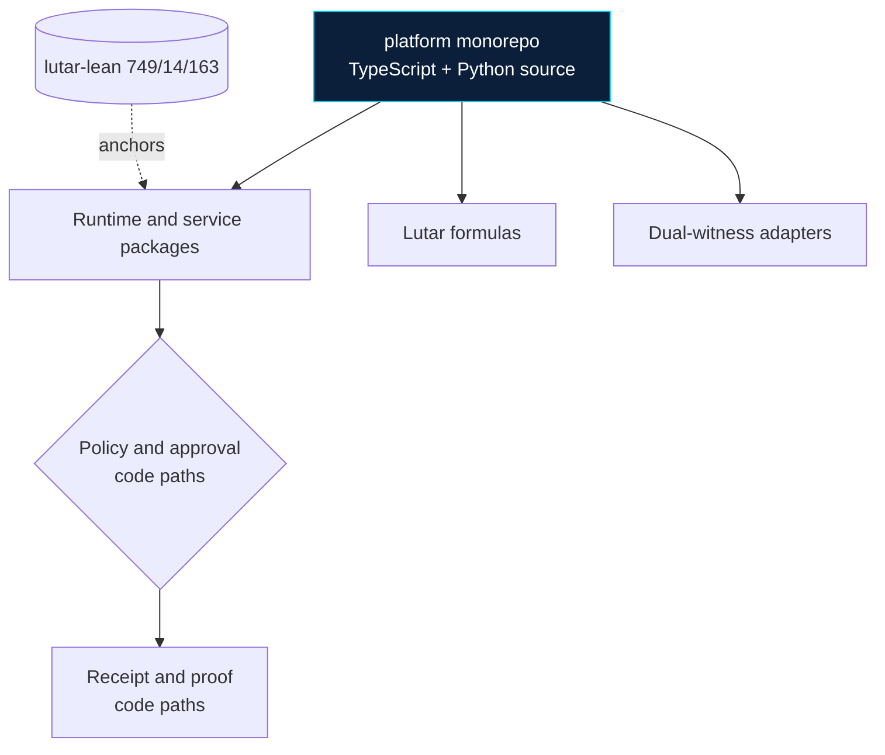

> **SZL Holdings** · Doctrine v11 · Λ = Conjecture 1 (advisory, never "green"/theorem) · canonical [a-11-oy.com](https://a-11-oy.com)

# GitHub Surface Map

<!-- series-a-badges (Doctrine v11) -->
  
  
  
  
  

This document explains every file and directory under `.github/` so contributors and reviewers know what each piece does and when to touch it.

---

## Architecture

```mermaid
flowchart TD
  MONO[platform monorepo\nTypeScript + Python source]:::in --> RUNTIME[Runtime and service packages]
  MONO --> FORMULAS[Lutar formulas]
  MONO --> ADAPTERS[Dual-witness adapters]
  RUNTIME --> COV{Policy and approval\ncode paths}
  COV --> PROOF[Receipt and proof\ncode paths]
  LEAN[(lutar-lean 749/14/163)] -.anchors.-> RUNTIME
  classDef in fill:#0B1F3A,color:#fff,stroke:#00D4FF;
```

This diagram is a source-topology guide, not a runtime, deployment, theorem, or
proof-completeness receipt. See also: [product surfaces](https://github.com/szl-holdings/platform/tree/main/artifacts) · [API spec](https://github.com/szl-holdings/platform/tree/main/docs). SLSA L1 honest; Doctrine v11.

## Quick Reference

| Path | Purpose | Change when |
|------|---------|-------------|
| `.github/BRANCH_PROTECTION.md` | Step-by-step GitHub UI settings for branch protection, merge rules, environments, secrets, and Dependabot | CI job names change or new environments are added |
| `.github/CODEOWNERS` | Maps path patterns to required reviewers | New directories added or ownership changes |
| `.github/copilot-instructions.md` | Copilot coding-assistant instructions scoped to this repo | Coding conventions change |
| `.github/dependabot.yml` | Automated dependency update schedules for npm, pip, docker, and GitHub Actions | New package ecosystems added or PR-limit policy changes |
| `.github/profile/README.md` | Public GitHub organization profile (visible at github.com/szl-holdings) | Platform branding, product names, or links change |
| `.github/PULL_REQUEST_TEMPLATE.md` | Default PR description template with type, affected surfaces, and quality checklist | Required CI checks or quality gates change |
| `.github/RELEASE_TEMPLATE.md` | Release notes template used by the `release.yml` workflow | Release format changes |
| `.github/ISSUE_TEMPLATE/` | Structured issue forms (bug, feature, security redirect) | New issue categories needed |
| `.github/assets/` | Images used by `.github/profile/README.md` | Brand assets updated |
| `.github/instructions/` | Editor-level AI coding instructions (gitignored from public mirror) | Internal tooling only |
| `.github/workflows/` | All GitHub Actions workflows | CI/CD pipeline changes |

---

## Workflows

The current tree contains 47 tracked workflow YAML files. The table below is a
concise source inventory of the promotion-relevant paths; it is not a hosted-run
receipt and “required” refers only to the dated live-ruleset observation in the
Branch Protection Summary.

### Validation and security

| Workflow | Source-declared trigger | Gate or scope |
|----------|-------------------------|---------------|
| `ci.yml` | PR to `main`/`master`, push to `main`, manual | Clean-clone validation on Linux and Windows, lint, and TypeScript typecheck; this file has no aggregate `CI Gate` or readiness job |
| `build.yml` | PR/push to `main`/`master`, manual | Frozen install and canonical full-workspace build |
| `e2e.yml` | PR/push to `main`/`master`, manual | `E2E Gate`; Playwright matrix for A11oy and Carlota Jo, not every artifact |
| `a11y.yml` | PR/push to `main`/`master`, manual | `A11y Gate`; axe WCAG 2.1 AA checks for six named artifacts |
| `lighthouse.yml` | PR/push to `main`/`master`, manual | Six-artifact matrix; accessibility and complete execution are enforced, other score categories are advisory |
| `audit-full.yml` | PR/push to `main`/`master`, manual | `Runtime Audit (audit:full)` with real local smoke targets and a 60-minute timeout |
| `codeql.yml` | PR/push to `main`, weekly, manual | JavaScript/TypeScript and Python analysis plus exact-PR-merge-ref `severity-gate` |
| `security.yml` | PR/push to `main`, Mondays 03:00 UTC, manual | pnpm audit/SBOM, Gitleaks, project secret scan, lockfile integrity, license report, and `Security Gate (blocking)` |
| `trivy.yml` | PR/push to `main`, Mondays 06:00 UTC | Trivy SARIF plus raw, digest-sealed Grype evidence and the fail-closed Grype gate |
| `repro-check.yml` | PR, Mondays 04:17 UTC, manual | Two clean forced builds of one SHA and complete output-manifest comparison (`repro`) |
| `lockfile-registry.yml` | PR/push to `main`, manual | Reusable lockfile registry-host check |
| `dependency-review.yml` | PR to `main` | Review newly introduced vulnerabilities and configured denied licenses |
| `source-of-truth.yml` | path-filtered PR/push to `main`, daily, manual | Canonical current-tree/documentation validator; scheduled/manual Hugging Face comparison is advisory |

### Release and operations

| Workflow | Source-declared trigger | Purpose and boundary |
|----------|-------------------------|----------------------|
| `release.yml` | Release created/published, manual | Generates and attests an SBOM; it does not create a release from a push to `main` |
| `npm-publish.yml` | Published release, version tag, manual | Builds and publishes packages to GitHub Packages |
| `npm-public-publish.yml` | Explicit manual dispatch | Publishes exact reviewed public tarballs after typed confirmation |
| `deploy-staging.yml` | Push to `main`/`master` | Best-effort staging trigger; missing credentials skip it and remote API errors are warnings |
| `post-deploy-smoke.yml` | Deployment workflow completion, manual | Source-declared post-deploy smoke; a configured target and hosted success are separate evidence |
| `warm-flagships.yml` | Schedule, manual, selected push/PR | Flagship probes and authenticated wake-receipt path; deployment and secret availability are unproved by source |

No current workflow named `deploy-production.yml`, `container-publish.yml`,
`backup.yml`, or `uptime-monitor.yml` exists in this tree. See
[`docs/operations/ci-overview.md`](../docs/operations/ci-overview.md) for the
evidence labels and dated ruleset boundary.

---

## Issue Templates

| File | Type | Notes |
|------|------|-------|
| `ISSUE_TEMPLATE/bug_report.yml` | Bug report | Structured form: surface, severity, repro steps, environment |
| `ISSUE_TEMPLATE/feature_request.yml` | Feature request | Structured form: problem statement, proposed solution, priority |
| `ISSUE_TEMPLATE/security_report.md` | Security disclosure | Redirects to `security@szlholdings.com` — do not open public issues for vulnerabilities |
| `ISSUE_TEMPLATE/config.yml` | Template config | Disables blank issues; routes security reports off-Issues to email |

---

## Dependency Update Policy

Dependabot is configured in `dependabot.yml` with the following schedule and limits:

| Ecosystem | Directories | Schedule | PR Limit | Grouping |
|-----------|------------|----------|----------|---------|
| `npm` | Root plus configured `apps`, `artifacts`, `lib`, `packages`, `scripts`, `services`, and `workers` globs | Weekly (Mon 08:00 ET) | 10 | All minor/patch updates |
| `pip` | Root plus configured `apps`, `packages`, `scripts`, `services`, `substrate`, and `workers` globs | Weekly (Mon 08:00 ET) | 5 | All minor/patch updates |
| `docker` | Configured `apps`, `artifacts`, `services`, and `workers` globs | Weekly (Mon 08:00 ET) | 3 | All minor/patch updates |
| `github-actions` | Root | Weekly (Mon 08:00 ET) | 5 | All minor/patch updates |

All Dependabot PRs must pass the same required CI checks as any other PR.

> **Note — `docs/github/packages/maven/pom.xml`:** This file is a documentation template for future Java/Kotlin consumers of the GitHub Packages registry (its header says "Copy this file to your package directory"). It is not an active production manifest. No Maven Dependabot entry is needed until an actual Java/Kotlin package is added to the repo.

---

## Secret Scanning

Three complementary layers are intended; only the workflow layers are
source-confirmed in this checkout:

1. **GitHub-native scanning and push protection:** live enablement was not
   observed. When enabled, GitHub checks provider-known patterns and can block
   matching pushes.
2. **PR-time scan** (`security.yml` → `secret-scan`): Gitleaks scans the PR's base-to-head commit range, then the project-specific scanner checks the current tree. A finding fails the `Security Gate (blocking)` fan-in job.
3. **Default-branch and scheduled scan** (`security.yml` → `secret-scan`): pushes to `main`, manual dispatches, and the Monday 03:00 UTC schedule scan reachable repository history with Gitleaks and check the current tree with the project-specific scanner.

Config lives in `.gitleaks.toml`. If you need to add an allowlist entry, document the reason inline and keep patterns as narrow as possible.

**If a real leaked secret is discovered:** do NOT rotate from a PR. File a high-priority follow-up task and add an entry to `INCIDENT_RESPONSE.md` under the "Suspected secret exposure" runbook.

---

## Branch Protection Summary

`BRANCH_PROTECTION.md` is the human-readable companion to the dated,
authenticated, repository-scoped receipt; neither document proves a check
conclusion. The 2026-10-06 read observed these required contexts for `main`:

- `Runtime Audit (audit:full)`
- `Security Gate (blocking)`
- `E2E Gate`
- `severity-gate`
- `lockfiles / No lockfile references a Replit-internal registry host`

That read was repository-scoped. Organization-wide ruleset detail remained
unavailable, and it does not prove that any check passed for a candidate SHA.
`severity-gate` was already required in that read. The source-declared Grype
and reproducibility gates were not in the observed required list. If the live
ruleset changes, record a fresh authenticated readback before describing either
of those two additional gates as required.
