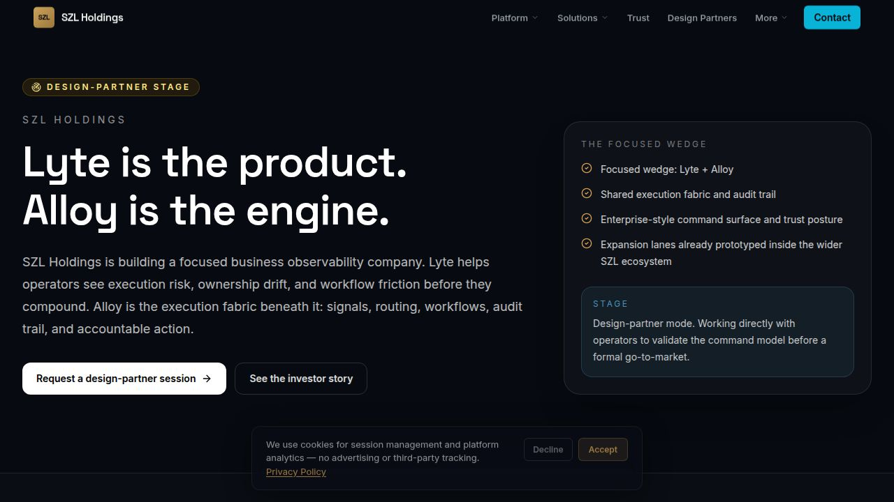
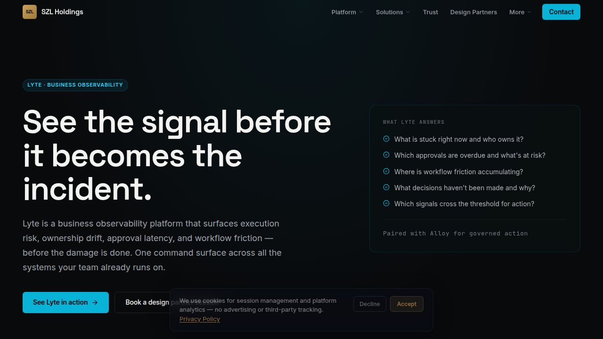
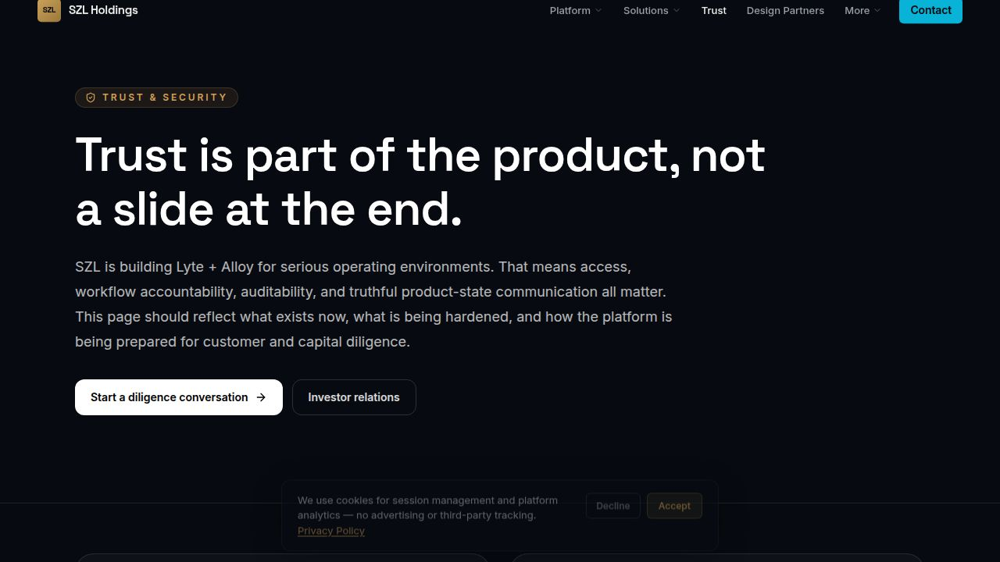

# SZL Holdings Platform

> Lyte is the command surface. Alloy is the execution fabric. Domain packs extend the same system into security, maritime, and real estate.

---

## Platform Ecosystem

SZL Holdings builds **governed operational intelligence software**. The core thesis: business observability must connect to action, not just visualization. AI outputs without traceability create noise, not trust. Every decision should have a signal, a routing path, an approval gate, and an audit trail.

**Lyte** is the flagship product — a business observability platform that surfaces execution risk, ownership drift, and workflow friction before they compound.

**Alloy** is the execution fabric beneath it — signal normalization, workflow orchestration, approval controls, human-in-the-loop gates, and immutable audit trace.

**Domain packs** apply the same architecture where consequence is highest:
| Pack | Domain | Stage |
|------|--------|-------|
| **Aegis** | Security & defense intelligence | Functional alpha |
| **Vessels** | Maritime fleet command | Functional alpha |
| **Terra** | Real estate intelligence | Functional alpha |
| **Carlota Jo** | Premium advisory operations | Live — accepting clients |

## Screenshots








## Why This Matters

- Operational complexity is growing faster than team capacity
- Dashboards show what happened — not what to do next
- AI outputs without governance create risk, not leverage
- Observability must connect to action, approval, and audit

## Architecture at a Glance

```
Signals ──> Normalization ──> Context Engine ──> Routing
                                                   │
                                    ┌──────────────┼──────────────┐
                                    ▼              ▼              ▼
                               Auto-Execute   Approval Gate   Human Review
                                    │              │              │
                                    └──────────────┼──────────────┘
                                                   ▼
                                            Action Execution
                                                   │
                                                   ▼
                                         Immutable Audit Trail
```

**Stack**: TypeScript, React, Express 5, PostgreSQL, Drizzle ORM, Vite, Expo (mobile), Apollo GraphQL, pnpm monorepo.

**AI**: HuggingFace Inference (Qwen3-8B primary), evidence-backed hybrid retrieval, 9 schema-validated decision types, policy-gated tool execution.

**Auth**: OIDC/PKCE, session-based, 11-role RBAC, SCIM 2.0 provisioning, Azure AD multi-tenant SSO.

## Products

### Lyte — Business Observability
The command surface for operators who need to see risk, bottlenecks, ownership gaps, and next actions in one place. PRISM framework: People, Revenue, Infrastructure, Security, Market. Signal timeline, correlation engine, priority action queue, and execution accountability.

### Alloy — Execution Fabric
Workflow orchestration, signal routing, approval matrix, cost controls, governance policies, and audit trail. The layer that makes AI-assisted operations durable and accountable. Enterprise governance dashboard with SOC 2, HIPAA, and financial services compliance templates.

### Aegis — Security & Defense Intelligence
Unified defense platform consolidating SOC, managed operations, and intelligence engine. SOAR playbook engine, STIX/TAXII protocol support, XDR console, MITRE ATT&CK mapping, threat intelligence feeds.

### Vessels — Maritime Intelligence
Fleet command, AIS tracking, route anomaly detection, sanctions screening, voyage economics, and dark activity monitoring. Maritime operations with full signal context and exception-based workflows.

### Terra — Real Estate Intelligence
Distress signal detection, ownership analysis, underwriting workflows, broker scorecards, and pipeline management. Deal intelligence at execution speed with spatial mapping and market data integration.

### Carlota Jo — Premium Advisory
White-glove advisory operations for UHNW residential clients. Private intake, service lanes, client portal, and structured engagement workflows. Advisory informed by platform intelligence.

## Trust

- **Audit trail**: Every action, approval, and decision is logged with actor attribution
- **Human-in-the-loop**: Configurable approval gates before consequential actions
- **AI governance**: Model routing policies, cost controls, and compliance templates
- **Role-based access**: 11-role RBAC with org-scoped tenant isolation
- **Evidence-backed decisions**: AI outputs include source citations and confidence scores

See [Trust Center](docs/trust/trust-center.md) and [Security Posture](docs/trust/security-posture.md).

## Deployment & Operations

- **Source of truth**: Replit workspace (active development)
- **Production target**: Azure (production-ready architecture)
- **Database**: PostgreSQL with 120+ tables, Drizzle ORM
- **Observability**: Structured logging (pino), 8-pillar domain-native framework
- **Mobile**: Expo/React Native apps for Aegis, Vessels, Terra, SZL, Stephen, Carlota Jo

## Documentation Map

| Area | Path |
|------|------|
| Architecture overview | [`docs/architecture/system-overview.md`](docs/architecture/system-overview.md) |
| Platform map | [`docs/architecture/platform-map.md`](docs/architecture/platform-map.md) |
| Data flow | [`docs/architecture/data-flow.md`](docs/architecture/data-flow.md) |
| Trust center | [`docs/trust/trust-center.md`](docs/trust/trust-center.md) |
| Security posture | [`docs/trust/security-posture.md`](docs/trust/security-posture.md) |
| Platform thesis | [`docs/investor/platform-thesis.md`](docs/investor/platform-thesis.md) |
| Product readiness | [`docs/investor/product-readiness.md`](docs/investor/product-readiness.md) |
| Release notes | [`docs/releases/v0.1.0.md`](docs/releases/v0.1.0.md) |

## Start Here

| You are... | Start with |
|------------|------------|
| **Investor** | [Platform Thesis](docs/investor/platform-thesis.md) &#8594; [Product Readiness](docs/investor/product-readiness.md) &#8594; [Why Now](docs/investor/why-now.md) |
| **Technical Reviewer** | [Architecture](docs/architecture/system-overview.md) &#8594; [Data Flow](docs/architecture/data-flow.md) &#8594; [Security](docs/trust/security-posture.md) |
| **Design/Product** | [Platform Map](docs/architecture/platform-map.md) &#8594; [Trust Center](docs/trust/trust-center.md) |
| **Enterprise Buyer** | [Trust Center](docs/trust/trust-center.md) &#8594; [Deployment](docs/trust/deployment-model.md) &#8594; [Contact](https://szlholdings.com/contact) |

## Public Mirror Notice

This repository is a curated public mirror of the SZL Holdings platform workspace. The live Replit workspace is the active source of truth. Proprietary modules, internal tooling, and sensitive configuration are intentionally excluded from the public surface.

See [Public Mirror Policy](docs/public/public-mirror-policy.md) for details.

## License

Proprietary. All rights reserved. See [LICENSE.md](LICENSE.md).

## Contact

**Stephen Lutar** — Founder & CEO, SZL Holdings
- Website: [szlholdings.com](https://szlholdings.com)
- Design partner inquiries: [szlholdings.com/contact](https://szlholdings.com/contact)
