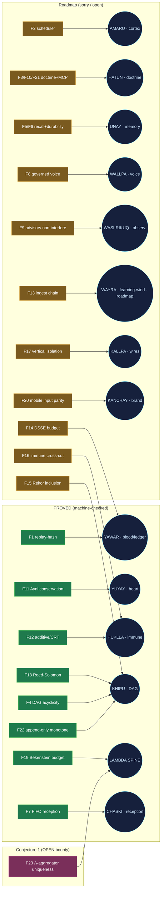

<!-- SPDX-License-Identifier: Apache-2.0 -->
<!-- Sign: Yachay <yachay@szlholdings.dev> · Doctrine v11 · machine source: genome.json -->

# SZL Anatomy GENOME

**Canonical organ ↔ PURIQ formula ↔ Lean theorem ↔ flagship ↔ HF Space ↔ receipt-schema manifest.**

> This Markdown is a thin **index**. The machine-consumable source of truth is
> [`genome.json`](./genome.json) (JSON Schema 2020-12). Tools consume the JSON; humans read this.

- **Doctrine:** v11
- **Lean pin:** lutar-lean@main — 749 declarations / 14 unique axioms / 163 tracked sorries — replay hash c7c0ba17
- **SLSA:** L1 (honest)
- **Λ-aggregator (F23):** Conjecture 1 — NOT a theorem — bounty: [`BOUNTY.md`](https://github.com/szl-holdings/lutar-lean/blob/main/BOUNTY.md)
- **Live receipts (2026-06-02):** 50 total — {"a11oy": 13, "amaru": 13, "rosie": 13, "sentra": 11, "slsa_chain": 5}

> **Provenance honesty.** Quechua / heritage organ names are brand naming and analogy only — no prior-art or mystical claims. Formula statuses quoted verbatim from in-repo codex_formula_provenance.json (PROVED = {F1,F4,F7,F11,F12,F18,F19,F22}; F4/F7/F22 added 2026-06-04 with real zero-sorry Lean proofs in lutar-lean `Lutar/Puriq/Formulas/ProvedFormulas.lean`; F23 = Conjecture 1; all others SORRY_PURIQ_OPEN). Locked Doctrine v11 kernel count 749/14/163 UNCHANGED (PURIQ formula scope excluded from that counter).

---

## Organs

| Organ (Quechua) | English purpose | Lean status | PURIQ formula(s) | Flagship | Live endpoint | Receipts |
|---|---|---|---|---|---|---|
| **AMARU** (`amaru`) | Cortex / Reasoning | PROVEN | F2 | amaru | [https://szlholdings-amaru.hf.space/chakras](https://szlholdings-amaru.hf.space/chakras) | 13 |
| **YUYAY** (`yuyay`) | Heart / Memory (conjunctive gate) | PARTIAL | F11 | amaru | [https://szlholdings-amaru.hf.space/brain](https://szlholdings-amaru.hf.space/brain) | 13 |
| **UNAY** (`unay`) | Cross-session Memory | CONJECTURE | F5, F6 | rosie | [https://szlholdings-rosie.hf.space/](https://szlholdings-rosie.hf.space/) | 13 |
| **YAWAR** (`yawar`) | Blood / Ledger (circulatory) | PROVEN | F1, F14 | a11oy | [https://szlholdings-a11oy.hf.space/governance](https://szlholdings-a11oy.hf.space/governance) | 13 |
| **HUKLLA** (`huklla`) | Immune / Halt-authority | PROVEN | F12, F16 | amaru | [https://szlholdings-amaru.hf.space/brain](https://szlholdings-amaru.hf.space/brain) | 13 |
| **KALLPA** (`kallpa`) | Wires / Interconnect | PARTIAL | F17 | a11oy | [https://szlholdings-a11oy.hf.space/mesh](https://szlholdings-a11oy.hf.space/mesh) | 13 |
| **KHIPU** (`khipu`) | DAG / Merkle Ledger | PROVEN | F4, F15, F18, F22 | rosie | [https://szlholdings-rosie.hf.space/](https://szlholdings-rosie.hf.space/) | 13 |
| **LAMBDA SPINE** (`lambda`) | Skeleton / Λ Aggregator (13 axes) | PROVEN | F19, F23 | a11oy | [https://szlholdings-a11oy.hf.space/lambda](https://szlholdings-a11oy.hf.space/lambda) | 13 |
| **OTel VSP** (`otel`) | Nervous System | PARTIAL | — | a11oy | [https://szlholdings-a11oy.hf.space/mesh](https://szlholdings-a11oy.hf.space/mesh) | 13 |
| **KANCHAY** (`kanchay`) | Brand Projection | CONJECTURE | F20 | a11oy | [https://szlholdings-a11oy.hf.space/](https://szlholdings-a11oy.hf.space/) | 13 |
| **HATUN** (`hatun`) | Doctrine | PROVEN | F3, F10, F21 | a11oy | [https://szlholdings-a11oy.hf.space/frontier/hatun-willay](https://szlholdings-a11oy.hf.space/frontier/hatun-willay) | 13 |
| **SUMAQ RIKUQ** (`sumaq`) | Graphic Designer | PROVEN | — | a11oy | [https://szlholdings-a11oy.hf.space/](https://szlholdings-a11oy.hf.space/) | 13 |
| **CHASKI** (`chaski`) | Reception / Onboarding | SORRY | F7 | a11oy | [https://szlholdings-a11oy.hf.space/chaski](https://szlholdings-a11oy.hf.space/chaski) | 13 |
| **WALLPA** (`wallpa`) | Voice / Expression (OSS-TTS) | SORRY | F8 | a11oy | [https://szlholdings-a11oy.hf.space/wallpa](https://szlholdings-a11oy.hf.space/wallpa) | 13 |
| **WASI-RIKUQ** (`wasi-rikuq`) | House-Watcher / Observability | SORRY | F9 | a11oy | [https://szlholdings-a11oy.hf.space/wasi-rikuq](https://szlholdings-a11oy.hf.space/wasi-rikuq) | 13 |

Receipt schema for every organ: **UDS Governance Receipt** — DSSE-wrapped in-toto attestation, SLSA Provenance v1.0 predicate. Source: [`uds-spans-receipts/schemas/receipt_schema.json`](https://huggingface.co/datasets/SZLHOLDINGS/uds-spans-receipts/blob/main/schemas/receipt_schema.json).

---

## Formula → Organ map (F1–F23)

Proof class is quoted verbatim from the in-repo audit `codex_formula_provenance.json`: **PROVED** = {F1, F4, F7, F11, F12, F18, F19, F22} (F4/F7/F22 closed 2026-06-04 — real zero-sorry Lean proofs, see `lutar-lean Lutar/Puriq/Formulas/ProvedFormulas.lean`); **Conjecture 1** = F23; all others **Roadmap (sorry/open)**.

| Formula | Name | Organ | Lean theorem | Proof class | Live endpoint |
|---|---|---|---|---|---|
| **F1** | Replay-hash determinism / idempotent replay | YAWAR (`yawar`) | `PuriqFormulaLean.lean:L35-L53 (idempotent fold over Nat/List)` | PROVED | [link](https://szlholdings-a11oy.hf.space/governance) |
| **F2** | Scheduler liveness / round-robin fairness | AMARU (`amaru`) | `PuriqFormulaLean.lean:L132-L139` | Roadmap (sorry/open) | [link](https://szlholdings-amaru.hf.space/chakras) |
| **F3** | Organ boot gating soundness | HATUN (`hatun`) | `PuriqFormulaLean.lean:L137-L140` | Roadmap (sorry/open) | [link](https://szlholdings-a11oy.hf.space/frontier/hatun-willay) |
| **F4** | Khipu DAG acyclicity preservation | KHIPU (`khipu`) | `ProvedFormulas.lean (f4_khipu_dag_acyclic) — 0 sorry, core axioms; 2026-06-04` | PROVED | [link](https://szlholdings-rosie.hf.space/) |
| **F5** | Unay receipt-keyed recall correctness | UNAY (`unay`) | `PuriqFormulaLean.lean:L150-L154` | Roadmap (sorry/open) | [link](https://szlholdings-rosie.hf.space/) |
| **F6** | LMDB persistence durability | UNAY (`unay`) | `PuriqFormulaLean.lean:L153-L154` | Roadmap (sorry/open) | [link](https://szlholdings-rosie.hf.space/) |
| **F7** | Chaski FIFO reception ordering | CHASKI (`chaski`) | `ProvedFormulas.lean (f7_chaski_fifo + helpers) — 0 sorry, core axioms; 2026-06-04` | PROVED | [link](https://szlholdings-a11oy.hf.space/chaski) |
| **F8** | Wallpa governed-voice OSS-only safety | WALLPA (`wallpa`) | `PuriqFormulaLean.lean:L159-L160` | Roadmap (sorry/open) | [link](https://szlholdings-a11oy.hf.space/wallpa) |
| **F9** | Wasi-Rikuq advisory non-interference | WASI-RIKUQ (`wasi-rikuq`) | `PuriqFormulaLean.lean:L162-L163` | Roadmap (sorry/open) | [link](https://szlholdings-a11oy.hf.space/wasi-rikuq) |
| **F10** | Hatun-MCP tool-call idempotency | HATUN (`hatun`) | `PuriqFormulaLean.lean:L165-L166` | Roadmap (sorry/open) | [link](https://szlholdings-a11oy.hf.space/frontier/hatun-willay) |
| **F11** | Ayni reciprocity conservation (zero-sum balance) | YUYAY (`yuyay`) | `PuriqFormulaLean.lean:L56-L75 (zero-sum balance over append-only ledger)` | PROVED | [link](https://szlholdings-amaru.hf.space/brain) |
| **F12** | Additive coupling / CRT-style scheduling (Kuramoto-inspired) | HUKLLA (`huklla`) | `PuriqFormulaLean.lean:L77-L87 (distributive/CRT scaffold)` | PROVED | [link](https://szlholdings-amaru.hf.space/brain) |
| **F13** | WAYRA ingest-chain verification / Gauss-Bonnet spine-curvature analogue | WAYRA (`wayra`) | `PuriqFormulaLean.lean:L168-L169` | Roadmap (sorry/open) | (roadmap — WAYRA learning-wind ingest not yet deployed) |
| **F14** | DSSE / partition-style budget audit | YAWAR (`yawar`) | `PuriqFormulaLean.lean:L171-L172` | Roadmap (sorry/open) | [link](https://szlholdings-a11oy.hf.space/governance) |
| **F15** | Rekor transparency-log inclusion | KHIPU (`khipu`) | `PuriqFormulaLean.lean:L174-L175` | Roadmap (sorry/open) | [link](https://szlholdings-rosie.hf.space/) |
| **F16** | Sentra mesh immune cross-cut completeness | HUKLLA (`huklla`) | `PuriqFormulaLean.lean:L177-L178` | Roadmap (sorry/open) | [link](https://szlholdings-amaru.hf.space/brain) |
| **F17** | Three-vertical isolation (a11oy / killinchu / rosie) | KALLPA (`kallpa`) | `PuriqFormulaLean.lean:L180-L181` | Roadmap (sorry/open) | [link](https://szlholdings-a11oy.hf.space/mesh) |
| **F18** | Reed-Solomon RS(10,6) parity / erasure tolerance | KHIPU (`khipu`) | `PuriqFormulaLean.lean:L89-L107 (RS erasure recovery)` | PROVED | [link](https://szlholdings-rosie.hf.space/) |
| **F19** | Bekenstein additive scaffolding / budget monotonicity | LAMBDA SPINE (`lambda`) | `PuriqFormulaLean.lean:L109-L124 (monotone budget scaffold; full inequality NOT proved)` | PROVED | [link](https://szlholdings-a11oy.hf.space/lambda) |
| **F20** | Mobile input-event equivalence (touch/pointer parity) | KANCHAY (`kanchay`) | `PuriqFormulaLean.lean:L183-L184` | Roadmap (sorry/open) | [link](https://szlholdings-a11oy.hf.space/) |
| **F21** | Genome TOML validation totality | HATUN (`hatun`) | `PuriqFormulaLean.lean:L186-L187` | Roadmap (sorry/open) | [link](https://szlholdings-a11oy.hf.space/frontier/hatun-willay) |
| **F22** | Khipu emit append-only monotonicity | KHIPU (`khipu`) | `ProvedFormulas.lean (f22_khipu_emit_monotone + helpers) — 0 sorry, core axioms; 2026-06-04` | PROVED | [link](https://szlholdings-rosie.hf.space/) |
| **F23** | Λ-aggregator soundness (9-axis geometric-mean uniqueness) | LAMBDA SPINE (`lambda`) | `Uniqueness.lean (TH10) + lambda-bounty/Lambda/Lambda.lean — Conjecture 1, NOT a theorem; open CAUCHY_ND sorry Uniqueness.lean:120` | Conjecture 1 | [link](https://szlholdings-a11oy.hf.space/lambda) |

### Visual diagram

---

## Λ bounty

The apex aggregator **F23 (Λ)** is **Conjecture 1**, not a theorem. Any two 9-axis aggregators satisfying A1 idempotence, A2 monotonicity, A3 symmetry, A4 zero-absorption agree on every input.

Open obligation: `Uniqueness.lean:120 (CAUCHY_ND) + missing symmetry axiom`.

A complete, axiom-allowlisted Lean proof earns the founder-set bounty. See [`lutar-lean/BOUNTY.md`](https://github.com/szl-holdings/lutar-lean/blob/main/BOUNTY.md) and the working submission surface at [`lambda-bounty`](https://github.com/szl-holdings/lambda-bounty).

---

*Generated 2026-06-02 from `genome.json`. Co-Authored-By: Perplexity Computer Agent · Sign: Yachay.*