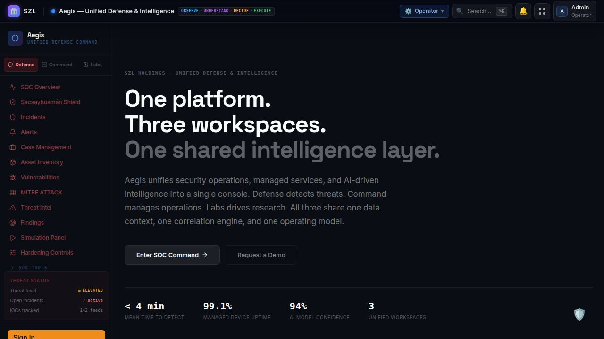
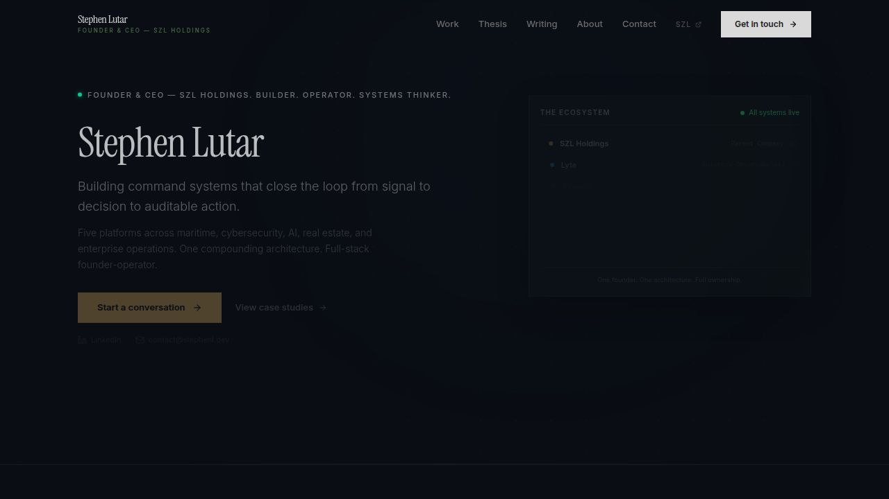

# SZL Holdings — Platform Ecosystem

**Five platforms. One architecture. Built to compound.**

SZL Holdings designs and operates enterprise command systems that connect operational signal to strategic decision — across business observability, maritime intelligence, cybersecurity, real estate, and private advisory. Every platform shares one data layer, one execution fabric, and one AI engine.

Founded and operated by [Stephen Lutar](https://linkedin.com/in/stephen-l-279315240).


---

## Platform Hierarchy

```
┌─────────────────────────────────────────────────────────────────────┐
│  ADVISE                                                             │
│  Carlota Jo — Private Advisory & Strategy Consulting                │
├─────────────────────────────────────────────────────────────────────┤
│  EXECUTE                                                            │
│  Alloy — Execution Fabric, Workflow Engine, Audit Trail             │
├─────────────────────────────────────────────────────────────────────┤
│  OBSERVE · DECIDE · ACT                                             │
│  Lyte — Business Observability (PRISM Framework)                    │
│  Aegis — Unified Defense & Intelligence (Defense/Command/Labs)      │
│  Terra — NYC Real Estate Intelligence                               │
│  Vessels — Maritime Intelligence & Fleet Operations                 │
└─────────────────────────────────────────────────────────────────────┘
```

### The Five Platforms

| Platform | Domain | Doctrine Role |
|----------|--------|---------------|
| **Lyte** | Business Observability | OBSERVE · INTERPRET · ROUTE |
| **Vessels** | Maritime Intelligence | TRACK · ANALYZE · COMMAND |
| **Aegis** | Unified Defense & Intelligence | DETECT · RESPOND · RESEARCH |
| **Terra** | NYC Real Estate Intelligence | DISCOVER · UNDERWRITE · CLOSE |
| **Carlota Jo** | Private Advisory & Strategy | ADVISE · POSITION · GROW |

### Internal Systems

| System | Role |
|--------|------|
| **Alloy** | Execution Fabric — workflow engine, audit trail, automation |
| **INCA** | AI Research — model registry, experiment tracking (Aegis module) |
| **Rosie** | Managed Security Operations (Aegis module) |

---

## Screenshots

| Lyte — Business Observability | Aegis — SOC Dashboard |
|---|---|
|  |  |

| Terra — Real Estate Intelligence | Vessels — Maritime Intelligence |
|---|---|
|  |  |

| Aegis — Marketing | Stephen Lutar — Founder Site |
|---|---|
|  |  |

---

## Architecture

This is a **pnpm monorepo** with a shared TypeScript foundation. Every frontend artifact is a Vite + React SPA. The API server is a single Express process serving all platform backends. PostgreSQL (Drizzle ORM) is the persistence layer. WebSocket provides real-time push to all clients.

```
/
├── artifacts/              # Deployable applications
│   ├── api-server/         # Express API — all platform backends
│   ├── lyte-command-center/# Lyte — Business Observability
│   ├── firestorm/          # Aegis — Defense & Intelligence
│   ├── terra/              # Terra — Real Estate Intelligence
│   ├── vessels/            # Vessels — Maritime Intelligence
│   ├── carlota-jo/         # Carlota Jo — Advisory web app
│   ├── carlota-jo-mobile/  # Carlota Jo — Expo/React Native client app
│   ├── szl-holdings/       # SZL Holdings — corporate site
│   └── stephen-site/       # Stephen Lutar — founder authority site
├── lib/                    # Shared libraries
│   ├── db/                 # Drizzle schema, migrations, seed
│   ├── shared-ui/          # Cross-app React components
│   ├── auth/               # OIDC authentication
│   ├── config/             # Shared configuration
│   ├── services/           # Business logic services
│   ├── workflow-engine/    # Alloy execution fabric
│   ├── ai-engine/          # AI/ML integration layer
│   ├── analytics/          # Event tracking
│   ├── audit/              # Compliance audit trail
│   ├── data-connectors/    # External data source adapters
│   ├── observability/      # APM, logging, metrics
│   ├── api-client-react/   # Generated React Query hooks
│   ├── api-zod/            # Zod schema validation
│   ├── api-spec/           # OpenAPI specification
│   └── graphql-client/     # GraphQL client
├── packages/               # Marketplace packages
│   ├── salesforce-appexchange/ # Salesforce AppExchange package
│   └── atlassian-connect/  # Jira Marketplace Connect app
├── infra/                  # Azure Bicep IaC templates
├── scripts/                # Seed data, post-merge hooks
├── docs/                   # Architecture, trust, deployment docs
└── social-content/         # Brand assets, social media content
```

### Tech Stack

| Layer | Technology |
|-------|-----------|
| Frontend | React 18, Vite, TypeScript, Tailwind CSS v4, Recharts |
| Backend | Express, TypeScript, esbuild |
| Database | PostgreSQL, Drizzle ORM |
| Auth | OpenID Connect (PKCE), session cookies |
| Real-time | WebSocket (HMAC-signed tickets, per-channel ACL) |
| AI | OpenAI, Anthropic, Google Gemini (via integration proxies) |
| Payments | Stripe (Checkout, Subscriptions, Invoicing, Customer Portal) |
| Maps | Mapbox GL JS (Terra property maps, Vessels fleet tracking) |
| Mobile | Expo / React Native (Carlota Jo client app) |
| PDF | pdfkit (server-side document generation, 8 templates) |
| Email | Resend / SendGrid / SMTP (multi-provider with fallback) |
| Notifications | Slack webhooks, Microsoft Teams webhooks, WebSocket push |
| Infra | Azure Bicep (App Service, PostgreSQL, Key Vault, Redis, CDN) |
| Marketplace | Salesforce AppExchange, Jira Marketplace (Connect app) |

---

## Getting Started

### Prerequisites

- Node.js 20+
- pnpm 9+
- PostgreSQL 15+

### Setup

```bash
# Install dependencies
pnpm install

# Copy environment template
cp .env.example .env
# Edit .env with your database URL and secrets

# Push database schema
pnpm --filter db push

# Seed demo data (optional)
pnpm --filter scripts run seed

# Start the API server
pnpm --filter @workspace/api-server run dev

# Start any frontend app
pnpm --filter @workspace/lyte-command-center run dev
pnpm --filter @workspace/firestorm run dev
pnpm --filter @workspace/terra run dev
pnpm --filter @workspace/vessels run dev
pnpm --filter @workspace/szl-holdings run dev
pnpm --filter @workspace/stephen-site run dev
pnpm --filter @workspace/carlota-jo run dev
```

### Build

```bash
# Build all artifacts
pnpm -r build

# Build specific app
pnpm --filter @workspace/lyte-command-center build
pnpm --filter @workspace/api-server build
```

---

## App Inventory

### Lyte — Business Observability

*"In the dark, let Lyte guide you."*

The flagship platform. Lyte defines the category of **Business Observability** — the discipline of making every operational surface visible, contextual, and actionable. Built on the **PRISM** analytical framework:

- **P**ulse — Business health, operating heartbeat, trend status
- **R**isk — Approvals, churn, delays, ownership gaps, regulatory exposure
- **I**ntelligence — Modeled reasoning, evidence, confidence, likely outcomes
- **S**ignals — Anomalies, changes, event spikes, workflow drift
- **M**otion — Escalations, routing, approvals, interventions, execution

PRISM color system: Pulse (#10b981), Risk (#ef4444), Intelligence (#8b5cf6), Signals (#f59e0b), Motion (#0ea5e9).

40+ connector integrations. 7 Pillars of Business Observability doctrine.

### Aegis — Unified Defense & Intelligence

*"One platform. Three workspaces. One shared intelligence layer."*

Enterprise cybersecurity and managed services command console. Three workspaces sharing one data context:

- **Defense** (red) — SOC operations, incident response, MITRE ATT&CK, threat intel
- **Command** (blue) — Managed operations, SLA management, client oversight
- **Labs** (violet) — AI research, model training, neural exploration

Includes INCA (AI Research) and Rosie (Managed Security) as integrated modules.

### Terra — NYC Real Estate Intelligence

*"The distress intelligence platform built for NYC real estate."*

Property intelligence for brokers, investors, and portfolio teams. Surfaces distressed properties, tracks ownership structures, manages deal pipelines, and delivers market intelligence — all from one operating surface.

Six modules: Distress Intelligence, Ownership Intelligence, Deal Pipeline, Market Intelligence, Broker Operations, Investment Analysis.

### Vessels — Maritime Intelligence

*"Fleet operations. Decided faster."*

Maritime command platform for fleet operators. Real-time AIS telemetry, voyage economics, route intelligence, maintenance readiness, dark vessel detection, sanctions screening, and Mapbox-powered fleet tracking.

### Carlota Jo — Private Advisory & Strategy

Luxury consulting platform for brand strategy, advisory, and client engagement. Web app + native mobile client (Expo/React Native) with OIDC authentication, booking flows, document vault, and Stripe-powered billing.

### SZL Holdings — Corporate Site

The parent company site. Ecosystem overview, investor relations, trust center, compliance documentation, and contact. Presents the unified platform hierarchy.

### Stephen Lutar — Founder Authority Site

Professional portfolio and founder positioning site. Work showcase, thesis writing, career command, case studies, and contact.

---

## Authentication

All apps use **OpenID Connect** with PKCE flow. The API server validates sessions via cookie or Bearer token. WebSocket connections use HMAC-signed tickets with 5-minute TTL and per-channel role-based access control.

Roles: `founder_admin`, `admin`, `operator`, `analyst`, `viewer`, `client`.

Mobile (Expo) uses `expo-auth-session` for native OIDC with SecureStore token persistence.

---

## Payments & Billing

Stripe powers all commercial flows:

- **Carlota Jo**: Session bookings via Stripe Checkout
- **Terra**: Starter/Pro subscription tiers with annual discount
- **Aegis**: Enterprise quotes via Stripe Invoicing or Checkout
- **Lyte**: Self-serve and enterprise pricing
- **Vessels**: Enterprise sales model (contact-driven)

Webhook signature verification uses raw request body for HMAC integrity. CSRF exemptions are configured for payment initiation endpoints (Stripe handles security on the payment side).

---

## Email & Notifications

Multi-channel notification pipeline:

- **Email**: Resend (primary), SendGrid (fallback), SMTP (tertiary)
- **Slack**: Webhook or Bot Token delivery for warning+ severity
- **Microsoft Teams**: Webhook delivery for warning+ severity
- **WebSocket**: Real-time push to connected clients
- **In-app**: Toast notifications via WebSocket channel subscriptions

Contact form submissions (Stephen Site, Carlota Jo) send dual emails: confirmation to the submitter, notification to the admin inbox.

---

## PDF Document Generation

Server-side PDF generation via pdfkit with 8 branded templates:

| Template | Context |
|----------|---------|
| `stephen-resume` | Stephen Lutar professional resume |
| `szl-investor-letter` | Investor communications |
| `szl-compliance-summary` | Compliance documentation |
| `szl-portfolio-report` | Portfolio performance report |
| `terra-property-report` | Property analysis with distress scoring |
| `aegis-assessment-report` | Security assessment |
| `firestorm-incident-summary` | Incident post-mortem |
| `carlota-engagement-summary` | Client engagement summary |

---

## Deployment

### Replit (Primary — Development & Staging)

The live workspace runs on Replit with automatic HTTPS, PostgreSQL, and environment secret management. Each artifact binds to a unique port via the `PORT` environment variable.

### Azure (Production — Enterprise)

Full Azure Bicep IaC in `/infra/`:
- App Service (Node.js 20 LTS)
- Azure Database for PostgreSQL Flexible Server
- Azure Key Vault (secrets management)
- Azure Redis Cache (session store)
- Azure CDN (static asset delivery)
- Application Insights (APM)

See [docs/deployment.md](docs/deployment.md) for full deployment guide.

---

## Marketplace Integrations

### Salesforce AppExchange (`packages/salesforce-appexchange/`)

Custom objects, Apex callouts, and webhook listeners for bidirectional sync between Salesforce and the SZL platform. Webhook authentication uses HMAC-signed secrets.

### Jira Marketplace (`packages/atlassian-connect/`)

Atlassian Connect app with JWT-verified lifecycle hooks, issue panel integration, and persistent tenant storage. Syncs Jira issues as platform signals.

---

## Security & Trust

- CSRF protection (double-submit cookie pattern) on all mutation endpoints
- GraphQL depth limiting (max 10 levels)
- WebSocket connection limits (max 500 concurrent)
- HMAC-signed WebSocket tickets with TTL
- Role-based access control on all API routes
- Per-tenant Power BI embed token scoping with RLS
- Constant-time comparison for webhook secret validation
- No secrets in client bundles — all sensitive config server-side only

See [docs/trust-center.md](docs/trust-center.md) for the full security posture.

---

## Environment Variables

See [`.env.example`](.env.example) for the complete list. Key categories:

| Category | Required | Notes |
|----------|----------|-------|
| `DATABASE_URL` | Yes | PostgreSQL connection string |
| `SESSION_SECRET` | Yes | Cookie signing key |
| `STRIPE_*` | No | Payments run in mock mode without keys |
| `RESEND_API_KEY` | No | Email delivery disabled without key |
| `MAPBOX_ACCESS_TOKEN` | No | Maps fall back to styled SVG without token |
| `OPENAI_API_KEY` | No | AI features disabled without key |
| `SLACK_WEBHOOK_URL` | No | Slack notifications disabled without URL |
| `ALLOY_INTERNAL_TOKEN` | Recommended | Server-to-server auth for WebSocket, self-monitor |

---

## Repository Policy

This repository is the **public code mirror** of the live SZL Holdings platform workspace. The source of truth is the live Replit workspace. This mirror is updated periodically to reflect the current state of the platform.

**Predecessor**: This repo succeeds the archived `stephenlutar2-hash/szl-holdings-platform` repository (if archived). All lineage traces back to the original repository.

---

## Documentation

| Document | Description |
|----------|-------------|
| [Architecture](docs/architecture.md) | System architecture, data flow, service boundaries |
| [Trust Center](docs/trust-center.md) | Security posture, compliance, AI governance |
| [Deployment](docs/deployment.md) | Deployment strategies, Azure IaC, CI/CD |
| [Integrations](docs/integrations.md) | Third-party integrations, secrets map, connectors |
| [Product Matrix](docs/product-matrix.md) | Platform inventory, naming, lane ownership |
| [GitHub Mirror Policy](docs/github-mirror-policy.md) | Mirror update policy, branch strategy |
| [Investor Narrative](docs/investor-narrative.md) | Company thesis, market positioning |

---

## License

Proprietary. All rights reserved. SZL Holdings.

**Contact**: [contact@stephenl.dev](mailto:contact@stephenl.dev) · [LinkedIn](https://linkedin.com/in/stephen-l-279315240)
