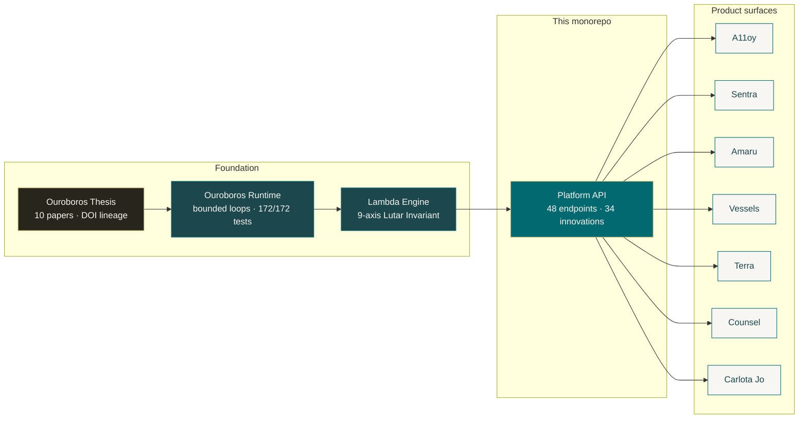
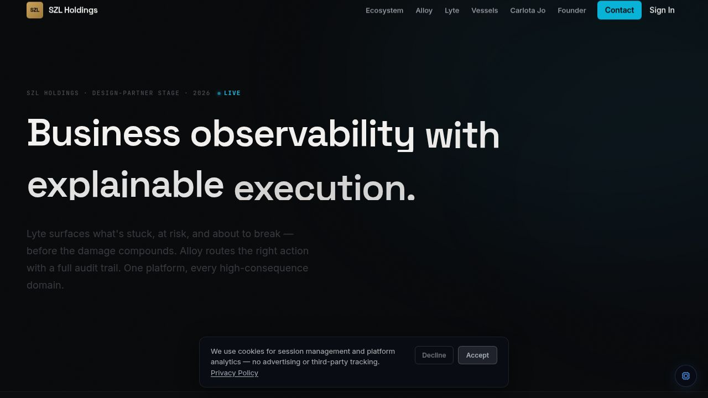
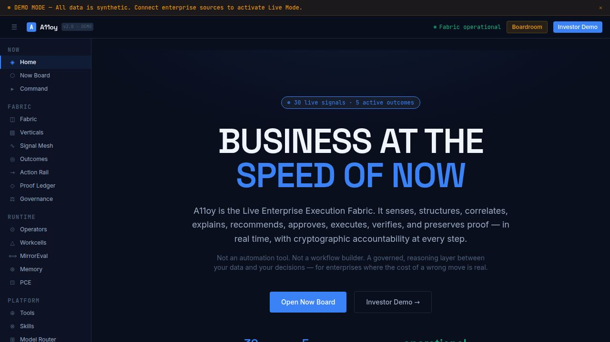
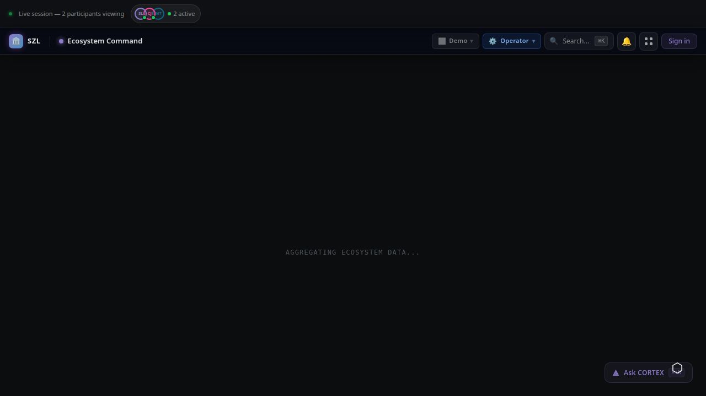
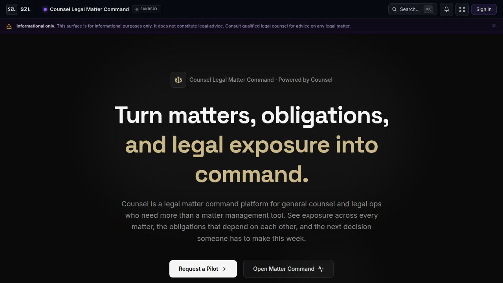
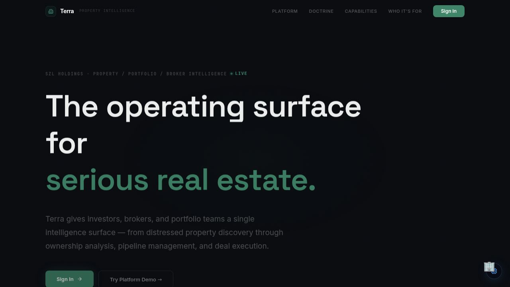
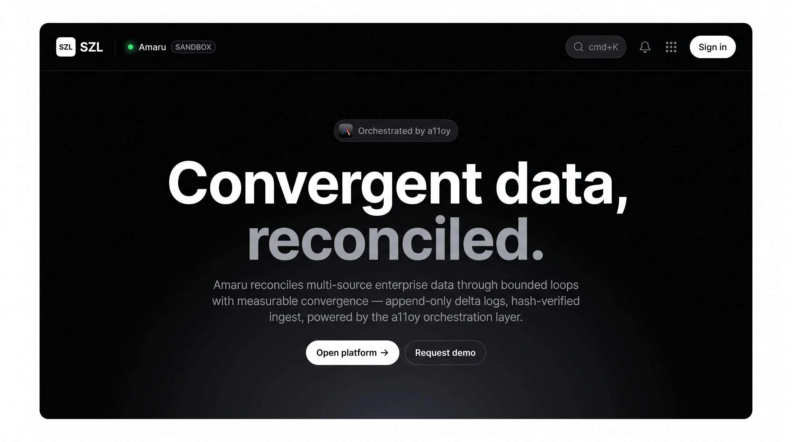
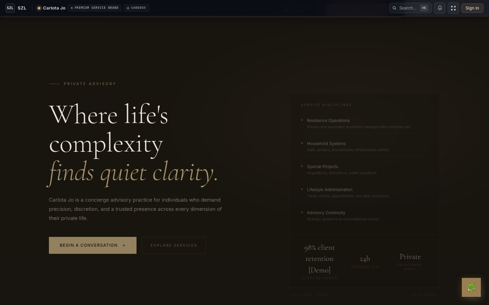
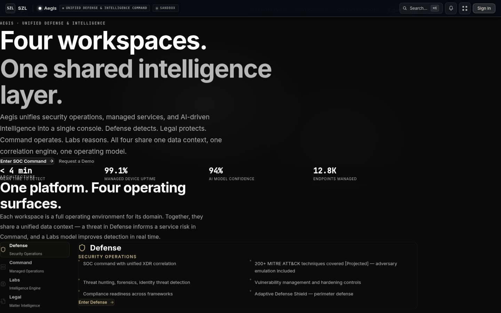

# SZL Holdings

      

**The governed infrastructure for high-consequence decisions.**

## Architecture

> Signal detection, AI-governed recommendations, human approval gates, cryptographic proof of every outcome — across eight enterprise verticals from a single platform.

**What this is in 30 seconds:** SZL Holdings is a TypeScript monorepo containing 14 deployable artifacts — a governed AI decision platform across cybersecurity, real estate, maritime, legal, defense, and advisory verticals. Every product shares one API backend, one authentication model, one design system, and one audit infrastructure. The defining capability is **A11oy**: a seven-layer fabric that connects live signals to human-confirmed actions with cryptographic proof at every step. No action executes autonomously — governance is structural, not advisory.

---

## The Problem

Enterprise operations have an accountability gap. Dashboards show what happened. Alerts surface what is wrong. Neither tells operators *what to do next*, *who authorized it*, or *whether a recommended action is safe to execute*.

AI tools compound the problem: they add recommendation volume without governance. Operators accumulate more data, more noise, and more untracked decisions.

**The problem is not insight — it is accountability.**

---

## What SZL Holdings Builds

**A11oy** is the governed agentic execution layer that sits between enterprise data and enterprise decisions. It senses, structures, correlates, explains, recommends, approves, executes, verifies, and preserves cryptographic proof — in real time, across all SZL verticals.

Every step in the pipeline has a traceable owner, a policy constraint, and an immutable record.

### Core Capabilities

- **Signal Intelligence** — correlated business signals across all connected systems
- **Governed AI Recommendations** — every recommendation carries source citations, confidence scores, and policy constraints
- **Human-Gated Autonomy** — no consequential action executes without human confirmation, enforced structurally
- **Cryptographic Proof** — append-only audit trail linking every decision to actor, policy, and outcome
- **Digital Twin Simulation** — probabilistic modeling before any high-stakes action
- **Multi-Provider AI** — policy-governed routing across leading AI providers
- **Executive Briefing** — board-ready decision surfaces with full attribution chain

---

## Platform Screenshots

Screenshots depict the alpha demo state of the platform (development environment, seeded data). Screenshots are not committed to the git repository and cannot be independently verified as unmodified captures.

### SZL Holdings — Governed Decision Operating System

*Parent company dashboard — governed infrastructure for high-consequence decisions across eight enterprise verticals.*

### A11oy — Live Enterprise Execution Fabric

*A11oy — seven-layer governed agentic fabric, live signal mesh, and cryptographic proof ledger.*

### Unified Command — Operations Surface

*Cross-domain operator surface with governed decision loop, signal timeline, and approval queue.*

### Domain Pack Verticals

| Sentra — Cyber Resilience | Counsel — Legal Matter Command |
|---|---|
|  |  |
| Cyber posture, recovery readiness, and live incident command | Matter tracking, obligation mapping, and legal exposure management |

| Terra — Real Estate Intelligence | Vessels — Maritime Intelligence |
|---|---|
|  |  |
| Deal pipeline, portfolio analytics, and market intelligence | Fleet command, route optimization, and maritime operations |

| Amaru — Convergent Data Sync | Carlota Jo — UHNW Advisory |
|---|---|
|  |  |
| Multi-source data reconciliation with append-only delta logs and hash-verified ingest | Premium concierge operations with Proof-Chain delivery and discreet multi-party coordination |

| Aegis — Defense & Intelligence |
|---|
|  |
| Threat intelligence, defense operations command, and spatial analytics |

> Screenshots captured from the alpha demo environment (development build, seeded data) — 2026-04-27.
> Canonical screenshots are in [`.github/assets/screenshots/`](.github/assets/screenshots/).

---

## Demo Videos

### SZL Holdings — Governed Autonomy Platform Demo

> Full platform walkthrough: A11oy execution fabric, domain packs, governed decision loop, and cryptographic proof chain.

**[Watch on szlholdings.com →](https://szlholdings.com/szl-demo-video/)**

The demo covers the end-to-end governed decision loop: signal ingestion → AI recommendation → human approval gate → Proof Chain record. All domain packs are shown with live seeded data.

### Developer Walkthrough (~90s)

> Monorepo orientation: repo open → API server up → artifact running → preview pane live → readme:check green.

See [`media/WALKTHROUGH.md`](./media/WALKTHROUGH.md) for the step-by-step script (start commands, directory map, and verification steps). The full platform demo above covers the same product flow with all domain packs.

---

## Product Portfolio

<!-- BEGIN: portfolio-table (generated by scripts/generate-readme-product-table.js) -->

| Product | Domain | Status |
|---------|--------|--------|
| **Sentra** | Cyber resilience command — exposure mapping, recovery readiness, incident command, control drift detection | Active |
| **Counsel** | Legal matter command — agentic matter management, obligation tracking, exposure quantification, court filing integration | Active |
| **Aegis** | Security and defense intelligence — SOC command, advanced security modules, SOAR playbooks, threat intelligence | Removed — source directory deleted (Task #1548). Domain backend active; security features consolidated into artifacts/sentra. |
| **Vessels** | Maritime fleet intelligence — AIS tracking, S&P workflow, demurrage, freight, voyage P&L | Active |
| **Terra** | Real estate intelligence — distress pipeline, ownership graph, deal workflow, AI analysis | Active |
| **Carlota Jo** | Premium advisory operations — UHNW client portal, service catalog, engagement management | Active |
| **Pulse** | AI executive briefing — narrative intelligence reports synthesized from live platform signals | Removed — source directory deleted; briefing capability consolidated into a11oy substrate. |
| **IMPERIUM** | Cloud sovereignty — multi-cloud governance, policy enforcement, cloud estate visibility | Archived (Task #920) |

<!-- END: portfolio-table -->

**Additional surfaces:** Command (unified operator surface), Mobile Command (iOS/Android)

---

## Platform Scale

| Metric | Count |
|--------|-------|
| Deployable artifacts | 15 |
| Packages | 152 |
| Shared libraries | 51 |
| Operator products | 8 |

---

## Tech Stack

| Layer | Stack |
|-------|-------|
| **Language** | TypeScript (full stack, strict mode) |
| **Frontend** | React, Vite, Tailwind CSS, Framer Motion |
| **Mobile** | Expo / React Native |
| **Backend** | Express, Node.js |
| **Database** | PostgreSQL, Drizzle ORM |
| **AI** | Multi-provider (governed routing with policy constraints) |
| **Auth** | OIDC/PKCE, multi-role RBAC, deny-by-default enforcement |
| **Infra** | pnpm monorepo, GitHub Actions CI/CD |

---

## Security Posture

- **Access control:** Multi-role RBAC with deny-by-default enforcement. All routes require authentication. All queries are org-scoped.
- **AI governance:** Advisory agents only. Covenant Policy enforces approval gates at the fabric layer. AI cannot bypass human confirmation.
- **Audit trail:** Every consequential action writes an immutable proof entry with actor attribution, timestamp, and decision context.
- **Multi-tenancy:** Cross-tenant access is architecturally prevented, not only policy-controlled.
- **Vulnerability disclosure:** Responsible disclosure only. See [SECURITY.md](SECURITY.md).

---

## Roadmap

| Item | Status |
|------|--------|
| A11oy Phase 1 — Foundation (type system, fabric primitives, demo seed, read API) | ✅ Complete |
| A11oy Phase 2 — Workcell engine with live AI reasoning | 🔜 In Progress |
| A11oy Phase 3 — Full proof-carrying execution with live connectors | 🔜 Planned |
| Mobile Command (unified iOS + Android command) | 🔜 Planned |
| SOC 2 Type 1 audit readiness | 🔜 Roadmap |
| Production customer onboarding | 🔜 Roadmap |

---

## Current Status

**Alpha — last runtime verification 2026-04-27. Web surfaces serve in development. Build pipeline has active failures (see below).**

| Classification | Artifacts |
|---|---|
| `alpha working` | SZL Holdings, API Server, Carlota Jo, Counsel, Pulse (5) |
| `alpha partial` | Vessels, Terra, Command, Sentra, Lyte (5) |
| `build failing` | A11oy, SZL Demo Video (2) — cascaded from SDK dependency |
| `not started` | Mobile Command — scaffold complete, workflow not active |
| `demo-only` | SZL Demo Video (1) |
| `internal only` | Mockup Sandbox (1) |

- A11oy Phase 1: code present; Phase 2 workcell engine in progress; artifact build currently fails
- Six domain pack verticals serve in development; all use seeded/demo data; see matrix for live data gaps
- AI recommendations: multi-provider routing with governed policy constraints — live
- Authentication: OIDC/PKCE with multi-role RBAC — auth gates in place
- Known gaps: `/api/sentra/risks` route missing; Terra maps require Mapbox token; AIS telemetry simulated (not live); TypeScript build fails for `@szl-holdings/sdk` and 9 dependent packages
- Full evidence: [`docs/RELEASE_READINESS_SCORECARD.md`](docs/RELEASE_READINESS_SCORECARD.md)

---

## Access & Collaboration

This repository is proprietary. Source code, architecture, and implementation details are confidential.

**For investors:** We welcome due diligence conversations and guided platform walkthroughs. Contact us to schedule a demo or request access to detailed technical documentation.

**For enterprise evaluation:** Design partner conversations and pilot programs are available for qualified organizations.

**For all other inquiries:** Please reach out via the contact information below.

## Directory Structure

| Path | Contents |
|------|----------|
| `artifacts/` | All deployable web and mobile applications |
| `artifacts/a11oy/` | A11oy — Live Enterprise Execution Fabric |
| `lib/` | Shared libraries: database client, auth, AI, event bus, UI components |
| `apps/` | Background applications: embedding API, ingestion orchestrator, runtime API |
| `services/` | Platform services: Command fabric, Lyte metrics engine, Substrate MCP gateway |
| `workers/` | Background workers: embedding, ranking, reranking, vector, Python substrate |
| `packages/` | Domain packages: design system, substrate, agent core, evidence ledger, policy guard |
| `scripts/` | Seed scripts, QA scripts, screenshot capture, deployment utilities |
| `docs/` | Architecture, trust, investor, and operational documentation |
| `docs/assets/screenshots/current/` | Verified current screenshots — only source for README images |
| `audit/` | Audit reports, QA reports, asset reports |
| `ops/` | Infrastructure configuration, environment matrix, runbooks |
| `.github/workflows/` | CI, CodeQL, security, deploy, and README QA pipelines |

**Artifact inventory:**

> Status labels reflect runtime verification as of 2026-04-27. See [`audit/runtime/app-status-classification.md`](audit/runtime/app-status-classification.md) for full evidence and upgrade paths.

| Artifact | Kind | Preview | Runtime Status |
|----------|------|---------|----------------|
| SZL Holdings Dashboard | web | `/` | `alpha working` — all routes live, KPIs seeded |
| A11oy — Governed Agentic Execution Fabric | web | `/a11oy/` | `build failing` — Phase 1 complete, Phase 2 in progress; SDK dep build issue |
| API Server | web | `/api/` | `alpha working` — demo mode; auth-gated routes correct |
| Command — Unified Command Portal | web | `/command/` | `alpha partial` — CORTEX badge counts not wired to live API |
| Sentra — Cyber Resilience Command | web | `/sentra/` | `alpha partial` — UI complete; `/api/sentra/risks` route missing |
| Counsel — Legal Matter Command | web | `/counsel/` | `alpha working` — matter tracking functional; CourtListener token pending |
| Terra — Real Estate Intelligence | web | `/terra/` | `alpha partial` — maps blank (Mapbox token not configured) |
| Vessels — Maritime Intelligence | web | `/vessels/` | `alpha partial` — AIS simulated; 3 commercial modules not wired |
| Carlota Jo Consulting | web | `/carlota-jo/` | `alpha working` — most complete artifact; live integrations active |
| Lyte — Decision Intelligence | web | `/lyte/` | `alpha partial` — routes functional; legacy path alias missing |
| Pulse — AI Executive Briefing | web | `/pulse/` | `alpha working` — AI multi-provider routing active |
| SZL Holdings — Governed Autonomy Demo | video | `/szl-demo-video/` | `demo-only` — promotional video artifact |
| SZL Holdings — Mobile Command | mobile | `/szl-holdings-mobile/` | `not started` — scaffold complete; splash/icon and push linking pending |

---

## Contact

**Stephen Lutar** — Founder and CEO, SZL Holdings

**Email:** inquiries@szlholdings.com
**Website:** [szlholdings.com](https://szlholdings.com)
**LinkedIn:** [linkedin.com/in/stephen-l-279315240](https://linkedin.com/in/stephen-l-279315240)

---

## Legal

Copyright (c) 2024-2026 SZL Holdings. All rights reserved.

This repository and all contents — including source code, architecture, documentation, and brand assets — are the sole and exclusive property of SZL Holdings. No license, right, or interest is granted by virtue of access. See [LICENSE](./LICENSE).

SZL Holdings, A11oy, Sentra, Terra, Vessels, Counsel, Lyte, Pulse, Command, Carlota Jo, and IMPERIUM are trademarks of SZL Holdings. Certain methods and architectures may be the subject of pending or future patent applications.
