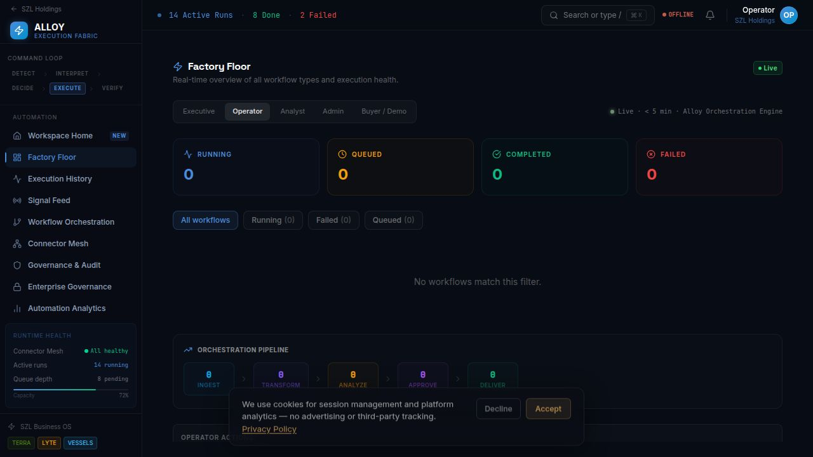

# SZL Holdings Platform

→ [Live Demo](https://szlholdings.com) | [Security](./SECURITY.md) | [Architecture](./docs/architecture/system-overview.md) | [Investor Docs](./docs/investor/platform-thesis.md) | [Trust Center](./docs/trust/trust-center.md)

[](https://github.com/szlholdings/szl-platform/actions/workflows/ci.yml)
[](https://github.com/szlholdings/szl-platform/actions/workflows/e2e.yml)
[](https://github.com/szlholdings/szl-platform/actions/workflows/lighthouse.yml)
[](https://github.com/szlholdings/szl-platform/actions/workflows/codeql.yml)


> Lyte is the command surface. Alloy is the execution fabric. Domain packs extend the same system into security, maritime, and real estate.

> Business observability must connect to action, not just visualization. AI outputs without traceability create noise, not trust. Every decision should have a signal, a routing path, an approval gate, and an audit trail.

**Stephen Lutar** — Founder & CEO, SZL Holdings

---

## Platform Thesis

Enterprise operations have an accountability gap. Dashboards show what happened. Alerts show what's wrong. Neither tells operators what to do next, who is responsible, or whether the recommended action is safe to execute.

AI tools compound the problem: they add recommendation volume without adding governance. Operators end up with more data, more noise, and more untracked decisions running in parallel.

SZL Holdings builds the **governed operational intelligence layer** — the platform that connects what's observable to what's executable, under governance, with full attribution.

---

## Ecosystem

```
┌─────────────────────────────────────────────────────────────────────────┐
│                        SZL Holdings Platform                            │
│                                                                         │
│  ┌─────────────────┐    ┌────────────────────────────────────────────┐  │
│  │      Lyte       │    │                  Alloy                     │  │
│  │  Business       │◄──►│  Signal Routing · Workflow Orchestration   │  │
│  │  Observability  │    │  Approval Gates · Human-in-the-Loop        │  │
│  │  PRISM Framework│    │  Immutable Audit Trail                     │  │
│  └─────────────────┘    └────────────────────────────────────────────┘  │
│                                      │                                  │
│              ┌───────────────────────┼───────────────────────┐          │
│              ▼                       ▼                       ▼          │
│  ┌──────────────────┐   ┌──────────────────┐   ┌──────────────────┐    │
│  │      Aegis       │   │     Vessels      │   │      Terra       │    │
│  │  Security &      │   │  Maritime Fleet  │   │  Real Estate     │    │
│  │  Defense Intel   │   │  Command         │   │  Intelligence    │    │
│  └──────────────────┘   └──────────────────┘   └──────────────────┘    │
│                                                                         │
│  ┌─────────────────────────────────────────────────────────────────┐    │
│  │                Carlota Jo — Premium Advisory                    │    │
│  └─────────────────────────────────────────────────────────────────┘    │
└─────────────────────────────────────────────────────────────────────────┘
```

---

## Products

| Product | Domain | Function | Status |
|---------|--------|----------|--------|
| **Lyte** | Business observability | Command surface — PRISM framework, signal timeline, action queue | Functional alpha |
| **Alloy** | Execution fabric | Signal routing, approval gates, workflow engine, audit trail | Functional alpha |
| **Aegis** | Security & defense | SOC command, SOAR playbooks, threat intelligence, MITRE ATT&CK | Functional alpha |
| **Vessels** | Maritime intelligence | AIS fleet tracking, sanctions screening, dark activity detection | Functional alpha |
| **Terra** | Real estate intelligence | Distress signals, ownership graph, deal pipeline, broker workflow | Functional alpha |
| **Carlota Jo** | Premium advisory | UHNW residential advisory — private intake, client portal | Live |

### Lyte — Business Observability

The command surface for operators who need to see risk, bottlenecks, ownership gaps, and next actions in one place. PRISM framework: **P**eople, **R**evenue, **I**nfrastructure, **S**ecurity, **M**arket. Signal timeline, correlation engine, priority action queue, and execution accountability.

### Alloy — Execution Fabric

Signal normalization, workflow orchestration, approval controls, human-in-the-loop gates, and immutable audit trail. The governance layer that makes AI-assisted operations durable and accountable. Enterprise compliance templates for SOC 2, HIPAA, and financial services.

### Aegis — Security & Defense Intelligence

Unified defense platform: SOC command, MITRE ATT&CK v14 mapping, SOAR playbook engine, STIX/TAXII protocol support, XDR console, AI-assisted triage (Sentinel agent) with human approval gates.

### Vessels — Maritime Intelligence

Fleet command, AIS telemetry, route anomaly detection, sanctions screening, voyage economics, dark vessel detection, and exception-based workflows. Helmsman AI agent for maritime intelligence.

### Terra — Real Estate Intelligence

NYC distress property pipeline (public data sources), ownership entity graph, deal pipeline via Alloy, Mapbox spatial mapping, broker workflow, market signal intelligence.

### Carlota Jo — Premium Advisory

White-glove advisory operations for UHNW residential clients. Private intake, service lanes, client portal, and structured engagement workflows.

---

## Screenshots





---

## Architecture

```
External Signals (integrations, telemetry, data feeds)
        │
        ▼
  Signal Normalization (Alloy)
        │
        ▼
  Context Engine (correlation, attribution, severity scoring)
        │
        ▼
  Routing Logic (priority classification, role assignment)
        │
   ┌────┴────────────────────────────────┐
   ▼                                     ▼
Auto-Execute (policy-approved)    Human Review Gate
   │                                     │
   └────────────────┬────────────────────┘
                    ▼
             Action Execution
                    │
                    ▼
          Immutable Audit Trail (append-only, actor-attributed)
```

**Stack:** TypeScript, React, Express 5, PostgreSQL 16, Drizzle ORM, Vite, Expo (mobile), Apollo GraphQL, pnpm monorepo.

**AI:** HuggingFace Inference (Qwen3-8B primary), evidence-backed hybrid retrieval, 9 schema-validated decision types, policy-gated tool execution.

**Auth:** OIDC/PKCE, session-based, 11-role RBAC, SCIM 2.0 provisioning, Azure AD multi-tenant SSO.

**Infrastructure:** Azure (App Service, PostgreSQL Flexible, Key Vault, Redis, CDN). IaC via Bicep templates.

**Scale:** 16 deployable artifacts, 120+ database tables, 7 web apps, 7 mobile apps.

---

## Trust

An AI-assisted operations platform carries a distinct trust burden. SZL Holdings addresses it structurally:

| Concern | Approach |
|---------|----------|
| **AI without oversight** | Advisory agents cannot execute consequential actions without explicit human confirmation — enforced at the Alloy workflow layer |
| **Opaque AI outputs** | All recommendations include source citations, confidence scores, and retrieval provenance |
| **Audit accountability** | Every action, approval, and decision generates an immutable audit event with actor attribution |
| **Access control** | 11-role RBAC with org-scoped tenant isolation. Every route and WebSocket channel is access-controlled |
| **Multi-tenancy** | All database queries include org_id scoping — cross-tenant access is architecturally prevented |
| **Data in transit** | TLS 1.3 for all connections. HMAC-signed WebSocket tickets with 5-minute TTL |

See [Trust Center](docs/trust/trust-center.md) · [Security Posture](docs/trust/security-posture.md) · [Wiki: Trust Center](../../wiki/Trust-Center)

---

## Deployment

| Environment | Purpose | Status |
|-------------|---------|--------|
| **Replit Workspace** | Active development, internal preview | Live |
| **Azure Production** | Customer-facing production deployment | Production-ready architecture |

See [Deployment Model](docs/trust/deployment-model.md) · [Wiki: Deployment Model](../../wiki/Deployment-Model)

---

## Documentation Map

| Area | Document | Wiki |
|------|----------|------|
| System architecture | [system-overview.md](docs/architecture/system-overview.md) | [Architecture](../../wiki/Architecture) |
| Platform map | [platform-map.md](docs/architecture/platform-map.md) | — |
| Data flow | [data-flow.md](docs/architecture/data-flow.md) | — |
| Trust center | [trust-center.md](docs/trust/trust-center.md) | [Trust Center](../../wiki/Trust-Center) |
| Security posture | [security-posture.md](docs/trust/security-posture.md) | [Security Posture](../../wiki/Security-Posture) |
| Deployment model | [deployment-model.md](docs/trust/deployment-model.md) | [Deployment Model](../../wiki/Deployment-Model) |
| Platform thesis | [platform-thesis.md](docs/investor/platform-thesis.md) | [Investor Overview](../../wiki/Investor-Overview) |
| Product readiness | [product-readiness.md](docs/investor/product-readiness.md) | — |
| Buyer use cases | [use-cases.md](docs/buyer/use-cases.md) | [Buyer Use Cases](../../wiki/Buyer-Use-Cases) |
| Release notes | [v0.1.0.md](docs/releases/v0.1.0.md) | [Roadmap](../../wiki/Roadmap) |
| Public mirror policy | [public-mirror-policy.md](docs/public/public-mirror-policy.md) | — |

---

## Start Here

| You are... | Start with |
|------------|------------|
| **Investor** | [Platform Thesis](docs/investor/platform-thesis.md) → [Product Readiness](docs/investor/product-readiness.md) → [Wiki: Investor Overview](../../wiki/Investor-Overview) |
| **Technical Reviewer** | [Architecture](docs/architecture/system-overview.md) → [Data Flow](docs/architecture/data-flow.md) → [Wiki: Architecture](../../wiki/Architecture) |
| **Enterprise Buyer** | [Trust Center](docs/trust/trust-center.md) → [Use Cases](docs/buyer/use-cases.md) → [Wiki: Buyer Use Cases](../../wiki/Buyer-Use-Cases) |
| **Design/Product** | [Platform Map](docs/architecture/platform-map.md) → [Solution Brief](docs/buyer/solution-brief.md) |
| **General** | [Wiki Home](../../wiki) → [Platform Overview](../../wiki/Platform-Overview) |

---

## Release Status

**Current:** v0.1.0 — Initial Public Platform Release (2026-04-01)

**Phase 2 (active):** Azure production deployment, Stripe billing activation, enterprise SSO, OpenAPI developer portal.

See [CHANGELOG.md](CHANGELOG.md) · [ROADMAP.md](ROADMAP.md) · [Wiki: Roadmap](../../wiki/Roadmap)

---

## Public Mirror Notice

This repository is a curated public mirror of the SZL Holdings platform workspace. The live Replit workspace is the active source of truth. Proprietary modules, internal tooling, and sensitive configuration are intentionally excluded from the public surface.

See [Public Mirror Policy](docs/public/public-mirror-policy.md) for details.

---

## License

Proprietary. All rights reserved. See [LICENSE.md](LICENSE.md).

---

## Contact

**Stephen Lutar** — Founder & CEO, SZL Holdings

| Purpose | Contact |
|---------|---------|
| Enterprise inquiries, design partner | [inquiries@szlholdings.com](mailto:inquiries@szlholdings.com) |
| Investment conversations | [stephen@szlholdings.com](mailto:stephen@szlholdings.com) |
| Security disclosures | [security@szlholdings.com](mailto:security@szlholdings.com) |
| Website | [szlholdings.com](https://szlholdings.com) |
| LinkedIn | [linkedin.com/in/stephen-l-279315240](https://linkedin.com/in/stephen-l-279315240) |
