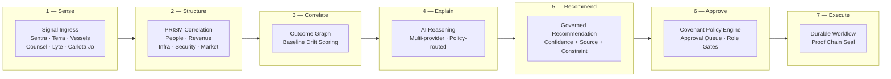

# Platform

> SZL Holdings monorepo — Ouroboros runtime, Lutar formulas, dual-witness adapters, agent-tooling, and CI substrate

<!-- CI + security badges (verified URLs: szl-holdings/platform, not szl-holdings-platform) -->
[](https://github.com/szl-holdings/platform/actions/workflows/ci.yml)
[](https://github.com/szl-holdings/platform/actions/workflows/build.yml)
[](https://github.com/szl-holdings/platform/actions/workflows/codeql.yml)
[](https://github.com/szl-holdings/platform/actions/workflows/security.yml)
[](./LICENSE)
[](https://www.typescriptlang.org/)
[](https://nodejs.org/)
[](https://pnpm.io/)
[](https://doi.org/10.5281/zenodo.20434276)
[](https://szlholdings.com)
[](https://github.com/szl-holdings/platform/blob/main/docs/doctrine/szl-doctrine.md)

Signal detection, AI-governed recommendations, human approval gates, cryptographic proof of every outcome — across eight enterprise verticals from a single TypeScript pnpm monorepo. Every consequential action executes through Covenant Policy; no AI agent operates outside a human confirmation gate.

---

<details>
<summary>Table of Contents</summary>

- [Architecture](#architecture)
- [What SZL Holdings Builds](#what-szl-holdings-builds)
- [Core Fabric — Lyte + Alloy](#core-fabric--lyte--alloy)
- [Product Portfolio](#product-portfolio)
- [Quick Start](#quick-start)
- [Tech Stack](#tech-stack)
- [Platform Scale](#platform-scale)
- [Platform Status](#platform-status)
- [Directory Structure](#directory-structure)
- [Security Posture](#security-posture)
- [Alloy Doctrine](#alloy-doctrine)
- [How to Cite](#how-to-cite)
- [Contributing](#contributing)
- [Contact](#contact)
- [Legal](#legal)

</details>

---

## Architecture

The seven-layer Alloy fabric connects live enterprise signals to human-confirmed decisions with cryptographic proof at each transition:



**Key invariant:** No action reaches layer 7 without layer 6 approval. This is structurally enforced, not policy-configured.

---

## What SZL Holdings Builds

**Alloy** is the governed agentic execution layer that sits between enterprise data and enterprise decisions. It senses, structures, correlates, explains, recommends, approves, executes, verifies, and preserves cryptographic proof — in real time, across all SZL verticals.

Every step in the pipeline has a traceable owner, a policy constraint, and an immutable record.

### Core Capabilities

- **Signal Intelligence** — correlated business signals across all connected systems
- **Governed AI Recommendations** — every recommendation carries source citations, confidence scores, and policy constraints
- **Human-Gated Autonomy** — no consequential action executes without human confirmation, enforced structurally
- **Cryptographic Proof** — append-only audit trail linking every decision to actor, policy, and outcome
- **Digital Twin Simulation** — probabilistic modeling before any high-stakes action
- **Multi-Provider AI** — policy-governed routing across leading AI providers
- **Executive Briefing** — board-ready decision surfaces with full attribution chain

---

## Core Fabric — Lyte + Alloy

### Lyte — Operational Intelligence Layer

Lyte is the observe-and-understand surface. It aggregates live signals from every connected domain, scores them against historical baselines and policy thresholds, and surfaces the prioritized governed decision queue to operators.

Lyte does not act. It observes, understands, and presents.

### Alloy — Governed Execution Fabric

Alloy is the govern-and-act layer. Every recommended action routes through Covenant Policy, collects required approvals, executes as a durable workflow, and seals an immutable Proof Chain entry.

**What Alloy does:**
- Routes every action through Covenant Policy before execution — AI cannot bypass the gate
- Manages approval queues: who must approve, in what order, under what conditions
- Executes confirmed actions as audited, durable workflows with failure recovery
- Writes an immutable Proof Chain entry: signal → recommendation → approval → execution → outcome
- Exposes 2,816 governed API endpoints across all domain verticals

---

## Product Portfolio

| Product | Domain | What It Does |
|---------|--------|--------------|
| **Alloy** | Execution Fabric | Governed agentic layer — signal mesh, proof ledger, covenant policies, operator surfaces |
| **Sentra** | Cybersecurity | Cyber posture management, recovery readiness, incident command |
| **Terra** | Real Estate | Deal pipeline intelligence, portfolio analytics, market signals |
| **Vessels** | Maritime | Fleet command, route optimization, compliance tracking |
| **Counsel** | Legal | Matter tracking, obligation dependency mapping, exposure management |
| **Lyte** | Decision Intelligence | Cross-domain metrics, outcome tracking, decision quality scoring |
| **Pulse** | Executive Briefing | Board-ready decision briefings with attribution and proof chains |
| **Carlota Jo** | Private Advisory | Concierge advisory with live integrations and booking workflow |

**Additional surfaces:** Command (unified operator surface), Mobile Command (iOS/Android)

---

## Quick Start

Prerequisites: Node.js 24+, pnpm 9+

```bash
# Enable corepack to use pnpm
corepack enable

# Install all workspace dependencies
pnpm install

# Start the development server
pnpm run dev
```

To run a specific artifact:

```bash
# Run the SZL Holdings dashboard
pnpm --filter @szl-holdings/platform dev

# Run Sentra (cyber resilience vertical)
pnpm --filter @szl-holdings/sentra dev

# Run all type checks
pnpm run typecheck

# Run CI locally
pnpm run lint && pnpm run test
```

For the full monorepo orientation, see [`media/WALKTHROUGH.md`](./media/WALKTHROUGH.md) and the [Developer Walkthrough video](https://szlholdings.com/szl-demo-video/).

---

## Tech Stack

| Layer | Stack |
|-------|-------|
| **Language** | TypeScript 5.x (full stack, strict mode) |
| **Frontend** | React, Vite, Tailwind CSS, Framer Motion |
| **Mobile** | Expo / React Native |
| **Backend** | Express, Node.js 24+ |
| **Database** | PostgreSQL, Drizzle ORM |
| **AI** | Multi-provider (governed routing with policy constraints) |
| **Auth** | OIDC/PKCE, multi-role RBAC, deny-by-default enforcement |
| **Infra** | pnpm monorepo, GitHub Actions CI/CD |
| **Package Manager** | pnpm 9+ workspace |

---

## Platform Scale

| Metric | Count |
|--------|-------|
| Deployable artifacts | 14 |
| Shared packages | 40 |
| Operator products | 8 |
| Governed API endpoints | 2,816 |

---

## Platform Status

**Alpha — last runtime verification 2026-04-27. Web surfaces serve in development. Build pipeline has active failures (see below).**

| Classification | Artifacts |
|---|---|
| `alpha working` | SZL Holdings, API Server, Carlota Jo, Counsel, Pulse (5) |
| `alpha partial` | Vessels, Terra, Command, Sentra, Lyte (5) |
| `build failing` | Alloy (cascaded from SDK dependency) |
| `not started` | Mobile Command — scaffold complete |
| `demo-only` | SZL Demo Video (1) |

Known gaps: `/api/sentra/risks` route missing; Terra maps require Mapbox token; AIS telemetry simulated; TypeScript build fails for `@szl-holdings/sdk` and 9 dependent packages. Full evidence: [`docs/RELEASE_READINESS_SCORECARD.md`](docs/RELEASE_READINESS_SCORECARD.md)

---

## Platform Screenshots

Screenshots depict the alpha demo state of the platform (development environment, seeded data).

### SZL Holdings — Governed Decision Operating System


*Parent company dashboard — governed infrastructure for high-consequence decisions across eight enterprise verticals.*

### Alloy — Live Enterprise Execution Fabric


*Alloy — seven-layer governed agentic fabric, live signal mesh, and cryptographic proof ledger.*

---

## Directory Structure

| Path | Contents |
|------|----------|
| `artifacts/` | All deployable web and mobile applications |
| `artifacts/a11oy/` | Alloy — Live Enterprise Execution Fabric |
| `lib/` | Shared libraries: database client, auth, AI, event bus, UI components |
| `apps/` | Background applications: embedding API, ingestion orchestrator, runtime API |
| `services/` | Platform services: Command fabric, Lyte metrics engine, Substrate MCP gateway |
| `workers/` | Background workers: embedding, ranking, reranking, vector, Python substrate |
| `packages/` | Domain packages: design system, substrate, agent core, evidence ledger, policy guard |
| `scripts/` | Seed scripts, QA scripts, screenshot capture, deployment utilities |
| `docs/` | Architecture, trust, investor, and operational documentation |
| `audit/` | Audit reports, QA reports, asset reports |
| `ops/` | Infrastructure configuration, environment matrix, runbooks |
| `.github/workflows/` | CI, CodeQL, security, deploy, and README QA pipelines |

---

## Security Posture

- **Access control:** Multi-role RBAC with deny-by-default enforcement. All routes require authentication. All queries are org-scoped.
- **AI governance:** Advisory agents only. Covenant Policy enforces approval gates at the fabric layer. AI cannot bypass human confirmation.
- **Audit trail:** Every consequential action writes an immutable proof entry with actor attribution, timestamp, and decision context.
- **Multi-tenancy:** Cross-tenant access is architecturally prevented, not only policy-controlled.
- **Vulnerability disclosure:** Responsible disclosure only. See [SECURITY.md](SECURITY.md).

---

## Alloy Doctrine

The Alloy Doctrine is the permanent governance framework that defines how all AI agents, contributors, and automated systems operate inside this codebase.

| Document | Purpose |
|----------|---------|
| [`AGENTS.md`](./AGENTS.md) | Root operating contract — execution loop, forbidden actions, naming rules, definition of done |
| [`docs/A11OY_DOCTRINE.md`](./docs/A11OY_DOCTRINE.md) | Core product thesis and operating philosophy |
| [`docs/A11OY_OPERATING_PRINCIPLES.md`](./docs/A11OY_OPERATING_PRINCIPLES.md) | Governing principles for all platform decisions |
| [`docs/A11OY_AGENT_DOCTRINE.md`](./docs/A11OY_AGENT_DOCTRINE.md) | 18 named agent roles, scopes, and proof obligations |
| [`docs/A11OY_NON_NEGOTIABLES.md`](./docs/A11OY_NON_NEGOTIABLES.md) | Absolute rules that cannot be overridden |
| [`docs/A11OY_PROOF_DOCTRINE.md`](./docs/A11OY_PROOF_DOCTRINE.md) | Proof requirements for every consequential action |
| [`docs/A11OY_SECURITY_DOCTRINE.md`](./docs/A11OY_SECURITY_DOCTRINE.md) | Security rules, secret handling, and audit requirements |

---

## How to Cite

If you use this software in research or production, please cite the Ouroboros Thesis v18.0:

```bibtex
@software{szl_holdings_platform_2026,
  title  = {SZL Holdings Platform — Governed Agentic Decision Infrastructure},
  author = {{SZL Holdings}},
  year   = {2026},
  doi    = {10.5281/zenodo.20434276},
  url    = {https://github.com/szl-holdings/platform}
}
```

[](https://doi.org/10.5281/zenodo.20434276)
[](https://orcid.org/0009-0001-0110-4173)

Companion repositories: [`szl-holdings/a11oy`](https://github.com/szl-holdings/a11oy) · [`szl-holdings/sentra`](https://github.com/szl-holdings/sentra) · [`szl-holdings/rosie`](https://github.com/szl-holdings/rosie) · [`szl-holdings/szl-cookbook`](https://github.com/szl-holdings/szl-cookbook)

---

## Contributing

See [CONTRIBUTING.md](CONTRIBUTING.md) for the engineering workflow (branch naming, commit conventions, PR template, and governance gate).

All contributions require: (1) a linked issue, (2) CI green on all required checks, (3) one reviewer approval. Doctrine v6 tone required in PR descriptions. Branch naming: `<type>/<scope>`.

This repository is proprietary. External contributions are not accepted without a signed CLA. Internal agents: consult [`AGENTS.md`](./AGENTS.md) before any change.

---

## Access & Collaboration

This repository is proprietary. Source code, architecture, and implementation details are confidential.

**For investors:** We welcome due diligence conversations and guided platform walkthroughs. Contact us to schedule a demo or request access to detailed technical documentation.

**For enterprise evaluation:** Design partner conversations and pilot programs are available for qualified organizations.

---

## Contact

**Stephen Lutar** — Founder and CEO, SZL Holdings

**Email:** inquiries@szlholdings.com  
**Website:** [szlholdings.com](https://szlholdings.com)  
**LinkedIn:** [linkedin.com/in/stephen-l-279315240](https://linkedin.com/in/stephen-l-279315240)

---

## Legal

Copyright (c) 2024-2026 SZL Holdings. All rights reserved.

This repository and all contents are the sole and exclusive property of SZL Holdings. No license, right, or interest is granted by virtue of access. See [LICENSE](./LICENSE).

SZL Holdings, Alloy, Sentra, Terra, Vessels, Counsel, Lyte, Pulse, Command, Carlota Jo, and IMPERIUM are trademarks of SZL Holdings.
