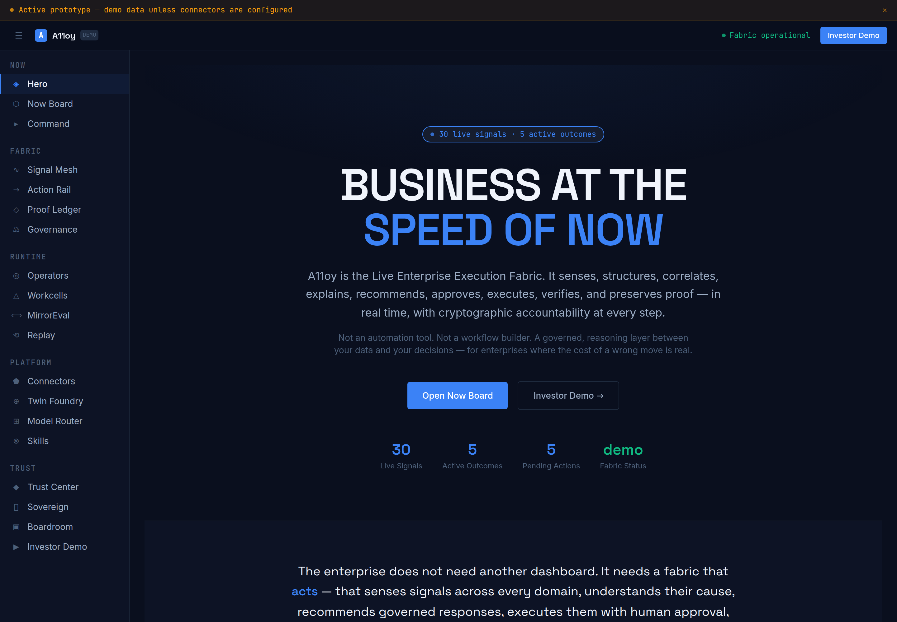
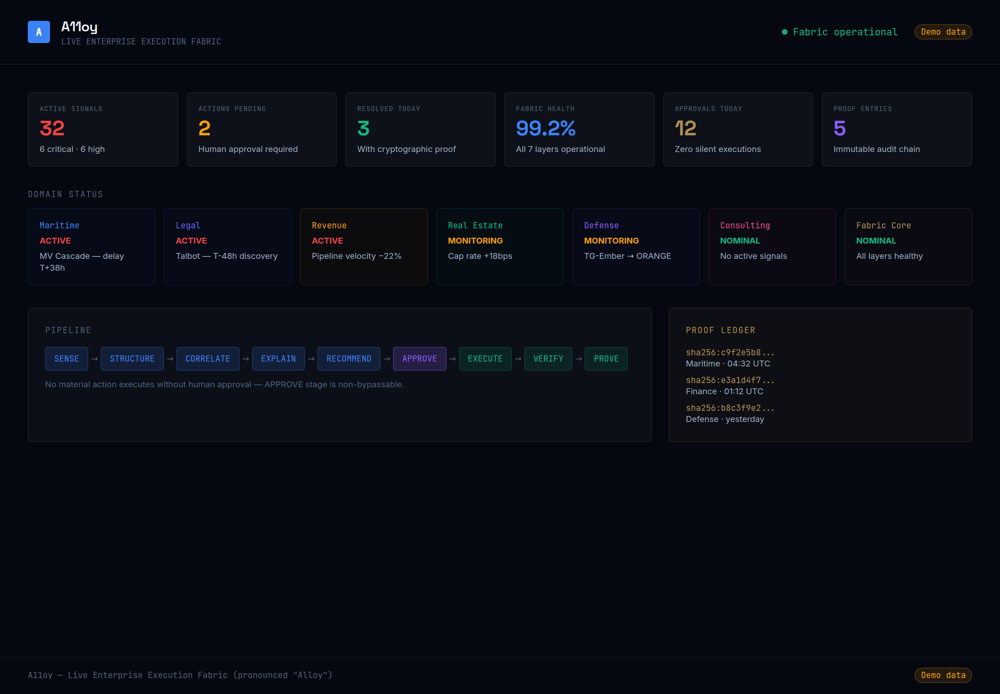
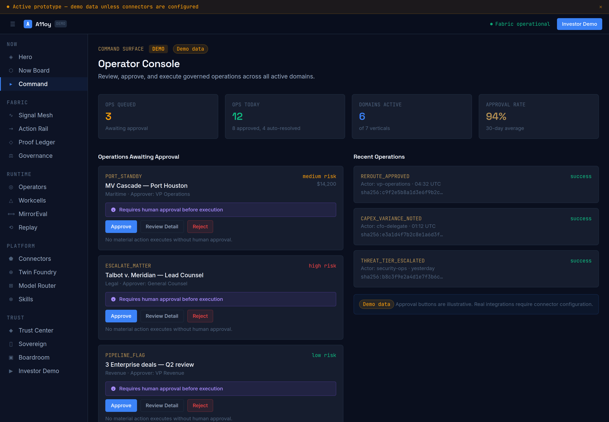
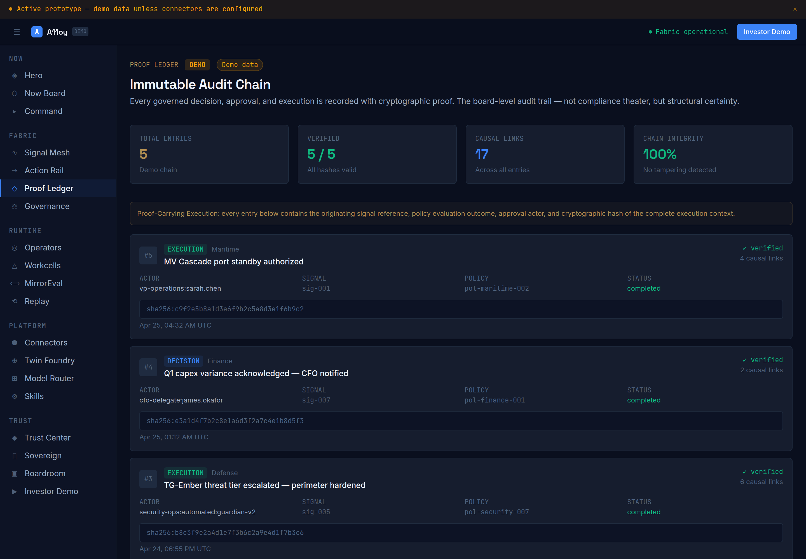
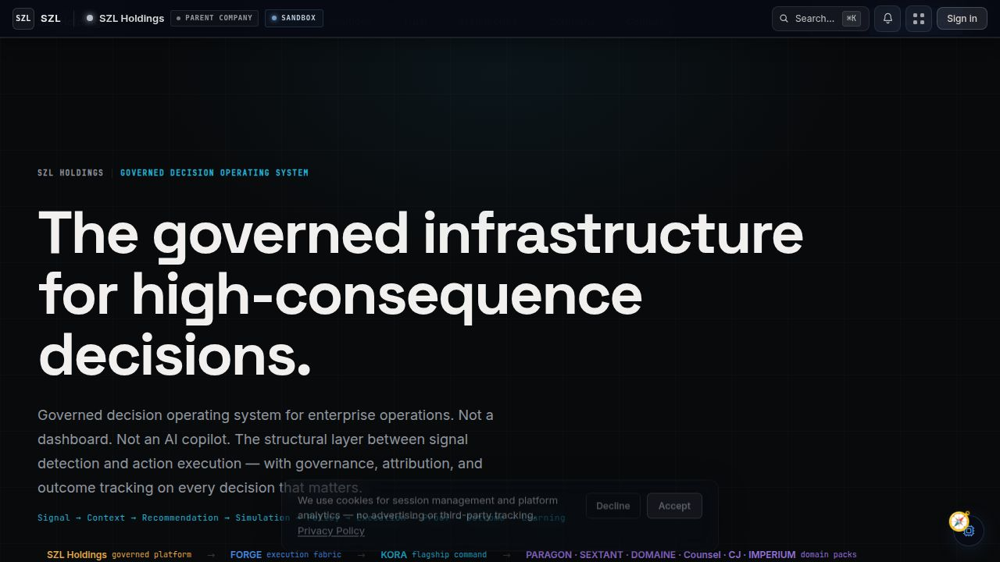
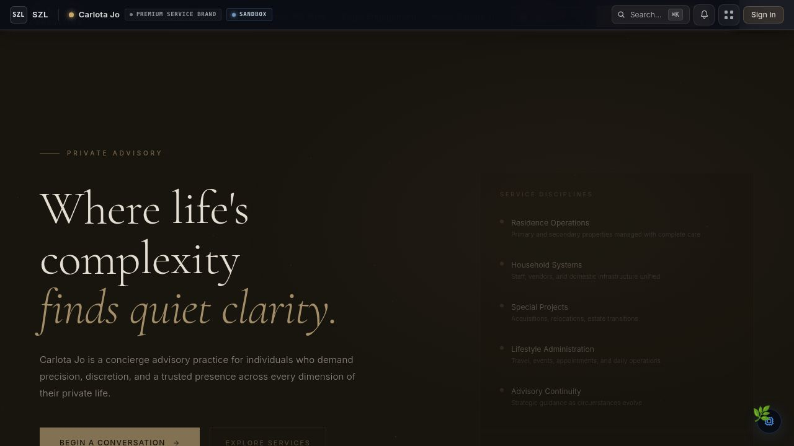

# SZL Holdings

[](https://github.com/szl-holdings/szl-holdings-platform/actions/workflows/ci.yml) [](https://github.com/szl-holdings/szl-holdings-platform/actions/workflows/codeql.yml) [](https://github.com/szl-holdings/szl-holdings-platform/actions/workflows/security.yml) [](./LICENSE) [](https://www.typescriptlang.org/) [](https://pnpm.io/) [](https://www.postgresql.org/)

> **Current status: active prototype / demo platform under development.**  
> No material action is designed to execute without human approval. Demo connectors use mock data unless configured otherwise.

**Governed decision infrastructure — connecting what is observable to what is executable, with full attribution.**

[Architecture](./docs/architecture/architecture.md) · [Platform Primitives](./docs/architecture/platform-primitives.md) · [Trust Center](./docs/trust/trust-center.md) · [Security](./SECURITY.md) · [Investor Docs](./docs/investor/platform-thesis.md)

---

## What A11oy Is

**A11oy** is the governed agentic layer that sits between enterprise data and enterprise decisions. It does not just observe — it senses, structures, correlates, explains, recommends, approves, executes, verifies, and preserves cryptographic proof. In real time. Across all seven SZL verticals.

Every step in the A11oy pipeline has a traceable owner, a policy constraint, and an immutable record.

---

## Why It Exists

Enterprise operations have an accountability gap. Dashboards show what happened. Alerts surface what is wrong. Neither tells operators what to do next, who authorized it, or whether a recommended action is safe to execute.

AI tools compound the problem: they add recommendation volume without governance. Operators accumulate more data, more noise, and more untracked decisions.

A11oy is the layer that closes the gap.

---

## Core Thesis

The problem is not insight — it is accountability. Enterprises do not lack data or dashboards. They lack a system that can answer:

- What should we do next, and why?
- Who approved this, and under what policy?
- What happened as a result?
- Can we prove it?

A11oy makes every one of those questions answerable in under 30 seconds.

---

## Architecture

A11oy is a seven-layer in-memory fabric:

```
Signal Mesh        →  senses raw events from every connected vertical
State Engine       →  maintains current business state across all contexts
Causal Core        →  correlates signals and surfaces root causes
Action Rail        →  routes AI recommendations to human approval gates
Covenant Layer     →  enforces policy constraints before any action executes
Proof Ledger       →  cryptographic append-only record of every decision
Coverage Graph     →  maps observability across all connected systems
```

---

## Execution Pipeline

```
Signal → Context → Recommendation → Simulation → Policy → Approval → Execution → Proof → Outcome
```

Every step is instrumented. Every decision is attributed. Every AI recommendation carries source citations and confidence scores. Every consequential action requires human confirmation.

---

## Product Surfaces

A11oy exposes 19 named surfaces — each a distinct governance view into the fabric:

| Surface | Route | What It Shows |
|---------|-------|---------------|
| **Hero** | `/a11oy/` | Fabric entry point — live signal overview across all verticals |
| **Now Board** | `/a11oy/now` | Real-time prioritized signal stream with causal attribution |
| **Command Surface** | `/a11oy/command` | Unified operator view — all verticals, all pending decisions |
| **Signal Mesh** | `/a11oy/signals` | Correlated signal graph — 32 business signals × 7 verticals |
| **Action Rail** | `/a11oy/actions` | Human-approval queue — no action executes without confirmation |
| **Proof Ledger** | `/a11oy/proof` | Cryptographic audit trail — 5 proof packets, immutable chain |
| **Covenant Governance** | `/a11oy/governance` | Policy engine — 5 covenant policies with approval thresholds |
| **Operator Control Plane** | `/a11oy/agents` | Agent orchestration — observable execution with full trace |
| **Workcells** | `/a11oy/workcells` | Sandboxed execution units with scope and policy constraints |
| **Workcell Replay** | `/a11oy/replay` | Step-by-step execution playback with diff and proof verification |
| **MirrorEval** | `/a11oy/evals` | AI reasoning evaluation — recommendations vs historical outcomes |
| **Connector Firewall** | `/a11oy/connectors` | Governed integration layer — policy-gated data access |
| **Twin Foundry** | `/a11oy/twins` | Digital twin simulation — sensitivity analysis, confidence intervals |
| **Model Router** | `/a11oy/model-router` | Multi-provider AI routing (Anthropic/OpenAI/Gemini) with policy |
| **Skills Library** | `/a11oy/skills` | Composable agent capability registry — versioned, scoped, governed |
| **Trust Center** | `/a11oy/trust` | Platform governance posture — structural controls, not policy docs |
| **Sovereign** | `/a11oy/sovereign` | Data sovereignty — jurisdiction control and residency enforcement |
| **Boardroom Mode** | `/a11oy/boardroom` | Executive decision briefing — attribution, proof chain, board-ready |
| **Investor Demo** | `/a11oy/investor-demo` | Guided walkthrough — signal ingestion to proof ledger verification |

---

## Human-Gated Autonomy

A11oy does not autonomously execute consequential actions. The Action Rail routes every AI recommendation to a human approval gate. The Covenant Layer enforces this structurally — it is not a UI option that can be toggled off.

Approval gates are configurable per policy:
- **Auto-approve**: permitted only for low-risk, high-confidence, policy-approved classes of action
- **Human-confirm**: default for any action with material business consequence
- **Multi-party**: requires quorum approval for high-stakes decisions

Every approval — including auto-approvals — generates an immutable Proof Ledger entry with actor attribution.

---

## Operators

The Operator Control Plane gives platform operators full visibility into agent execution:
- Active agents with execution status and current task
- Full execution trace — every step, every tool call, every output
- Intervention controls — pause, override, or terminate any agent at any point
- Attribution — every agent action is linked to the operator who authorized it

Agents cannot operate outside their defined Workcell scope.

---

## Workcells

Workcells are sandboxed execution environments for agent tasks. Each Workcell has:
- **Scope**: what data and systems the agent can access
- **Policy**: what actions the agent can take, and under what approval constraints
- **Trace**: full execution log, replayable at any point
- **Proof**: cryptographic proof of every action taken within the cell

## A11oy Doctrine

The A11oy Doctrine is the repo-native operating system for every AI agent, Replit task, Codex session, and human contributor working in this repo. Read `AGENTS.md` before touching any file.

**Core Execution Loop:**

```
Context → Plan → Patch → Test → Screenshot → Verify → Proof → Commit
```

| Document | Purpose |
|----------|---------|
| **[AGENTS.md](./AGENTS.md)** | Authoritative operating doctrine: core loop, forbidden actions, naming rules, done criteria |
| **[docs/A11OY_DOCTRINE.md](./docs/A11OY_DOCTRINE.md)** | Product thesis, operating philosophy, and five principle categories |
| **[docs/A11OY_AGENT_DOCTRINE.md](./docs/A11OY_AGENT_DOCTRINE.md)** | All 18 named agents with full specifications and sample prompts |
| **[docs/A11OY_DEFINITION_OF_DONE.md](./docs/A11OY_DEFINITION_OF_DONE.md)** | Full done checklist — a task is not done without this |
| **[docs/A11OY_PUBLIC_CLAIMS_DOCTRINE.md](./docs/A11OY_PUBLIC_CLAIMS_DOCTRINE.md)** | Blocked claims, required qualifiers, soften-or-remove rule |
| **[docs/A11OY_SCREENSHOT_DOCTRINE.md](./docs/A11OY_SCREENSHOT_DOCTRINE.md)** | Screenshot quality rules and blocked screenshot types |
| **[docs/A11OY_SECURITY_DOCTRINE.md](./docs/A11OY_SECURITY_DOCTRINE.md)** | Security rules, secret hygiene, .gitignore requirements |
| **[docs/A11OY_RELEASE_DOCTRINE.md](./docs/A11OY_RELEASE_DOCTRINE.md)** | Release readiness checklist and nine-category scoring |

Quick agent reference and copy-ready prompts: [`skills/a11oy-code/`](./skills/a11oy-code/)

- **Artifact:** `artifacts/a11oy` — serves at `/a11oy/`
- **API:** Read-side REST API at `/api/a11oy/*` (11 GET endpoints, all public in Phase 1)
- **Seed data:** 32 business signals × 7 verticals, 5 outcomes, 5 covenant policies, 5 proof packets
- **Architecture:** Seven-layer in-memory fabric (Coverage Graph, Signal Mesh, State Engine, Causal Core, Action Rail, Covenant Layer, Proof Ledger)
- **Phase:** Phase 1 Foundation — full type system, fabric primitives, demo seed, read-side API
- **Phase 2 (planned):** Workcell engine, live AI reasoning, full proof-carrying execution
- **Docs:** `AGENTS.md` · `CONTEXT.md` · `llms.txt`

Workcell Replay lets operators or auditors step through any completed execution and verify every decision.

---

## MirrorEval

MirrorEval is A11oy's AI reasoning evaluation harness. It compares AI recommendations against historical outcomes to surface:
- Accuracy drift over time
- Confidence calibration (do 80%-confidence recommendations win 80% of the time?)
- Recommendation bias by vertical or signal type
- Coverage gaps — signals the fabric is not yet surfacing

MirrorEval is not a benchmark. It is a closed-loop learning system that continuously improves the fabric.

---

## Covenant Layer

The Covenant Layer is the policy enforcement plane. Covenant Policies define:
- What agents and users can do
- What approval requirements apply
- What escalation paths exist if policies cannot be satisfied
- What the proof record must contain

Policies are structural. They cannot be bypassed by users, agents, or API calls. Any attempted policy violation is logged and surfaced as a Trust Center alert.

---

## Connector Firewall

The Connector Firewall governs all integration data access. No connector can read or write data without:
1. An active policy permitting the operation
2. A scoped credential with minimum necessary permissions
3. An audit log entry for every access

Demo connectors use mock data. Live connectors require explicit configuration and policy assignment.

---

## Proof Ledger

The Proof Ledger is the cryptographic audit trail. Every governed action — whether executed, rejected, or escalated — generates an append-only Proof Ledger entry containing:
- Actor (human or agent)
- Signal or trigger
- Recommendation and confidence
- Policy applied
- Approval chain
- Execution result
- Outcome (tracked over time via the Outcome Graph)

Proof packets are verifiable — compliance teams can reconstruct any decision chain from the ledger alone.

---

## Twin Foundry

The Twin Foundry creates digital twins of business systems for decision simulation. Before any consequential action executes, operators can:
- Run a probabilistic simulation on the current twin
- See confidence intervals and sensitivity analysis
- Understand what could happen, not just what should be done

Simulation results are attached to the Proof Ledger entry so post-decision review includes the pre-decision model.

---

## Boardroom Mode

Boardroom Mode translates A11oy's operational fabric into executive-grade decision briefings. It surfaces:
- The most consequential pending decisions requiring board or C-suite attention
- Attribution for who recommended each action and under what policy
- Proof chain links to the full decision context
- Outcome summaries for previously approved decisions

Boardroom Mode is not a summary — it is a governed decision surface with the same proof chain guarantees as the full operator view.

---

## Demo Screenshots

The screenshots below are verified, unmodified captures from the active demo platform. No mockups or AI-generated imagery.

### A11oy — Governed Agentic Execution Fabric



*A11oy hero — seven-layer governed agentic fabric with live in-memory seed data. Captured 2026-04-25.*



*Boardroom Mode — executive-ready governed decision briefing with attribution and proof chain links. Captured 2026-04-25.*



*Command Surface — unified operator view across all verticals, with human-approval queue. Captured 2026-04-25.*



*Proof Ledger — cryptographic append-only audit trail. 5 proof packets demonstrating signal-to-outcome traceability. Captured 2026-04-25.*

### Platform Surfaces and Domain Packs






> A11oy screenshots (`.png`) captured 2026-04-25 from the live Vite dev server. Platform surface screenshots (`.jpg`) captured 2026-04-21. All images are unmodified captures — no mockups or AI-generated imagery. See `docs/assets/screenshots/current/screenshot-manifest.md` for the full manifest (81 A11oy captures across 19 routes and 5 viewports).

---

## Tech Stack

| Layer | Stack |
|-------|-------|
| **Language** | TypeScript 5.x (full stack, strict mode) |
| **Frontend** | React 19, Vite, Tailwind CSS 4, Framer Motion, Recharts |
| **Mobile** | Expo SDK 53 / React Native, NativeWind |
| **Backend** | Express 5, Node.js 22 |
| **Database** | PostgreSQL 16, Drizzle ORM |
| **AI** | Multi-provider (Anthropic, OpenAI, Gemini), evidence-backed retrieval |
| **Auth** | OIDC/PKCE, 11-role RBAC, SCIM 2.0, deny-by-default enforcement |
| **Infra** | pnpm monorepo, Turbo, Azure (App Service, PostgreSQL Flexible, Key Vault) |
| **CI/CD** | GitHub Actions — lint, typecheck, test, build, CodeQL, dependency review, secret scan |

---

## Running Locally

**Requirements:** Node.js 22+, pnpm 10+

```bash
git clone https://github.com/szl-holdings/szl-holdings-platform.git
cd szl-holdings-platform
pnpm install
pnpm seed          # seed the local database with demo data
pnpm dev           # start all artifact workflows
```

A11oy (`/a11oy/`) uses in-memory seed data and does not require DATABASE_URL to be provisioned in Phase 1. All other domain pack surfaces require a configured PostgreSQL instance.

**Common tasks:**

```bash
pnpm typecheck              # TypeScript type checking across all packages
pnpm test                   # unit and component tests
pnpm test:integration       # integration tests
pnpm screenshots:proof      # capture investor-grade screenshots (requires all workflows running)
pnpm validate:markdown-assets  # validate all image and link references in README files
pnpm qa:routes              # smoke-test all routes
pnpm audit:all              # run full audit suite
```

---

## Environment Variables

| Variable | Required | Purpose |
|----------|----------|---------|
| `DATABASE_URL` | Yes (for domain packs) | PostgreSQL connection string |
| `ANTHROPIC_API_KEY` | Optional | AI recommendations (falls back to mock) |
| `OPENAI_API_KEY` | Optional | AI recommendations (falls back to mock) |
| `GEMINI_API_KEY` | Optional | AI recommendations (falls back to mock) |
| `SESSION_SECRET` | Yes | Express session signing |
| `PORT` | Auto-assigned | Artifact dev server port (set by Replit) |

See [docs/operations/deployment-guide.md](docs/operations/deployment-guide.md) for the full environment variable matrix and staging/production configuration.

---

## Security Posture

**Access control:** 11-role RBAC with deny-by-default enforcement. All routes require authentication. All queries are org-scoped. Cross-org access returns 404 to prevent information leakage.

**AI governance:** Advisory agents only. Covenant Policy enforces approval gates at the fabric layer. AI cannot bypass human confirmation requirements.

**Audit trail:** Every consequential action writes an immutable Proof Ledger entry with actor attribution, timestamp, source, and decision context.

**Multi-tenancy:** All queries include org_id scoping — cross-tenant access is architecturally prevented, not only policy-controlled.

**Vulnerability disclosure:** See [SECURITY.md](SECURITY.md). Responsible disclosure only.

> No SOC 2, HIPAA, FedRAMP, or ISO certifications are claimed. Compliance readiness is a planned roadmap item. See [docs/operations/known-gaps.md](docs/operations/known-gaps.md) for honest technical debt assessment.

---

## Roadmap

| Item | Status |
|------|--------|
| A11oy Phase 1 — Foundation (full type system, fabric primitives, demo seed, read API) | ✅ Complete |
| A11oy Phase 2 — Workcell engine with live AI reasoning | 🔜 Planned |
| A11oy Phase 3 — Full proof-carrying execution with live connectors | 🔜 Planned |
| APEX mobile (unified iOS + Android command) | 🔜 Deferred after APEX ships |
| SOC 2 Type 1 audit readiness | 🔜 Roadmap |
| HIPAA controls implementation | 🔜 Roadmap |
| Production customer onboarding | 🔜 Roadmap |

---

## Current Status

**Active prototype / demo platform under development.**

- A11oy Phase 1: fully implemented. All 19 routes functional with in-memory seed data.
- Domain pack surfaces: implemented and active with seeded demo data.
- AI recommendations: backed by multi-provider routing; demo data used in absence of live connectors.
- Authentication: full OIDC/PKCE with 11-role RBAC implemented.
- No production customers. No revenue. No official partnerships.
- All screenshots are from the active demo platform — no mockups or AI-generated imagery.

---

## Canonical Entry Points

| Document | Purpose |
|---|---|
| **[docs/INDEX.md](./docs/INDEX.md)** | Master index of all documentation, audit reports, and doctrine |
| **[docs/doctrine/szl-doctrine.md](./docs/doctrine/szl-doctrine.md)** | The SZL point of view: four pillars, voice rules, anti-patterns |
| **[packages/config/](./packages/config/)** | Single source of truth: platform registry, claims, feature flags, env contract |
| **[docs/APP_STATUS.md](./docs/APP_STATUS.md)** | Authoritative artifact readiness register |
| **[docs/operations/known-gaps.md](./docs/operations/known-gaps.md)** | Honest inventory of technical debt and remediation paths |
| **[docs/platform-facts.md](./docs/platform-facts.md)** | Authoritative platform statistics |
| **[audit/AUDIT_START_STATE.md](./audit/AUDIT_START_STATE.md)** | Repo state at start of screenshot/README pass |

---

## Repository Map

| Path | Contents |
|------|----------|
| `artifacts/` | All deployable web and mobile applications |
| `artifacts/a11oy/` | A11oy — Live Enterprise Execution Fabric |
| `lib/` | Shared libraries: database client, auth, AI, event bus, UI components |
| `apps/` | Background applications: embedding API, ingestion orchestrator, runtime API |
| `services/` | Platform services: FORGE fabric, KORA metrics, Substrate MCP gateway |
| `workers/` | Background workers: embedding, ranking, reranking, vector, Python substrate |
| `packages/` | Domain packages: design system, substrate, agent core, evidence ledger, policy guard |
| `scripts/` | Seed scripts, QA scripts, screenshot capture, deployment utilities |
| `docs/` | Architecture, trust, investor, and operational documentation |
| `docs/assets/screenshots/current/` | Verified current screenshots — only source for README images |
| `audit/` | Audit reports, QA reports, asset reports |
| `ops/` | Infrastructure configuration, environment matrix, runbooks |
| `.github/workflows/` | CI, CodeQL, security, deploy, and README QA pipelines |

**Artifact inventory:**

| Artifact | Kind | Preview | Status |
|----------|------|---------|--------|
| SZL Holdings Dashboard | web | `/` | Active |
| A11oy — Live Enterprise Execution Fabric | web | `/a11oy/` | Active — Phase 1 complete |
| API Server | web | `/api/` | Active — backend API |
| FORGE Command Portal | web | `/command/` | Active — cross-domain command surface |
| TENAX — Cyber Resilience Command | web | `/sentra/` | Active — domain pack |
| Counsel — Legal Matter Command | web | `/counsel/` | Active — domain pack |
| DOMAINE — Real Estate Intelligence | web | `/terra/` | Active — domain pack |
| SEXTANT Maritime Intelligence | web | `/vessels/` | Active — domain pack |
| Carlota Jo Consulting | web | `/carlota-jo/` | Active — domain pack |
| LUMINA — AI Executive Briefing | web | `/pulse/` | Active — cross-domain briefing |
| PARAGON (Investor Pitch Deck) | web | `/aegis/` | Active — investor slides and ATLAS runtime |
| SZL Holdings — Governed Autonomy Demo | video | `/szl-demo-video/` | Active — 60-second demo video |
| SZL Holdings — Mobile Command (APEX) | mobile | `/szl-holdings-mobile/` | Deferred — after APEX ships |

---

## Contact

**Stephen Lutar** — Founder and CEO, SZL Holdings

**Email:** inquiries@szlholdings.com  
**Website:** [szlholdings.com](https://szlholdings.com)  
**LinkedIn:** [linkedin.com/in/stephen-l-279315240](https://linkedin.com/in/stephen-l-279315240)

Open to design partner conversations, enterprise evaluation, and investment introductions.
