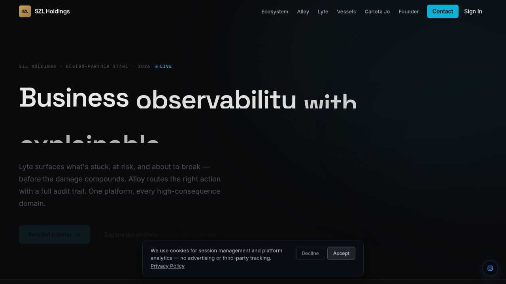
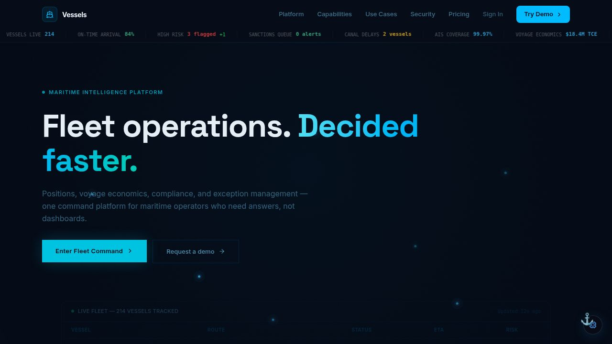
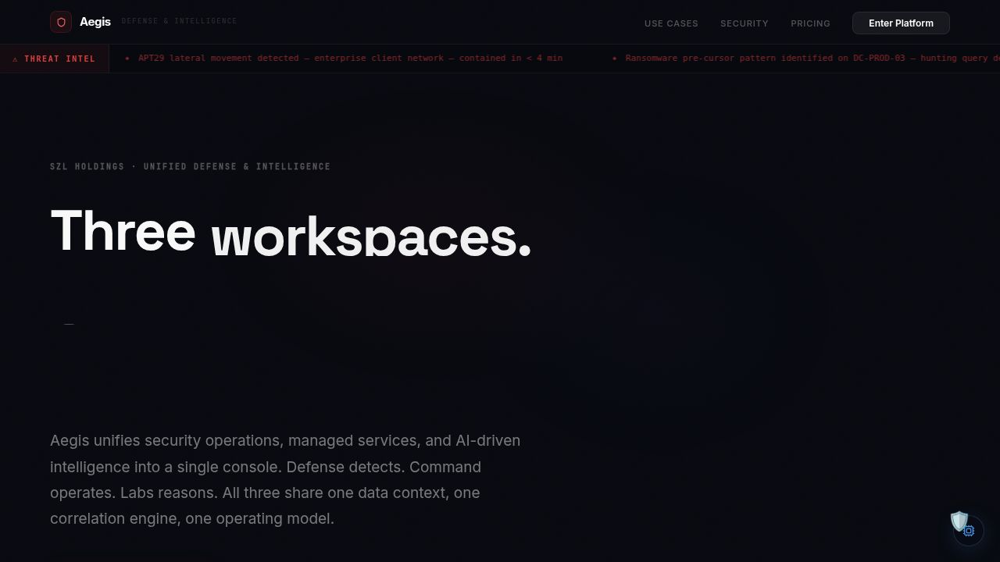
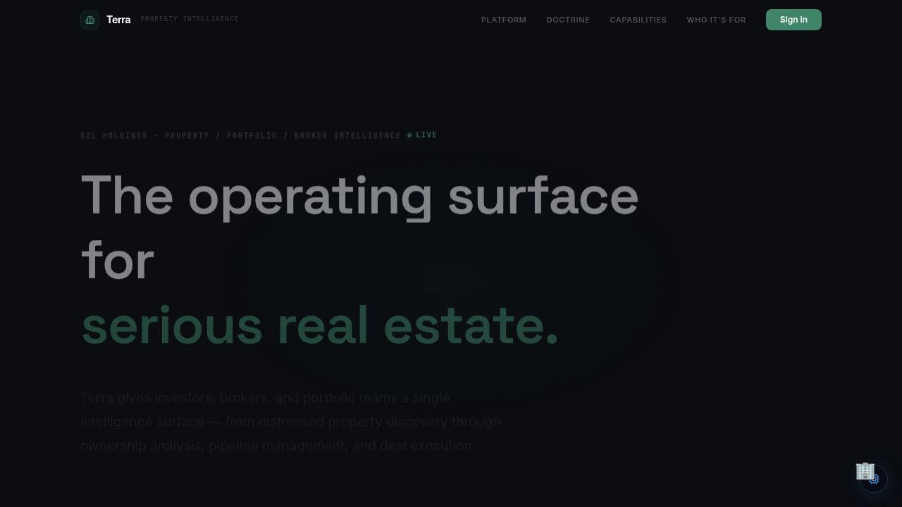
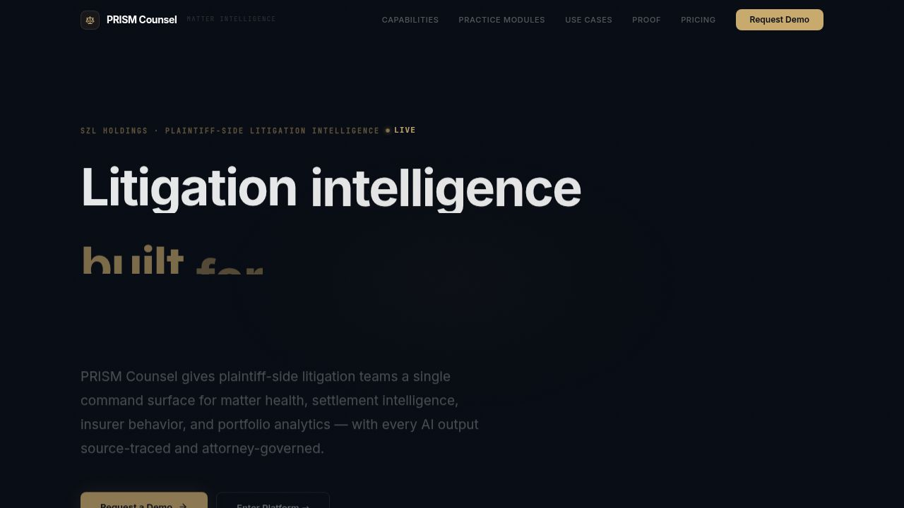
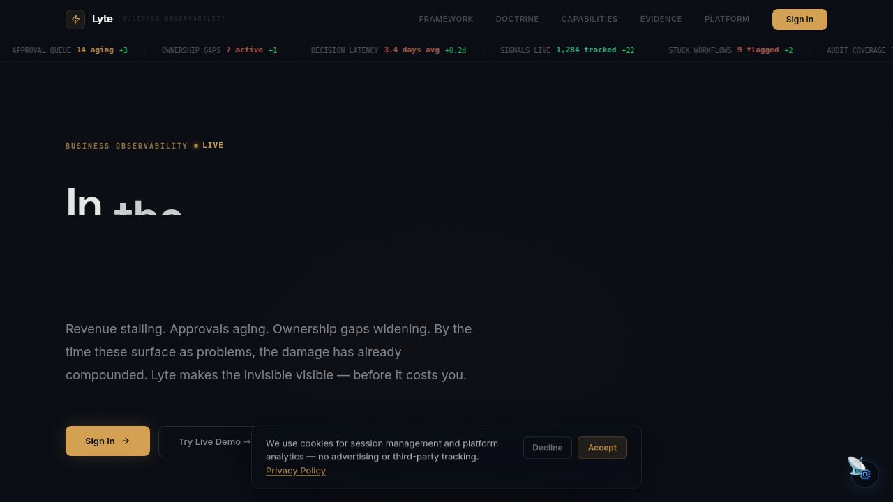
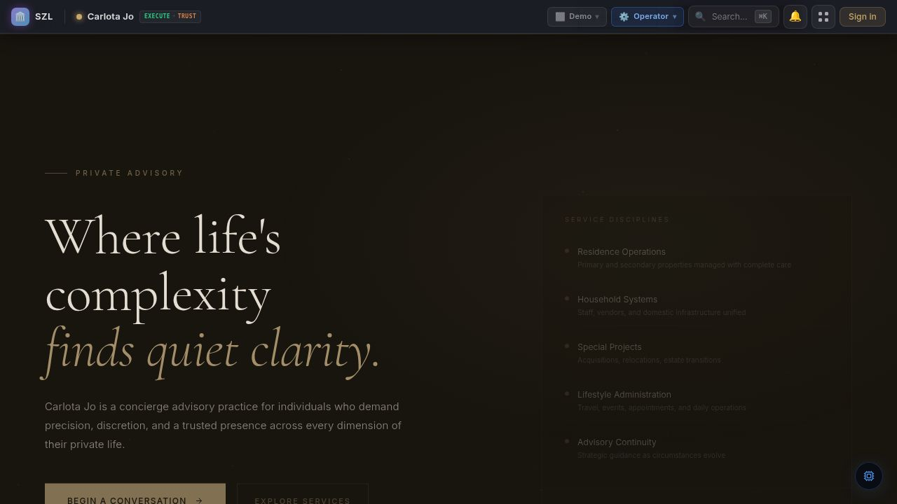
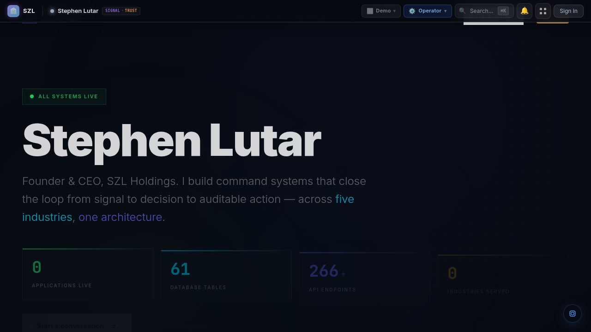
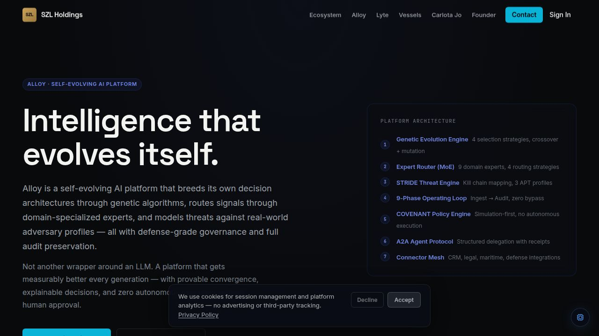
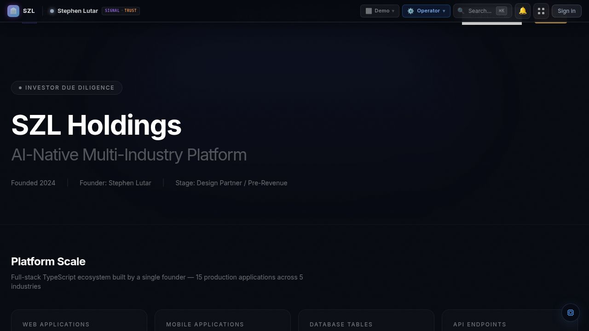

<p align="center">
  
</p>

<h1 align="center">SZL Holdings</h1>

<p align="center">
  <strong>The only platform that unifies cybersecurity, maritime, real estate, legal, and advisory intelligence into a single self-evolving operating system.</strong>
</p>

<p align="center">
  <a href="https://szlholdings.com">Live Platform</a>&nbsp;&nbsp;&bull;&nbsp;&nbsp;<a href="./docs/investor/platform-thesis.md">Investor Thesis</a>&nbsp;&nbsp;&bull;&nbsp;&nbsp;<a href="./docs/architecture/system-overview.md">Architecture</a>&nbsp;&nbsp;&bull;&nbsp;&nbsp;<a href="./docs/trust/trust-center.md">Trust Center</a>&nbsp;&nbsp;&bull;&nbsp;&nbsp;<a href="./SECURITY.md">Security</a>
</p>

<p align="center">
  
  
  
  
  
  
  
  
  
</p>

---

## Why This Exists

Every industry leader owns one vertical. Palantir owns defense intelligence. Windward owns maritime AI. Datadog owns observability. Litify owns legal ops. Reonomy owns property data.

**No one connects them.**

A sanctions violation on a vessel creates legal liability, impacts property values near ports, triggers compliance deadlines, and shifts advisory recommendations. Today, operators discover these connections weeks later through manual correlation across disconnected tools.

SZL Holdings is the **compound intelligence layer** that sees these connections in real-time, predicts cascading consequences across domains, and takes coordinated action under full governance.

Built by a single founder. Every line ships to production.

**Stephen Lutar** &mdash; Founder & CEO

---

## At a Glance

| Metric | Value |
|--------|-------|
| **Production Applications** | 19 (12 web/API + 7 mobile) |
| **Database Tables** | 600 |
| **Database Columns** | 5,300+ |
| **Database Indexes** | 940+ |
| **API Route Modules** | 150 |
| **Shared Libraries** | 28 |
| **Schema Definitions** | 82 files |
| **GitHub Commits** | 730+ |
| **Industries Served** | 5 |
| **Competitive Moat Score** | 0.94 / 1.00 (8/8 unique capabilities) |

---

## The Platform

### Compound Intelligence Engine &mdash; What Makes This One-of-One

<table>
  <tr>
    <th>Capability</th>
    <th>What It Does</th>
    <th>Who It Beats</th>
  </tr>
  <tr>
    <td><strong>Cross-Domain Ontology Fusion</strong></td>
    <td>Links entities across 5 industries in a single graph &mdash; 8 entity types per domain, 22 relationship types, traversal up to depth 4</td>
    <td>Palantir (single-context ontology)</td>
  </tr>
  <tr>
    <td><strong>Behavioral Genome Profiling</strong></td>
    <td>Builds behavioral DNA fingerprints for every entity &mdash; temporal patterns, Shannon entropy, anomaly scoring, domain-specific risk factors</td>
    <td>Windward (maritime-only profiling)</td>
  </tr>
  <tr>
    <td><strong>Predictive Cascade Engine</strong></td>
    <td>Predicts how events cascade across domains with time-to-impact estimation and automated mitigation recommendations</td>
    <td>Datadog Watchdog (post-hoc detection only)</td>
  </tr>
  <tr>
    <td><strong>Anticipatory Intelligence</strong></td>
    <td>Predicts events BEFORE they happen &mdash; settlement windows, APT campaigns, distress opportunities, weather disruptions</td>
    <td>No competitor (unique to SZL)</td>
  </tr>
  <tr>
    <td><strong>Self-Evolving Architecture</strong></td>
    <td>Genetic algorithms breed decision architectures across generations &mdash; tournament selection, crossover, mutation, convergence</td>
    <td>No competitor (unique to SZL)</td>
  </tr>
  <tr>
    <td><strong>Zero-Infrastructure LLM ML</strong></td>
    <td>Trains models by evolving prompt strategies &mdash; no GPU clusters, no data pipelines, no MLOps overhead</td>
    <td>AWS SageMaker, GCP Vertex, Azure ML</td>
  </tr>
  <tr>
    <td><strong>Agent-to-Agent Cross-Domain Delegation</strong></td>
    <td>AI agents across domains collaborate autonomously via A2A protocol with governed execution boundaries</td>
    <td>Litify (single-domain agents only)</td>
  </tr>
  <tr>
    <td><strong>Five-Industry Unified Command</strong></td>
    <td>Single pane of glass across cybersecurity, maritime, real estate, legal, and advisory operations</td>
    <td>All competitors (each owns one vertical)</td>
  </tr>
</table>

**Average Moat Score: 0.94** &mdash; All 8 capabilities rated ONE-OF-ONE. No single competitor, and no combination of competitors, can replicate what this platform does.

---

## Products

### Core Intelligence Layer

| Product | Domain | Description |
|---------|--------|-------------|
| **Alloy** | Self-Evolving AI Platform | Genetic decision architecture, mixture-of-experts routing, LLM-based ML training, compound intelligence engine, competitive moat analysis |
| **Lyte** | Business Observability | 7 Lenses of Business Observability, signal timeline, action queue, chaos prediction, causal AI graphs, self-healing workflows |
| **Nerve Center** | Executive Intelligence OS | Force-directed living graph, 7-Lens Prism overlay, situation rooms, executive daily briefs, decision trace with indecision burn rate |

### Domain Intelligence Platforms

| Product | Domain | Description |
|---------|--------|-------------|
| **Aegis** | Cybersecurity & Defense | Agentic SOC with zero-touch triage, MITRE ATT&CK mapping, SOAR playbooks, threat actor profiling, blast radius simulation |
| **Vessels** | Maritime Intelligence | AIS fleet tracking with 214+ vessels, digital twin, voyage economics, decarbonization scoring, sanctions monitoring |
| **Terra** | Real Estate Intelligence | Living property valuations, climate risk scoring, distressed asset detection, NYC ACRIS/HPD live data feeds |
| **PRISM Counsel** | Litigation Intelligence | Autonomous legal intelligence, litigation prediction, contract triage, settlement forecasting, judge profiling |
| **Carlota Jo** | Private Advisory | Anticipation engine, proactive client recommendations, sentiment analysis, UHNW lifestyle intelligence |

### Executive & Investor Surfaces

| Product | Domain | Description |
|---------|--------|-------------|
| **SZL Holdings** | Corporate Command | Portfolio intelligence, investor due diligence dashboard, platform flywheel visualization |
| **Stephen Lutar** | Founder Portfolio | Interactive founder journey, live platform proof, acquisition-grade metrics |

### Mobile Applications (7)

Every web platform has a companion Expo/React Native mobile app with voice commands, haptic feedback, biometric authentication, and offline-first architecture.

---

## Platform Screenshots

<table>
  <tr>
    <td align="center" width="50%">
      <strong>Vessels &mdash; Maritime Intelligence</strong><br>
      
    </td>
    <td align="center" width="50%">
      <strong>Aegis &mdash; Cybersecurity & Defense</strong><br>
      
    </td>
  </tr>
  <tr>
    <td align="center">
      <strong>Terra &mdash; Real Estate Intelligence</strong><br>
      
    </td>
    <td align="center">
      <strong>PRISM Counsel &mdash; Litigation Intelligence</strong><br>
      
    </td>
  </tr>
  <tr>
    <td align="center">
      <strong>Lyte &mdash; Business Observability</strong><br>
      
    </td>
    <td align="center">
      <strong>Carlota Jo &mdash; Private Advisory</strong><br>
      
    </td>
  </tr>
  <tr>
    <td align="center">
      <strong>Stephen Lutar &mdash; Founder Portfolio</strong><br>
      
    </td>
    <td align="center">
      <strong>Alloy &mdash; Self-Evolving AI Platform</strong><br>
      
    </td>
  </tr>
  <tr>
    <td align="center" colspan="2">
      <strong>Investor Due Diligence Dashboard</strong><br>
      
    </td>
  </tr>
</table>

---

## Competitive Position

### Why No One Can Replicate This

| Capability | SZL | Palantir | Anduril | Windward | Datadog | Litify | Reonomy |
|:-----------|:---:|:-------:|:-------:|:--------:|:-------:|:------:|:-------:|
| Five-Industry Unified Command | **0.98** | - | - | - | - | - | - |
| Self-Evolving Platform Architecture | **0.97** | - | - | - | - | - | - |
| Cross-Domain Ontology Fusion | **0.95** | - | - | - | - | - | - |
| Agent-to-Agent Cross-Domain Delegation | **0.94** | - | - | - | - | - | - |
| Anticipatory Intelligence | **0.93** | - | - | - | - | - | - |
| Predictive Cascade Engine | **0.92** | - | - | - | - | - | - |
| Behavioral Genome Profiling | **0.91** | - | - | - | - | - | - |
| Zero-Infrastructure LLM ML | **0.89** | - | - | - | - | - | - |

> **Verdict: ONE-OF-ONE.** Each competitor dominates a single vertical. SZL Holdings is the only platform that compounds intelligence across all five simultaneously.

---

## Architecture

```
External Signals (30+ live API feeds, AIS, NVD, GDELT, ACRIS, HPD, etc.)
        |
        v
  Signal Normalization (Alloy)
        |
        v
  Compound Intelligence Engine
  +-- Ontology Fusion (entity linking across 5 domains)
  +-- Behavioral Genome (per-entity DNA fingerprinting)
  +-- Cascade Prediction (cross-domain consequence modeling)
  +-- Anticipatory Intelligence (pre-emptive event detection)
        |
        v
  Routing Logic (MoE expert selection, priority, role assignment)
        |
   +----+------------------------------------+
   v                                         v
Auto-Execute (policy-approved)    Human Review Gate (HITL)
   |                                         |
   +-----------------+-----------------------+
                     v
              Action Execution
                     |
                     v
           Immutable Audit Trail (append-only, actor-attributed)
```

### Technology Stack

| Layer | Technologies |
|-------|-------------|
| **Languages** | TypeScript 5.9, SQL |
| **Frontend** | React 19, Vite 7, Tailwind CSS 4, Framer Motion, Recharts, TanStack Query |
| **Mobile** | Expo SDK 53, React Native, biometric auth, haptics, offline-first |
| **Backend** | Express 5, Drizzle ORM, Zod validation, Pino structured logging |
| **Database** | PostgreSQL 16 with pgvector, 600+ tables, 940+ indexes |
| **AI/ML** | Multi-provider gateway (Anthropic, OpenAI, Gemini, Groq), genetic algorithms, LLM-based training |
| **Intelligence** | Cross-domain ontology, behavioral genomes, cascade prediction, anticipatory signals |
| **Auth** | OIDC/PKCE, session-based, 7-role RBAC, SCIM 2.0 provisioning |
| **Build** | pnpm monorepo, esbuild, Vite, TypeScript project references |
| **Live Data** | CISA KEV, NVD, MITRE ATT&CK, AIS, GDELT, NYC ACRIS/HPD/PLUTO, Open-Meteo, SAM.gov |

---

## Repository Structure

```
szl-holdings-platform/
|-- artifacts/                    # 16 deployable applications
|   |-- szl-holdings/             #   Corporate command (React + Vite)
|   |-- firestorm/                #   Aegis cybersecurity command
|   |-- vessels/                  #   Maritime intelligence
|   |-- terra/                    #   Real estate intelligence
|   |-- lyte-command-center/      #   Business observability
|   |-- prism-counsel/            #   Litigation intelligence
|   |-- carlota-jo/               #   Private advisory
|   |-- stephen-site/             #   Founder portfolio
|   |-- api-server/               #   Unified API server (Express 5)
|   |-- *-mobile/                 #   7 companion mobile apps (Expo)
|   +-- mockup-sandbox/           #   Component design sandbox
|-- lib/                          # 28 shared libraries
|   |-- db/                       #   Drizzle ORM schemas (600 tables, 82 schema files)
|   |-- ai-engine/                #   Multi-provider AI gateway
|   |-- shared-ui/                #   Design system (80+ component exports)
|   |-- services/                 #   Business logic & external adapters
|   |-- workflow-engine/          #   Alloy execution fabric
|   |-- proof-chain/              #   Immutable audit trail engine
|   |-- covenant-policy/          #   Governance policy enforcement
|   +-- api-spec/                 #   OpenAPI specification
|-- docs/                         # Architecture, investor, trust docs
|-- ops/                          # Operational runbooks
|-- scripts/                      # Build, deploy, maintenance
+-- screenshots/                  # 130+ platform screenshots
```

---

## Trust & Governance

| Concern | Approach |
|---------|----------|
| **AI without oversight** | Advisory agents cannot execute consequential actions without explicit human confirmation &mdash; enforced at the Alloy workflow layer |
| **Opaque AI outputs** | All recommendations include source citations, confidence scores, and retrieval provenance |
| **Audit accountability** | Every action, approval, and decision generates an immutable audit event with actor attribution |
| **Access control** | 7-role RBAC with org-scoped tenant isolation. Every route and WebSocket channel is access-controlled |
| **Multi-tenancy** | All database queries include org_id scoping &mdash; cross-tenant access is architecturally prevented |
| **Data in transit** | TLS 1.3 for all connections. HMAC-signed WebSocket tickets with 5-minute TTL |

See [Trust Center](docs/trust/trust-center.md) &bull; [Security Posture](docs/trust/security-posture.md)

---

## Investor Due Diligence

The platform includes a live **Investor Dashboard** with real-time database metrics, defensibility analysis, acquisition readiness scoring, and TAM analysis across 5 industries.

| Document | Description |
|----------|-------------|
| [Platform Thesis](docs/investor/platform-thesis.md) | Why this exists and where it's going |
| [Product Readiness](docs/investor/product-readiness.md) | What's built, what's validated |
| [Go-to-Market](docs/investor/go-to-market.md) | Revenue strategy and market approach |
| [Portfolio Overview](docs/investor/platform-portfolio.md) | All 16 applications with positioning |
| [Data Room Index](docs/investor/data-room-index.md) | Complete diligence document inventory |

---

## Documentation

| Audience | Start Here |
|----------|------------|
| **Investor** | [Platform Thesis](docs/investor/platform-thesis.md) &rarr; [Product Readiness](docs/investor/product-readiness.md) &rarr; [Investor Overview](docs/investor/investor-overview.md) |
| **Technical Reviewer** | [Architecture](docs/architecture/system-overview.md) &rarr; [Data Flow](docs/architecture/data-flow.md) &rarr; [Platform Map](docs/architecture/platform-map.md) |
| **Enterprise Buyer** | [Trust Center](docs/trust/trust-center.md) &rarr; [Use Cases](docs/buyer/use-cases.md) &rarr; [Solution Brief](docs/buyer/solution-brief.md) |
| **Security** | [SECURITY.md](SECURITY.md) &rarr; [Security Posture](docs/trust/security-posture.md) &rarr; [Deployment Model](docs/trust/deployment-model.md) |

---

## Release Status

**Active development.** 740+ commits. 19 production applications. 600 database tables. 28 shared libraries. 150 API route modules. 5 industries. One architecture.

See [CHANGELOG.md](CHANGELOG.md) &bull; [ROADMAP.md](ROADMAP.md)

---

## License

Proprietary. All rights reserved. See [LICENSE.md](LICENSE.md).

---

<p align="center">
  <strong>Stephen Lutar</strong> &mdash; Founder & CEO, SZL Holdings
</p>

<p align="center">
  <a href="mailto:stephen@szlholdings.com">Investment</a>&nbsp;&nbsp;&bull;&nbsp;&nbsp;<a href="mailto:inquiries@szlholdings.com">Enterprise</a>&nbsp;&nbsp;&bull;&nbsp;&nbsp;<a href="mailto:security@szlholdings.com">Security</a>&nbsp;&nbsp;&bull;&nbsp;&nbsp;<a href="https://szlholdings.com">Website</a>&nbsp;&nbsp;&bull;&nbsp;&nbsp;<a href="https://linkedin.com/in/stephen-l-279315240">LinkedIn</a>&nbsp;&nbsp;&bull;&nbsp;&nbsp;<a href="https://x.com/szlholdings">X</a>
</p>
