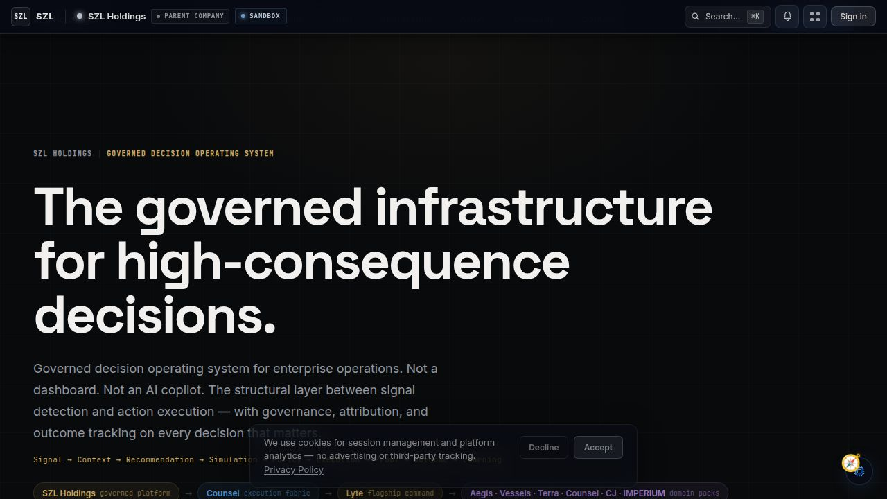
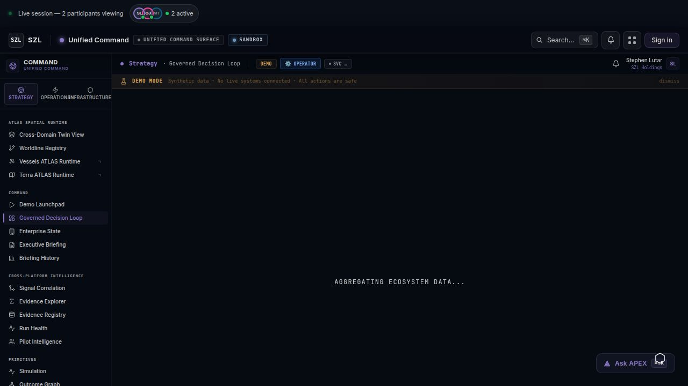
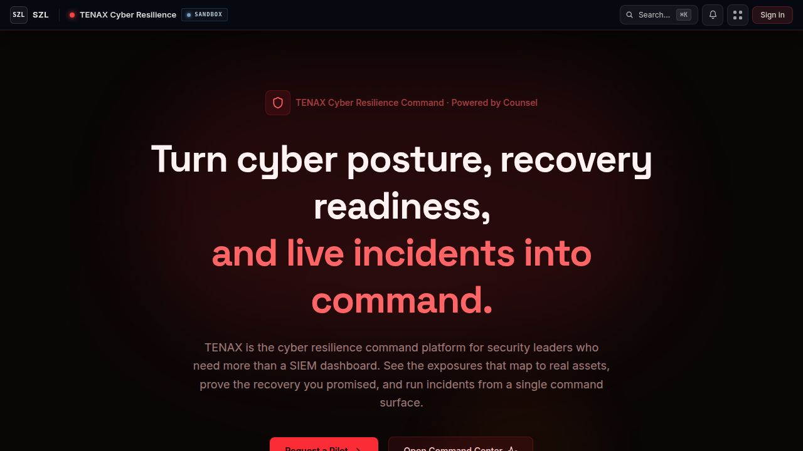
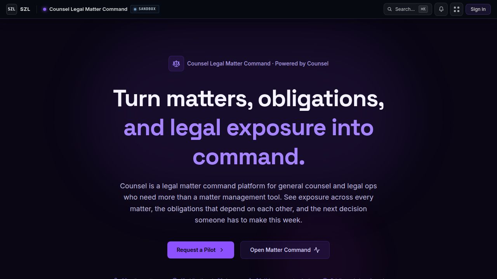
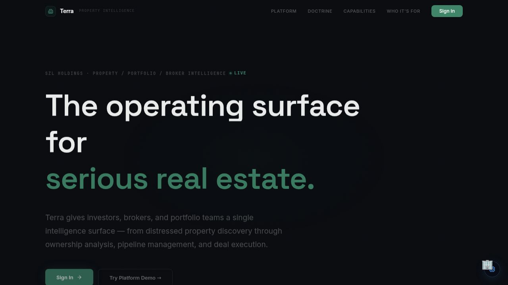
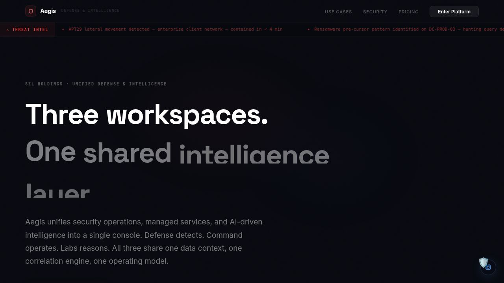

# SZL Holdings

      

**The governed infrastructure for high-consequence decisions.**

> Signal detection, AI-governed recommendations, human approval gates, cryptographic proof of every outcome — across eight enterprise verticals from a single platform.

---

## The Problem

Enterprise operations have an accountability gap. Dashboards show what happened. Alerts surface what is wrong. Neither tells operators *what to do next*, *who authorized it*, or *whether a recommended action is safe to execute*.

AI tools compound the problem: they add recommendation volume without governance. Operators accumulate more data, more noise, and more untracked decisions.

**The problem is not insight — it is accountability.**

---

## What SZL Holdings Builds

**A11oy** is the governed agentic execution layer that sits between enterprise data and enterprise decisions. It senses, structures, correlates, explains, recommends, approves, executes, verifies, and preserves cryptographic proof — in real time, across all SZL verticals.

Every step in the pipeline has a traceable owner, a policy constraint, and an immutable record.

### Core Capabilities

- **Signal Intelligence** — correlated business signals across all connected systems
- **Governed AI Recommendations** — every recommendation carries source citations, confidence scores, and policy constraints
- **Human-Gated Autonomy** — no consequential action executes without human confirmation, enforced structurally
- **Cryptographic Proof** — append-only audit trail linking every decision to actor, policy, and outcome
- **Digital Twin Simulation** — probabilistic modeling before any high-stakes action
- **Multi-Provider AI** — policy-governed routing across leading AI providers
- **Executive Briefing** — board-ready decision surfaces with full attribution chain

---

## Platform Screenshots

All screenshots are verified, unmodified captures from the live platform. No mockups or AI-generated imagery.

### SZL Holdings — Governed Decision Operating System

*Parent company dashboard — governed infrastructure for high-consequence decisions across eight enterprise verticals.*

### A11oy — Live Enterprise Execution Fabric

*A11oy — seven-layer governed agentic fabric with 19 operator surfaces, live signal mesh, and cryptographic proof ledger.*

### FORGE — Unified Command Surface

*Cross-domain operator surface with governed decision loop, spatial runtime, and cross-platform intelligence.*

### Domain Pack Verticals

| TENAX — Cyber Resilience | Counsel — Legal Matter Command |
|---|---|
|  |  |
| Cyber posture, recovery readiness, and live incident command | Matter tracking, obligation mapping, and legal exposure management |

| DOMAINE — Real Estate Intelligence | SEXTANT — Maritime Intelligence |
|---|---|
|  |  |
| Deal pipeline, portfolio analytics, and market intelligence | Fleet command, route optimization, and maritime operations |

| PARAGON — Defense & Intelligence |
|---|
|  |
| Threat intelligence, defense operations command, and spatial analytics |

> All screenshots captured 2026-04-25 from the live platform. Unmodified captures — no mockups or AI-generated imagery.

---

## Product Portfolio

| Product | Domain | What It Does |
|---------|--------|--------------|
| **A11oy** | Execution Fabric | Governed agentic layer — signal mesh, proof ledger, covenant policies, operator surfaces |
| **TENAX** | Cybersecurity | Cyber posture management, recovery readiness, incident command |
| **DOMAINE** | Real Estate | Deal pipeline intelligence, portfolio analytics, market signals |
| **SEXTANT** | Maritime | Fleet command, route optimization, compliance tracking |
| **PARAGON** | Defense & Intel | Threat intelligence, spatial analytics, operations command |
| **Counsel** | Legal | Matter tracking, obligation dependency mapping, exposure management |
| **KORA** | Decision Intelligence | Cross-domain metrics, outcome tracking, decision quality scoring |
| **LUMINA** | Executive Briefing | Board-ready decision briefings with attribution and proof chains |

**Additional surfaces:** FORGE (unified command), Carlota Jo (consulting), APEX (mobile command — iOS/Android)

---

## Platform Scale

| Metric | Count |
|--------|-------|
| Registered deployable artifacts | 15 |
| Workspace packages and libraries | 146 |
| API route files | 385 |
| Provisioned PostgreSQL tables | 730 |
| Active domain packs | 7 |
| GitHub Actions workflows | 24 |
| A11oy operator surfaces | 19 |

---

## Tech Stack

| Layer | Stack |
|-------|-------|
| **Language** | TypeScript (full stack, strict mode) |
| **Frontend** | React, Vite, Tailwind CSS, Framer Motion |
| **Mobile** | Expo / React Native |
| **Backend** | Express, Node.js |
| **Database** | PostgreSQL, Drizzle ORM |
| **AI** | Multi-provider (governed routing with policy constraints) |
| **Auth** | OIDC/PKCE, multi-role RBAC, deny-by-default enforcement |
| **Infra** | pnpm monorepo, GitHub Actions CI/CD |

---

## Security Posture

- **Access control:** Multi-role RBAC with deny-by-default enforcement. All routes require authentication. All queries are org-scoped.
- **AI governance:** Advisory agents only. Covenant Policy enforces approval gates at the fabric layer. AI cannot bypass human confirmation.
- **Audit trail:** Every consequential action writes an immutable proof entry with actor attribution, timestamp, and decision context.
- **Multi-tenancy:** Cross-tenant access is architecturally prevented, not only policy-controlled.
- **Vulnerability disclosure:** Responsible disclosure only. See [SECURITY.md](SECURITY.md).

---

## Roadmap

| Item | Status |
|------|--------|
| A11oy Phase 1 — Foundation (type system, fabric primitives, demo seed, read API) | ✅ Complete |
| A11oy Phase 2 — Workcell engine with live AI reasoning | 🔜 In Progress |
| A11oy Phase 3 — Full proof-carrying execution with live connectors | 🔜 Planned |
| APEX mobile (unified iOS + Android command) | 🔜 Planned |
| SOC 2 Type 1 audit readiness | 🔜 Roadmap |
| Production customer onboarding | 🔜 Roadmap |

---

## Current Status

**Active prototype / investor demo platform under development.**

- A11oy Phase 1: fully implemented across 19 operator surfaces
- Seven active domain packs: implemented or partially implemented with demo-safe data
- AI recommendations: multi-provider routing with governed policy constraints
- Authentication: OIDC/PKCE with multi-role RBAC
- All screenshots are from the active platform - no mockups or AI-generated imagery

---

## Access & Collaboration

This repository is proprietary. Source code, architecture, and implementation details are confidential.

**For investors:** We welcome due diligence conversations and guided platform walkthroughs. Contact us to schedule a demo or request access to detailed technical documentation.

**For enterprise evaluation:** Design partner conversations and pilot programs are available for qualified organizations.

**For all other inquiries:** Please reach out via the contact information below.

## Directory Structure

| Path | Contents |
|------|----------|
| `artifacts/` | All deployable web and mobile applications |
| `artifacts/a11oy/` | A11oy — Live Enterprise Execution Fabric |
| `lib/` | Shared libraries: database client, auth, AI, event bus, UI components |
| `apps/` | Background applications: embedding API, ingestion orchestrator, runtime API |
| `services/` | Platform services: FORGE fabric, KORA metrics, Substrate MCP gateway |
| `workers/` | Background workers: embedding, ranking, reranking, vector, Python substrate |
| `packages/` | Domain packages: design system, substrate, agent core, evidence ledger, policy guard |
| `scripts/` | Seed scripts, QA scripts, screenshot capture, deployment utilities |
| `docs/` | Architecture, trust, investor, and operational documentation |
| `docs/assets/screenshots/current/` | Verified current screenshots — only source for README images |
| `audit/` | Audit reports, QA reports, asset reports |
| `ops/` | Infrastructure configuration, environment matrix, runbooks |
| `.github/workflows/` | CI, CodeQL, security, deploy, and README QA pipelines |

**Artifact inventory:**

| Artifact | Kind | Preview | Status (active prototype) |
|----------|------|---------|--------------------------|
| SZL Holdings Dashboard | web | `/` | Active prototype |
| A11oy — Live Enterprise Execution Fabric | web | `/a11oy/` | Active prototype — Phase 1 complete |
| API Server | web | `/api/` | Active prototype — backend API |
| FORGE Command Portal | web | `/command/` | Active prototype — cross-domain command surface |
| TENAX — Cyber Resilience Command | web | `/sentra/` | Active prototype — domain pack |
| Counsel — Legal Matter Command | web | `/counsel/` | Active prototype — domain pack |
| DOMAINE — Real Estate Intelligence | web | `/terra/` | Active prototype — domain pack |
| SEXTANT Maritime Intelligence | web | `/vessels/` | Active prototype — domain pack |
| Carlota Jo Consulting | web | `/carlota-jo/` | Active prototype — domain pack |
| LUMINA — AI Executive Briefing | web | `/pulse/` | Active prototype — cross-domain briefing |
| PARAGON (Investor Pitch Deck) | web | `/aegis/` | Active prototype — investor slides and ATLAS runtime |
| SZL Holdings — Governed Autonomy Demo | video | `/szl-demo-video/` | Active prototype — 60-second demo video |
| SZL Holdings — Mobile Command (APEX) | mobile | `/szl-holdings-mobile/` | Deferred — after APEX ships |

---

## Contact

**Stephen Lutar** — Founder and CEO, SZL Holdings

**Email:** inquiries@szlholdings.com
**Website:** [szlholdings.com](https://szlholdings.com)
**LinkedIn:** [linkedin.com/in/stephen-l-279315240](https://linkedin.com/in/stephen-l-279315240)

---

## Legal

Copyright (c) 2024-2026 SZL Holdings. All rights reserved.

This repository and all contents — including source code, architecture, documentation, and brand assets — are the sole and exclusive property of SZL Holdings. No license, right, or interest is granted by virtue of access. See [LICENSE](./LICENSE).

SZL Holdings, A11oy, TENAX, DOMAINE, SEXTANT, PARAGON, KORA, LUMINA, Counsel, Carlota Jo, FORGE, APEX, and IMPERIUM are trademarks of SZL Holdings. Certain methods and architectures may be the subject of pending or future patent applications.
