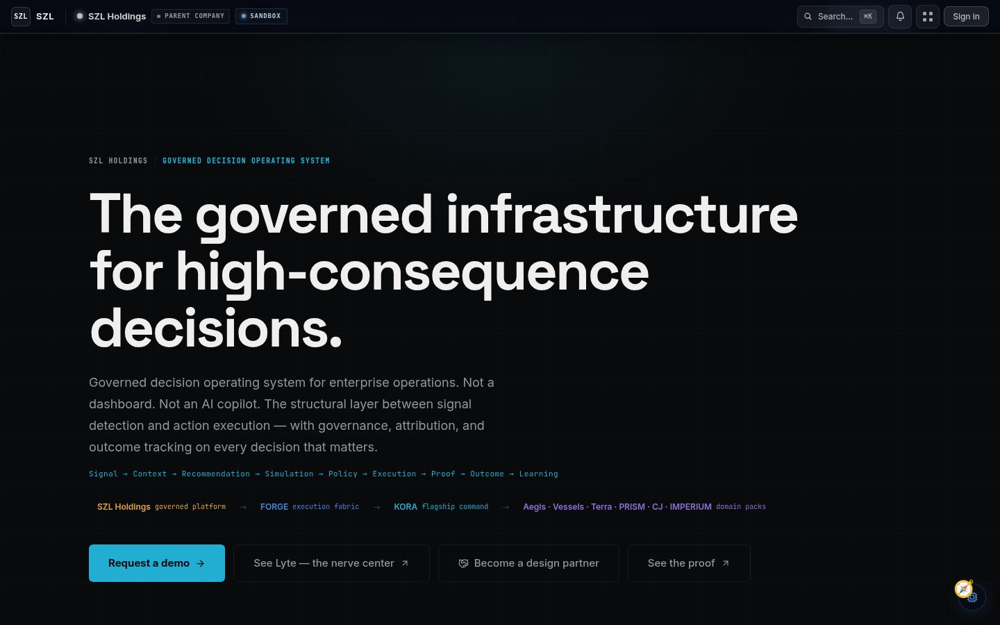
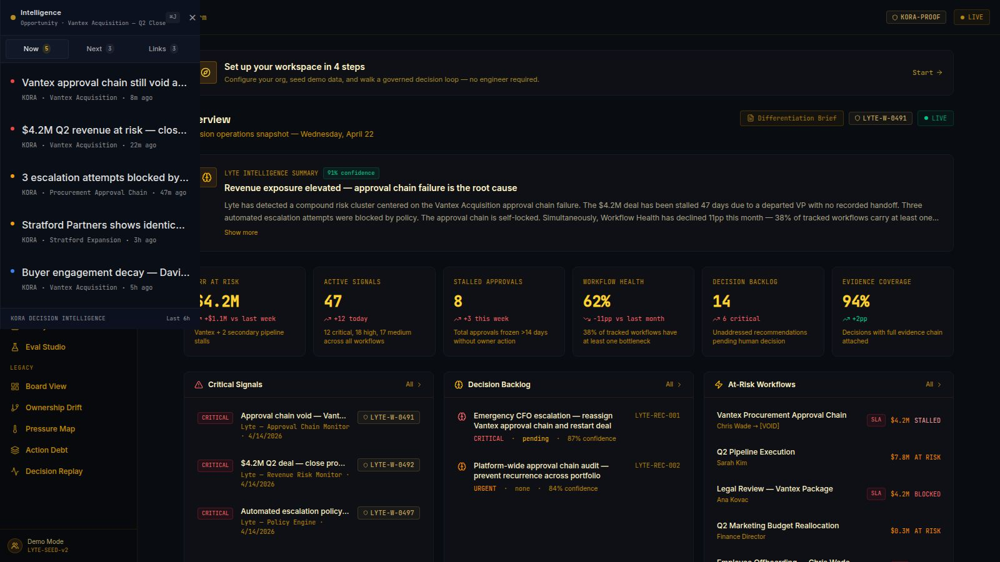
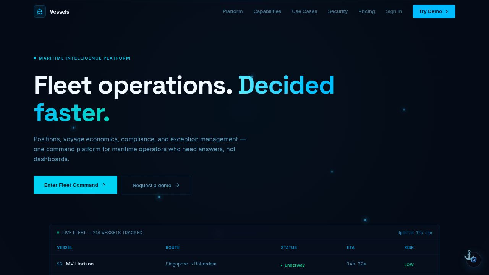
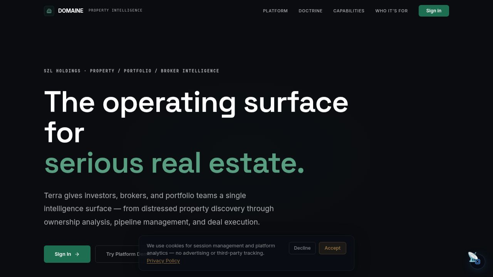
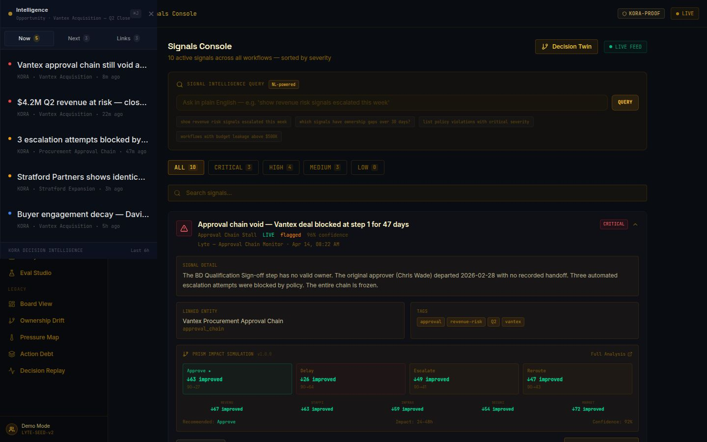
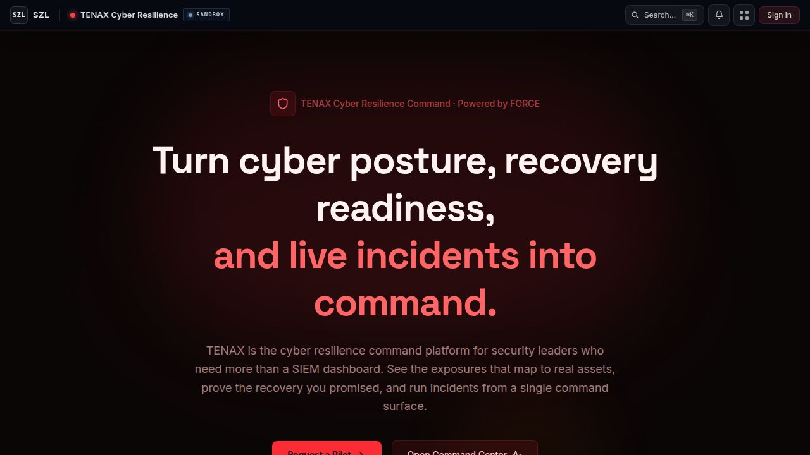

# SZL Holdings

[](https://github.com/szl-holdings/szl-holdings-platform/actions/workflows/ci.yml) [](https://github.com/szl-holdings/szl-holdings-platform/actions/workflows/codeql.yml) [](https://github.com/szl-holdings/szl-holdings-platform/actions/workflows/security.yml) [](./LICENSE) [](https://www.typescriptlang.org/) [](https://pnpm.io/) [](https://www.postgresql.org/)

**Governed decision infrastructure — connecting what is observable to what is executable, with full attribution.**

[Architecture](./docs/architecture/architecture.md) · [Platform Primitives](./docs/architecture/platform-primitives.md) · [Trust Center](./docs/trust/trust-center.md) · [Security](./SECURITY.md) · [Investor Docs](./docs/investor/platform-thesis.md)

---

## Canonical Entry Points

New to the codebase? Start here.

| Document | Purpose |
|---|---|
| **[docs/INDEX.md](./docs/INDEX.md)** | Master index of all documentation, audit reports, and doctrine |
| **[docs/audit/2026-04/README.md](./docs/audit/2026-04/README.md)** | April 2026 operational audit — executive summary and findings |
| **[docs/doctrine/szl-doctrine.md](./docs/doctrine/szl-doctrine.md)** | The SZL point of view: four pillars, voice rules, anti-patterns |
| **[packages/config/](./packages/config/)** | Single source of truth: platform registry, claims, feature flags, env contract |
| **[docs/APP_STATUS.md](./docs/APP_STATUS.md)** | Authoritative artifact readiness register (GA / Beta / Partial / Archived) |
| **[docs/operations/known-gaps.md](./docs/operations/known-gaps.md)** | Honest inventory of technical debt and remediation paths |
| **[docs/platform-facts.md](./docs/platform-facts.md)** | Authoritative platform statistics — generated from `packages/platform-metrics-registry` |

> **Platform facts are auto-generated.** Run `pnpm metrics:generate` to regenerate [`docs/platform-facts.md`](./docs/platform-facts.md) and the registry from the current filesystem state. Run `pnpm metrics:validate` to verify no drift. Never edit `docs/platform-facts.md` directly.

---

## Trust

An AI-assisted operations platform carries a distinct trust burden. The platform addresses it structurally, not through policy documents alone.

| Concern | Structural Response |
|---------|---------------------|
| AI without oversight | Covenant Policy enforces approval gates — AI cannot execute consequential actions without human confirmation |
| Opaque AI outputs | All recommendations include source citations, confidence scores, and retrieval provenance |
| Audit accountability | Every action generates an immutable audit event with actor attribution via Proof Chain |
| Access control | 11-role RBAC with org-scoped tenant isolation. Deny-by-default global auth enforcer |
| Multi-tenancy | All queries scoped by org identifier. Cross-org access returns 404 to prevent information leakage |
| Decision traceability | Outcome Graph tracks the full chain: signal to recommendation to decision to outcome |

[Trust Center](docs/trust/trust-center.md) · [Security Policy](SECURITY.md) · [Proof and Policy Model](docs/architecture/proof-and-policy-model.md)

---

## What We Build

Enterprise operations have an accountability gap. Dashboards show what happened. Alerts surface what is wrong. Neither tells operators what to do next, who is responsible, or whether a recommended action is safe to execute.

AI tools compound the problem: they add recommendation volume without governance. Operators accumulate more data, more noise, and more untracked decisions.

SZL Holdings builds the governed decision layer that sits between signal detection and action execution:

```
Signal -> Context -> Recommendation -> Simulation -> Policy -> Approval -> Execution -> Proof -> Outcome
```

Every step is instrumented. Every decision is attributed. Every AI recommendation carries source citations and confidence scores. Every consequential action requires human confirmation.

---

## Product Portfolio

### Platform Core

**KORA** is the flagship command surface where operators observe signals, review AI recommendations, run simulations, and make governed decisions. It runs the PRAXIS framework (People, Revenue, Infrastructure, Security, Market) across all connected domains.

**FORGE** is the execution fabric: signal normalization, workflow orchestration, approval controls, human-in-the-loop gates, and immutable audit trail. It is the shared infrastructure layer that makes AI-assisted operations durable and accountable.

**APEX** is the unified mobile command app (iOS and Android) that surfaces all domain workspaces with biometric authentication and offline-capable sync.

### Domain Packs

Domain packs extend the same governance infrastructure into domain-specific intelligence. Each pack is a structured application built on KORA, FORGE, and the six platform primitives.

<!-- BEGIN: portfolio-table (generated by scripts/generate-readme-product-table.js) -->

| Product | Domain | Status |
|---------|--------|--------|
| **TENAX** | Cyber resilience command — exposure mapping, recovery readiness, incident command, control drift detection | Active |
| **Counsel** | Legal matter command — agentic matter management, obligation tracking, exposure quantification, court filing integration | Active |
| **PARAGON** | Security and defense intelligence — SOC command, advanced security modules, SOAR playbooks, threat intelligence | Domain backend active; web UI consolidated into Aegis |
| **SEXTANT** | Maritime fleet intelligence — AIS tracking, S&P workflow, demurrage, freight, voyage P&L | Active |
| **DOMAINE** | Real estate intelligence — distress pipeline, ownership graph, deal workflow, AI analysis | Active |
| **Carlota Jo** | Premium advisory operations — UHNW client portal, service catalog, engagement management | Active |
| **LUMINA** | AI executive briefing — narrative intelligence reports synthesized from live platform signals | Active |
| **Counsel (legacy PRISM Counsel)** | Legal matter command — agentic matter management, court filings, recovery operations | Superseded by Counsel (Active); legacy domain API routes retained |
| **IMPERIUM** | Cloud sovereignty — multi-cloud governance, policy enforcement, cloud estate visibility | Archived (Task #920) |

<!-- END: portfolio-table -->

### FORGE Command Portal

The FORGE Command Portal is the cross-domain real-time dashboard aggregating signals from all domain packs into a unified executive view with eight-domain SSE feeds and executive briefing.

### A11oy — Live Enterprise Execution Fabric

**A11oy** is the governed agentic layer that sits between enterprise data and enterprise decisions. It senses, structures, correlates, explains, recommends, approves, executes, verifies, and preserves cryptographic proof — in real time, across all seven SZL verticals.

## A11oy Doctrine

The A11oy Doctrine is the repo-native operating system for every AI agent, Replit task, Codex session, and human contributor working in this repo. Read `AGENTS.md` before touching any file.

**Core Execution Loop:**

```
Context → Plan → Patch → Test → Screenshot → Verify → Proof → Commit
```

| Document | Purpose |
|----------|---------|
| **[AGENTS.md](./AGENTS.md)** | Authoritative operating doctrine: core loop, forbidden actions, naming rules, done criteria |
| **[docs/A11OY_DOCTRINE.md](./docs/A11OY_DOCTRINE.md)** | Product thesis, operating philosophy, and five principle categories |
| **[docs/A11OY_AGENT_DOCTRINE.md](./docs/A11OY_AGENT_DOCTRINE.md)** | All 18 named agents with full specifications and sample prompts |
| **[docs/A11OY_DEFINITION_OF_DONE.md](./docs/A11OY_DEFINITION_OF_DONE.md)** | Full done checklist — a task is not done without this |
| **[docs/A11OY_PUBLIC_CLAIMS_DOCTRINE.md](./docs/A11OY_PUBLIC_CLAIMS_DOCTRINE.md)** | Blocked claims, required qualifiers, soften-or-remove rule |
| **[docs/A11OY_SCREENSHOT_DOCTRINE.md](./docs/A11OY_SCREENSHOT_DOCTRINE.md)** | Screenshot quality rules and blocked screenshot types |
| **[docs/A11OY_SECURITY_DOCTRINE.md](./docs/A11OY_SECURITY_DOCTRINE.md)** | Security rules, secret hygiene, .gitignore requirements |
| **[docs/A11OY_RELEASE_DOCTRINE.md](./docs/A11OY_RELEASE_DOCTRINE.md)** | Release readiness checklist and nine-category scoring |

Quick agent reference and copy-ready prompts: [`skills/a11oy-code/`](./skills/a11oy-code/)

- **Artifact:** `artifacts/a11oy` — serves at `/a11oy/`
- **API:** Read-side REST API at `/api/a11oy/*` (11 GET endpoints, all public in Phase 1)
- **Seed data:** 32 business signals × 7 verticals, 5 outcomes, 5 covenant policies, 5 proof packets
- **Architecture:** Seven-layer in-memory fabric (Coverage Graph, Signal Mesh, State Engine, Causal Core, Action Rail, Covenant Layer, Proof Ledger)
- **Phase:** Phase 1 Foundation — full type system, fabric primitives, demo seed, read-side API
- **Phase 2 (planned):** Workcell engine, live AI reasoning, full proof-carrying execution
- **Docs:** `AGENTS.md` · `CONTEXT.md` · `llms.txt`

### Walkthrough Video

A 60-second governed-autonomy walkthrough is rendered from `artifacts/szl-demo-video`:

| Format | File | Use |
|--------|------|-----|
| 1920×1080 H.264 (16:9) | [`artifacts/szl-demo-video/deliverables/linkedin-4-17.mp4`](artifacts/szl-demo-video/deliverables/linkedin-4-17.mp4) | Web / desktop / LinkedIn |
| 1080×1080 H.264 (1:1) | [`artifacts/szl-demo-video/deliverables/linkedin-4-17-square.mp4`](artifacts/szl-demo-video/deliverables/linkedin-4-17-square.mp4) | Mobile feed |

Re-render with `pnpm --filter @workspace/szl-demo-video render`. Source manifest and scene definitions live in [`artifacts/szl-demo-video/src/`](artifacts/szl-demo-video/src/).

### Screens














> **Note on these images:** The images above (`assets/readme/products/`) are pre-v2 design generation assets and are candidates for replacement. For verified, post-redesign screenshots captured live on 2026-04-21, see `docs/assets/screenshots/current/` (7 current screenshots) and `audit/screenshot-catalog.md` for full metadata. Authenticated dashboard surfaces require `DATABASE_URL` to be provisioned — see `audit/deployment-proof.md`.

---

## Architecture

The six platform primitives define what is structurally different from dashboards, copilots, and workflow tools:

| Primitive | Function |
|-----------|----------|
| **Outcome Graph** | Tracks the full lifecycle: recommendation to decision to outcome. Closed-loop learning — the platform knows which recommendations led to which results. |
| **Proof Chain** | Immutable, verifiable audit trail for every significant action. Compliance teams can reconstruct any decision chain. AI outputs carry provenance. |
| **Covenant Policy** | Defines what agents and users can do, with what approval requirements. Human-in-the-loop is enforced at the policy layer — AI cannot bypass it. |
| **Decision Simulation** | Probabilistic simulation before action — confidence intervals and sensitivity analysis. Operators see not just what should be done but what could happen. |
| **Workflow Engine** | Durable multi-step process orchestration with agent coordination. Complex decisions are tracked, governed, and recoverable. |
| **Event Fabric** | Cross-domain signal backbone — normalizes, routes, and correlates events. A sanctions hit in SEXTANT can surface a legal risk flag in Counsel automatically. |

**Platform hierarchy:**

```
+-----------------------------------------------------------------------+
|  SZL HOLDINGS                                                         |
|  Governed decision infrastructure layer                              |
+-----------------------------------------------------------------------+
|  KORA                  — Flagship command surface (PRAXIS framework)  |
|  FORGE                 — Execution fabric (workflows, approvals, audit)|
|  APEX                  — Unified mobile command (iOS + Android)       |
+-----------------------------------------------------------------------+
|  DOMAIN PACKS                                                         |
|                                                                       |
|  TENAX    Counsel   PARAGON  SEXTANT    DOMAINE                      |
|  Carlota Jo         LUMINA                                           |
+-----------------------------------------------------------------------+
|  GOVERNANCE INFRASTRUCTURE                                            |
|                                                                       |
|  Outcome Graph  .  Proof Chain  .  Covenant Policy                   |
|  Decision Simulation  .  Workflow Engine  .  Event Fabric            |
+-----------------------------------------------------------------------+
|  DATA LAYER                                                           |
|                                                                       |
|  PostgreSQL 16 (Drizzle ORM)  .  External feeds: AIS, STIX/TAXII    |
+-----------------------------------------------------------------------+
```

See [docs/architecture/platform-primitives.md](docs/architecture/platform-primitives.md) for the full specification of each primitive and [docs/architecture/architecture.md](docs/architecture/architecture.md) for the service topology.

---

## Repository Map

This is a pnpm monorepo. Key locations:

| Path | Contents |
|------|----------|
| `artifacts/` | All deployable web and mobile applications |
| `lib/` | Shared libraries: database client, auth, AI, event bus, UI components |
| `apps/` | Background applications: embedding API, ingestion orchestrator, runtime API |
| `services/` | Platform services: FORGE fabric, KORA metrics, Substrate MCP gateway |
| `workers/` | Background workers: embedding, ranking, reranking, vector, Python substrate |
| `packages/` | Domain packages: design system, substrate, agent core, evidence ledger, policy guard |
| `scripts/` | Seed scripts, QA scripts, deployment utilities |
| `docs/` | Architecture, trust, investor, and operational documentation |
| `ops/` | Infrastructure configuration, environment matrix, runbooks |
| `.github/workflows/` | CI, CodeQL, security, deploy, and README QA pipelines |
| `assets/readme/` | All README-facing visual assets (products, architecture, brand) |

Artifact inventory:

| Artifact | Kind | Preview | Status | README |
|----------|------|---------|--------|--------|
| SZL Holdings Dashboard | web | `/` | **Active** — primary public web app | [README](artifacts/szl-holdings/README.md) |
| API Server | web | `/api/` | **Active** — backend API, powers all surfaces | [README](artifacts/api-server/README.md) |
| FORGE Command Portal | web | `/command/` | **Active** — ops command surface (merged KORA + IMPERIUM) | [README](artifacts/command/README.md) |
| TENAX — Cyber Resilience Command | web | `/sentra/` | **Active** — domain pack: cyber posture, recovery readiness, incident command | [README](artifacts/sentra/README.md) |
| Counsel — Legal Matter Command | web | `/counsel/` | **Active** — domain pack: legal matter management, obligation tracking, exposure quantification | [README](artifacts/counsel/README.md) |
| DOMAINE — Real Estate Intelligence | web | `/terra/` | **Active** — domain pack | [README](artifacts/terra/README.md) |
| SEXTANT Maritime Intelligence | web | `/vessels/` | **Active** — domain pack | [README](artifacts/vessels/README.md) |
| Carlota Jo Consulting | web | `/carlota-jo/` | **Active** — domain pack | [README](artifacts/carlota-jo/README.md) |
| LUMINA — AI Executive Briefing | web | `/pulse/` | **Active** — executive intelligence briefing | [README](artifacts/pulse/README.md) |
| SZL Holdings — Investor Pitch Deck (PARAGON) | web | `/aegis/` | **Active** — investor slides and ATLAS runtime | [README](artifacts/aegis/README.md) |
| SZL Holdings — Governed Autonomy Demo | video | `/szl-demo-video/` | **Active** — demo video artifact | [README](artifacts/szl-demo-video/README.md) |
| SZL Holdings — Mobile Command | mobile | `/szl-holdings-mobile/` | **Deferred** — after APEX ships | [README](artifacts/szl-holdings-mobile/README.md) |
| PRAXIS — Unified Agentic AI Layer | design | `/nexus/` | **Internal** — UI prototyping only | — |

**Archived artifacts** (source on disk, no registered workflow, not part of the build):

| Artifact | Disposition | Notes |
|----------|-------------|-------|
| `artifacts/imperium/` | Archived (Task #920) | Cloud sovereignty UI; source retained on disk |
| `artifacts/cortex-mobile/` | Archived | Superseded by `artifacts/szl-holdings-mobile` |
| `artifacts/prism-counsel/` | Archived | Superseded by `artifacts/counsel`; legacy API routes retained |

**Removed artifacts** (directory deleted, no remaining code on disk):

| Artifact | Disposition | Notes |
|----------|-------------|-------|
| `prism-counsel/` | Removed (Task #634) | `/prism-counsel/*` API routes still live on the API server |
| `stephen-site/` | Removed (Task #634) | Content moved to `/founder` route in SZL Holdings |

If a future product decision brings any archived surface back, treat it as a fresh build — do not restore from old `dist/` output.

---

## Build, Run, and Contribute

**Requirements:** Node.js 22+, pnpm 10+

```bash
git clone https://github.com/szl-holdings/szl-holdings-platform.git
cd szl-holdings-platform
pnpm install
pnpm dev
```

**Common tasks:**

```bash
pnpm typecheck          # TypeScript type checking across all packages
pnpm test               # Unit and component tests
pnpm test:integration   # Integration tests
pnpm readme:check       # Validate README images and badge workflows
pnpm qa:routes          # Smoke-test all routes
pnpm audit:all          # Run full audit suite (mocks, routes, deps, copy, design)
pnpm seed               # Seed the local database with demo data
```

See [docs/operations/deployment-guide.md](docs/operations/deployment-guide.md) for staging and production deployment.

**Contributing:** See [CONTRIBUTING.md](CONTRIBUTING.md) for the branch workflow, code style, commit format, and PR process. All contributions require a passing CI run and a passing `pnpm readme:check` before merge.

**Environments:**

| Environment | Purpose | Trigger |
|-------------|---------|---------|
| Development | Active development and internal preview | Always on (Replit workspace) |
| Staging | Integration validation before production | Push to `main` via `deploy-staging.yml` |
| Production | Customer-facing deployment | Published release via `deploy-production.yml` |

---

## Governance, Security, and Contact

**Access control:** 11-role RBAC with deny-by-default enforcement. All routes require authentication. All queries are org-scoped.

**AI governance:** Advisory agents only. Covenant Policy enforces approval gates at the workflow layer. AI cannot bypass human confirmation requirements.

**Audit trail:** Every consequential action writes an immutable Proof Chain event with actor attribution, timestamp, source, and decision context.

**Vulnerability disclosure:** See [SECURITY.md](SECURITY.md). Responsible disclosure only.

**Known gaps and tech debt:** Documented honestly in [docs/operations/known-gaps.md](docs/operations/known-gaps.md).

### Documentation Index

All documentation has been consolidated into `docs/`. See [docs/INDEX.md](docs/INDEX.md) for the complete index.

| Document | Purpose |
|----------|---------|
| [docs/architecture/architecture.md](docs/architecture/architecture.md) | System architecture: topology, stack, design principles (v4.0, canonical) |
| [docs/architecture/platform-primitives.md](docs/architecture/platform-primitives.md) | The six core abstractions |
| [docs/architecture/data-model.md](docs/architecture/data-model.md) | Entity-relationship overview of the core database schema |
| [docs/architecture/api-spec.md](docs/architecture/api-spec.md) | API surface: route inventory, auth model, rate limiting |
| [docs/security/access-control-matrix.md](docs/security/access-control-matrix.md) | Role-permission matrix mapped to implementation |
| [docs/security/security-checklist.md](docs/security/security-checklist.md) | Security controls checklist |
| [docs/operations/deployment-guide.md](docs/operations/deployment-guide.md) | Deployment procedures |
| [docs/operations/operations-runbook.md](docs/operations/operations-runbook.md) | Operational procedures and incident response |
| [docs/operations/known-gaps.md](docs/operations/known-gaps.md) | Honest assessment of tech debt and planned improvements |
| [CONTRIBUTING.md](CONTRIBUTING.md) | Contribution guidelines |
| [docs/readme-standards.md](docs/readme-standards.md) | README asset and badge standards |

**Canonical ops documentation** (authoritative sources — these win over root-level equivalents):

| Document | Purpose |
|----------|---------|
| [ops/infra/target-production-architecture.md](ops/infra/target-production-architecture.md) | Production architecture and deployment topology |
| [ops/infra/environment-matrix.md](ops/infra/environment-matrix.md) | Environment separation (dev / staging / prod) |
| [ops/infra/recovery-and-backup-model.md](ops/infra/recovery-and-backup-model.md) | Backup and disaster recovery |
| [ops/mobile/flagship-release-readiness.md](ops/mobile/flagship-release-readiness.md) | APEX mobile release status and readiness criteria |
| [ops/mobile/eas-and-store-secrets-matrix.md](ops/mobile/eas-and-store-secrets-matrix.md) | EAS build profiles and App Store secrets |
| [ops/mobile/testflight-play-internal-runbook.md](ops/mobile/testflight-play-internal-runbook.md) | TestFlight / Play Internal Testing distribution runbook |
| [ops/frontier/final-frontier-report.md](ops/frontier/final-frontier-report.md) | Final platform readiness report |
| [ops/frontier/launch-readiness-scorecard.md](ops/frontier/launch-readiness-scorecard.md) | Go/no-go launch scorecard |
| [ops/frontier/disposition-matrix.md](ops/frontier/disposition-matrix.md) | App disposition decisions (archive / defer / active) |
| [ops/cleanup/canonical-source-map.md](ops/cleanup/canonical-source-map.md) | Single reference for canonical document locations |

---

**Stephen Lutar** — Founder and CEO, SZL Holdings

**Email:** inquiries@szlholdings.com
**Website:** [szlholdings.com](https://szlholdings.com)
**LinkedIn:** [linkedin.com/in/stephen-l-279315240](https://linkedin.com/in/stephen-l-279315240)

Open to design partner conversations, enterprise evaluation, and investment introductions.
