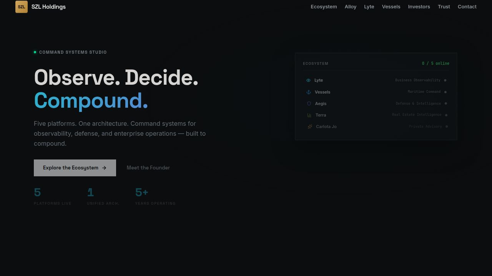
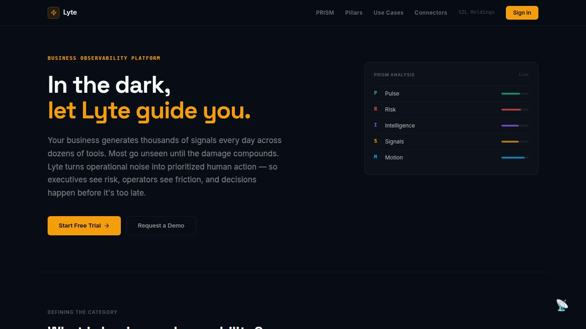
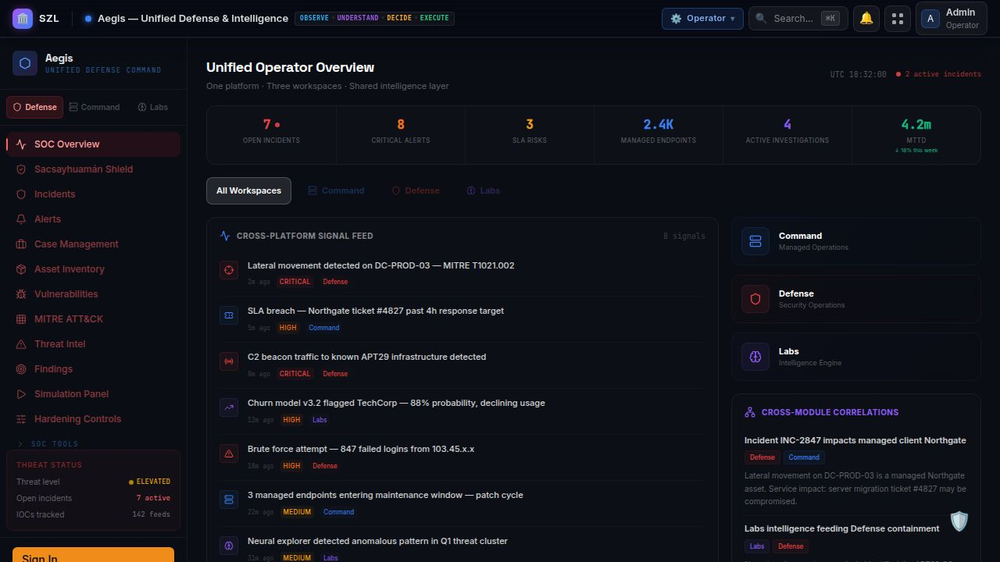
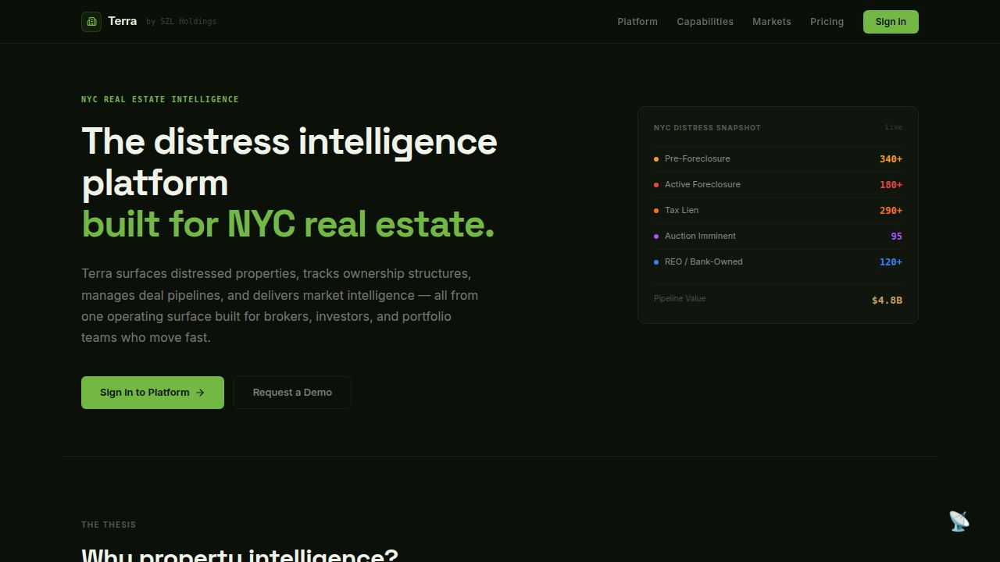
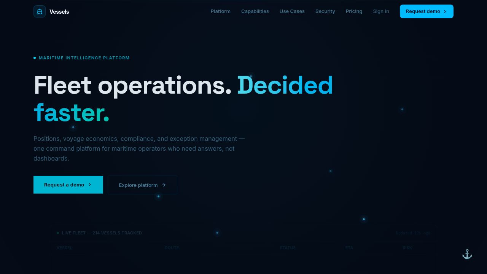

# SZL Holdings — Lyte + Alloy

**Focused now. Compounding later.**

SZL Holdings is building **Lyte**, a business observability platform, powered by **Alloy**, its execution fabric and audit layer.

The broader SZL ecosystem matters, but the near-term company narrative is intentionally tighter:

- **Lyte** = market-facing software wedge
- **Alloy** = workflow, signal, routing, and audit engine
- **Vessels / Aegis / Terra / Carlota Jo** = staged expansion lanes and option value

This repository contains the broader platform workspace and historical expansion surfaces, but the recommended commercial, investor, and lender story is centered on **Lyte + Alloy**.

**Canonical flagship repo:** `stephenlutar2-hash/szl-holdings-platform` — public mirror of the live Replit workspace.

Founded and operated by [Stephen Lutar](https://linkedin.com/in/stephen-l-279315240).

---

## Why the Narrative Changed

The previous framing emphasized a multi-platform ecosystem across several markets at once. The stronger narrative for capital formation and customer acquisition is narrower:

1. Lead with one software wedge.
2. Show one clear execution engine beneath it.
3. Present the rest of the platform as expansion logic instead of simultaneous go-to-market scope.

---

## Near-Term Operating Objective

Use Lyte + Alloy to win:

- design partners
- early pilots
- lender confidence
- investor clarity
- customer proof

---

## Platform Hierarchy

```
┌──────────────────────────────────────────────────────────────────┐
│  ADVISE                                                          │
│  Carlota Jo — Private Advisory & Strategy                        │
│  Principal advisory grounded in platform intelligence            │
├──────────────────────────────────────────────────────────────────┤
│  EXECUTE                                                         │
│  Alloy — Execution Fabric                                        │
│  Workflow engine · Audit trail · Human-in-the-loop gates         │
├──────────────────────────────────────────────────────────────────┤
│  OBSERVE · DECIDE · ACT                                          │
│  Lyte            Aegis            Terra          Vessels         │
│  Business        Defense &        Real Estate    Maritime        │
│  Observability   Intelligence     Intelligence   Intelligence    │
│  PRISM Framework Defense/Cmd/     NYC Distress   Fleet & AIS     │
│                  Intelligence     Pipeline       Telemetry       │
└──────────────────────────────────────────────────────────────────┘
```

---

## Why This Matters

The operating wedge is **Lyte + Alloy**: Lyte surfaces operational signals across an organization's full system. Alloy routes those signals to verified, auditable action.

**Business Observability** is the emerging category at the intersection of operational intelligence, AI-assisted reasoning, and structured action. It is distinct from BI (retrospective), AIOps (infrastructure-only), and ERP (execution without intelligence). No dominant platform owns this category. SZL Holdings is building the architecture for it — in verticals where the cost of poor observability is quantifiably high.

---

## Products

### Lyte — Business Observability

**Readiness: Functional Alpha**

The flagship platform. Lyte defines the category of Business Observability — making every operational surface visible, contextual, and actionable through the **PRISM** analytical framework:

- **P**ulse — Business health, operating heartbeat, trend status
- **R**isk — Approvals, churn, delays, ownership gaps, regulatory exposure
- **I**ntelligence — Modeled reasoning, evidence, confidence, likely outcomes
- **S**ignals — Anomalies, changes, event spikes, workflow drift
- **M**otion — Escalations, routing, approvals, interventions, execution

Command Inbox. Action Queue. Approvals Center. Ownership Map. Escalation Center. Readiness Module. Connector integration framework (adapter pattern with environment-detected activation). Role-aware dashboards.

### Alloy — Execution Fabric

**Readiness: Functional Alpha**

The orchestration engine that closes the loop. When Lyte surfaces a signal, Alloy routes the action. Workflow engine, human-in-the-loop approval gates, agent coordination, and immutable audit trail — the infrastructure that makes observability and accountability a single system.

**AI Decision Engine:**
- 9 schema-validated decision types: action, risk, triage, entity extraction, ownership assignment, escalation, approval recommendation, executive summary, resolution summary
- Evidence-backed retrieval with hybrid search, semantic embeddings (BGE-m3), and reranking (BGE-reranker-v2-m3)
- Policy-gated tool execution with 9 tools (lookup, create, route, audit) — default mode: `propose_only`
- Evaluation harness with 25+ golden test cases across 9 categories
- Immutable audit trail for every AI decision with model route, confidence, latency, and evidence references

### Expansion Lanes

Once the core wedge is commercially validated, the same operating spine can support:

### Aegis — Unified Defense & Intelligence

**Readiness: Functional Alpha**

Enterprise cybersecurity and managed services command. Three unified workspaces sharing one intelligence context: **Defense** (SOC operations, SOAR playbooks, XDR, MITRE ATT&CK v14), **Command** (managed services operations, client SLA management), and **Intelligence** (AI research, model governance, experiment tracking via INCA).

### Terra — Real Estate Intelligence

**Readiness: Functional Alpha**

Property intelligence for NYC brokers, investors, and portfolio teams. Live distress data pipeline integrating NYC HPD, DOF, DOB, ACRIS, and ECB records. Ownership structure tracking, deal pipeline management via Alloy, interactive property map, market signal intelligence.

### Vessels — Maritime Intelligence

**Readiness: Functional Alpha**

Fleet command for maritime operators. Real-time AIS telemetry, voyage economics, route intelligence, dark vessel detection, and sanctions screening. Exception Center with consequence modeling. Helmsman AI agent for fleet intelligence. All execution flows through Alloy.

### Carlota Jo — Private Advisory

**Readiness: Functional Alpha**

Luxury consulting platform for brand strategy, advisory, and client engagement. Web platform plus native mobile client (Expo/React Native). Principal advisory informed by platform-grade intelligence.

---

## Architecture at a Glance

Signal-to-action lifecycle across all platforms:

```
Raw Signal (domain-specific data source)
    │
    ▼
[INGEST] — Normalization, structuring, domain-specific tagging
    │
    ▼
[ANALYZE] — PRISM scoring (Lyte) · Sentinel (Aegis) · Helmsman (Vessels)
    │
    ▼
[SURFACE] — Role-appropriate dashboard · AI recommendation with reasoning
    │
    ▼
[EXECUTE] — Alloy workflow · Human approval gate (enforced in code)
    │
    ▼
Confirmed Action + Immutable Audit Trail
```

**Shared backbone:** One PostgreSQL database, one auth model (OIDC PKCE + RBAC), one design system (`@workspace/shared-ui`), one AI engine, one audit trail. Every new vertical compounds the existing infrastructure investment.

---

## Trust

**AI governance is structural, not policy.** Advisory agents cannot execute consequential actions without explicit human confirmation. This is enforced at the Alloy execution fabric level — not just in the UI. Every tool call is policy-gated, and the default execution mode is `propose_only`.

**Audit trail is a first-class feature.** Every significant action — by a human or an agent — is logged immutably with full attribution, role context, and timestamp. The chain from signal to recommendation to approval to action is permanently traceable. AI decision audit includes model route, confidence score, latency, and evidence references.

**Enterprise identity is active.** Multi-tenant SSO via Azure AD, SCIM 2.0 provisioning, six-tier RBAC hierarchy (`super_admin`, `admin`, `ops`, `analyst`, `viewer`, `executive_viewer`), organization-scoped middleware, and tenant-isolated data access.

**Secrets are never committed.** All credentials are managed via environment variable injection. `.env` files are gitignored absolutely.

**Readiness labels are standardized.** Every product uses the five-level [Readiness Standard](docs/public/readiness-standard.md) (Concept → Prototype → Functional Alpha → Pilot Ready → Production). Every environment is labeled per the [Environment Labeling Standard](docs/public/environment-labeling-standard.md) (Demo / Seeded Data / Pilot / Live). See also: [Canonical Demo Flow](docs/buyer/canonical-demo.md).

**Ecosystem tiering is formal.** Every artifact is assigned to a tier: Tier 1 (Flagship Now — Lyte, Alloy/API Server, SZL Holdings, Shared Libraries), Tier 2 (Pilot-Adjacent — Vessels and Lyte Mobile), or Tier 3 (Parked/Staged — all remaining, including Aegis, Terra, Carlota Jo, and all other mobile apps). See [Tiering Plan](docs/internal/operations/tiering-plan.md) · [System Inventory](docs/internal/operations/system-inventory.md).

See [Trust Center](docs/trust/trust-center.md) · [Security Posture](docs/trust/security-posture.md) · [SECURITY.md](SECURITY.md)

---

## Deployment & Operations

| Environment | Platform | Status |
|-------------|----------|--------|
| Development / Demo | Replit | Active |
| Enterprise Production | Azure (Bicep IaC in `/infra/`) | Ready — pending first commercial deployment |

**API health:** `GET /api/health` returns `{"status":"healthy", "services": {...}}`

**Rollback:** Replit checkpoints before every task merge. Full Git history.

---

## Screenshots


*SZL Holdings corporate platform — ecosystem overview and investor relations*


*Lyte — Business Observability platform with PRISM framework*


*Lyte PRISM command surface — Pulse, Risk, Intelligence, Signals, Motion*


*Aegis — SOC command dashboard with MITRE ATT&CK integration*


*Terra — NYC real estate intelligence and distress data platform*


*Vessels — Fleet command dashboard with AIS telemetry*

---

## Repository Structure

This is a **pnpm monorepo** with a shared TypeScript foundation. Every frontend artifact is a Vite + React SPA. The API server is a single Express process serving all platform backends. PostgreSQL with Drizzle ORM is the persistence layer.

```
/
├── artifacts/              # Deployable applications (16 total)
│   ├── api-server/         # Express API — all platform backends
│   ├── szl-holdings/       # SZL Holdings — corporate site
│   ├── lyte-command-center/# Lyte — Business Observability
│   ├── firestorm/          # Aegis — Defense & Intelligence
│   ├── terra/              # Terra — Real Estate Intelligence
│   ├── vessels/            # Vessels — Maritime Intelligence
│   ├── carlota-jo/         # Carlota Jo — Advisory web app
│   ├── stephen-site/       # Stephen Lutar — Founder site
│   ├── carlota-jo-mobile/  # Carlota Jo — Expo/React Native
│   ├── szl-holdings-mobile/# SZL Holdings — Executive mobile
│   ├── aegis-mobile/       # Aegis — Mobile SOC command
│   ├── vessels-mobile/     # Vessels — Fleet command mobile
│   ├── lyte-mobile/        # Lyte — AIOps mobile command
│   ├── terra-mobile/       # Terra — Field intelligence mobile
│   └── stephen-mobile/     # Stephen — Personal command mobile
├── lib/                    # Shared TypeScript libraries
│   ├── db/                 # Drizzle schema, migrations, seed
│   ├── shared-ui/          # Cross-app React component library
│   ├── auth/               # OIDC authentication
│   ├── services/           # Business logic adapters
│   ├── workflow-engine/    # Alloy execution fabric
│   ├── ai-engine/          # AI inference and orchestration
│   ├── audit/              # Compliance audit trail
│   ├── observability/      # APM, logging, metrics
│   ├── api-client-react/   # Generated React Query hooks
│   ├── api-zod/            # Zod schema validation
│   ├── api-spec/           # OpenAPI 3.1 specification
│   └── graphql-client/     # GraphQL client
├── packages/               # Marketplace packages
│   ├── salesforce-appexchange/  # Salesforce AppExchange
│   └── atlassian-connect/       # Jira Marketplace Connect
├── infra/                  # Azure Bicep IaC templates
├── scripts/                # Seed, automation, GitHub, mirror
├── ops/                    # GitHub operations, automation
├── profile-readme/         # GitHub profile README package
└── docs/                   # Full documentation suite
    ├── architecture/       # System overview, platform map, data flow
    ├── trust/              # Trust center, security, privacy, deployment
    ├── investor/           # Thesis, readiness, GTM, team, gaps
    ├── buyer/              # Executive overview, solution brief, use cases
    ├── design/             # Design audit, tokens, remediation plan
    ├── releases/           # Release strategy, versioning, changelogs
    ├── public/             # Mirror policy
    └── audit/              # Surface audit, canonicalization plan
```

---

## Tech Stack

| Layer | Technology |
|-------|-----------|
| Frontend | React, Vite, TypeScript, Tailwind CSS v4, Framer Motion, Recharts |
| Backend | Express, TypeScript, Node.js, esbuild |
| Database | PostgreSQL, Drizzle ORM |
| Auth | OpenID Connect (PKCE), organization-scoped RBAC |
| Real-time | WebSocket (HMAC-signed tickets, per-channel ACL) |
| AI | HuggingFace Inference (Qwen3-8B, BGE-m3, BGE-reranker-v2-m3), OpenAI, Anthropic |
| Payments | Stripe (Checkout, Subscriptions, Invoicing, Customer Portal) |
| Maps | Mapbox GL JS |
| Mobile | Expo / React Native (iOS and Android) |
| PDF | pdfkit (server-side, 8 branded templates) |
| Email | Resend / SendGrid / SMTP (multi-provider with failover) |
| Notifications | Slack webhooks, Microsoft Teams webhooks, WebSocket push |
| Infra | Azure Bicep (App Service, PostgreSQL, Key Vault, Redis, CDN) |
| API | OpenAPI 3.1, GraphQL (Apollo Server), generated client hooks |
| Marketplace | Salesforce AppExchange, Jira Marketplace (Atlassian Connect) |

---

## Documentation Map

| Document | Description |
|----------|-------------|
| [Architecture Overview](docs/architecture/system-overview.md) | Full system architecture, layers, and design principles |
| [Platform Map](docs/architecture/platform-map.md) | Ecosystem topology, product registry, readiness labels |
| [Data Flow](docs/architecture/data-flow.md) | Entity model, signal-to-action flow, audit trail schema |
| [Trust Center](docs/trust/trust-center.md) | AI governance, RBAC, auditability, incident readiness |
| [Security Posture](docs/trust/security-posture.md) | Authentication, authorization, data protection, known gaps |
| [Deployment Model](docs/trust/deployment-model.md) | Replit, Azure, multi-tenant configuration |
| [Investor Overview](docs/investor/investor-overview.md) | Company summary, investment thesis, contact |
| [Platform Thesis](docs/investor/platform-thesis.md) | Category definition, defensibility, expansion logic |
| [Product Readiness](docs/investor/product-readiness.md) | Honest readiness labels per platform |
| [Go-to-Market](docs/investor/go-to-market.md) | Entry strategy, target buyers, pricing philosophy |
| [Readiness Gaps](docs/investor/readiness-gaps.md) | Transparent disclosure of current gaps and paths to close |
| [Executive Overview](docs/buyer/executive-overview.md) | C-suite evaluation guide |
| [Solution Brief](docs/buyer/solution-brief.md) | Platform-by-platform capability summaries |
| [Security Summary](docs/buyer/security-summary.md) | Security architecture for procurement teams |
| [Use Cases](docs/buyer/use-cases.md) | Concrete use cases with expected outcomes |
| [Design Audit](docs/design/design-audit.md) | Visual consistency assessment and recommendations |
| [Release Notes v0.1.0](docs/releases/v0.1.0.md) | What's in the initial release |
| [Public Mirror Policy](docs/public/public-mirror-policy.md) | What's published, what's excluded, and why |
| [Roadmap](ROADMAP.md) | Phase-by-phase product direction (public-safe) |
| [Changelog](CHANGELOG.md) | Release history and milestone log |
| [Platform Overview](docs/PLATFORM_OVERVIEW.md) | Polished platform overview for external audiences |
| [What This Proves](docs/WHAT_THIS_PROVES.md) | Technical proof summary for evaluators and recruiters |
| [System Inventory](docs/internal/operations/system-inventory.md) | Complete artifact baseline — readiness, tier, auth, payments, monitoring |
| [Tiering Plan](docs/internal/operations/tiering-plan.md) | Tier 1/2/3 assignments, rules, and investment guidance |
| [Readiness Standard](docs/public/readiness-standard.md) | Five-level readiness scale with criteria (Concept → Prototype → Functional Alpha → Pilot Ready → Production) |
| [Environment Labeling Standard](docs/public/environment-labeling-standard.md) | Environment label definitions: Live / Pilot / Demo / Seeded Data |

---

## Getting Started

```bash
# Install dependencies
pnpm install

# Push database schema
pnpm --filter db push

# Start the API server
pnpm --filter @workspace/api-server run dev

# Start a frontend application
pnpm --filter @workspace/lyte-command-center run dev
pnpm --filter @workspace/firestorm run dev
pnpm --filter @workspace/vessels run dev
pnpm --filter @workspace/terra run dev
```

Environment variables: copy `.env.example` to `.env` — all required variables are documented there.

---

## Public Mirror Notice

This repository (`stephenlutar2-hash/szl-holdings-platform`) is the **public mirror** of the SZL Holdings platform ecosystem. The authoritative source of truth is the live **Replit workspace** where all active development occurs.

The mirror is updated at meaningful milestones — after significant features, before investor or enterprise review sessions, and at the founder's discretion. The published branch (`master`) is always clean and buildable.

See [Public Mirror Policy](docs/public/public-mirror-policy.md) for the full curation rules and exclusion policy.

---

## Roadmap

*Public-safe directional roadmap. Specific dates and competitive details are not disclosed.*

### Phase 1 — Commercial Activation *(in progress)*
- Revenue activation: Stripe billing live for Vessels, Lyte, Terra, Carlota Jo
- Design partner onboarding (first paying commercial pilots)
- Alloy AI decision engine: schema-validated decisions, evidence retrieval, policy-gated execution, eval harness
- Enterprise SSO (Azure AD), SCIM 2.0 provisioning, multi-tenant RBAC — implemented
- Canonical Lyte + Alloy demo flow documented

### Phase 2 — Enterprise Hardening
- SOC 2 Type II audit preparation
- Full APM integration (Sentry, Datadog, or equivalent)
- Performance baseline and load testing
- Formal DR plan with documented RTO/RPO
- Redis session store for production deployments

### Phase 3 — Platform Expansion
- Salesforce AppExchange submission (Lyte connector)
- Jira Marketplace listing (Alloy workflow integration)
- Cross-domain signal correlation (Lyte ↔ Aegis ↔ Terra ↔ Vessels)
- Dedicated model inference serving for enterprise pilots
- White-label and reseller partner program

*For more detail on near-term milestones, see [CHANGELOG.md](CHANGELOG.md).*

---

## Start Here

### For Investors

→ [Investor Overview](docs/investor/investor-overview.md)  
→ [Platform Thesis](docs/investor/platform-thesis.md)  
→ [Product Readiness](docs/investor/product-readiness.md)  
→ [Go-to-Market](docs/investor/go-to-market.md)  
→ [Readiness Gaps (Honest)](docs/investor/readiness-gaps.md)  
→ Request live demo: inquiries@szlholdings.com

### For Technical Reviewers

→ [Architecture Overview](docs/architecture/system-overview.md)  
→ [Data Flow & Entity Model](docs/architecture/data-flow.md)  
→ [Security Posture](docs/trust/security-posture.md)  
→ Start the API server and browse `/api/health`  
→ Explore `lib/` for shared infrastructure  
→ Explore `artifacts/lyte-command-center/src/` for the flagship platform

### For Design & Product Reviewers

→ [Platform Map](docs/architecture/platform-map.md) — product scope  
→ [Design System Tokens](docs/design/design-system-tokens.md)  
→ `lib/shared-ui/src/` — component library  
→ Screenshots: `docs/screenshots/`

### For Enterprise Buyers

→ [Executive Overview](docs/buyer/executive-overview.md)  
→ [Solution Brief](docs/buyer/solution-brief.md)  
→ [Security Summary](docs/buyer/security-summary.md)  
→ [Deployment Options](docs/buyer/deployment-options.md)  
→ [Use Cases](docs/buyer/use-cases.md)  
→ Contact: inquiries@szlholdings.com

---

## Contact & Partnerships

**Investment, partnership, and enterprise evaluation inquiries:**  
[inquiries@szlholdings.com](mailto:inquiries@szlholdings.com)

**Founder LinkedIn:**  
[linkedin.com/in/stephen-l-279315240](https://linkedin.com/in/stephen-l-279315240)

**Website:**  
[szlholdings.com](https://szlholdings.com)

---

## Legal

SZL Holdings is a private operating company. All platforms, intellectual property, and trademarks are owned by SZL Holdings. Stephen Lutar is the founder and sole officer.

**License:** Proprietary. All rights reserved. See [LICENSE](LICENSE).
