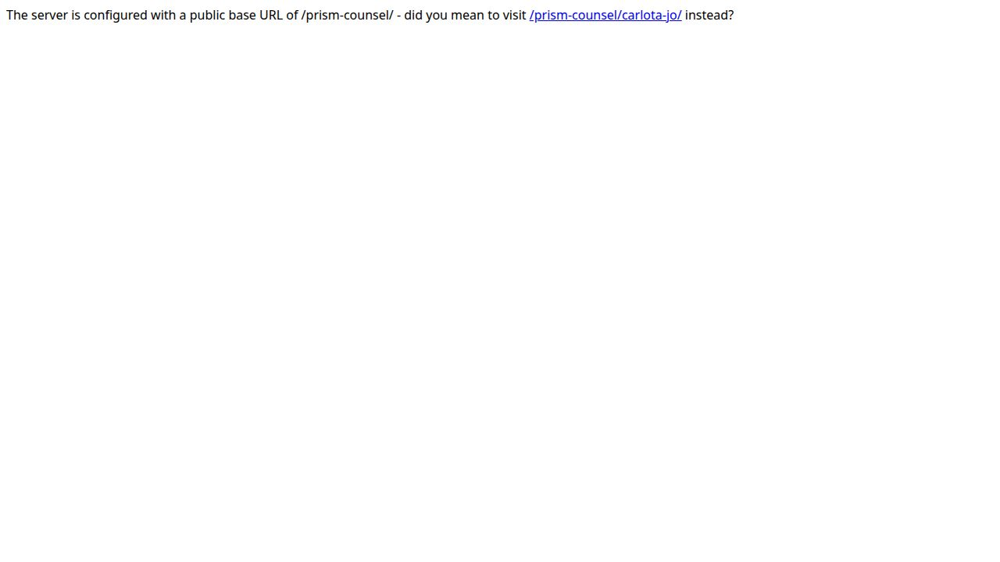
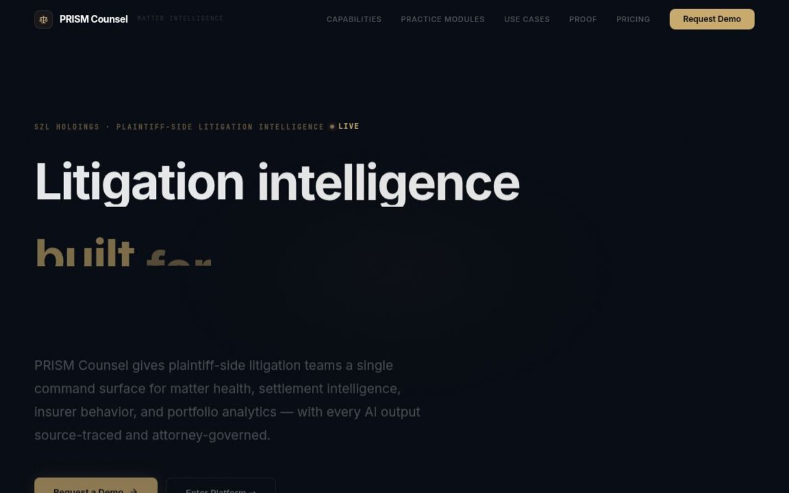
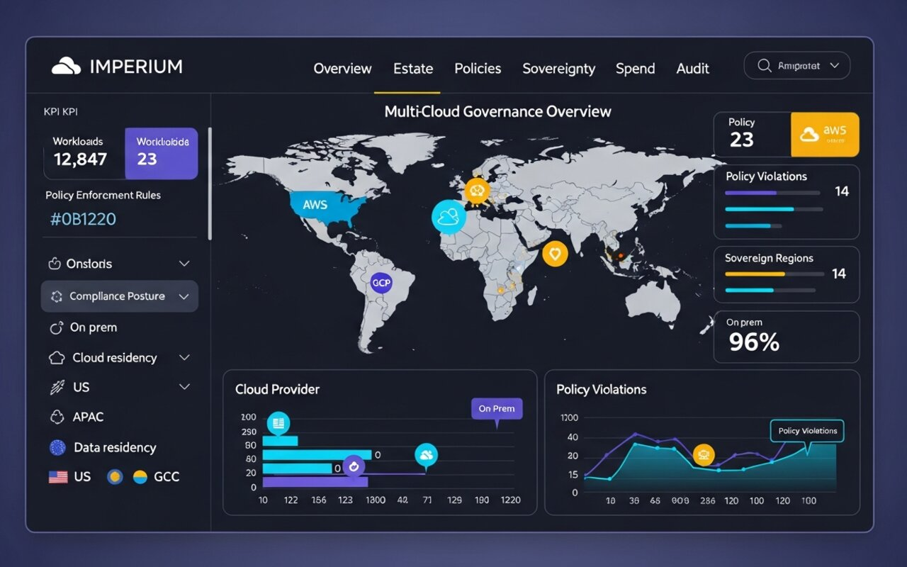

# SZL Holdings

[](https://github.com/szl-holdings/szl-holdings-platform/actions/workflows/ci.yml) [](https://github.com/szl-holdings/szl-holdings-platform/actions/workflows/codeql.yml) [](https://github.com/szl-holdings/szl-holdings-platform/actions/workflows/security.yml) [](./LICENSE) [](https://www.typescriptlang.org/) [](https://pnpm.io/) [](https://www.postgresql.org/)

**Governed decision infrastructure — connecting what is observable to what is executable, with full attribution.**

[Architecture](./ARCHITECTURE.md) · [Platform Primitives](./PLATFORM_PRIMITIVES.md) · [Trust Center](./docs/trust/trust-center.md) · [Security](./SECURITY.md) · [Investor Docs](./docs/investor/platform-thesis.md)

---

## Trust

An AI-assisted operations platform carries a distinct trust burden. The platform addresses it structurally, not through policy documents alone.

| Concern | Structural Response |
|---------|---------------------|
| AI without oversight | Covenant Policy enforces approval gates — AI cannot execute consequential actions without human confirmation |
| Opaque AI outputs | All recommendations include source citations, confidence scores, and retrieval provenance |
| Audit accountability | Every action generates an immutable audit event with actor attribution via Proof Chain |
| Access control | 11-role RBAC with org-scoped tenant isolation. Deny-by-default global auth enforcer |
| Multi-tenancy | All queries scoped by org identifier. Cross-org access returns 404 to prevent information leakage |
| Decision traceability | Outcome Graph tracks the full chain: signal to recommendation to decision to outcome |

[Trust Center](docs/trust/trust-center.md) · [Security Policy](SECURITY.md) · [Proof and Policy Model](PROOF_AND_POLICY_MODEL.md)

---

## What We Build

Enterprise operations have an accountability gap. Dashboards show what happened. Alerts surface what is wrong. Neither tells operators what to do next, who is responsible, or whether a recommended action is safe to execute.

AI tools compound the problem: they add recommendation volume without governance. Operators accumulate more data, more noise, and more untracked decisions.

SZL Holdings builds the governed decision layer that sits between signal detection and action execution:

```
Signal -> Context -> Recommendation -> Simulation -> Policy -> Approval -> Execution -> Proof -> Outcome
```

Every step is instrumented. Every decision is attributed. Every AI recommendation carries source citations and confidence scores. Every consequential action requires human confirmation.

---

## Product Portfolio

### Platform Core

**Lyte** is the flagship command surface where operators observe signals, review AI recommendations, run simulations, and make governed decisions. It runs the PRISM framework (People, Revenue, Infrastructure, Security, Market) across all connected domains.

**Alloy** is the execution fabric: signal normalization, workflow orchestration, approval controls, human-in-the-loop gates, and immutable audit trail. It is the shared infrastructure layer that makes AI-assisted operations durable and accountable.

**CORTEX** is the unified mobile command app (iOS and Android) that surfaces all domain workspaces with biometric authentication and offline-capable sync.

### Domain Packs

Domain packs extend the same governance infrastructure into domain-specific intelligence. Each pack is a structured application built on Lyte, Alloy, and the six platform primitives.

| Product | Domain | Status |
|---------|--------|--------|
| **Aegis** | Security and defense intelligence — SOC command, advanced security modules, SOAR playbooks, threat intelligence | Active |
| **Vessels** | Maritime fleet intelligence — AIS tracking, S&P workflow, demurrage, freight, voyage P&L | Active |
| **Terra** | Real estate intelligence — distress pipeline, ownership graph, deal workflow, AI analysis | Active |
| **PRISM Counsel** | Legal matter command — agentic matter management, court filings, recovery operations | Active |
| **Carlota Jo** | Premium advisory operations — UHNW client portal, service catalog, engagement management | Active |
| **IMPERIUM** | Cloud sovereignty — multi-cloud governance, policy enforcement, cloud estate visibility | Archived |

### Command Portal

The Command Portal is the cross-domain real-time dashboard aggregating signals from all domain packs into a unified executive view with eight-domain SSE feeds and executive briefing.

### Screens









---

## Architecture

The six platform primitives define what is structurally different from dashboards, copilots, and workflow tools:

| Primitive | Function |
|-----------|----------|
| **Outcome Graph** | Tracks the full lifecycle: recommendation to decision to outcome. Closed-loop learning — the platform knows which recommendations led to which results. |
| **Proof Chain** | Immutable, verifiable audit trail for every significant action. Compliance teams can reconstruct any decision chain. AI outputs carry provenance. |
| **Covenant Policy** | Defines what agents and users can do, with what approval requirements. Human-in-the-loop is enforced at the policy layer — AI cannot bypass it. |
| **Decision Simulation** | Probabilistic simulation before action — confidence intervals and sensitivity analysis. Operators see not just what should be done but what could happen. |
| **Workflow Engine** | Durable multi-step process orchestration with agent coordination. Complex decisions are tracked, governed, and recoverable. |
| **Event Fabric** | Cross-domain signal backbone — normalizes, routes, and correlates events. A sanctions hit in Vessels can surface a legal risk flag in PRISM Counsel automatically. |

**Platform hierarchy:**

```
+-----------------------------------------------------------------------+
|  SZL HOLDINGS                                                         |
|  Governed decision infrastructure layer                              |
+-----------------------------------------------------------------------+
|  Lyte                  — Flagship command surface (PRISM framework)   |
|  Alloy                 — Execution fabric (workflows, approvals, audit)|
|  CORTEX                — Unified mobile command (iOS + Android)       |
+-----------------------------------------------------------------------+
|  DOMAIN PACKS                                                         |
|                                                                       |
|  Aegis    Vessels    Terra    PRISM Counsel    Carlota Jo             |
+-----------------------------------------------------------------------+
|  GOVERNANCE INFRASTRUCTURE                                            |
|                                                                       |
|  Outcome Graph  .  Proof Chain  .  Covenant Policy                   |
|  Decision Simulation  .  Workflow Engine  .  Event Fabric            |
+-----------------------------------------------------------------------+
|  DATA LAYER                                                           |
|                                                                       |
|  PostgreSQL 16 (Drizzle ORM)  .  External feeds: AIS, STIX/TAXII    |
+-----------------------------------------------------------------------+
```

See [PLATFORM_PRIMITIVES.md](PLATFORM_PRIMITIVES.md) for the full specification of each primitive and [ARCHITECTURE.md](ARCHITECTURE.md) for the service topology.

---

## Repository Map

This is a pnpm monorepo. Key locations:

| Path | Contents |
|------|----------|
| `artifacts/` | All deployable web and mobile applications |
| `lib/` | Shared libraries: database client, auth, AI, event bus, UI components |
| `scripts/` | Seed scripts, QA scripts, deployment utilities |
| `docs/` | Architecture, trust, investor, and operational documentation |
| `ops/` | Infrastructure configuration, environment matrix, runbooks |
| `.github/workflows/` | CI, CodeQL, security, deploy, and README QA pipelines |
| `assets/readme/` | All README-facing visual assets (products, architecture, brand) |

Artifact inventory (auto-generated from `artifacts/*/.replit-artifact/artifact.toml` — run `pnpm readme:generate` to refresh):

<!-- BEGIN: artifact-inventory (auto-generated by scripts/generate-readme-product-table.js) -->
| Artifact | Kind | Path | Preview |
|----------|------|------|---------|
| SZL Holdings Dashboard | web | `artifacts/szl-holdings/` | `/` |
| API Server | web | `artifacts/api-server/` | `/api/` |
| Carlota Jo Consulting | web | `artifacts/carlota-jo/` | `/carlota-jo/` |
| NEXUS — Unified Agentic AI Layer | design | `artifacts/mockup-sandbox/` | `/nexus/` |
| Pulse — AI Executive Briefing | web | `artifacts/pulse/` | `/pulse/` |
| SZL Holdings — Mobile Command | mobile | `artifacts/szl-holdings-mobile/` | `/szl-holdings-mobile/` |
| Terra — Real Estate Intelligence | web | `artifacts/terra/` | `/terra/` |
| Unified Command | web | `artifacts/command/` | `/command/` |
| Vessels Maritime Intelligence | web | `artifacts/vessels/` | `/vessels/` |
<!-- END: artifact-inventory -->

---

## Build, Run, and Contribute

**Requirements:** Node.js 22+, pnpm 10+

```bash
git clone https://github.com/szl-holdings/szl-holdings-platform.git
cd szl-holdings-platform
pnpm install
pnpm dev
```

**Common tasks:**

```bash
pnpm typecheck          # TypeScript type checking across all packages
pnpm test               # Unit and component tests
pnpm test:integration   # Integration tests
pnpm readme:check       # Validate README images and badge workflows
pnpm qa:routes          # Smoke-test all routes
pnpm audit:all          # Run full audit suite (mocks, routes, deps, copy, design)
pnpm seed               # Seed the local database with demo data
```

See [DEPLOYMENT-GUIDE.md](DEPLOYMENT-GUIDE.md) for staging and production deployment.

**Contributing:** See [CONTRIBUTING.md](CONTRIBUTING.md) for the branch workflow, code style, commit format, and PR process. All contributions require a passing CI run and a passing `pnpm readme:check` before merge.

**Environments:**

| Environment | Purpose | Trigger |
|-------------|---------|---------|
| Development | Active development and internal preview | Always on (Replit workspace) |
| Staging | Integration validation before production | Push to `main` via `deploy-staging.yml` |
| Production | Customer-facing deployment | Published release via `deploy-production.yml` |

---

## Governance, Security, and Contact

**Access control:** 11-role RBAC with deny-by-default enforcement. All routes require authentication. All queries are org-scoped.

**AI governance:** Advisory agents only. Covenant Policy enforces approval gates at the workflow layer. AI cannot bypass human confirmation requirements.

**Audit trail:** Every consequential action writes an immutable Proof Chain event with actor attribution, timestamp, source, and decision context.

**Vulnerability disclosure:** See [SECURITY.md](SECURITY.md). Responsible disclosure only.

**Known gaps and tech debt:** Documented honestly in [KNOWN-GAPS.md](KNOWN-GAPS.md).

### Documentation Index

| Document | Purpose |
|----------|---------|
| [ARCHITECTURE.md](ARCHITECTURE.md) | System architecture: topology, stack, design principles |
| [PLATFORM_PRIMITIVES.md](PLATFORM_PRIMITIVES.md) | The six core abstractions |
| [DATA-MODEL.md](DATA-MODEL.md) | Entity-relationship overview of the core database schema |
| [API-SPEC.md](API-SPEC.md) | API surface: route inventory, auth model, rate limiting |
| [ACCESS-CONTROL-MATRIX.md](ACCESS-CONTROL-MATRIX.md) | Role-permission matrix mapped to implementation |
| [SECURITY-CHECKLIST.md](SECURITY-CHECKLIST.md) | Security controls checklist |
| [DEPLOYMENT-GUIDE.md](DEPLOYMENT-GUIDE.md) | Deployment procedures |
| [OPERATIONS-RUNBOOK.md](OPERATIONS-RUNBOOK.md) | Operational procedures and incident response |
| [KNOWN-GAPS.md](KNOWN-GAPS.md) | Honest assessment of tech debt and planned improvements |
| [CONTRIBUTING.md](CONTRIBUTING.md) | Contribution guidelines |
| [docs/readme-standards.md](docs/readme-standards.md) | README asset and badge standards |

---

**Stephen Lutar** — Founder and CEO, SZL Holdings

**Email:** inquiries@szlholdings.com
**Website:** [szlholdings.com](https://szlholdings.com)
**LinkedIn:** [linkedin.com/in/stephen-l-279315240](https://linkedin.com/in/stephen-l-279315240)

Open to design partner conversations, enterprise evaluation, and investment introductions.
