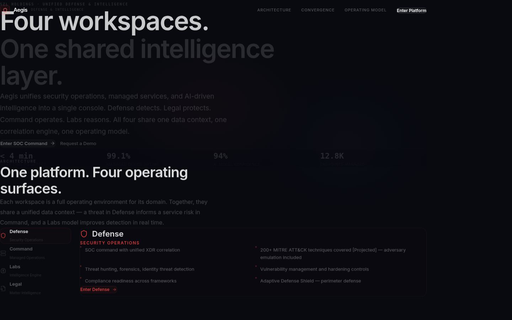

# SZL Holdings — Interactive Investor Pitch Deck

> Series A pitch deck with live ATLAS execution engine replay, scenario branching, and interactive platform demonstrations — built to run in a browser, not a PDF.

[](https://github.com/szl-holdings/szl-holdings-platform/actions/workflows/ci.yml)
[](https://www.typescriptlang.org/)
[](../../LICENSE.md)

[Investor Dashboard](https://szlholdings.com/stephen/investor) · [Platform Demo Video](https://szlholdings.com/szl-demo-video/) · [Platform Thesis](../../docs/investor/platform-thesis.md) · [Data Room Index](../../docs/investor/data-room-index.md)



---

## What it does

This artifact hosts the SZL Holdings Series A investor pitch deck as an interactive React web application — not a slide export. Investors can navigate the full deck, explore the ATLAS execution engine through the live replay viewer, and branch into alternative scenarios to understand how the platform's governed decision loop functions under different conditions.

The pitch deck is a live demonstration of the platform thesis: the deck itself is built on the same tech stack (React 19, TypeScript, Vite) that powers the production surfaces. Investors can see the code quality, the architecture, and the engineering standards firsthand.

## Deck Contents

| Slide | Section | Key Message |
|-------|---------|-------------|
| S01 | Cover | Governed Autonomy — the era of AI without receipts is ending |
| S02 | Problem | Enterprise AI has an accountability gap |
| S03 | Solution | The governed decision layer |
| S04 | Platform | 6 primitives, 6 domain packs, one architecture |
| S05 | Market | TAM/SAM/SOM — the enterprise decision intelligence market |
| S06 | Traction | Design partners, pipeline, and proof points |
| S07 | Business Model | ARR model, expansion motion, domain pack economics |
| S08 | Team | Founder profile and advisory network |
| S09 | Ask | Series A ask and use of proceeds |

## ATLAS Runtime

| Route | Purpose |
|-------|---------|
| `/aegis/atlas` | ATLAS execution runtime live demo |
| `/aegis/replay` | Execution replay viewer — step through a decision lifecycle |
| `/aegis/branches` | Scenario branch explorer — fork decisions, see outcome paths |

The ATLAS demo illustrates the end-to-end governed decision loop: signal → context → recommendation → simulation → approval → execution → Proof Chain.

## Tech Stack

| Layer | Technology |
|-------|-----------|
| **Frontend** | React 19, Vite 7, Tailwind CSS 4, Framer Motion |
| **Language** | TypeScript (strict mode) |
| **Animations** | Framer Motion (slide transitions, data visualizations) |
| **Charts** | Recharts (market data, unit economics) |
| **Backend** | Express 5 via shared API server (ATLAS replay data) |

## Quick Start

```bash
# From the monorepo root
pnpm install
pnpm --filter @szl-holdings/aegis dev
```

For ATLAS replay views (optional, pulls live data):

```bash
pnpm --filter @szl-holdings/api-server dev
```

## Notable Source Paths

| Path | Purpose |
|------|---------|
| `src/pages/` | Slide pages (S01–S09) and ATLAS surfaces |
| `src/components/` | Slide chrome and ATLAS UI components |
| `src/data/` | Slide content and ATLAS demo data |
| `src/lib/` | API client and helpers |
| `docs/` | Supporting investor documents |

## Environment Variables

| Variable | Purpose |
|----------|---------|
| `VITE_API_URL` | API server base URL (used by ATLAS replay views) |

## Notes

This artifact previously hosted the Aegis defense intelligence app at this path. It now hosts the investor pitch deck and ATLAS demo. The defense intelligence surface is archived — see the root [`README.md`](../../README.md) for the archived surfaces register.

---

**SZL Holdings** · [szlholdings.com](https://szlholdings.com) · [stephen@szlholdings.com](mailto:stephen@szlholdings.com)
