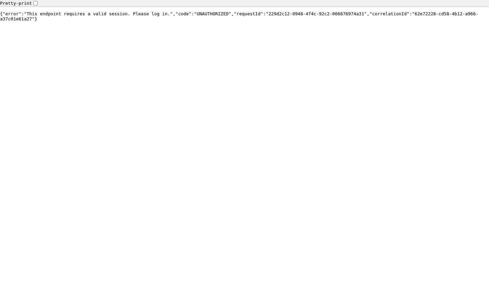

# API Server — Platform Backend

> Shared Express 5 API server powering all SZL Holdings domain packs — auth, AI services, data, webhooks, and the Proof Chain.

[](https://github.com/szl-holdings/szl-holdings-platform/actions/workflows/ci.yml)
[](https://www.typescriptlang.org/)
[](../../LICENSE.md)

[Architecture](../../docs/architecture/architecture.md) · [Onboarding Guide](../../docs/onboarding.md) · [Investor Dashboard](https://szlholdings.com/stephen/investor) · [Platform Thesis](../../docs/investor/platform-thesis.md)



---

## What it does

This is the single shared backend that serves every SZL Holdings front-end artifact. It handles OIDC/PKCE authentication, multi-provider AI orchestration (Anthropic, OpenAI, Gemini), all database operations via Drizzle ORM, webhook ingestion, the Proof Chain immutable audit trail, and the n8n automation bridge.

All domain routes are scoped under `/api/<domain>/` — maritme, real estate, advisory, cybersecurity, defense, operations.

## Run locally

```bash
# From the monorepo root
pnpm install
pnpm --filter @workspace/api-server dev
```

**Health check:** `GET /api/health`

## Key route groups

| Route Group | Domain | Purpose |
|-------------|--------|---------|
| `/api/auth/*` | Platform | OIDC/PKCE, session, token management |
| `/api/vessels/*` | Maritime | Fleet data, voyage intelligence, sanctions |
| `/api/terra/*` | Real Estate | Distress pipeline, ownership graph, deals |
| `/api/sentra/*` | Cyber | Threat feeds, incidents, posture |
| `/api/aegis/*` | Defense | SOC data, managed services, Labs |
| `/api/counsel/*` | Legal | Matters, obligations, counterparties, RAG |
| `/api/carlota-jo/*` | Advisory | Client portal, appointments, documents |
| `/api/command/*` | Operations | Signals, actions, approvals, automations |
| `/api/proof-chain/*` | Platform | Immutable audit trail writes and queries |

## Tech stack

Express 5 · TypeScript (strict) · PostgreSQL 16 · Drizzle ORM · Anthropic / OpenAI / Gemini · OIDC/PKCE (Clerk) · Node 22

## Architecture reference

Full system architecture: [`docs/architecture/architecture.md`](../../docs/architecture/architecture.md)

---

**SZL Holdings** · [szlholdings.com](https://szlholdings.com) · [inquiries@szlholdings.com](mailto:inquiries@szlholdings.com)
