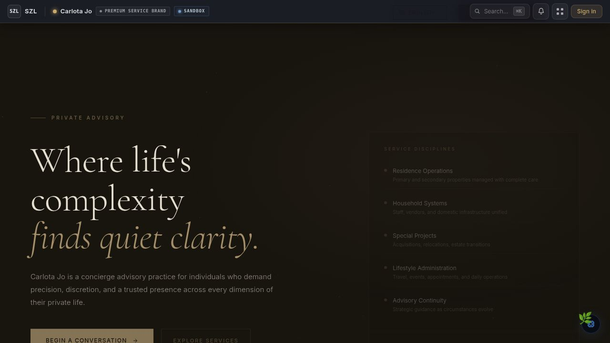

# Carlota Jo — Premium Advisory Operations

> White-glove UHNW client portal with secure communication, service catalog, appointment booking, and Proof Chain-attributed document delivery.

[](https://github.com/szl-holdings/szl-holdings-platform/actions/workflows/ci.yml)
[](https://www.typescriptlang.org/)
[](../../LICENSE.md)



[Live Demo](https://szlholdings.com) · [Platform Demo Video](https://szlholdings.com/szl-demo-video/) · [Investor Dashboard](https://szlholdings.com/stephen/investor) · [Platform Thesis](../../docs/investor/platform-thesis.md)

---

## What it does

Carlota Jo is the premium advisory operations domain pack for the SZL Holdings platform. It provides a private, white-glove digital experience for ultra-high-net-worth (UHNW) clients: secure intake, service catalog browsing, appointment booking, and document delivery — all under the same Proof Chain and Covenant Policy infrastructure that runs every SZL Holdings product.

For advisory firms serving UHNW clients, trust and discretion are the product. Carlota Jo operationalizes that trust: every document delivery is attributed, every client communication is secured, and every service engagement is tracked with full audit trail.

## Feature Highlights

- **Client Portal** — Secure, authenticated client communication hub with Proof Chain attribution on every interaction
- **Service Catalog** — Advisory service management with tiered offerings, eligibility rules, and request workflows
- **Booking System** — Appointment scheduling with advisor allocation, conflict resolution, and confirmation flow
- **Document Delivery** — Secure document sharing with Covenant Policy enforcement and delivery receipts
- **Engagement Management** — End-to-end engagement lifecycle tracking from intake to outcome
- **Client Messaging** — Encrypted in-platform messaging with read receipts and audit trail
- **Internationalization** — Multi-language support for global UHNW clientele

## Architecture

```
Client Request / External Intake
          |
    Auth Layer (OIDC/PKCE, client-scoped isolation)
          |
    Advisory Workflow Engine (Alloy)
          |
    Document Vault + Covenant Policy (access control, delivery rules)
          |
    Proof Chain (immutable attribution: every access, delivery, decision)
          |
    Carlota Jo UI (React 19 + Vite 7)
```

## Tech Stack

| Layer | Technology |
|-------|-----------|
| **Frontend** | React 19, Vite 7, Tailwind CSS 4, Framer Motion |
| **Language** | TypeScript (strict mode, full stack) |
| **State** | TanStack Query v5, React Context |
| **i18n** | React i18next, multi-locale support |
| **Backend** | Express 5 via shared API server |
| **Database** | PostgreSQL 16 via Drizzle ORM |
| **Auth** | OIDC/PKCE, 11-role RBAC, org-scoped tenant isolation |
| **Audit** | Proof Chain — immutable, append-only event log |

## Quick Start

```bash
# From the monorepo root
pnpm install
pnpm --filter @szl-holdings/api-server dev   # Start the API server first
pnpm --filter @szl-holdings/carlota-jo dev
```

## Key Modules

| Module | Route | Purpose |
|--------|-------|---------|
| Client Portal | `/carlota-jo/portal` | Secure client communication hub |
| Service Catalog | `/carlota-jo/services` | Advisory service management |
| Booking | `/carlota-jo/booking` | Appointment scheduling |
| Documents | `/carlota-jo/documents` | Secure document delivery |

See [`PRODUCT_SURFACE_MAP.md`](../../PRODUCT_SURFACE_MAP.md) for the full module-to-primitive mapping.

## Notable Source Paths

| Path | Purpose |
|------|---------|
| `src/pages/` | Top-level routes (portal, catalog, booking, documents) |
| `src/components/` | Shared advisory UI components (60 components) |
| `src/hooks/`, `src/lib/` | Data hooks and API client |
| `src/locales/` + `src/i18n.ts` | Internationalization |
| `src/data/` | Demo seed data |

## Environment Variables

| Variable | Purpose |
|----------|---------|
| `VITE_PLAUSIBLE_DOMAIN` | Plausible analytics domain |

API and auth keys live on `api-server`. See [`ops/infra/environment-matrix.md`](../../ops/infra/environment-matrix.md) for the full matrix.

---

**SZL Holdings** · [szlholdings.com](https://szlholdings.com) · [inquiries@szlholdings.com](mailto:inquiries@szlholdings.com)
