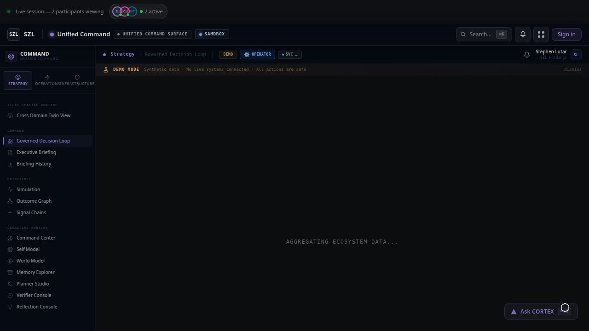

# Unified Command — Operations Command Surface

> The cross-domain nerve center: correlated signals, pending decisions, approval queues, and the Governed Decision Loop — all in one surface.

[](https://github.com/szl-holdings/szl-holdings-platform/actions/workflows/ci.yml)
[](https://www.typescriptlang.org/)
[](../../LICENSE.md)



[Live Demo](https://szlholdings.com) · [Platform Demo Video](https://szlholdings.com/szl-demo-video/) · [Governed Decision Loop](/command/operations/governed-decision-loop) · [Investor Dashboard](https://szlholdings.com/stephen/investor)

---

## What it does

Unified Command is the primary operations command surface for the SZL Holdings platform. It merges the former Lyte Command Center (business observability) and IMPERIUM (cloud sovereignty) into a single interface that gives operators a real-time view across all connected domains: signals, pending decisions, approval queues, cloud infrastructure, and the platform's flagship Governed Decision Loop demonstration.

Command is where the platform thesis becomes interactive. The Governed Decision Loop at `/command/operations/governed-decision-loop` walks through the end-to-end decision lifecycle — from raw signal to executed outcome with full Proof Chain — in a step-by-step demonstration that any operator or investor can follow.

## Feature Highlights

- **Strategy Dashboard** — 5-pillar PRISM framework view (People, Revenue, Infrastructure, Security, Market) with health scoring and trend indicators
- **Signal Timeline** — Correlated business signal feed — cross-domain events unified, scored, and ranked by priority
- **Action Queue** — Pending decisions surfaced with simulation context, confidence scores, and recommended actions
- **Approvals Center** — Human-in-the-loop approval queue with Covenant Policy enforcement and Guardian gate
- **Governed Decision Loop** — End-to-end interactive demo: signal → context → simulation → approval → execution → Proof Chain
- **Decision Receipts** — Immutable governed decision records with full actor attribution and decision provenance
- **Outcome Loop** — Aggregate outcome graph view: what decisions led to which outcomes
- **Infrastructure** — Cloud sovereignty surfaces: multi-cloud governance, policy enforcement, cloud estate visibility (formerly IMPERIUM)

## Architecture

```
All Domain Signals (Vessels + Terra + Sentra + Carlota Jo)
          |
    PRISM Bus (cross-domain event fabric)
          |
    Context Engine (correlation, attribution, scoring)
          |
    Priority Router (auto-execute | human review gate)
          |
    Alloy Workflow Engine (durable orchestration, approval chains)
          |
    Proof Chain (immutable audit trail)
          |
    Command UI (React 19 + Vite 7 + SSE real-time feeds)
```

## Tech Stack

| Layer | Technology |
|-------|-----------|
| **Frontend** | React 19, Vite 7, Tailwind CSS 4, Framer Motion, Recharts |
| **Language** | TypeScript (strict mode, full stack) |
| **Real-time** | Server-Sent Events (SSE) for live signal feeds |
| **State** | TanStack Query v5, React Context |
| **Backend** | Express 5 via shared API server |
| **Database** | PostgreSQL 16 via Drizzle ORM |
| **AI** | Multi-provider (Anthropic, OpenAI, Gemini) via Alloy agent fabric |
| **Auth** | OIDC/PKCE, 11-role RBAC, org-scoped tenant isolation |
| **Audit** | Proof Chain — immutable, append-only event log |

## Quick Start

```bash
# From the monorepo root
pnpm install
pnpm --filter @szl-holdings/api-server dev   # Start the API server first
pnpm --filter @szl-holdings/command dev
```

Seed demo data:

```bash
pnpm seed:demo
```

## Key Modules

| Module | Route | Purpose |
|--------|-------|---------|
| Strategy Dashboard | `/command/` | PRISM 5-pillar operations overview |
| Signal Timeline | `/command/signals` | Cross-domain correlated signal feed |
| Action Queue | `/command/actions` | Pending decisions with context |
| Approvals Center | `/command/approvals` | Human-in-the-loop approval queue |
| Governed Decision Loop | `/command/operations/governed-decision-loop` | End-to-end decision demo |
| Decision Receipts | `/command/decisions` | Immutable governed decision archive |
| Outcome Loop | `/command/outcomes` | Outcome graph view |
| Infrastructure | `/command/infrastructure` | Cloud sovereignty surfaces |
| **Automations** | `/command/operations/automations` | n8n workflow bridge — 400+ integrations |

## n8n Automation Bridge

Command is connected to n8n's 400+ integrations via an MCP-compatible proxy bridge. The
**Automations** surface at `/command/operations/automations` lets operators browse available
n8n workflows, trigger them with custom parameters, and view run history — all without leaving
Command.

### Connecting n8n

1. **Stand up or access an n8n instance.** You can self-host n8n at [n8n.io](https://n8n.io) or
   use n8n Cloud. The instance just needs to be network-accessible from the API server.

2. **Get an API key.** In n8n, go to **Settings → API → Create an API key**.

3. **Set environment secrets.** In the Replit Secrets panel (or your deployment environment), add:

   | Secret | Example value |
   |--------|---------------|
   | `N8N_INSTANCE_URL` | `https://your-n8n.yourdomain.com` |
   | `N8N_API_KEY` | `n8n_api_XXXX…` |

4. **Restart the API server.** The bridge reads the config at startup; a restart is required after
   adding or changing secrets.

5. Navigate to **Operations → Automations** in Command. You should see your workflows listed.

### How to find workflow IDs

Open any workflow in the n8n editor. The ID appears in the browser URL:
`/workflow/<id>`. The Automations surface also displays each workflow's ID in the list view.

### Triggering automations from context

On the **Alerts** page (`/command/operations/alerts`), expanding any alert reveals an
**Automate** button alongside the normal acknowledge/snooze/resolve actions. Clicking it
navigates directly to the Automations surface so you can select and run an appropriate n8n
workflow (e.g. "post to #ops-alerts in Slack", "create Jira ticket", "page on-call via PagerDuty").

### Adding new in-context trigger sites

To add an "Automate" button to any other Command page:

```tsx
import { useLocation } from 'wouter';
import { Workflow } from 'lucide-react';

// Inside your component:
const [, navigate] = useLocation();

<button onClick={() => navigate('/operations/automations')}>
  <Workflow size={12} /> Automate
</button>
```

### API endpoints

The bridge exposes the following endpoints on the API server under `/api/n8n/`:

| Method | Path | Description |
|--------|------|-------------|
| `GET` | `/api/n8n/health` | Connection status — `{ configured, reachable }` |
| `GET` | `/api/n8n/workflows` | List all workflows |
| `GET` | `/api/n8n/workflows/:id` | Get a single workflow's details |
| `POST` | `/api/n8n/workflows/:id/execute` | Trigger a workflow with `{ data: { ... } }` payload |
| `GET` | `/api/n8n/executions` | List recent executions (optional `?workflowId=` filter) |
| `GET` | `/api/n8n/executions/:id` | Get a single execution's status |

When `N8N_INSTANCE_URL` / `N8N_API_KEY` are not set, all endpoints return:
```json
{ "configured": false, "message": "n8n is not connected. Set N8N_INSTANCE_URL and N8N_API_KEY…" }
```
The Command frontend detects this 503 response and shows a clear setup prompt rather than an
error state.

See [`PRODUCT_SURFACE_MAP.md`](../../PRODUCT_SURFACE_MAP.md) for the full module-to-primitive mapping.

## Notable Source Paths

| Path | Purpose |
|------|---------|
| `src/pages/` | Top-level command routes |
| `src/operations/` | Governed Decision Loop and operational surfaces |
| `src/infrastructure/` | Cloud sovereignty / IMPERIUM-era views |
| `src/components/` | Shared command UI |
| `src/hooks/`, `src/lib/` | Data hooks, API client, utilities |
| `src/data/` | Demo seed data |

## Environment Variables

| Variable | Purpose |
|----------|---------|
| `VITE_API_BASE_URL` | API server base URL |
| `VITE_DEPLOY_ENV` | Deployment environment label |
| `VITE_IS_DEMO` | Toggle demo-mode UI affordances |
| `VITE_PLAUSIBLE_DOMAIN` | Plausible analytics domain |

See [`ops/infra/environment-matrix.md`](../../ops/infra/environment-matrix.md) for the full matrix.

---

**SZL Holdings** · [szlholdings.com](https://szlholdings.com) · [inquiries@szlholdings.com](mailto:inquiries@szlholdings.com)
