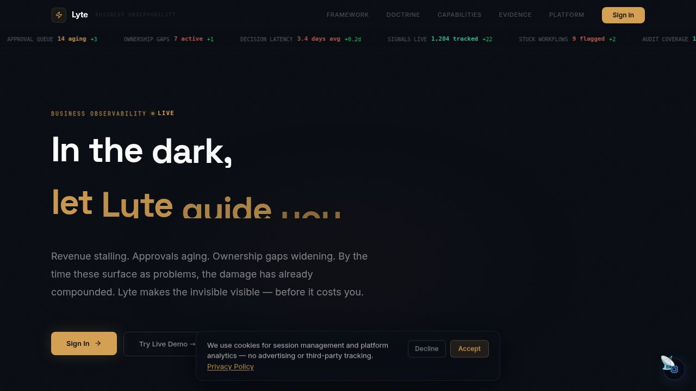

# Lyte — Decision Intelligence

> Structured decision governance with confidence scoring, scenario simulation, and human-in-the-loop approvals — the intelligence layer that makes AI recommendations accountable.

[Platform Thesis](../../docs/investor/platform-thesis.md) · [Investor Dashboard](https://szlholdings.com/stephen/investor)

---

## Status

**Archived.** Lyte's surfaces have been merged into [`artifacts/command`](../command/) (Unified Command). Source is retained on disk for reference. The active decision intelligence surface is at `/command/`.

See [`ops/frontier/disposition-matrix.md`](../../ops/frontier/disposition-matrix.md) for the full disposition decision.

---

## What it does

Lyte is the decision intelligence surface for the SZL Holdings platform. It governs structured decisions — not dashboards, not recommendations — with confidence scoring, scenario simulation via Monte Carlo analysis, and human-in-the-loop approval workflows powered by the Alloy Fabric.

The core thesis: AI should advise, humans should decide, and every decision should be recorded. Lyte enforces this structurally. Advisory agents queue recommendations with confidence scores and source attribution. Human approvers review, simulate alternatives, and make the call. Guardian approval gates enforce Covenant Policy — AI cannot bypass human confirmation.

## Feature Highlights

- **Decision Queue** — Active decisions requiring review or approval, ranked by priority and time sensitivity
- **Scenario Simulator** — Monte Carlo and branch simulation for pending choices — see probability distributions before deciding
- **Confidence Engine** — Signal-weighted confidence scores per decision with explainable factor breakdown
- **Outcome Ledger** — Historical decision outcomes with full Proof Chain attribution and causal tracing
- **Guardian Approvals** — Policy-gated approval workflows: Covenant Policy determines what requires which tier of approval

## Tech Stack

| Layer | Technology |
|-------|-----------|
| **Frontend** | React 19, Vite 7, Tailwind CSS 4, Framer Motion, Recharts |
| **Language** | TypeScript (strict mode) |
| **State** | TanStack Query v5, React Context |
| **Backend** | Express 5 via shared API server |
| **Database** | PostgreSQL 16 via Drizzle ORM |
| **Auth** | OIDC/PKCE, 11-role RBAC, org-scoped tenant isolation |
| **Audit** | Proof Chain — immutable, append-only event log |

## Visual Standards

See [`media/brand-kit/tokens.md`](../../media/brand-kit/tokens.md) for the visual brand standards that govern this surface.

---

**SZL Holdings** · [szlholdings.com](https://szlholdings.com) · [inquiries@szlholdings.com](mailto:inquiries@szlholdings.com)
