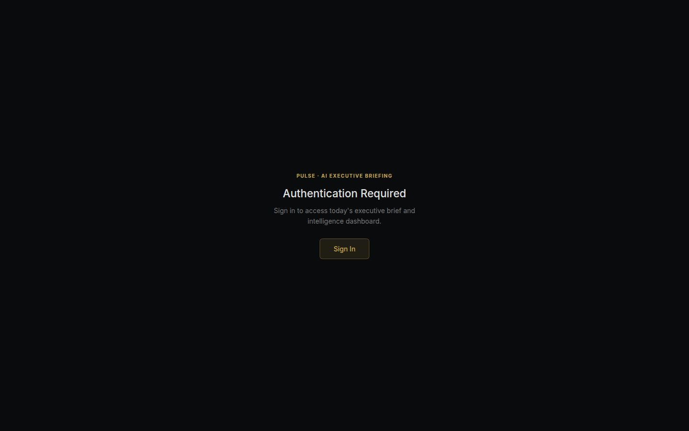

# Pulse — AI Executive Briefing

> Narrative intelligence briefings synthesized from live platform signals across all domains — an AI-powered executive intelligence layer that replaces daily status meetings.

[](https://github.com/szl-holdings/szl-holdings-platform/actions/workflows/ci.yml)
[](https://www.typescriptlang.org/)
[](../../LICENSE.md)

[Live Demo](https://szlholdings.com) · [Platform Demo Video](https://szlholdings.com/szl-demo-video/) · [Investor Dashboard](https://szlholdings.com/stephen/investor) · [Architecture](../../docs/architecture/architecture.md) · [Platform Thesis](../../docs/investor/platform-thesis.md)



---

## What it does

Pulse generates structured narrative intelligence briefings synthesized from live signals across all SZL Holdings domain packs — maritime, real estate, cybersecurity, advisory, and operations. Instead of navigating multiple dashboards, executives receive a single curated briefing that surfaces what changed, why it matters, and what decisions are pending.

Pulse is the output layer of the SZL Holdings intelligence stack. Every briefing is source-cited and attributable — no opaque AI outputs.

## Run locally

```bash
# From the monorepo root
pnpm install
pnpm --filter @workspace/api-server dev   # Start the API server first
pnpm --filter @workspace/pulse dev
```

**Primary route:** `/pulse/`

## Key modules

| Module | Route | Purpose |
|--------|-------|---------|
| Daily Brief | `/pulse/` | Today's intelligence briefing across all domains |
| Brief Archive | `/pulse/archive` | Historical briefings with search |
| Signal Sources | `/pulse/sources` | Live data feeds powering the briefing |
| Executive Dashboard | `/pulse/dashboard` | KPI summary and anomaly digest |

## Tech stack

React 19 + Vite 7 + TypeScript (strict) · Express 5 (shared API server) · PostgreSQL 16 / Drizzle ORM · Multi-provider AI (Anthropic, OpenAI, Gemini) · OIDC/PKCE auth · Proof Chain audit trail

## Architecture reference

Full system architecture: [`docs/architecture/architecture.md`](../../docs/architecture/architecture.md)

---

**SZL Holdings** · [szlholdings.com](https://szlholdings.com) · [inquiries@szlholdings.com](mailto:inquiries@szlholdings.com)
