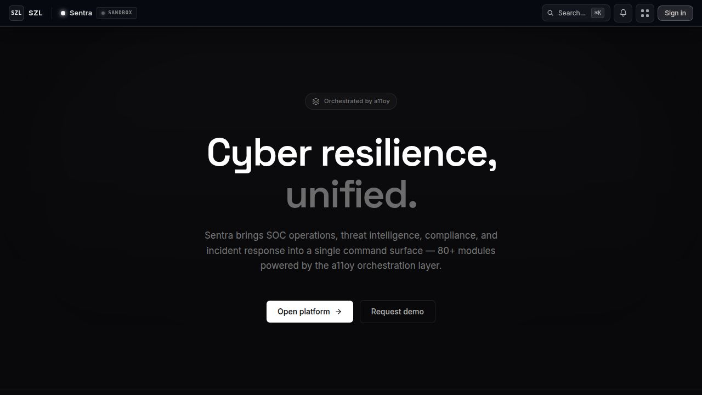

# Sentra — Cyber Resilience Command

> Threat monitoring, AI-assisted incident triage, security posture scoring, and policy-gated response — governed cybersecurity command for enterprise security teams.

> **Evidence status: MODELED / SUPERSEDED.** This retained standalone artifact is not a live product surface. New cyber work belongs in the a11oy cyber vertical. Canonical counts and definitions: [`SOURCE_OF_TRUTH.md`](../../SOURCE_OF_TRUTH.md).

[](https://github.com/szl-holdings/platform/actions/workflows/ci.yml)
[](https://www.typescriptlang.org/)
[](../../LICENSE.md)

[Platform Site](https://szlholdings.com) · [Platform Demo Video](https://szlholdings.com/szl-demo-video/) · [Investor Dashboard](https://szlholdings.com/stephen/investor) · [Architecture](../../docs/architecture/architecture.md)



---

## What it does

Sentra is the cyber resilience domain pack for the SZL Holdings platform. It gives security teams a governed command surface for active threat monitoring, AI-assisted incident triage, cross-environment posture scoring, and policy-gated response actions — all under the Proof Chain and Covenant Policy infrastructure that governs every SZL Holdings product.

Where traditional SIEMs generate alert volume, Sentra generates governed decisions. Every threat is triaged by AI, every response action requires human approval, and every disposition is recorded in the immutable Proof Chain with full actor attribution.

## Run locally

```bash
# From the monorepo root
pnpm install
pnpm --filter @workspace/api-server dev   # Start the API server first
pnpm --filter @workspace/sentra dev
```

**Primary route:** `/sentra/`

## Key modules

| Module | Route | Purpose |
|--------|-------|---------|
| Threat Monitor | `/sentra/threats` | Real-time threat detection and severity scoring |
| Incident Triage | `/sentra/incidents` | AI-assisted prioritization with Proof Chain |
| Posture Dashboard | `/sentra/posture` | Cross-environment security posture overview |
| Guardian Actions | `/sentra/guardian` | Human-in-the-loop response approvals |
| Compliance Tracker | `/sentra/compliance` | Policy adherence and audit-ready reports |

## Tech stack

React 19 + Vite 7 + TypeScript (strict) · Express 5 (shared API server) · PostgreSQL 16 / Drizzle ORM · Multi-provider AI (Anthropic, OpenAI, Gemini) · OIDC/PKCE auth · Proof Chain audit trail

## Architecture reference

Full system architecture: [`docs/architecture/architecture.md`](../../docs/architecture/architecture.md)

---

**SZL Holdings** · [szlholdings.com](https://szlholdings.com) · [security@szlholdings.com](mailto:security@szlholdings.com)
