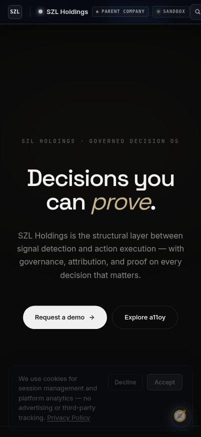

# SZL Holdings — Mobile Command

> Native iOS/Android command surface for the SZL Holdings platform — key metrics, alerts, and approval workflows on the go.

[](https://www.typescriptlang.org/)
[](https://expo.dev/)
[](../../LICENSE.md)

[Platform Demo Video](https://szlholdings.com/szl-demo-video/) · [Investor Dashboard](https://szlholdings.com/stephen/investor) · [Architecture](../../docs/architecture/architecture.md)



---

## What it does

The SZL Holdings mobile app is the on-the-go command surface for platform operators. It surfaces key metrics, cross-domain anomaly alerts, and Human Lock approval requests — so decision-makers can monitor and act from anywhere. It consumes the same shared API server as all web artifacts.

> **Status:** Beta — core metrics and alerts are working. Full feature parity with web apps is on the product roadmap.

## Run locally

```bash
# From the monorepo root (requires Expo Go or simulator)
pnpm install
pnpm --filter @workspace/szl-holdings-mobile start

# iOS simulator
pnpm --filter @workspace/szl-holdings-mobile ios

# Android emulator
pnpm --filter @workspace/szl-holdings-mobile android
```

**Preview path:** `/mobile/` (web preview of the Expo app)

## Key screens

| Screen | Purpose |
|--------|---------|
| Dashboard | Cross-domain KPI summary |
| Alerts | Priority anomaly and threat alerts |
| Approvals | Human Lock approval queue |
| Fleet | Maritime asset status |
| Profile | Account and settings |

## Tech stack

Expo 53 · React Native · TypeScript (strict) · NativeWind (Tailwind CSS for RN) · Expo Router · Shared API server

## Architecture reference

Full system architecture: [`docs/architecture/architecture.md`](../../docs/architecture/architecture.md)

---

**SZL Holdings** · [szlholdings.com](https://szlholdings.com) · [inquiries@szlholdings.com](mailto:inquiries@szlholdings.com)
