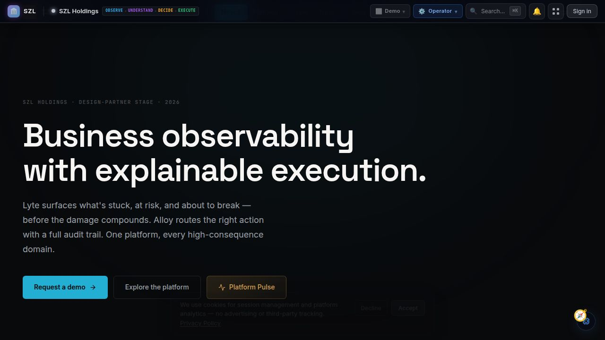

# SZL Holdings — Platform Dashboard

> The corporate site, product hub, investor portal, and trust center — the public front door to the SZL Holdings governed decision infrastructure platform.

[](https://github.com/szl-holdings/szl-holdings-platform/actions/workflows/ci.yml)
[](https://www.typescriptlang.org/)
[](../../LICENSE.md)



[Live Site](https://szlholdings.com) · [Platform Demo Video](https://szlholdings.com/szl-demo-video/) · [Investor Dashboard](https://szlholdings.com/stephen/investor) · [Trust Center](https://szlholdings.com/trust)

---

## What it does

This is the primary public-facing web application for SZL Holdings. It serves as the corporate site, product overview, investor hub, founder profile, trust center, and — for authenticated operators — the Forge admin surface.

It is both the marketing face of the platform and the authenticated entry point for platform administrators and investors. From here, investors access the data room, operators access Forge, and prospects explore the product portfolio.

## Key Sections

| Route | Audience | Purpose |
|-------|----------|---------|
| `/` | Public | Homepage: platform overview, product portfolio, narrative |
| `/products` | Public | Product detail pages for each domain pack |
| `/trust` | Public | Trust center: security, compliance, governance |
| `/investor` | Investors | Investor dashboard and data room |
| `/stephen/investor` | Investors | Founder's investor portal |
| `/founder` | Public | Founder profile |
| `/nexus` | Public | NEXUS unified agentic AI layer overview |
| `/forge` | Admin (authenticated) | Platform administration surface |
| `/ownership-os` | Authenticated | Ownership Operating System |

## Feature Highlights

- **Product Portfolio** — Interactive product pages for every domain pack: Vessels, Terra, Sentra, Carlota Jo, Command, Pulse
- **Investor Hub** — Password-protected data room with pitch materials, platform thesis, financials, and product readiness reports
- **Trust Center** — Detailed security, compliance, and governance documentation for enterprise evaluation
- **Forge Admin** — Platform administration surface: user management, feature flags, system health, audit logs
- **Ownership OS** — Ownership Operating System: portfolio management, fund operations, allocation views
- **Internationalization** — Multi-language support for global enterprise and investor audiences

## Architecture

```
SZL Holdings Dashboard (React 19 + Vite 7)
          |
    Vite API Proxy Plugin (dev) / API Server (production)
          |
    API Server (Express 5 + Drizzle ORM + PostgreSQL 16)
          |
    Auth: OIDC/PKCE + 11-role RBAC
```

The dashboard is a React SPA proxied through the shared API server. All authenticated routes enforce RBAC at the API layer — the frontend receives only the data the user's role is authorized to see.

## Tech Stack

| Layer | Technology |
|-------|-----------|
| **Frontend** | React 19, Vite 7, Tailwind CSS 4, Framer Motion |
| **Language** | TypeScript (strict mode, full stack) |
| **State** | TanStack Query v5, React Context |
| **i18n** | React i18next, multi-locale support |
| **Analytics** | Plausible (privacy-first), Amplitude |
| **Backend** | Express 5 via shared API server |
| **Database** | PostgreSQL 16 via Drizzle ORM |
| **Auth** | OIDC/PKCE, 11-role RBAC |
| **Payments** | Stripe (subscription management) |

## Quick Start

```bash
# From the monorepo root
pnpm install
pnpm --filter @szl-holdings/api-server dev   # Start the API server first
pnpm --filter @szl-holdings/szl-holdings dev
```

## Notable Source Paths

| Path | Purpose |
|------|---------|
| `src/pages/` | Top-level route components for the public site |
| `src/control-tower/` | Forge admin (authenticated) surfaces |
| `src/ownership-os/` | Ownership Operating System views |
| `src/fund-operations/` | Fund Operations surfaces |
| `src/alloy/` | Alloy workflow and digest UI |
| `src/components/` | Shared UI components |
| `src/lib/` | API client, analytics, helpers |
| `src/locales/` + `src/i18n.ts` | Internationalization |
| `vite-api-plugin.ts` | Local dev API proxy plugin |

## Environment Variables

| Variable | Purpose |
|----------|---------|
| `VITE_API_URL` | Base URL for the API server |
| `VITE_APP_MODE` | Runtime mode (e.g. `demo`, `live`) |
| `VITE_SANDBOX_API_BASE` | Sandbox API base for demo mode |
| `VITE_PLAUSIBLE_DOMAIN` | Plausible analytics domain |
| `VITE_PLAUSIBLE_SHARED_URL` | Shared Plausible dashboard URL |
| `VITE_STRIPE_PRICE_SZL_PRO` | Stripe price ID for SZL Pro tier |
| `SZL_WEBHOOK_SECRET` | Server-side webhook signing secret (build/SSR only) |

See [`ops/infra/environment-matrix.md`](../../ops/infra/environment-matrix.md) for the full matrix.

---

**SZL Holdings** · [szlholdings.com](https://szlholdings.com) · [inquiries@szlholdings.com](mailto:inquiries@szlholdings.com)
