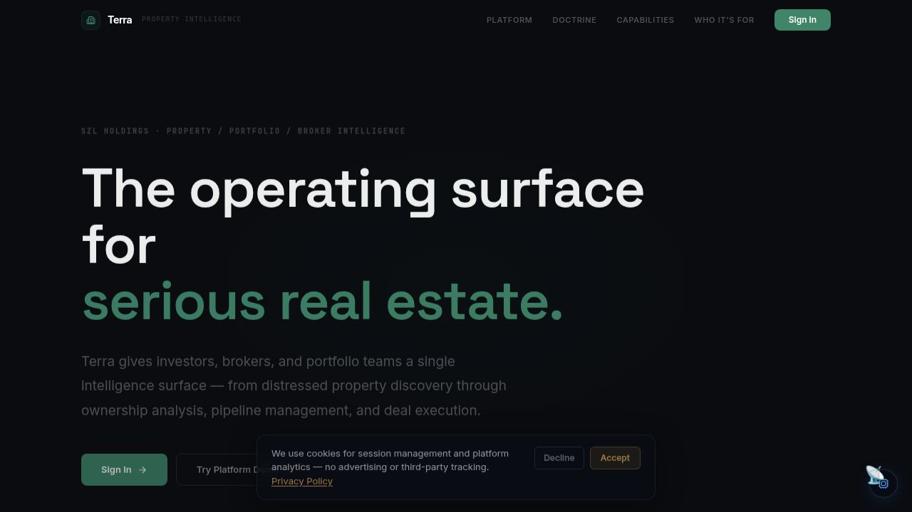

# Terra — Real Estate Intelligence

> NYC distress pipeline, ownership entity graph, and AI-assisted deal workflow — governed real estate intelligence for acquisition teams and fund operators.

[](https://github.com/szl-holdings/szl-holdings-platform/actions/workflows/ci.yml)
[](https://www.typescriptlang.org/)
[](../../LICENSE.md)



[Live Demo](https://szlholdings.com) · [Platform Demo Video](https://szlholdings.com/szl-demo-video/) · [Investor Dashboard](https://szlholdings.com/stephen/investor) · [Platform Thesis](../../docs/investor/platform-thesis.md)

---

## What it does

Terra is the real estate intelligence domain pack for the SZL Holdings platform. It monitors New York City public records for distress signals, maps ownership entity relationships, runs AI-assisted lead scoring, and tracks deal pipelines — all under the same governance infrastructure that powers every SZL Holdings product.

Terra transforms fragmented public records and market data into a decision surface: every distress signal becomes a potential acquisition lead, every ownership node is traceable, and every deal action carries a Proof Chain record. From signal to signed deal, every step is governed and attributed.

## Feature Highlights

- **Distress Pipeline** — Automated NYC public records monitoring: lis pendens, pre-foreclosures, tax liens, and code violations surfaced as prioritized leads
- **Ownership Graph** — Interactive entity relationship mapping for LLC chains, beneficial ownership, and related-party exposure
- **Deal Pipeline** — Investment opportunity tracking with Monte Carlo simulation and staged approval workflow
- **AI Lead Scoring** — Machine learning-assisted prospect ranking with explainable factor breakdown
- **Market Signals** — Real-time market intelligence: MLS ingestion, price trend analysis, distress velocity
- **Broker Workflow** — Engagement tracking, offer management, and counterparty due diligence
- **Guardian Approvals** — Human-in-the-loop deal authorization with Covenant Policy enforcement

## Architecture

```
NYC Public Records / MLS Feeds / Market Data
          |
    Signal Normalization (Alloy)
          |
    Terra Domain Engine (distress scoring, ownership resolution)
          |
    AI Scoring + Simulation (Monte Carlo deal analysis)
          |
    Deal Workflow (staged approvals, Proof Chain)
          |
    Terra UI (React 19 + Vite 7)
```

## Tech Stack

| Layer | Technology |
|-------|-----------|
| **Frontend** | React 19, Vite 7, Tailwind CSS 4, Framer Motion, Recharts |
| **Language** | TypeScript (strict mode, full stack) |
| **State** | TanStack Query v5, React Context |
| **Backend** | Express 5 via shared API server |
| **Database** | PostgreSQL 16 via Drizzle ORM |
| **AI** | Multi-provider (Anthropic, OpenAI, Gemini) via Alloy agent fabric |
| **Auth** | OIDC/PKCE, 11-role RBAC, org-scoped tenant isolation |
| **Audit** | Proof Chain — immutable, append-only event log |

## Quick Start

```bash
# From the monorepo root
pnpm install
pnpm --filter @szl-holdings/api-server dev   # Start the API server first
pnpm --filter @szl-holdings/terra dev
```

Seed demo data:

```bash
pnpm seed:atlas:terra
```

## Key Modules

| Module | Route | Purpose |
|--------|-------|---------|
| Distress Pipeline | `/terra/pipeline` | Lead sourcing from public records |
| Ownership Graph | `/terra/ownership` | Entity relationship mapping |
| Deal Pipeline | `/terra/deals` | Acquisition workflow with simulation |
| Market Signals | `/terra/signals` | Market intelligence and trend analysis |
| Lead Scoring | `/terra/leads` | AI-assisted prospect ranking |

See [`PRODUCT_SURFACE_MAP.md`](../../PRODUCT_SURFACE_MAP.md) for the full module-to-primitive mapping.

## Notable Source Paths

| Path | Purpose |
|------|---------|
| `src/pages/` | Route-level views (pipeline, deals, ownership, etc.) |
| `src/components/` | Shared Terra UI components (77 components) |
| `src/hooks/`, `src/lib/` | Data hooks and API client |
| `src/data/` | Demo seed data |

## Environment Variables

| Variable | Purpose |
|----------|---------|
| `VITE_PLAUSIBLE_DOMAIN` | Plausible analytics domain |

Terra reads its primary data from the API server via the shared API client. Backend keys (e.g. records providers) live on `api-server`. See [`ops/infra/environment-matrix.md`](../../ops/infra/environment-matrix.md) for the full matrix.

---

**SZL Holdings** · [szlholdings.com](https://szlholdings.com) · [inquiries@szlholdings.com](mailto:inquiries@szlholdings.com)
