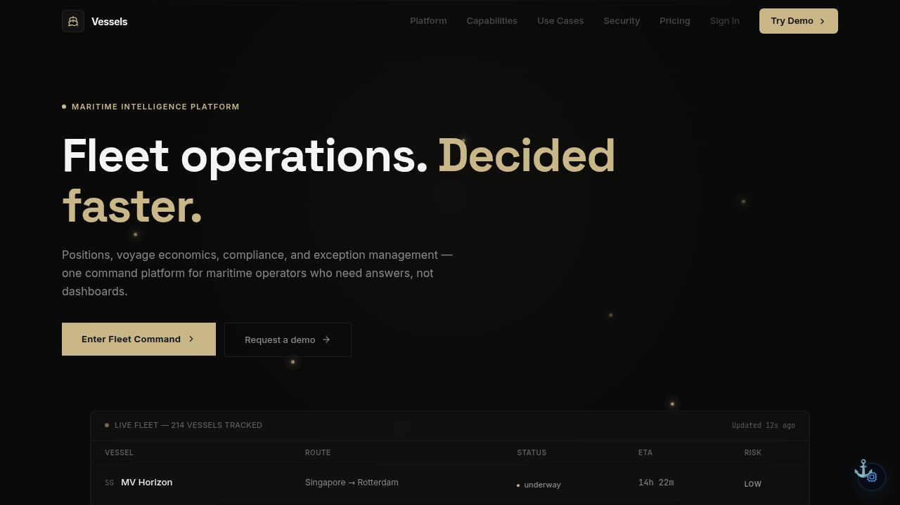

# Vessels — Maritime Fleet Intelligence

> AIS tracking, voyage economics, sanctions screening, and dark-vessel detection — unified in a governed command surface for maritime operators.

> **Evidence status: MODELED / SUPERSEDED.** This retained standalone artifact is not a live product surface. Functionality moved to killinchu and governance/command to a11oy. Canonical counts and definitions: [`SOURCE_OF_TRUTH.md`](../../SOURCE_OF_TRUTH.md).

[](https://github.com/szl-holdings/platform/actions/workflows/ci.yml)
[](https://www.typescriptlang.org/)
[](../../LICENSE.md)

[Platform Site](https://szlholdings.com) · [Platform Demo Video](https://szlholdings.com/szl-demo-video/) · [Investor Dashboard](https://szlholdings.com/stephen/investor) · [Architecture](../../docs/architecture/architecture.md) · [Platform Thesis](../../docs/investor/platform-thesis.md)



---

## What it does

Vessels is the maritime intelligence domain pack for the SZL Holdings platform. It gives fleet operators, risk managers, and compliance teams a single command surface that correlates AIS telemetry, voyage economics, sanctions exposure, and AI-generated alerts — all governed by the same Proof Chain and Covenant Policy infrastructure that runs every SZL Holdings product.

Every anomaly surfaces a recommended action. Every sanctioned-entity match triggers an approval workflow. Every voyage P&L projection is traceable back to the signal that prompted it.

## Run locally

```bash
# From the monorepo root
pnpm install
pnpm --filter @workspace/api-server dev   # Start the API server first
pnpm --filter @workspace/vessels dev
```

**Primary route:** `/vessels/`

> **Note:** AIS telemetry is simulated. Live AIS requires a paid provider subscription (~$15–40K/year). See [`docs/operations/known-gaps.md`](../../docs/operations/known-gaps.md).

## Key modules

| Module | Route | Purpose |
|--------|-------|---------|
| Fleet Overview | `/vessels/` | Fleet status, AIS positions, anomaly alerts |
| Voyage Intelligence | `/vessels/voyages` | Route economics, ETA, deviation detection |
| Sanctions Screening | `/vessels/sanctions` | Entity matching against OFAC/UN/EU lists |
| Dark Vessel Detection | `/vessels/dark` | AIS gap analysis and dark transit alerts |
| Commercial | `/vessels/commercial` | Freight, insurance, and trading modules |

## Tech stack

React 19 + Vite 7 + TypeScript (strict) · Express 5 (shared API server) · PostgreSQL 16 / Drizzle ORM · NOAA CO-OPS / Open-Meteo Marine / GDELT (live) · OIDC/PKCE auth · Proof Chain audit trail

## Architecture reference

Full system architecture: [`docs/architecture/architecture.md`](../../docs/architecture/architecture.md)

---

**SZL Holdings** · [szlholdings.com](https://szlholdings.com) · [inquiries@szlholdings.com](mailto:inquiries@szlholdings.com)
