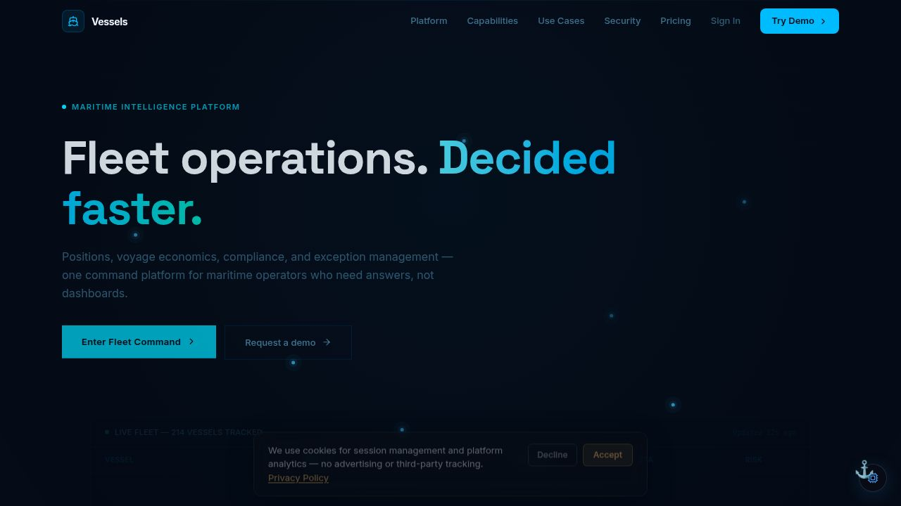

# Vessels — Maritime Fleet Intelligence

> AIS tracking, voyage economics, sanctions screening, and dark-vessel detection — unified in a governed command surface for maritime operators.

[](https://github.com/szl-holdings/szl-holdings-platform/actions/workflows/ci.yml)
[](https://www.typescriptlang.org/)
[](../../LICENSE.md)



[Live Demo](https://szlholdings.com) · [Platform Demo Video](https://szlholdings.com/szl-demo-video/) · [Investor Dashboard](https://szlholdings.com/stephen/investor) · [Platform Thesis](../../docs/investor/platform-thesis.md)

---

## What it does

Vessels is the maritime intelligence domain pack for the SZL Holdings platform. It gives fleet operators, risk managers, and compliance teams a single command surface that correlates AIS telemetry, voyage economics, sanctions exposure, and AI-generated alerts — all governed by the same Proof Chain and Covenant Policy infrastructure that runs every SZL Holdings product.

Where standalone maritime tools give you dashboards, Vessels gives you decisions. Every anomaly surfaces a recommended action. Every sanctioned-entity match triggers an approval workflow. Every voyage P&L projection is traceable back to the signal that prompted it.

## Feature Highlights

- **Fleet Map** — Real-time AIS vessel tracking with dark-vessel anomaly detection and spoofing alerts
- **Voyage P&L** — Per-voyage economics with Monte Carlo simulation and sensitivity analysis
- **Sanctions Screening** — Automated compliance verification with Proof Chain attribution on every check
- **Helmsman AI** — Maritime intelligence agent: natural-language queries, risk summaries, route recommendations
- **Exception Center** — Risk-based workflow queue — every alert becomes a governable, trackable work item
- **Dark Vessel Detection** — AIS gap analysis, transponder-off alerts, and behavioral anomaly scoring
- **S&P Workflow** — Sale-and-purchase deal pipeline with counterparty due diligence integration
- **Demurrage Tracking** — Port stay monitoring with NOR-to-laytime calculation and dispute workflow

## Architecture

Vessels runs on the shared SZL Holdings platform primitives:

```
AIS Feed / Intelligence Providers
          |
    Signal Normalization (Alloy)
          |
    Context Engine (Vessels domain logic)
          |
    Routing: auto-execute (policy-approved) | human review gate
          |
    Action Execution + Proof Chain (immutable audit trail)
          |
    Vessels UI (React 19 + Vite 7)
```

The Alloy execution fabric handles all workflow orchestration. Every consequential action — sanctions disposition, voyage approval, exception triage — requires a human confirmation step enforced at the Alloy layer. The Proof Chain records every decision with full actor attribution.

## Tech Stack

| Layer | Technology |
|-------|-----------|
| **Frontend** | React 19, Vite 7, Tailwind CSS 4, Framer Motion, Recharts |
| **Language** | TypeScript (strict mode, full stack) |
| **State** | TanStack Query v5, React Context |
| **Backend** | Express 5 via shared API server |
| **Database** | PostgreSQL 16 via Drizzle ORM |
| **AI** | Multi-provider (Anthropic, OpenAI, Gemini) via Alloy agent fabric |
| **Auth** | OIDC/PKCE, 11-role RBAC, org-scoped tenant isolation |
| **Audit** | Proof Chain — immutable, append-only event log |

## Quick Start

```bash
# From the monorepo root
pnpm install
pnpm --filter @szl-holdings/api-server dev   # Start the API server first
pnpm --filter @szl-holdings/vessels dev
```

Seed demo data:

```bash
pnpm seed:atlas:vessels
```

## Key Modules

| Module | Route | Purpose |
|--------|-------|---------|
| Fleet Map | `/vessels/fleet` | AIS tracking, dark-vessel alerts |
| Voyage P&L | `/vessels/voyage` | Economics, simulation, forecasting |
| Exception Center | `/vessels/exceptions` | Risk-based work queue |
| Sanctions Screening | `/vessels/compliance` | Automated compliance with Proof Chain |
| Helmsman AI | `/vessels/helmsman` | Maritime intelligence agent |
| S&P Workflow | `/vessels/sp` | Vessel sale-and-purchase pipeline |

See [`PRODUCT_SURFACE_MAP.md`](../../PRODUCT_SURFACE_MAP.md) for the full module-to-primitive mapping.

## Notable Source Paths

| Path | Purpose |
|------|---------|
| `src/pages/` | Route-level views (fleet, voyage, exceptions, helmsman) |
| `src/components/` | Shared Vessels UI components (83 components) |
| `src/contexts/` | React contexts for fleet/session state |
| `src/hooks/`, `src/lib/` | Data hooks and API client |
| `src/data/` | Demo seed data |

## Environment Variables

| Variable | Purpose |
|----------|---------|
| `VITE_API_URL` | API server base URL |
| `VITE_PLAUSIBLE_DOMAIN` | Plausible analytics domain |
| `VITE_STRIPE_PRICE_VESSELS_ENTERPRISE` | Stripe price ID for Vessels Enterprise tier |

The AIS feed is gated server-side by `AIS_FEED_ENABLED` on `api-server`. See [`ops/infra/environment-matrix.md`](../../ops/infra/environment-matrix.md) for the full matrix.

---

**SZL Holdings** · [szlholdings.com](https://szlholdings.com) · [inquiries@szlholdings.com](mailto:inquiries@szlholdings.com)
