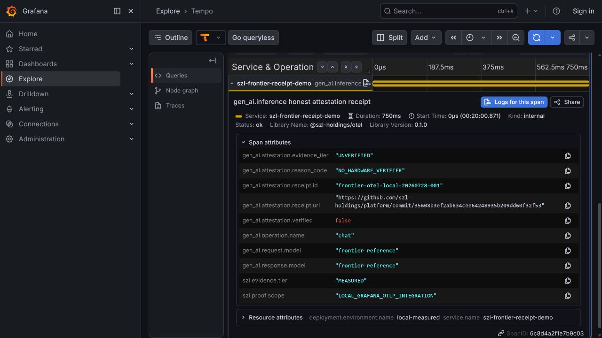

# Frontier F2.1 Grafana receipt proof

**Observed:** 2026-07-28T04:20:00Z

**Evidence tier:** MEASURED local integration

**Production status:** NOT PROVED

## Verdict

An OTLP/HTTP GenAI span carrying the experimental SZL receipt correlation
attributes was accepted by an OpenTelemetry Collector, stored in Grafana Tempo,
queried through the Tempo API, and rendered in Grafana Explore.

This closes the local third-party rendering proof. It does not prove a public
collector, hosted vendor integration, production traffic, or hardware
attestation.

## Pinned stack

| Component | Observed version |
| --- | --- |
| `grafana/otel-lgtm` | `v0.29.2` |
| Grafana | `13.1.0` |
| Tempo | `3.0.2` |
| OpenTelemetry Collector | `0.156.0` |
| Container image digest | `sha256:af7242c1a9608faf6d26e6f235392fd0c32b67258228f9a3cfc96e724974930c` |

## Transport and query evidence

| Check | Result |
| --- | --- |
| `POST http://localhost:4318/v1/traces` | HTTP 200 |
| `GET` through Grafana's Tempo data-source proxy | HTTP 200 |
| Trace ID | `b7a1f3e54d9c4b3e8a2f6c1d0e9b7a55` |
| Span ID | `6c8d4a2f1e7b9c03` |
| Service | `szl-frontier-receipt-demo` |
| Span | `gen_ai.inference honest attestation receipt` |

## Honesty boundary rendered in Grafana

The trace deliberately exercises the fail-closed, no-hardware-verifier path:

| Attribute | Value |
| --- | --- |
| `gen_ai.attestation.evidence_tier` | `UNVERIFIED` |
| `gen_ai.attestation.verified` | `false` |
| `gen_ai.attestation.reason_code` | `NO_HARDWARE_VERIFIER` |
| `gen_ai.attestation.receipt.id` | `frontier-otel-local-20260728-001` |
| `gen_ai.attestation.receipt.url` | GitHub-verified implementation commit `35608b3ef2ab834cee64248935b209dd60f32f53` |
| `szl.evidence.tier` | `MEASURED` for this local integration observation only |
| `szl.proof.scope` | `LOCAL_GRAFANA_OTLP_INTEGRATION` |

No attestation type, quote digest, measurement, or verified timestamp was
emitted because no hardware verifier participated.

## Screenshot integrity

- Path:
  `docs/evidence/observability/frontier-grafana-receipt-20260728.png`
- Bytes: `94593`
- SHA-256:
  `382f5333664135feb80d2ae8cd50650165dd5e04dd32df848c3765370d4f5a52`

## Remaining production gate

Before this evidence can be upgraded from local integration to production
proof, a source-identified deployed service must:

1. export a real application-created span through its configured OTLP path;
2. expose the exact deployed source identity;
3. retain a resolvable receipt produced by that execution;
4. render the trace in the selected hosted or production observability system;
5. preserve `UNVERIFIED` unless an authoritative hardware verifier supplies a
   valid result.
