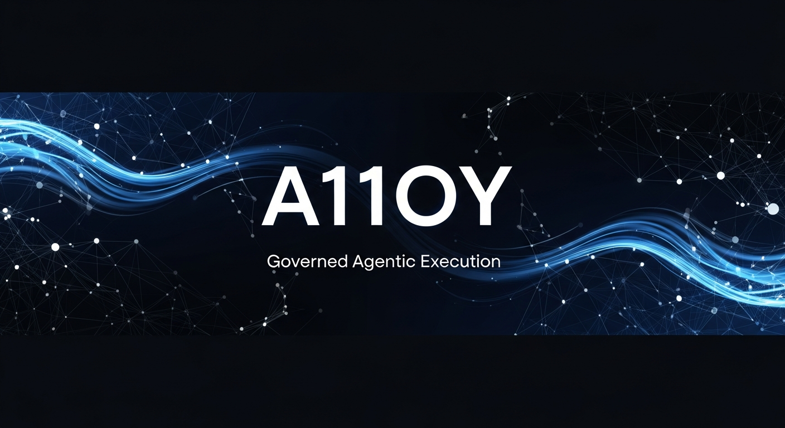

<p align="center">

</p>

<h1 align="center">A11oy</h1>

<p align="center">
<strong>The governed agentic execution layer for high-consequence enterprise operations.</strong>
</p>

---

## What A11oy Is

A11oy is the execution fabric that sits between enterprise data and enterprise decisions. It is not a dashboard. It is not an analytics tool. It is not a chatbot wrapper.

A11oy is the layer where signals become structured intelligence, intelligence becomes governed recommendations, recommendations become human-approved actions, and actions produce cryptographic proof.

Every step has a traceable owner, a policy constraint, and an immutable record.

---

## The Problem A11oy Solves

Enterprise AI has shipped a generation of tools that add recommendation volume without governance.

| What exists today | What's missing |
|:------------------|:---------------|
| Dashboards show what happened | No one knows what to do next |
| Alerts surface anomalies | No one knows if the suggested response is safe |
| AI generates recommendations | No one knows who authorized execution |
| Actions are taken | No one has proof of why, by whom, or under what policy |

The gap is not insight. It is **accountability**.

A11oy closes that gap structurally — not with policy documents, not with manual review processes, but with a governed execution fabric that enforces human-gated autonomy at every consequential decision point.

---

## How A11oy Works

### Nine-Layer Execution Fabric

```
┌─────────────────────────────────────────────────────┐
│  Layer 9: COMPLIANCE FABRIC                         │
│  Compliance-as-Runtime — EU AI Act, NIST AI RMF,   │
│  ISO 42001, CSA Agentic Profile. Compass, Agent-   │
│  BOM, Delegation Chain, Trust Exchange, CARE        │
├─────────────────────────────────────────────────────┤
│  Layer 8: DOCTRINE (HATUN)                         │
│  Frontier alignment governance — constitutions,     │
│  behavioral audit, reward-hacking watchdog,         │
│  red-team probes, agent welfare, system cards       │
├─────────────────────────────────────────────────────┤
│  Layer 7: PROOF LEDGER                              │
│  Cryptographic audit trail — actor, policy, outcome │
├─────────────────────────────────────────────────────┤
│  Layer 6: EXECUTIVE BRIEFING                        │
│  Board-ready decision surfaces with attribution     │
├─────────────────────────────────────────────────────┤
│  Layer 5: DIGITAL TWIN                              │
│  Probabilistic simulation before execution          │
├─────────────────────────────────────────────────────┤
│  Layer 4: HUMAN GATE                                │
│  Explicit confirmation — no silent automation       │
├─────────────────────────────────────────────────────┤
│  Layer 3: GOVERNED AI                               │
│  Multi-provider routing, citations, confidence      │
├─────────────────────────────────────────────────────┤
│  Layer 2: SIGNAL MESH                               │
│  Cross-domain correlation and anomaly detection     │
├─────────────────────────────────────────────────────┤
│  Layer 1: CONNECTORS                                │
│  Normalized ingestion from any enterprise system    │
└─────────────────────────────────────────────────────┘
```

### Core Capabilities

| Capability | What It Does |
|:-----------|:-------------|
| **Signal Intelligence** | Ingests and correlates business signals across all connected systems in real time |
| **Governed AI Recommendations** | Multi-provider AI routing (Anthropic, OpenAI, Gemini, Groq) with mandatory source citations, confidence scores, and policy constraints on every output |
| **Human-Gated Autonomy** | No consequential action executes without explicit human confirmation — enforced structurally at the fabric layer, not by convention |
| **Cryptographic Proof** | Append-only audit trail linking every decision to actor, policy, data inputs, and measurable outcome |
| **Digital Twin Simulation** | Probabilistic modeling of downstream effects before any high-stakes action is approved |
| **Covenant Governance** | Policy constraints that travel with every recommendation — what is permitted, what is prohibited, under what conditions |
| **Executive Briefing** | Board-ready decision surfaces with complete attribution chains from raw signal to final outcome |
| **Hatun Doctrine** | Layer 8 frontier-grade alignment governance — versioned constitutions, behavioral audit, reward-hacking watchdog, red-team probes, agent welfare telemetry, Glasswing transparency mode, and per-agent system cards |
| **Hatun Doctrine Specification** | Open standard (CC-BY-4.0) for the artifacts above — JSON Schema 2020-12 + TypeScript types. A11oy authors and operates the spec; other implementations are invited |
| **Glasswing Distinction Layer** | Glasswing partner program (4-stage cyber verification with dual approval), Coordinated Agent-Vulnerability Disclosure (CAVD), 90-Day Transparency Reports, Public Trust Portal, Adversarial Robustness Wall, Constitution-as-Code DSL + simulator, Welfare Intervention Playbooks, Defender Credit Pool, and the `hatun-doctrine` GitHub Action |
| **Compliance Fabric (Layer 9)** | Compliance-as-Runtime — maps every A11oy governance primitive to EU AI Act (Articles 9-72, Annex IV), NIST AI RMF (GOVERN/MAP/MEASURE/MANAGE), ISO 42001 (Annex A), and CSA Agentic Profile controls. Five pillars: **Compass** (real-time compliance posture dashboard with heat map, drill-down, and one-click audit package export), **Agent-BOM** (per-agent CycloneDX ML-BOM v1.7 covering model fingerprints, tool manifest hashes, constitution version, eval history, welfare posture), **Delegation Chain** (governs multi-agent delegation with scope narrowing, privilege boundaries, and chain replay), **Federated Trust Exchange** (cross-org compliance attestation via posture brackets without exposing proprietary internals), **CARE** (Continuous Audit Readiness Engine — evidence freshness monitoring, 6-month log retention verification, FRIA template generator) |

### 24 Operator Surfaces

A11oy is not a single screen. It exposes 24 purpose-built operator surfaces across the execution lifecycle — from signal ingestion to compliance audit. Each surface is governed by the same policy constraints and proof requirements as the fabric itself.

### Doctrine references

| Document | Purpose |
|:---------|:--------|
| [`A11OY_DOCTRINE.md`](./A11OY_DOCTRINE.md) | A11oy's internal operating doctrine for the Open Spec, Glasswing partners, CAVD, transparency reports, the Public Trust Portal, the Adversarial Robustness Wall, the Constitution-as-Code DSL, the Welfare Intervention Playbooks, the Defender Credit Pool, and the `hatun-doctrine` GitHub Action |
| [`A11OY_PUBLIC_CLAIMS_DOCTRINE.md`](./A11OY_PUBLIC_CLAIMS_DOCTRINE.md) | Every public claim → its backing artifact in the Open Spec |
| [`HATUN_RESEARCH_SWEEP.md`](./HATUN_RESEARCH_SWEEP.md) | Catalogued prior art that grounds the Hatun Doctrine work |
| [`spec/hatun-doctrine-spec/`](./spec/hatun-doctrine-spec/) | The Hatun Doctrine Specification — JSON Schemas + TypeScript types, CC-BY-4.0 |

---

## Why A11oy Is One of One

### What makes this different from everything else on the market

| Category | What Others Do | What A11oy Does |
|:---------|:---------------|:----------------|
| **AI Governance** | Policy documents and manual review processes | Structural enforcement — governance is in the execution fabric, not in a handbook |
| **Audit Trail** | Log files and event streams | Cryptographic proof chain — every decision links actor, policy, data inputs, and outcome in an immutable record |
| **Human Oversight** | "Human-in-the-loop" as a design pattern | Human-gated autonomy — no consequential action can bypass confirmation, enforced at the infrastructure layer |
| **AI Recommendations** | Black-box outputs with confidence scores | Every recommendation carries source citations, retrieval provenance, confidence scoring, and policy constraints |
| **Multi-Domain** | Vertical-specific solutions | One fabric across 8 enterprise verticals — cyber, legal, maritime, defense, real estate, executive, advisory, and decision intelligence |
| **Simulation** | A/B testing after deployment | Digital twin modeling before execution — probabilistic impact analysis before any high-stakes action |
| **Proof** | Compliance reports generated quarterly | Real-time proof generation — every action produces its own attestation at execution time |

### Competitive Landscape

| Platform | What It Does | What It Doesn't Do |
|:---------|:-------------|:-------------------|
| **Palantir Foundry** | Data integration and ontology modeling | No governed agentic execution, no cryptographic proof chain, no human-gated autonomy enforcement |
| **Datadog / Splunk** | Observability and monitoring | Tells you what broke — doesn't tell you what to do, who should approve it, or prove the outcome |
| **ServiceNow** | IT workflow automation | Workflow orchestration without AI governance, no cross-domain signal correlation, no proof layer |
| **Microsoft Copilot** | AI assistant embedded in productivity tools | Recommendation generation without structural governance, no proof chain, no policy enforcement |
| **C3.ai** | Enterprise AI platform | Predictive analytics without execution governance, no human-gated autonomy, no proof ledger |
| **Anduril Lattice** | Defense/security command and control | Single-domain (defense), not multi-vertical, proprietary government-only |
| **A11oy** | **Governed agentic execution across 8 verticals** | **The only platform that structurally enforces human-gated autonomy, generates cryptographic proof at execution time, and operates across multiple enterprise domains from a single fabric** |

### The A11oy Moat

1. **Structural governance, not policy governance.** Other platforms add governance as a layer on top. A11oy builds governance into the execution fabric itself. You cannot bypass it. It is not optional. It is the infrastructure.

2. **Proof at execution time, not compliance after the fact.** Other platforms generate audit logs. A11oy generates cryptographic proof — an immutable, attributable record created at the moment of decision, not reconstructed later.

3. **Multi-domain from day one.** A11oy is not a cyber tool adapted for legal, or a legal tool adapted for maritime. It is a domain-agnostic execution fabric with domain-specific intelligence packs. The governance model is the same everywhere.

4. **Human-gated autonomy as infrastructure.** "Human-in-the-loop" is a design pattern that most platforms implement inconsistently. A11oy enforces it at the fabric layer — every consequential action requires explicit human confirmation, and the system cannot proceed without it.

---

## Platform Architecture

```
SZL Holdings Platform
├── A11oy           Governed agentic execution fabric (this document)
│
├── TENAX           Cyber resilience — posture management, incident command, recovery
├── DOMAINE         Real estate — deal pipeline, ownership graph, market intelligence
├── SEXTANT         Maritime — fleet command, route optimization, sanctions screening
├── PARAGON         Defense & intelligence — threat analysis, spatial analytics
├── Counsel         Legal — matter tracking, obligation mapping, exposure management
├── KORA            Decision intelligence — cross-domain metrics, outcome tracking
├── LUMINA          Executive briefing — board-ready surfaces with proof chains
├── Carlota Jo      Premium advisory — UHNW client operations
│
├── FORGE           Unified command surface — spatial runtime, cross-domain operator view
├── APEX            Mobile command center — iOS/Android (Expo/React Native)
└── PRAXIS          Agentic AI coordination layer
```

### Technical Foundation

| Layer | Stack |
|:------|:------|
| **Language** | TypeScript (full-stack, strict mode) |
| **Frontend** | React 19, Vite 7, Tailwind CSS 4, Framer Motion |
| **Mobile** | Expo SDK 53, React Native |
| **Backend** | Express 5, Node.js 22 |
| **Database** | PostgreSQL 16, Drizzle ORM |
| **AI** | Multi-provider (Anthropic, OpenAI, Gemini, Groq) — policy-governed routing |
| **Monorepo** | 202 pnpm workspace packages (measured in `artifacts/SOURCE_OF_TRUTH.json`) |
| **CI/CD** | 47 GitHub Actions workflows (measured) |

---

## Current Status

| Phase | Status |
|:------|:-------|
| **Phase 1** — Foundation: type system, fabric primitives, 19 operator surfaces, signal mesh, proof ledger, covenant governance | Complete |
| **Phase 2** — Workcell engine with live AI reasoning, full proof-carrying execution | In Progress |
| **Phase 3** — Live connector integrations, production-grade multi-tenant deployment | Planned |

---

## Access

A11oy is proprietary technology developed by SZL Holdings. Source code, architecture details, and implementation specifics are confidential.

**For investors:** Due diligence conversations and guided platform walkthroughs available on request.

**For enterprise evaluation:** Design partner and pilot conversations available for qualified organizations.

**Contact:** [inquiries@szlholdings.com](mailto:inquiries@szlholdings.com)

---

<sub>Copyright &copy; 2024–2026 SZL Holdings. All rights reserved. A11oy is a trademark of SZL Holdings.</sub>
