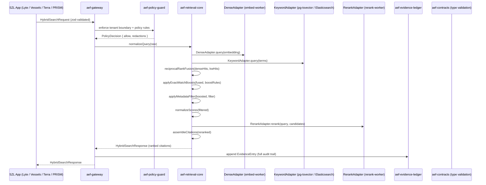

# Alloy Embedding Fabric (AEF) — Architecture

## Overview

Alloy Embedding Fabric (AEF) is the evidence-first retrieval backbone for the SZL Holdings platform. It provides structured, auditable, policy-governed retrieval of dense-vector and keyword evidence across all SZL product surfaces (Lyte, Vessels, Terra, PRISM Counsel, Sentra, Pulse, Command).

AEF is composed of independently deployable, framework-agnostic packages. Each package has a single responsibility and communicates via typed contracts.

---

## Module Map

```
packages/
  aef-contracts          — Zod schemas + TypeScript types for all AEF API shapes
  aef-retrieval-core     — Pure retrieval functions: fusion, boost, filter, citations
  aef-evidence-ledger    — Append-only audit ledger (in-memory + filesystem dev adapters)
  aef-policy-guard       — Rule evaluation, tenant boundary, retention, redaction

services/
  aef-gateway            — (Phase 3) HTTP API gateway: /embed, /rerank, /search, /ingest
  aef-embed-worker       — (Phase 4) Dense embed worker; pluggable model backend
  aef-rerank-worker      — (Phase 4) Cross-encoder rerank worker
  aef-ingest-worker      — (Phase 4) Document ingest, chunking, indexing orchestrator

packages/
  aef-domain-profiles    — (Phase 5) Domain-specific retrieval profiles (maritime, legal, real-estate, cyber)
  aef-evals              — (Phase 6) Retrieval eval harness; nDCG, recall, citation precision metrics
```

---

## Request Lifecycle



---

## Evidence Model

Every retrieval operation appended to the ledger records:

| Field | Description |
|---|---|
| `requestId` | Unique request identifier |
| `tenantId` | Tenant scope |
| `profileId` | Domain profile version used |
| `chunkId` | Retrieved chunk identifier |
| `sourceId` | Source document identifier |
| `sourceUri` | Canonical URI of the source |
| `title` | Document or section title |
| `page` | Page number (if applicable) |
| `section` | Section heading (if applicable) |
| `denseScore` | Raw dense retrieval score |
| `keywordScore` | Raw keyword retrieval score |
| `fusedScore` | Reciprocal rank fusion score |
| `boostApplied` | Whether an exact-match boost was applied |
| `rerankerScore` | Cross-encoder rerank score (if reranked) |
| `finalScore` | Score used for final ordering |
| `policyDecision` | Structured allow/deny/redact from policy-guard |
| `profileVersion` | Profile descriptor version |
| `requestedAt` | ISO-8601 timestamp of request |
| `completedAt` | ISO-8601 timestamp of response |
| `operatorAnnotation` | Optional human annotation |

---

## Multi-Backend Strategy

AEF uses pluggable adapter interfaces defined in `aef-retrieval-core`:

- **DenseAdapter** — wraps any vector store (pgvector, Qdrant, Weaviate, Pinecone). The embed-worker (Phase 4) handles model execution and exposes a consistent HTTP interface.
- **KeywordAdapter** — wraps any inverted-index backend (PostgreSQL tsvector, Elasticsearch, OpenSearch). Swappable per-deployment.
- **RerankAdapter** — wraps any cross-encoder service. Optional; retrieval-core proceeds without it if not configured.

No adapter implementation is bundled in `aef-retrieval-core` — the package is pure functions only.

---

## Domain Profiles (Phase 5 preview)

Profiles customize retrieval behavior per SZL product domain:

| Profile | Boost rules | Metadata filters | Prompt transform |
|---|---|---|---|
| `maritime` | IMO numbers, MMSI, vessel names | fleet, flag state, port | Vessels context prefix |
| `legal` | Docket IDs, case numbers, citation codes | jurisdiction, court, date | PRISM Counsel context prefix |
| `real-estate` | Parcel IDs, property addresses, APN | county, zip, asset class | Terra context prefix |
| `cyber` | CVE IDs, incident IDs, actor names | severity, MITRE ATT&CK | Sentra context prefix |
| `compliance` | Regulation codes, sanctions names, control IDs | framework, effective date | Lyte context prefix |

---

## Deployment Posture

| Environment | Component | Hosting |
|---|---|---|
| Dev / Replit | All packages, in-memory adapters | Replit container (Reserved VM) |
| Staging | aef-gateway, aef-ingest-worker | Replit Autoscale |
| Staging | embed-worker (light model) | Replit Reserved VM |
| Production control plane | aef-gateway, aef-policy-guard, aef-evidence-ledger | Replit Reserved VM |
| Production embed/rerank | aef-embed-worker, aef-rerank-worker | External GPU container (fly.io / Modal) |
| Production vector store | pgvector (Neon) or managed Qdrant | External managed service |

The gateway and policy-guard run inside Replit's network boundary. Heavy model inference is offloaded to external GPU containers that communicate with the gateway over mTLS.

---

## Security and Privacy

- All retrieval requests pass through `aef-policy-guard` before results are returned. There are no silent fallbacks — policy violations produce structured `PolicyDecision` objects with explicit `allow: false`.
- Tenant boundaries are enforced at both the gateway (request routing) and the retrieval-core (metadata filtering). Cross-tenant reads are rejected explicitly.
- Redaction hooks allow PII fields to be stripped before evidence entries are returned to the caller or written to the ledger.
- Retention controls are enforced by `aef-policy-guard` and applied per-tenant. The ledger's filesystem adapter respects retention overrides.
- No model weights, embedding vectors, or raw document content are stored in the evidence ledger — only scored metadata and provenance.

---

## Integration Points into SZL Apps

Each SZL app calls the AEF gateway's typed HTTP API (Phase 3). During Phase 2, apps may import `aef-contracts` directly for type-checking local retrieval stubs.

| App | Primary AEF usage |
|---|---|
| Lyte | Compliance term search, regulation retrieval, policy Q&A |
| Vessels | Maritime intelligence, fleet document search, sanctions screening |
| Terra | Property document search, parcel ID lookup, comp retrieval |
| PRISM Counsel | Legal document retrieval, docket search, case law |
| Sentra | Threat intelligence, CVE lookup, incident correlation |
| Pulse | Executive briefing source attribution |
| Command | Cross-domain unified search |

---

## Phase File Additions Plan

### Phase 3 — REST API Gateway + Embed/Rerank Workers

```
services/aef-gateway/
  package.json
  tsconfig.json
  src/
    server.ts              — Hono/Express HTTP server, binds PORT
    routes/
      embed.ts             — POST /embed
      rerank.ts            — POST /rerank
      search.ts            — POST /search
      ingest.ts            — POST /ingest
      index-ops.ts         — POST /index/rebuild, POST /index/verify
      evals.ts             — POST /evals/run
      openai-compat.ts     — POST /v1/embeddings (OpenAI-compatible)
    middleware/
      auth.ts              — Tenant auth (API key / JWT)
      request-id.ts        — Assigns requestId per request
      policy.ts            — Injects aef-policy-guard
    adapters/
      dense-http.ts        — DenseAdapter wrapping embed-worker HTTP
      keyword-pg.ts        — KeywordAdapter wrapping PostgreSQL tsvector
      rerank-http.ts       — RerankAdapter wrapping rerank-worker HTTP

services/aef-embed-worker/
  package.json
  src/
    server.ts              — HTTP server for embed requests
    model.ts               — Model loader (pluggable; stub in dev)

services/aef-rerank-worker/
  package.json
  src/
    server.ts              — HTTP server for rerank requests
    model.ts               — Cross-encoder loader (pluggable; stub in dev)
```

### Phase 4 — Ingestion Orchestrator

```
services/aef-ingest-worker/
  package.json
  src/
    server.ts              — HTTP server for ingest jobs
    pipeline/
      chunker.ts           — Document chunking strategies
      embedder.ts          — Calls embed-worker for batch embedding
      indexer.ts           — Writes vectors to vector store adapter
      extractor.ts         — Metadata extraction per domain profile
    adapters/
      pgvector.ts          — pgvector upsert adapter
      qdrant.ts            — Qdrant upsert adapter
```

### Phase 5 — Domain Profiles

```
packages/aef-domain-profiles/
  package.json
  src/
    index.ts
    maritime.ts            — Vessels domain profile
    legal.ts               — PRISM Counsel domain profile
    real-estate.ts         — Terra domain profile
    cyber.ts               — Sentra domain profile
    compliance.ts          — Lyte domain profile
    registry.ts            — Profile registry and version management
```

### Phase 6 — Evals

```
packages/aef-evals/
  package.json
  src/
    index.ts
    runner.ts              — Eval run orchestrator
    metrics/
      ndcg.ts              — nDCG@k
      recall.ts            — Recall@k
      citation-precision.ts — Citation precision scoring
    datasets/
      loader.ts            — Dataset loader (JSONL format)
    reporters/
      json.ts              — JSON report output
      console.ts           — Human-readable console output
```
