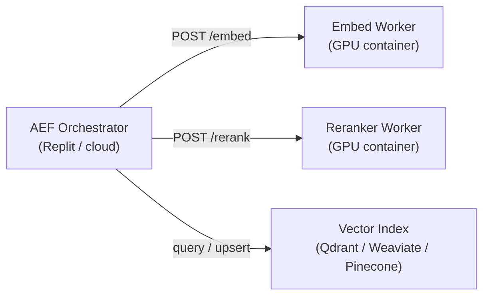

# AEF External GPU Deployment (Historical Design Only)

> **Status: historical, unvalidated design material.** This is not a deployment
> runbook, production receipt, benchmark report, or statement of a currently
> operating service. The repository's production admission gates remain on
> HOLD until immutable artifacts, durable state/evidence backends, tenant-bound
> credentials, and qualification receipts are wired and verified.

This document records candidate architecture for running AEF embedding workers
and a reranker on external GPU infrastructure. Any provider, model, sizing, or
latency below is a planning option that must be independently qualified before
promotion.

> **Scope note**: No external GPU deployment or provider validation is evidenced
> here. Example hostnames, secrets, commands, and controls are illustrative.

## Architecture

A candidate future production topology could connect AEF to three external services:


```mermaid
graph LR
    AEF["AEF Orchestrator\n(Replit / cloud)"] -->|"POST /embed"| EmbedWorker["Embed Worker\n(GPU container)"]
    AEF -->|"POST /rerank"| RerankWorker["Reranker Worker\n(GPU container)"]
    AEF -->|"query / upsert"| VectorIndex["Vector Index\n(Qdrant / Weaviate / Pinecone)"]
```

In this candidate topology, control-plane components would run on standard CPU
compute while embedding and reranking workers could use qualified GPU hosts.
This division has not been validated as a deployed production architecture.

## Embedding Worker

The embedding worker accepts POST requests in the OpenAI-compatible embedding API format:

```json
POST /embed
{
  "input": ["query text"],
  "model": "szl-embed-v1",
  "encoding_format": "float"
}
```

Response:

```json
{
  "object": "list",
  "data": [{"object": "embedding", "index": 0, "embedding": [0.01, -0.02, ...]}],
  "model": "szl-embed-v1",
  "usage": {"prompt_tokens": 12, "total_tokens": 12}
}
```

AEF's `@workspace/aef-contracts` package defines the TypeScript types for this contract under the `openai-compat` export.

### Candidate Models (Not Qualified)

| Use Case | Model | Dimensions | Sequence Length |
|---|---|---|---|
| General retrieval | `BAAI/bge-large-en-v1.5` | 1024 | 512 |
| Long document encoding | `Alibaba-NLP/gte-Qwen2-7B-instruct` | 3584 | 8192 |
| Fast indexing | `BAAI/bge-small-en-v1.5` | 384 | 512 |

### Container Configuration

```dockerfile
FROM nvcr.io/nvidia/pytorch:24.01-py3

WORKDIR /app
COPY requirements.txt .
RUN pip install -r requirements.txt

COPY embed_server.py .
CMD ["python", "embed_server.py", "--port", "8001", "--model", "BAAI/bge-large-en-v1.5"]
```

Environment variables:

| Variable | Default | Description |
|---|---|---|
| `EMBED_MODEL` | `BAAI/bge-large-en-v1.5` | HuggingFace model identifier |
| `EMBED_BATCH_SIZE` | `64` | Tokenisation batch size |
| `EMBED_MAX_LENGTH` | `512` | Maximum input token length |
| `CUDA_VISIBLE_DEVICES` | `0` | GPU device index |

## Reranking Worker

The reranker accepts a list of (query, passage) pairs and returns relevance scores.

```json
POST /rerank
{
  "query": "IMO 9234567 sanctions status",
  "passages": [
    {"id": "chunk-001", "text": "Vessel IMO 9234567 — sanctioned entity..."},
    {"id": "chunk-002", "text": "Unrelated maritime document..."}
  ],
  "model": "szl-rerank-v1",
  "top_n": 10
}
```

### Candidate Models (Not Qualified)

| Use Case | Model |
|---|---|
| Cross-encoder reranking | `cross-encoder/ms-marco-MiniLM-L-6-v2` |
| High-accuracy reranking | `BAAI/bge-reranker-large` |
| Long context | `jinaai/jina-reranker-v2-base-multilingual` |

## Vector Index Options

AEF's `RetrievalAdapter` interface in `@workspace/aef-retrieval-core` can be
implemented for multiple backend protocols. None of the following options is
claimed as production-tested by this document:

| Backend | Protocol | Best For |
|---|---|---|
| Qdrant | HTTP / gRPC | Filtered dense search, payload-aware retrieval |
| Weaviate | GraphQL / HTTP | Hybrid (dense + keyword) out of the box |
| Pinecone | HTTP | Managed, serverless, zero-ops |
| pgvector | SQL | Postgres-native, easiest to self-host |

## Candidate GPU Sizing (Unvalidated)

| Workload | Instance Type | Notes |
|---|---|---|
| Small corpus (< 100k chunks) | T4 (16 GB) | Sufficient for all six domain profiles |
| Medium corpus (100k–5M chunks) | A10G (24 GB) | Handles long-context models |
| Large-corpus planning case (5M+ chunks) | A100 (80 GB) | Candidate full-precision batch reranking |

## Illustrative External-Worker Configuration

Set these environment variables on the API server or orchestrator:

```bash
AEF_EMBED_ENDPOINT=https://embed.internal.szlholdings.com
AEF_EMBED_API_KEY=<secret>
AEF_RERANK_ENDPOINT=https://rerank.internal.szlholdings.com
AEF_RERANK_API_KEY=<secret>
AEF_INDEX_ENDPOINT=https://index.internal.szlholdings.com
AEF_INDEX_API_KEY=<secret>
AEF_INDEX_COLLECTION_PREFIX=szl_aef_
```

## Candidate Security Requirements

- All communication between AEF components and external GPU workers must use TLS 1.3.
- A future deployment should define, implement, and evidence credential rotation;
  this document does not prove that a quarterly workflow exists or has run.
- GPU workers must run in a private network segment not accessible from the public internet.
- Logs from GPU workers must not contain embedding vectors or raw query text — log only token counts, latencies, and request IDs.

## Unvalidated Planning Latency Targets

These figures are hypotheses only. They were not produced by a checked-in,
reproducible benchmark or tied to an admitted model/artifact receipt.

| Operation | GPU (A10G) | Notes |
|---|---|---|
| Query embedding (512 tokens) | 5–15 ms | Batching reduces per-query cost |
| Document embedding (512 tokens) | 5–15 ms | Done at indexing time, not query time |
| Reranking (top 100) | 20–80 ms | Scales with passage count |
| Dense vector search (1M chunks) | 2–10 ms | Depends on index and filter complexity |
| Full retrieval round trip | 30–110 ms | Embed + search + rerank + filter |
