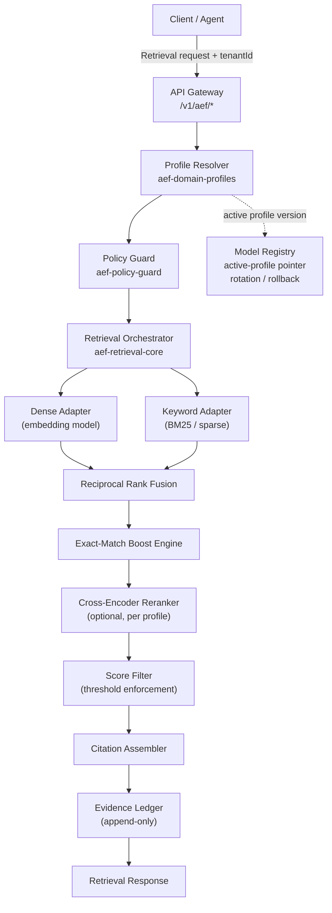
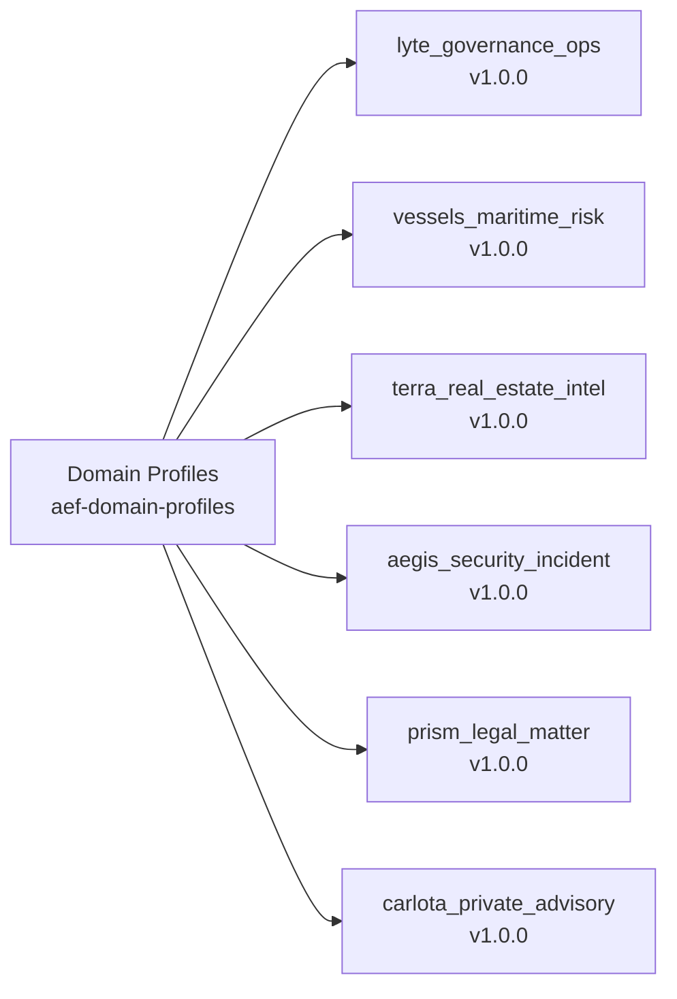
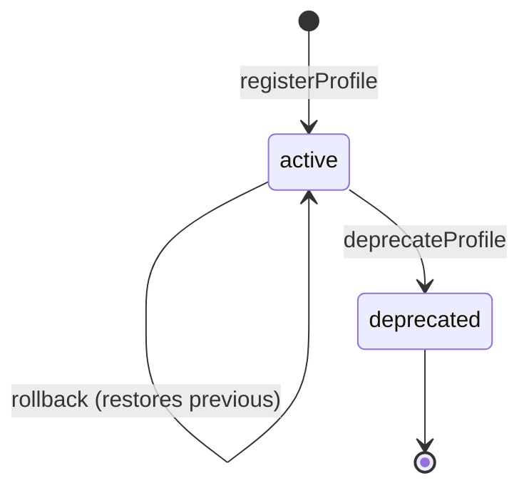
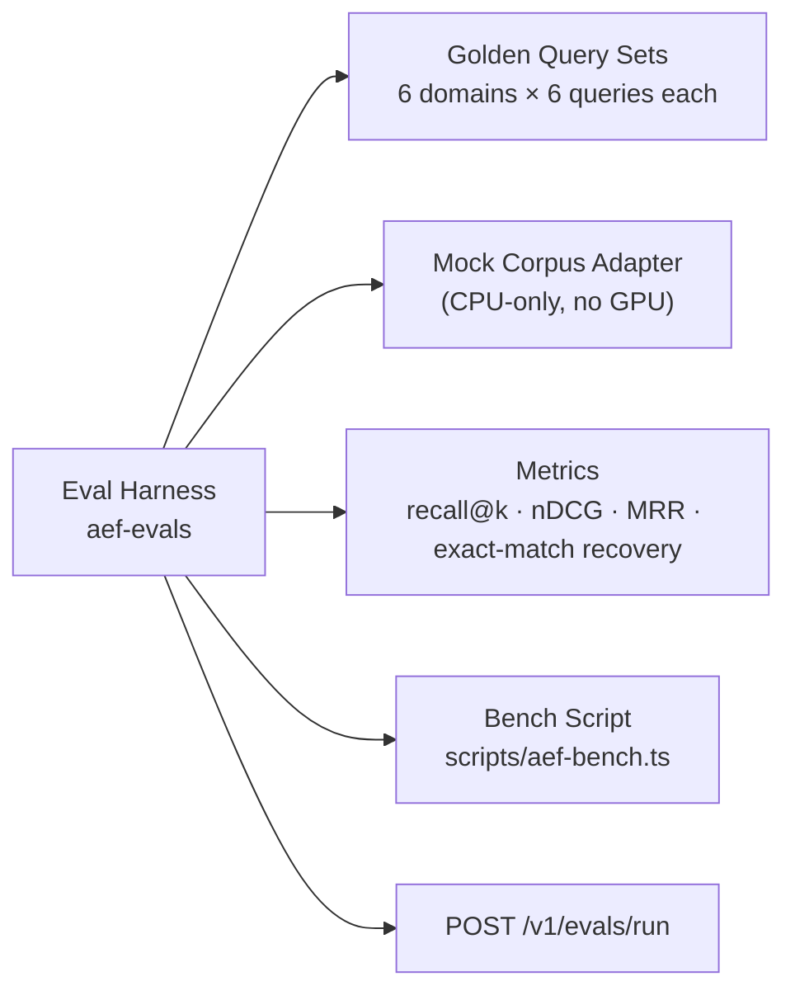

# AEF Architecture

> Updated in Phase 5 with finalised domain profiles, eval layer, and model registry.

## System Overview

The Alloy Embedding Fabric is structured as a layered retrieval pipeline. Requests enter through the API gateway, pass through the profile resolution and policy layers, proceed to the retrieval adapters, and return results with full provenance metadata.

## Data Flow

### 1. Request Ingestion

A retrieval request carries a tenant ID, a query string, and an optional profile override. If no override is provided, the profile resolver looks up the active profile for the tenant's domain using the model registry. The model registry returns the profile descriptor frozen at the active version — callers cannot bypass the version pointer.

### 2. Profile Application

The resolved profile instructs the orchestrator on:
- Which prompt templates to use for query and document encoding
- Which exact-match boost rules apply
- Which metadata filters to apply automatically
- Whether the reranker should run
- What `topK` and `maxCandidates` to request from each adapter

### 3. Policy Evaluation

Before retrieval begins, the policy guard evaluates the request against:
- Tenant boundary rules (allowedDomains, allowedProfiles in tenant identity)
- Privacy level requirements
- Redaction field configuration

If the request fails any rule, the guard returns a `PolicyDecision` with `allow: false`. The orchestrator treats this as an unrecoverable error rather than a silent fallback.

### 4. Hybrid Retrieval

The orchestrator dispatches the encoded query in parallel to the dense adapter and the keyword adapter. Dense results carry cosine similarity scores; keyword results carry BM25 scores. Both sets are normalised to [0, 1] before fusion.

### 5. Reciprocal Rank Fusion

RRF combines the ranked lists from the dense and keyword adapters using a smoothed rank formula. The fusion weight is configured per profile — maritime and security domains weight keyword matching more heavily; advisory and legal domains weight dense embeddings more heavily.

### 6. Exact-Match Boost

The boost engine scans each fused result against the profile's boost rule set. A query containing `IMO 9234567` will trigger the `imo-number` boost rule, applying a 2× score multiplier to the chunk that references that specific IMO number. Boost multipliers are deterministic — the same query always produces the same boost result for the same profile version.

### 7. Reranking

When `rerankEnabled` is true in the profile, the top `maxCandidates` results are passed to a cross-encoder reranker. Results falling below `scoreThresholds.rerankDropBelowScore` are suppressed before the final set is assembled. Carlota Jo (private advisory) disables reranking by default due to the small corpus size and high precision requirements.

### 8. Score Filtering

The score filter applies `minimumRelevanceScore` as a final gate. Results below this threshold are dropped entirely — they do not appear in the citation assembler output.

### 9. Citation Assembly

The citation assembler attaches provenance metadata to each retained result: chunk ID, source document reference, profile version, boost rules applied, policy decisions, and processing timestamp.

### 10. Evidence Ledger

Before the response is returned to the client, the complete retrieval event is appended to the evidence ledger. The ledger record includes every chunk considered, every score, and every policy decision. This record is immutable.

## Domain Profiles

Six versioned profiles cover the entire SZL portfolio. Each is declared in `packages/aef-domain-profiles`.

| Profile | Privacy Level | Rerank | Top-K | Exact-Match Anchors |
|---|---|---|---|---|
| lyte_governance_ops | internal | yes | 12 | approval chain IDs, opportunity codes |
| vessels_maritime_risk | confidential | yes | 10 | IMO numbers, MMSI codes |
| terra_real_estate_intel | internal | yes | 12 | NYC parcel IDs (BBL), property addresses |
| aegis_security_incident | restricted | yes | 10 | CVE IDs, incident IDs, control IDs |
| prism_legal_matter | privileged | yes | 10 | docket IDs, case numbers, citation codes |
| carlota_private_advisory | privileged | no | 8 | engagement IDs, client reference codes |

## Model Registry

The model registry tracks:
- The active profile version per tenant per domain
- The full rotation history (enabling rollback)
- Deprecation flags with successor profile references

## Eval and Benchmark Layer

## Privacy and Tenant Isolation

Tenant isolation is enforced at two layers:

1. **Profile resolver** — the active profile for a tenant is resolved from the model registry using the tenant's registered `allowedProfiles`. If the requested profile is not in the allowed list, the resolver rejects the request before retrieval begins.

2. **Policy guard** — the guard checks `allowedDomains` in the tenant identity and applies redaction rules before any result is returned to the caller.

Cross-tenant chunk leakage is structurally impossible: the retrieval adapters receive the tenant ID as a mandatory filter parameter, and results containing metadata from other tenants are suppressed by the score filter's metadata validation step.
