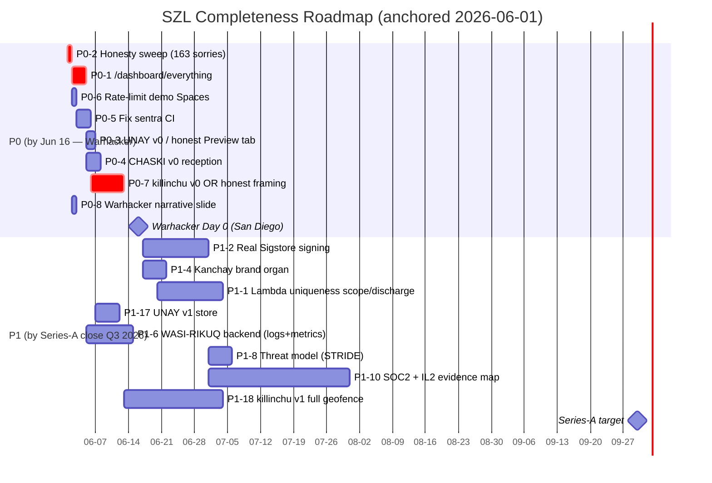

# PRIORITIZED ROADMAP — closing the completeness gaps
**Auditor:** Yachay. Read-only proposal (no push). NO BANDAID.
**Priority bands:**
- **P0** — before **16 June 2026** (Warhacker / DU "build-package-deploy", San Diego, ~400 attendees) + Greene demo. **15 days out from today (2026-06-01).**
- **P1** — before **Series-A close (Q3 2026)**.
- **P2** — enterprise readiness (Q1 2027).
- **P3** — nice-to-have.

**Effort:** S (≤1 day) · M (≤3 days) · L (≤2 weeks) · XL (>2 weeks).
**Owner-agents (Quechua squad, `110_:47–62`):** Wasichaq (builder), Llamkachiq (painter/dev), Hampichiq (mender), Cheqaq (truth/honesty), Sumaq Rikuq (designer), Kawsachiq (marketer), Maskaq (seeker), Yachay (CTO/coordination).
**LOCKED numbers preserved:** 749/14/163 · 13-axis · `bacf5443…631fc5` · A2=`IsHomogeneous` · A4=`IsBounded` · SLSA L1 · Λ-uniqueness Conjecture 1.

---

## P0 — BEFORE 16 JUNE (demo-critical, 15 days)
| ID | Gap | Action | Sev | Effort | Owner | Dependencies | Source |
|---|---|---|---|---|---|---|---|
| P0-1 | No single-pane status | Ship `/dashboard/everything` (WASI-RIKUQ face): static aggregator polling 7 Spaces + LOCKED numbers + wire matrix + UDS-sig status | CRIT | M | Wasichaq + Llamkachiq | anatomy-3d as front | ANATOMY §7, `411_…` |
| P0-2 | "zero/6 sorries" stale | **Honesty sweep:** every live UI string → **163 sorries / 749 decl / 14 axioms**; scope "verified" to sorry-free lemmas only | CRIT | S | Cheqaq | none | OC-1, `PURIQ_DOCTRINE_v12.md:172` |
| P0-3 | rosie Unay tab empty | Either back it with a minimal receipt-keyed read (UNAY v0) OR label it "Preview" honestly | HIGH | M | Wasichaq | YAWAR chain | OC-2, ANATOMY §2 |
| P0-4 | No reception / front door | Ship CHASKI v0: one landing page routing visitor → right flagship + "what is this" 30-sec path | HIGH | M | Llamkachiq + Sumaq Rikuq | P0-1 | EMPIRE §1, NOVEL CHASKI |
| P0-5 | sentra CI broken (oversight demo) | Fix sentra container-build + hf-sync (it's the Cannonico/Thompson wedge demo) | HIGH | M | Hampichiq | none | EMPIRE §13, `240_` |
| P0-6 | Rate-limit on demo Spaces | Add basic rate-limit/CORS to the 7 live Spaces so a 400-attendee spike can't 503 them | HIGH | S | Hampichiq | none | EMPIRE §8 |
| P0-7 | killinchu = 503 vs P1 drone lane | **DECISION (Yachay):** ship a killinchu v0 *geofence demo* (even static) OR explicitly frame it "spec, shipping Q3" in the deck — do NOT show it as a live flagship | CRIT | L | Wasichaq | geofence hard/soft decision (PONDER) | FLAGSHIP §D, `470_WAMANI_DRONE_PIVOT_PLAN.md` |
| P0-8 | Warhacker narrative | One slide: Lean decision gate + DSSE Khipu sum-of-sums receipt (TH11 `khipuReceipt_checksum_invariant`) → "evaluate-in-minutes ATO" | HIGH | S | Kawsachiq + Yachay | P0-2 honest numbers | `100_WARHACKER_DU_DEEP_DIVE.md` |

## P1 — BEFORE SERIES-A CLOSE (Q3 2026)
| ID | Gap | Action | Sev | Effort | Owner | Deps |
|---|---|---|---|---|---|---|
| P1-1 | Λ uniqueness Conjecture | Keep honestly scoped; discharge or formally bound `Uniqueness.lean:120` + `lutar_is_geomean`; never claim "proven unique" | HIGH | L | Yachay (Lean) | none |
| P1-2 | DSSE/Sigstore PLACEHOLDER | Wire real Sigstore signing into CI; sign the other 5 UDS bundles | HIGH | L | Hampichiq | CI fix |
| P1-3 | vsp-otel no DOI + ships nowhere | Mint Zenodo SW deposit + instill OTel into ≥1 live Space | HIGH | M | Maskaq + Wasichaq | none |
| P1-4 | Kanchay not a real brand organ | Build logo SVG set + shared `tokens.css` + typography spec + 1-page brand bible + import-snapshot test | HIGH | M | Sumaq Rikuq | none |
| P1-5 | SSO not live | Exercise 12-role OIDC/PKCE on ≥1 Space | HIGH | L | Wasichaq | none |
| P1-6 | Audit-log + metrics | Stand up WASI-RIKUQ backend: log aggregation + Prometheus/Grafana | HIGH | L | Hampichiq | P0-1 |
| P1-7 | DR + BC | Backup-restore drill, RPO/RTO doc, durable DB deploy (848-table) | HIGH | XL | Wasichaq | P1-6 |
| P1-8 | Threat model | STRIDE model across anatomy + flagships | HIGH | M | Cheqaq + Yachay | none |
| P1-9 | Privacy GDPR/CCPA | Data-flow map + retention spec (esp. UNAY) + privacy policy | HIGH | M | Legal/Business | UNAY v1 |
| P1-10 | Compliance cert path | SOC2 readiness + IL2 ATO-evidence mapping | HIGH | XL | Business + Yachay | P1-2, P1-8 |
| P1-11 | Pricing / commercial entity | SKUs + pricing page + entity wrapper | HIGH | M | Business | none |
| P1-12 | Legal entity hygiene | Incorporation + IP assignment + contributor CLA; **create the missing `corporate_hygiene_checklist.md`** | HIGH | M | Legal/Business | none |
| P1-13 | Unified docs site | Publish UDS docs site across flagships | MED | M | Sumaq Rikuq | none |
| P1-14 | Wire C/D + 3 dashed wires | Land Wire C receiver, Wire D, cross-organ e2e test → make anatomy-3d wires solid | HIGH | L | Wasichaq | test harness |
| P1-15 | 13 broken CI workflows | Fix remaining 12 (after P0-5) or document direct-deploy model | MED | M | Hampichiq | none |
| P1-16 | Mythos→Hatun-Willay rename | Finish ~360 remaining tokens | MED | S | Cheqaq | none |
| P1-17 | UNAY v1 | Real receipt-keyed continuity store + Lean stub `unay_recall_is_subset_of_chain` + replay test | HIGH | M | Wasichaq | P0-3 |
| P1-18 | killinchu v1 deploy | Full geofence organ live (resolve hard/soft `G(a)`) | HIGH | XL | Wasichaq | P0-7 |

## P2 — ENTERPRISE (Q1 2027)
| ID | Gap | Action | Effort | Owner |
|---|---|---|---|---|
| P2-1 | WALLPA output/voice organ | Build expression organ (shared output contract + voice/announce) | L | Llamkachiq |
| P2-2 | SLSA L1 → L3 | Hardened build provenance | XL | Hampichiq |
| P2-3 | FedRAMP / IL4+ | Full cert | XL | Business |
| P2-4 | Substrate moats instilled | Wire compiler.ts Kahn-DAG + codex-kernel into live Spaces | L | Wasichaq |
| P2-5 | Cardano real anchoring | Replace local hash-chain with real tx | L | Wasichaq |
| P2-6 | Chaos engineering | WASI-RIKUQ chaos drills + circuit breakers | L | Hampichiq |

## P3 — NICE-TO-HAVE
| ID | Gap | Action | Owner |
|---|---|---|---|
| P3-1 | i18n | Localize flagships | Llamkachiq |
| P3-2 | FE OTel | Frontend tracing | Llamkachiq |
| P3-3 | rosie-3d depth | Richer interactivity | Llamkachiq |

---

## GANTT (Mermaid) — P0/P1 critical path to June 16 + Series-A

## CRITICAL PATH (the must-not-slip chain to June 16)
**P0-2 (honesty sweep) → P0-1 (/dashboard/everything) → P0-4 (CHASKI reception) → P0-8 (narrative).** Plus the independent **P0-7 killinchu decision** (ship-v0-or-honestly-frame) which is the single biggest Warhacker risk because the drone-oversight lane is Cannonico's exact ask and SZL has only a spec.

## SEQUENCING NOTES (no bandaids)
- **Do P0-2 first and alone:** you cannot demo "verified" with stale "zero sorry" strings while the LOCKED count is 163. Fixing the numbers is one day and de-risks everything downstream.
- **P0-7 is a decision, not just a build:** if killinchu v0 can't be real by June 16, the honest move is to frame it as "spec, Q3" — showing a 503 flagship is worse than showing a roadmap.
- **WASI-RIKUQ is split:** its *face* (`/dashboard/everything`, P0-1) is demo-critical; its *backend* (logs/metrics/DR, P1-6/P1-7) is Series-A work. Don't conflate.

---
*— Yachay, Prioritized Roadmap, 2026-06-01. Read-only proposal; no repos modified.*
