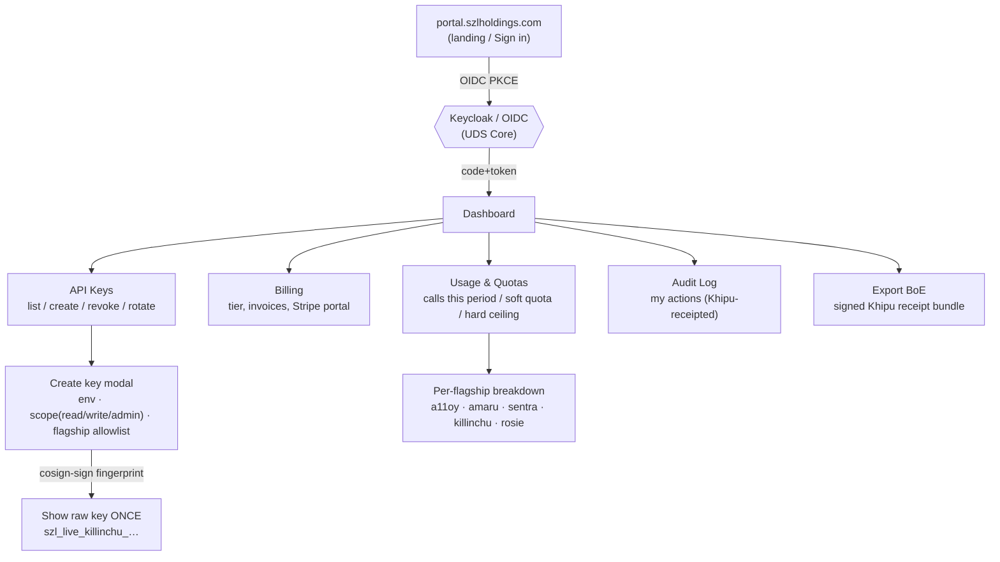
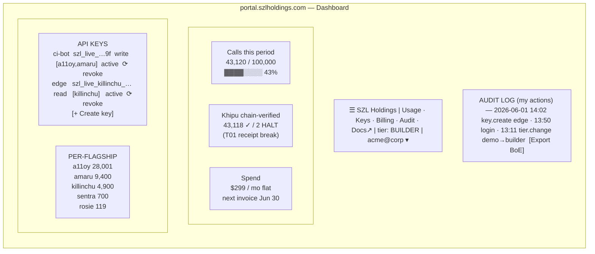

# CUSTOMER_PORTAL_SPEC — SSO, sign-up, dashboard, API keys, audit log

**Layer:** PURIQ v12 customer surface · **Author:** Yachay (CTO authority) · **Date:** 2026-06-01
**Status discipline:** spec + patch. v11 LOCKED numbers preserved verbatim (749 / 14 / 163 / 13-axis
`yuyay_v3` / replay hash `bacf5443…631fc5` / `lutar-v18.0.0` @ `c7c0ba17`). Khipu signature = cosign
PLACEHOLDER. NO mock.

---

## 0 — What the portal is

`portal.szlholdings.com` — the authenticated commercial front door where a customer:
- signs in (real OAuth/OIDC), signs up, manages their org/team,
- sees **usage** (calls this period vs quota), **billing** (tier, invoices), **quotas**,
- **issues / revokes / rotates API keys** with scopes and per-flagship allowlists,
- reads an **audit log of their own actions** (every portal action is Khipu-receipted),
- exports a **Body-of-Evidence (BoE)** bundle of their Khipu receipts for compliance.

It is the layer that turns "a bunch of cool HF Spaces" into "a sellable platform": a buyer can self-serve
a key, run the SDK against the live flagships, watch receipts accrue, and reconcile the bill — without
talking to a human until Enterprise/DoD.

---

## 1 — Tech choice: **new microservice** (`szl-holdings/customer-portal`), NOT an a11oy Space tab

**Decision: build a dedicated portal microservice; do NOT extend the a11oy Space.**

Justification (Series-A diligence-grade, not vibes):

| Concern | a11oy Space tab | Dedicated microservice | Winner |
|---|---|---|---|
| **Auth blast radius** | a11oy is the cognition brain serving every flagship; bolting OIDC + a key DB + billing into it widens the attack surface of the most critical organ | portal isolated; a key DB compromise never touches the router | microservice |
| **Compliance posture** | HF Spaces have shared infra & opaque egress; storing PII (emails, billing) there fails most DoD/IC and SOC2 reviews | portal runs on controlled infra (Keycloak under UDS Core), air-gappable for DoD/IC | microservice |
| **Statefulness** | Spaces are designed for stateless demo apps; a billing/key store wants WAL SQLite → Postgres with backups | microservice owns its DB lifecycle | microservice |
| **Doctrine separation** | a11oy must stay the governed *cognition* substrate; mixing commerce muddies the "verifiable brain" story | clean separation: brain vs. commerce | microservice |
| **Coupling to LOCKED numbers** | any portal edit risks touching a11oy's LOCKED banner/healthz fields | portal never edits LOCKED a11oy fields | microservice |

a11oy still gets **two read-only marketing tabs** (`/docs`, `/pricing`) pushed via HfApi (per hard rules)
— but those are static pages that *link to* the portal, not the portal itself. The portal authenticates
every flagship call by verifying the key (see API_KEY_SYSTEM.md) and writing the Khipu receipt; the
flagships stay pure.

**Stack:** FastAPI (matches every flagship; emits OpenAPI 3.1 natively) + SQLite/WAL → Postgres in prod
+ Keycloak (OIDC) as the auth provider (open-source, UDS-Core-deployable, air-gap-friendly). A thin
React/Vite SPA front-end. Stripe for Builder/Professional self-serve billing; Enterprise/DoD are
contract + invoice (no card).

---

## 2 — Single sign-on / OAuth (real, open-source-first)

Per hard rules: **real OAuth**, with open-source via **Keycloak under UDS Core** as the canonical choice;
**auth0 / clerk / propelauth** are documented as managed alternatives for the cloud SaaS deployment.

- **Canonical (UDS / DoD/IC / on-prem):** Keycloak OIDC. Keycloak is CNCF-adjacent, fully open source,
  and is already a first-class UDS Core capability, so the air-gapped DoD/IC deployment uses the *same*
  identity stack as cloud. ([Keycloak](https://www.keycloak.org/), bundled in
  [Defense Unicorns UDS Core](https://uds.defenseunicorns.com/core/).)
- **Cloud SaaS alternative:** Auth0 / Clerk / PropelAuth as a managed OIDC provider for the public
  `portal.szlholdings.com` if we want hosted social logins. The portal speaks **OIDC**, so the provider
  is swappable behind the same `oauth_sub` column.
- **Flow:** Authorization Code + PKCE. On first login the portal upserts an `accounts` row keyed by the
  OIDC `sub`, defaulting `tier='demo'`. Greene-network / academic / hackathon accounts get
  `greene_network=1` (free Demo) via an invite code or a verified-domain allowlist.

---

## 3 — Wireframe (Mermaid)

### 3a — Information architecture / navigation



### 3b — Dashboard screen layout (low-fi wireframe)



### 3c — Sign-up + first-key sequence

```mermaid
sequenceDiagram
    participant U as User
    participant P as Portal (FastAPI)
    participant K as Keycloak (OIDC)
    participant DB as SQLite/Postgres
    participant M as Keymint (offline + cosign)
    U->>P: GET / (Sign in)
    P->>K: redirect (Auth Code + PKCE)
    K-->>U: login page
    U->>K: credentials / social
    K-->>P: code -> tokens (id_token sub)
    P->>DB: upsert accounts(sub, email, tier=demo)
    P->>DB: insert audit_log(login)
    P-->>U: Dashboard
    U->>P: Create key (env=live, scope=write, flagships=[killinchu])
    P->>M: cosign sign-blob(fingerprint)
    M-->>P: cosign_sig
    P->>DB: insert api_keys(...) ; insert audit_log(key.create)
    P-->>U: show raw key ONCE: szl_live_killinchu_Q2m7...
```

---

## 4 — Dashboard panels (data sources)

| Panel | Source | Notes |
|---|---|---|
| **Usage & quotas** | `usage_counters` + `quota_state()` | live bar; per-flagship from `call_receipts` group-by |
| **Billing** | Stripe (Builder/Pro) / contract record (Ent/DoD) | tier change writes `audit_log` + Khipu receipt |
| **API keys** | `api_keys` + `key_flagship_scope` | create/revoke/rotate per API_KEY_SYSTEM.md |
| **Audit log (own actions)** | `audit_log` | login, key.* , tier.change; export as CSV/JSON |
| **Khipu health** | `call_receipts.chain_verified` / `.tripwire` | shows HALTs so customer sees fail-closed honesty |
| **Export BoE** | `call_receipts` → bundle | reuses killinchu `/v1/audit?format=boe` shape |

---

## 5 — Audit log of the customer's own actions

Every portal mutation writes an `audit_log` row **and** a Khipu receipt (same `continuum_hash`
discipline). The customer can:
- filter by action (`login`, `key.create`, `key.revoke`, `key.rotate`, `tier.change`),
- export JSON/CSV,
- **export a BoE bundle** that an auditor (or Greene) can verify independently by recomputing each
  `continuum_hash` from the receipt packets — the same self-verification posture as the Lean
  sorry-counting and the flagship audit endpoints.

---

## 6 — Patch files (NOT pushed by authoring step)

| File | Target | Push path |
|---|---|---|
| `patches/github_customer_portal/schema.sql` | DB schema | `szl-holdings/customer-portal` (git) |
| `patches/github_customer_portal/app.py` | FastAPI portal app | same |
| `patches/github_customer_portal/README.md` | repo README | same |
| `patches/a11oy_space/docs.html` | a11oy `/docs` tab (links to portal) | HfApi → `SZLHOLDINGS/a11oy` |
| `patches/a11oy_space/pricing.html` | a11oy `/pricing` tab | HfApi → `SZLHOLDINGS/a11oy` |

— Signed **Yachay** (CTO authority), 2026-06-01. Brain stays pure; commerce is its own organ. No bandaid.
