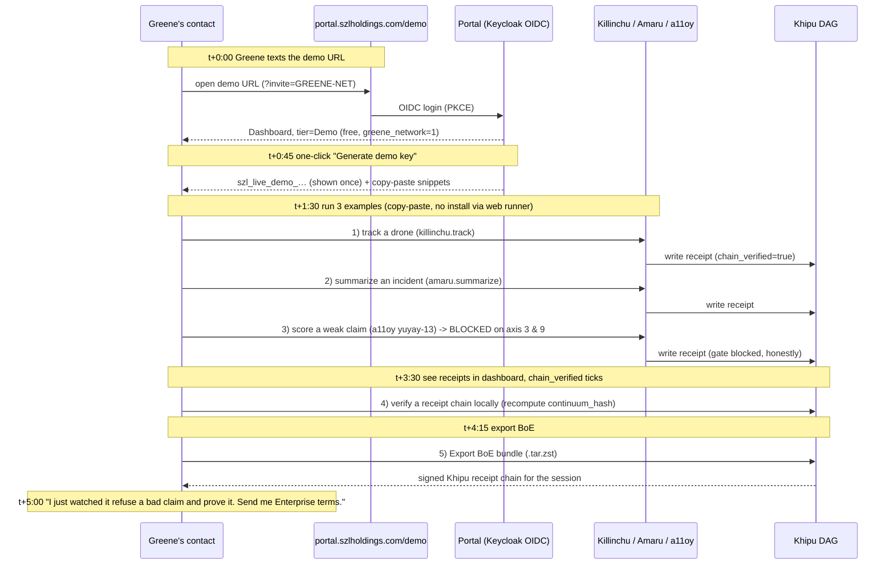

# GREENE_PERSONA_FLOW — Andrew Greene demos SZL to a contact (5-minute story)

**Layer:** PURIQ v12 customer surface · **Author:** Yachay (CTO authority) · **Date:** 2026-06-01
**Status discipline:** spec. v11 LOCKED numbers preserved verbatim (749 / 14 / 163 / 13-axis `yuyay_v3`
/ replay hash `bacf5443…631fc5` / `lutar-v18.0.0` @ `c7c0ba17`). Khipu signature = cosign PLACEHOLDER.
NO mock.

---

## 0 — The persona

**Andrew Greene** — SZL's backer, ex-CIA Director. He is not going to read code. He wants to forward
**one URL** to a defense/IC contact, have that contact **self-serve a key in 60 seconds**, run **three
examples**, **see the Khipu receipts prove the system did what it said**, and **export a Body-of-Evidence
bundle** they can hand to their own auditors. The whole thing must land in **five minutes** and feel like
"a real system, not a deck."

---

## 1 — The 5-minute flow (end to end)

---

## 2 — Beat-by-beat (what Greene's contact sees)

**t+0:00 — One URL.** Greene forwards `https://portal.szlholdings.com/demo?invite=GREENE-NET`. The invite
code maps to `greene_network=1`, so the account lands on the **free Demo tier** (1,000 calls) with no
credit card. (See CUSTOMER_PORTAL_SPEC.md §2.)

**t+0:45 — One key.** The dashboard's first card is **"Generate demo key."** One click mints
`szl_live_demo_Q2m7…` (cosign-signed fingerprint, API_KEY_SYSTEM.md §2), shows it **once**, and renders
three copy-paste snippets right beside it. No install needed — a sandboxed web runner executes them.

**t+1:30 — Three examples** (verbatim from EXAMPLES_GALLERY.md):
1. **Track a drone** (`killinchu.track`, example #1) → returns a track id + `yuyay.passed=True` + receipt.
2. **Summarize an incident** (`amaru.summarize`, example #3) → fuses 4 sources into one paragraph + receipt.
3. **Score a weak claim** (`a11oy` yuyay-13, example #4) → "the vessel is hostile / one blurry photo" is
   **BLOCKED** on axis 3 (empiricalGrounding) and axis 9 (claimCalibration). The system **refuses** and
   says why. *This is the money beat:* an ex-CIA Director's contact watches the gate refuse an over-claim
   — exactly the failure mode that gets people killed in the field — and sees the receipt that proves it.

**t+3:30 — The receipts are real.** The dashboard's Khipu panel shows three receipts, `chain_verified ✓`,
and the blocked one carries the axis floor that fired. The contact clicks "verify locally," and the SDK
recomputes the `continuum_hash` byte-for-byte — *they* verify SZL, not the other way around.

**t+4:15 — Export BoE.** One click exports a **Body-of-Evidence** bundle (`.tar.zst`) of the session's
Khipu receipts — the same BoE format bundled into the DoD/IC tier. The contact can hand it to their own
auditors and recompute every hash.

**t+5:00 — The ask.** "I watched it refuse a bad claim and prove the refusal. Send me Enterprise terms."
Greene's job is done in one text message and five minutes.

---

## 3 — Why this flow wins the room

- **Self-serve, no human in the loop** until the Enterprise/DoD ask — the contact never waits on SZL.
- **The refusal is the demo.** Most AI demos show the system *doing* something; SZL's best demo is the
  system *correctly refusing* an over-claim and proving it. For an IC audience that is the whole pitch.
- **Verify-it-yourself** turns a skeptical auditor into a believer in two clicks (recompute the hash;
  clone lutar-lean @ `c7c0ba17` and re-run the canonical counter → 749 / 14 / 163).
- **BoE export** is the artifact that survives a real authorization board.

---

## 4 — Honest labels Greene's contact will see (and that build trust)

The demo does **not** hide the open work — and that is precisely what an ex-CIA Director's network
respects: Λ uniqueness is a **Conjecture**; the Khipu signature is a **cosign PLACEHOLDER** (chain
verified by hash today, signature when Sigstore lands); **SLSA = L1**; Wire D (cross-mesh traceparent) is
**in-process only**. Counting the sorries out loud (163) is the credibility.

## 5 — Patch / asset files (NOT pushed by authoring step)
| File | Target |
|---|---|
| `patches/a11oy_space/docs.html` (links to demo flow) | HfApi → `SZLHOLDINGS/a11oy` `/docs` |
| `patches/github_customer_portal/demo_flow.md` | portal repo |

— Signed **Yachay** (CTO authority), 2026-06-01. One URL, one key, three examples, receipts that prove it. No bandaid.
