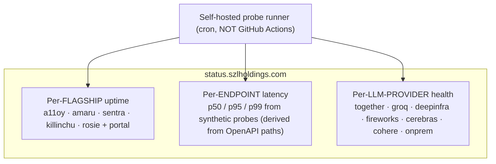

# STATUS_PAGE — `status.szlholdings.com`

**Layer:** PURIQ v12 customer surface · **Author:** Yachay (CTO authority) · **Date:** 2026-06-01
**Status discipline:** spec + patch. v11 LOCKED numbers preserved verbatim. NO mock.

---

## 0 — Tech choice: **Upptime** (self-hosted, git-backed) — with Cachet as the on-prem/DoD alternative

**Decision: Upptime for the public cloud status page; Cachet for on-prem/DoD/IC.**

Justification (Series-A diligence-grade):

| Criterion | Upptime | Cachet | Statuspage.io (SaaS) | Why for SZL |
|---|---|---|---|---|
| **Cost** | free (static, git) | free (self-host) | paid SaaS | Series-A frugality |
| **Transparency** | uptime history lives in a public git repo — anyone can audit the raw probe history | DB-backed | opaque SaaS | matches our "verify it yourself" honesty posture |
| **Air-gap / DoD** | static site mirrorable into UDS; probes run from an internal runner | self-hostable in UDS | ❌ SaaS, no air-gap | DoD/IC needs an air-gapped status page |
| **Per-endpoint probes** | yes (config-driven) | yes (components + metrics) | yes | per-flagship, per-endpoint, per-provider |
| **Push constraint** | Upptime's *default* uses GitHub Actions — **we override** to a self-hosted runner / dev-box cron (HfApi/git push only, per hard rules) | cron-driven | n/a | honors "NEVER GitHub Actions" |

**The one caveat, handled honestly:** Upptime's out-of-the-box design schedules probes via GitHub
Actions. Our hard rule forbids GitHub Actions. So we run the Upptime probe loop on a **self-hosted runner
/ dev-box cron** and commit results with `git push` (not Actions). For the air-gapped DoD/IC deployment
we use **Cachet** inside the UDS bundle, fed by an internal cron probe. The public cloud page is Upptime;
the sovereign page is Cachet. ([Upptime](https://upptime.js.org/), [Cachet](https://cachethq.io/).)

---

## 1 — What the page reports (three axes)



### 1a — Per-flagship uptime
One component per flagship + the portal. Probe = the flagship's unauthenticated `GET /healthz` (excluded
from billing/Khipu). Uptime % over 24h / 7d / 30d / 90d, with the raw history committed to git.

### 1b — Per-endpoint latency
Synthetic probes for each **public** OpenAPI `operationId` (derived from `/openapi.json`, so the probe set
auto-updates when a spec changes). Tracks p50/p95/p99. Probes use a dedicated `szl_test_*` key so they
emit real Khipu receipts but never touch billing or live fleet data.

### 1c — Per-LLM-provider health
a11oy's router fans out to multiple open-model providers. The status page surfaces each provider's
reachability + p95 from the router's own provider-health pings, so a customer can see *which* upstream is
degraded when a route slows — the same providers named in the router contract (together, groq, deepinfra,
fireworks, cerebras, cohere, onprem).

---

## 2 — Upptime config (real)

```yaml
# .upptimerc.yml  (probe loop runs on a self-hosted runner / dev-box cron; NOT GitHub Actions)
owner: szl-holdings
repo: status
sites:
  - { name: a11oy,     url: https://szlholdings-a11oy.hf.space/api/a11oy/healthz }
  - { name: amaru,     url: https://szlholdings-amaru.hf.space/api/amaru/healthz }
  - { name: sentra,    url: https://szlholdings-sentra.hf.space/api/sentra/healthz }
  - { name: killinchu, url: https://szlholdings-vessels.hf.space/api/killinchu/healthz }
  - { name: rosie,     url: https://szlholdings-rosie.hf.space/api/rosie/healthz }
  - { name: portal,    url: https://portal.szlholdings.com/healthz }
  - { name: api-gateway, url: https://api.szlholdings.com/healthz }
status-website:
  cname: status.szlholdings.com
  name: SZL Holdings Status
  theme: dark
assignees: [yachay]
```

Provider-health and per-endpoint-latency probes run from a companion script (`probe_endpoints.py`) that
reads each `/openapi.json`, hits every public path with a test key, records latency, and commits a JSON
metrics file that the status site renders. The runner is cron-driven; results are pushed with `git push`.

---

## 3 — Honest labels on the status page

- The page shows **real probe history** (committed to git, auditable) — not a hand-maintained "all green."
- A **HUKLLA halt is not an outage**: if a flagship correctly *refuses* a poisoned payload (fail-closed),
  that is healthy behavior, not downtime. The status page distinguishes `5xx infra error` (outage) from
  `409 hukla_halt` (correct refusal). This distinction is itself part of the honesty wedge.
- The provider-health row carries a note that Wire D (cross-mesh traceparent) is **in-process only**, so
  cross-Space latency attribution is best-effort until Wire D lands.

---

## 4 — Patch files (NOT pushed by authoring step)

| File | Target | Push path |
|---|---|---|
| `patches/github_customer_portal/upptimerc.yml` | `szl-holdings/status` repo (or status dir) | git |
| `patches/github_customer_portal/probe_endpoints.py` | probe runner | git |

— Signed **Yachay** (CTO authority), 2026-06-01. Real probe history, committed to git, no GitHub Actions. No bandaid.
