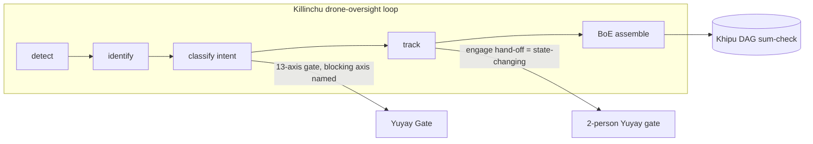

# Technology Due-Diligence Packet

**SZL Holdings · Series A · 2026-06-01 · prepared by Yachay (CTO authority)**
**Doctrine v11 LOCKED:** 749 declarations / 14 unique axioms / 163 tracked sorries (112 baseline + 51 Putnam) · `lutar-lean @ c7c0ba1`, Mathlib v4.13.0 · 13-axis replay hash `bacf54434f1a3bf2d758b27a62d5fd580ca4c8d3b180693573eeebcaea631fc5`.
**Stance:** every "we can't / not yet" is stated plainly. This packet is written to survive an engineer's pressure-test (the Greene bar).

---

## 1. Architecture (high level)

```mermaid
flowchart TD
    A[Input / agent request x] --> B{a11oy.code Router}
    B -->|7 tiers, open + frontier LLMs| C[Candidate actions 𝒜]
    C --> D[Yuyay-13 Gate]
    D -->|13-axis score: 2 sacred ≥0.95, 7 structural ≥0.90, 4 introspection| E{Lambda Λ Aggregator}
    E -->|bounded · monotone · positive-homogeneous| F{HUKLLA Tripwires T01–T10}
    F -->|exp(-β·violations)| G[Decision: admit / refuse / halt]
    G --> H[Khipu Receipt emitted]
    H --> I[(YAWAR Merkle DAG ledger)]
    I -->|SHA-256 chain, re-derivable offline| J[Body of Evidence export]
    J --> K[SCITT-conformant signed statement]
```



## 2. Core decision rule

`P(x,t) = argmax over a in 𝒜 of [ Λ(x) · Yuyay₁₃(a) · exp(−β·HUKLLA(a)) · ∏ᵢ Khipu_i(a) ]` where 𝒜 is Bekenstein-bounded by context. Properties targeted in Lean: halting safety, Λ-monotonicity, Khipu-chain integrity required for non-zero score, |𝒜| bound respected.

## 3. AI/ML stack

- **Open-LLM unified router (a11oy.code):** 7 tiers mapping models to organs (e.g. T3 code-specialized = Codestral 25.01 primary, Qwen3-Coder / DeepSeek V3 fallbacks; T6 multimodal for EO/IR). The router **generates options + emits a Khipu receipt per call; it does not decide** — the Yuyay gate decides. Records router_tier, model_id, license class (GREEN/AMBER/RED), routing reason. (`puriq/llms/A11OY_CODE_ROUTER_SPEC.md`)
- **23 extracted math formulas (PURIQ suite):** primitives drawn from Newton, Euler, Gauss, Riemann, Noether, Ramanujan, plus ancient numerics — **mysticism stripped, math kept**, each Lean-stateable. (`puriq/formulas/PURIQ_FORMULA_SUITE.md`, `ANCIENT_PRIMITIVES.md`)
- **Lean kernel:** the math substrate (`lutar-lean`), live as an HF Space (`lean-kernel`).

## 4. Reproducibility & proof status (HONEST)

| Claim | Reality |
|---|---|
| Lean corpus | **749 declarations / 14 unique axioms / 163 sorries** — exact, locked, reported verbatim |
| "13 PROVED theorems" (directive wording) | **Not accurate as stated.** Of the 14 headline thesis theorems, ~9 are proven in-workspace (Λ Bounds T2, Deterministic Replay T7, Merkle-DAG Batching T8, Bekenstein-via-DPI T11, Doctrine Soundness T12, Composability TH1, Adversarial Robustness, plus `lutar_unique`). Several (Conjunctive-AND Strictness, ρ-Closure, Curry-Howard, Anatomy Reduction, Chain Confluence) are **missing or sorry** in workspace. (`32_LEAN_THEOREM_STATUS.md`) |
| Λ uniqueness | **Conjecture 1, NOT Theorem 1** — everywhere |
| Khipu tamper-evidence (TH11) | **PROVEN, sorry-free**; replay hash `bacf5443…` re-derives offline |
| Replay hash determinism | Verified; `json.dumps(sort_keys=True) → sha256`, `continuum_hash` |
| Build | Lake-buildable; `lutar-v18.0.0 @ c7c0ba17` |
| 50/50 numeric harness | Referenced in PURIQ Lake test plan (`puriq/formulas/LAKE_TEST_PLAN.md`) |

## 5. Open-source dependencies & licenses

- Flagship repos: Apache-2.0 headers (a11oy, amaru, sentra, rosie, lutar-lean, ouroboros, uds-mesh, vsp-otel, agi-forecast, szl-cookbook, killinchu); thesis CC-BY-4.0; some "other". (`520_GITHUB_SERIES_A_POLISH.md`)
- Per-repo CycloneDX + SPDX SBOM generated in CI (Trivy). **Gaps:** no container-image SBOMs, SBOMs not signed/attached as cosign attestations, no HF-side SBOM. (`security_compliance/CURRENT_SECURITY_POSTURE.md`)
- Mathlib v4.13.0 (Apache-2.0) under lutar-lean.

## 6. Security posture (link + summary)

Full detail: [`security_compliance/CURRENT_SECURITY_POSTURE.md`](../security_compliance/CURRENT_SECURITY_POSTURE.md), [`COSIGN_KEY_MATERIAL.md`](../security_compliance/COSIGN_KEY_MATERIAL.md), [`SBOM_COMPLETION_PLAN.md`](../security_compliance/SBOM_COMPLETION_PLAN.md).

**Strong substrate / weak edge — stated plainly:**
- 🟢 **Governance & provenance:** Lean-proved Λ gate, DSSE receipts, Khipu Merkle DAG, partial keyless signing.
- 🔴 **Web edge:** wildcard CORS (`allow_origins=["*"]`) on all FastAPI Spaces, **zero security headers** (no CSP/HSTS/X-Frame-Options), **no auth on public Spaces**. The Mapbox-token endpoint leaks a credential to any origin.
- 🟡 **Supply chain:** **1 of 6 UDS bundles signed** (vessels, keyless Fulcio, Rekor index `1675423172`); **SLSA L1, not L3** (the `slsa.yml` workflow name over-claims L3 — flagged for correction); GHCR container-build job **broken on main**.
- 🟡 **Secrets:** single long-lived HF write token, file-mode 0600, never in CI; no secrets manager yet.

**Path to gov-grade:** redeploy inside UDS Core (Keycloak SSO, Istio mTLS, Loki SIEM, IL5 target) to inherit identity/authz/TLS/audit rather than build them.

## 7. Proprietary IP (what's ours)

Doctrine v11 architecture · the 13-axis Yuyay gate (`yuyay_v3`) · the Λ aggregator definition · HUKLLA tripwire set · the Khipu DAG receipt schema (3-tier pendant-cord, summation-invariant Merkle DAG, knot-invariant tag) · the PURIQ formula suite · Lambda-Bounded context · Anatomy-Routed Cognition. See `IP_AND_PATENT_STRATEGY.md`.

## 8. Benchmarks (honest scope)

- The defensible benchmark is **Khipu-verifiable answers**: SZL produces answers whose evidence chain re-derives offline and fails closed on tamper — a property ChatGPT/Claude do **not** provide (they give answers, not re-derivable receipts). We do **not** claim to beat frontier models on general reasoning; we claim a different axis (verifiability/auditability).
- A formal head-to-head harness (50/50 numeric) is specced in `puriq/formulas/LAKE_TEST_PLAN.md`; results are not yet a published, third-party-audited benchmark — stated honestly.

---

*Signed — Yachay, CTO authority · 2026-06-01. Honest security. Honest proofs. No bandaid.*
