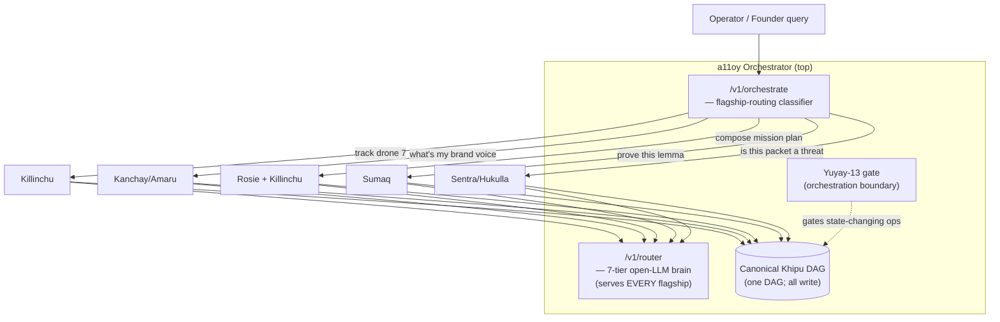
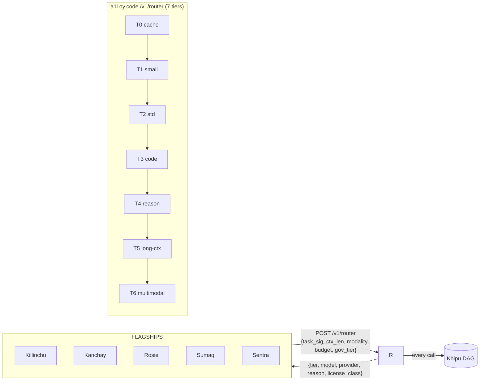
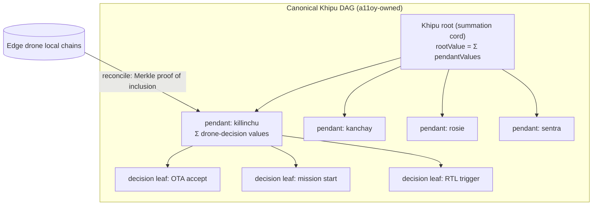
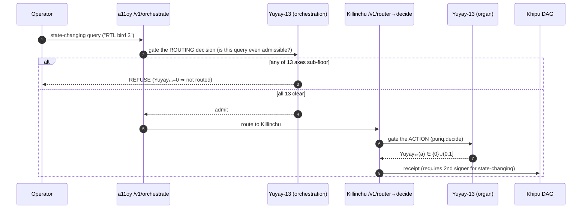

# A11OY_ORCHESTRATION_LAYER — a11oy orchestrates ALL flagships incl. Killinchu

**Layer:** PURIQ v12 → `killinchu/architecture/`
**Author:** Yachay, under CTO authority · 2026-06-01
**Founder directive:** "…and a11oy can orchestrate."

**Grounding:** a11oy.code is the unified open-LLM router — the reasoning backend for
`P(x,t)` (`puriq/llms/A11OY_CODE_ROUTER_SPEC.md`). **One endpoint, seven tiers**: every
flagship calls `POST /v1/router`; selection is a *pure, auditable function* of
`(task_signature, context_len, modality, budget, governance_tier)` and emits a Khipu
receipt for every call. The router **generates** candidate actions `a ∈ 𝒜`; it does **not
decide** — Yuyay-gating + HUKLLA-penalty are applied downstream by the organ.

This document specifies the **orchestration layer**: query routing across flagships,
`a11oy.code` as the single LLM brain for all, Khipu-DAG unification, and Yuyay-13 gating
at the orchestration boundary.

---

## 1 — Orchestration topology



**Two distinct a11oy endpoints:**
- `POST /v1/orchestrate` — **routing layer**: classifies the user query → picks which
  flagship(s) handle it. New in this spec.
- `POST /v1/router` — **LLM brain**: the existing 7-tier open-LLM router. The flagship
  calls it to *generate candidate actions*. Already specified in `A11OY_CODE_ROUTER_SPEC.md`.

---

## 2 — Flagship routing logic (`/v1/orchestrate`)

Routing is a **pure, deterministic classifier** over the query — same Zero-Bandaid
discipline as the LLM router. It returns `{flagships, reason, governance_tier}` and emits
a Khipu receipt.

| Example query | Routed to | Why |
|---|---|---|
| "track drone 7" | **Killinchu** | physical-agent telemetry/command |
| "what's my brand voice say" | **Kanchay** (+ Amaru recall) | public-claim surface (SF-09) |
| "compose mission plan" | **Rosie + Killinchu** | Rosie proposes plan; Killinchu validates G(a) |
| "RTL bird 3 now" | **Killinchu** (state-changing) | actuation ⇒ 2-person Yuyay gate |
| "prove the halting lemma" | **Sumaq** | proof-discharge (SF-11) |
| "is this packet a threat" | **Sentra / Hukulla** | immune screen (SF-04) |
| "amend doctrine §3" | **Hatun** | additivity guard (SF-10) |
| "show mission Alpha audit" | **Killinchu** `/killinchu/audit/{id}` | Khipu DAG render |

**Classifier shape (deterministic + LLM-assisted, auditable):**
```python
def orchestrate(query: str, ctx: Context) -> RouteDecision:
    sig = task_signature(query)                       # pure feature extraction
    # 1) deterministic rules first (no LLM cost) — verbs/entities → flagship
    rule = ROUTING_RULES.match(sig)                   # e.g. "drone|bird|RTL|loiter" → Killinchu
    if rule and rule.confidence >= 0.9:
        flagships = rule.flagships
    else:
        # 2) low-confidence escalation: ask the T1 small-fast brain to classify (cheap)
        flagships = a11oy_router.classify(query, tier="T1")   # /v1/router, cost-monotone
    decision = RouteDecision(flagships=flagships, reason=rule_or_llm_reason,
                             governance_tier=govern_tier(sig))
    khipu.emit({"orchestrate": query_hash(query), **decision.as_dict()})  # receipt
    return decision
```

**Multi-flagship fan-out** ("compose mission plan" → Rosie + Killinchu): the orchestrator
issues the plan request to Rosie (`/drones/{id}/rosie/evolve`), then routes the proposed
`a_star` to Killinchu's `puriq.decide` for the `G(a)` geofence + final `argmax`. Rosie
proposes; Killinchu validates; the operator's 2-person gate authorizes.

---

## 3 — `a11oy.code` as the LLM brain for EVERY flagship (single `/v1/router`)

Every flagship — Killinchu included — gets its candidate actions from the **same** 7-tier
router. No flagship embeds its own model selection.



**Killinchu's typical tier usage:**
- "track drone 7" → **T1** (extraction/classification, <400ms).
- "compose mission plan" → **T4** (long-CoT planning) when connected; **local heuristic**
  when disconnected (no router reachable — honest degrade).
- twin imagery / sensor-frame question → **T6** (multimodal).

Every routing decision emits `{tier, model, provider, reason, license_class}` into the
Khipu chain (router spec §1.3). Fallback is a **bounded chain** (primary→fb1→fb2→
degrade-to-cache/refuse), never a retry-storm — respecting the Bekenstein bound on `|𝒜|`.

**Edge note:** when a drone is disconnected, `/v1/router` is unreachable. Killinchu's
`puriq.decide` then sources candidate actions from **local heuristic templates** (in
`szl-rosie-companion.propose`) — the math (`Λ·Yuyay·e^{-βH}·∏Khipu·G`) is identical; only
the candidate-generation quality degrades, and the response says so.

---

## 4 — Khipu DAG unification (one canonical DAG, every flagship writes)



- **One DAG, per-flagship pendants.** Each flagship is a pendant cord; its decisions are
  leaves. `rootValue = Σ pendantValues = Σ Σ decisionValues` (TH11 summation invariant,
  `Lutar/Khipu/SummationInvariant.lean`).
- **RUWAY is the only writer** (v11 §4). Flagships emit through RUWAY; a11oy owns the
  canonical root.
- **Edge drones** keep a local chain and reconcile into the `killinchu` pendant via Merkle
  proof of inclusion on reconnect (`DISCONNECTED_OPS_PROTOCOL.md`).
- **Dual-attestation** on the root: state-changing decisions carry two distinct signers
  (the 2-person Yuyay gate), mirroring `khipu-receipt.ts` `DualAttestation`.

**Integer normalisation:** decision `value = round(score * 1e6)` keeps the summation in
integer arithmetic so tamper-detection is exact (matches `khipu-receipt.ts`).

---

## 5 — Yuyay-13 gating at the orchestration layer

The 13-axis gate runs **twice** — once at orchestration, once at the organ:



- **Orchestration gate:** is the *query* admissible to route at all? (e.g. a query that
  would violate ROE is refused before any flagship sees it.)
- **Organ gate:** is the *action* `a` admissible? (the canonical `Yuyay₁₃(a)` conjunctive
  AND.)
- Both are the same 13-axis math (2 sacred ≥0.95, 7 structural ≥0.90, 4 introspection,
  replay-hash `bacf5443…631fc5`). The orchestration gate is a *pre-filter*; the organ gate
  is *authoritative*. No double-counting — they gate different objects (query vs action).

---

## 6 — a11oy orchestration patch (TypeScript, additive to existing a11oy router)

The existing a11oy patch carries `openLlmRouter.ts` + `routerClient.ts`
(`puriq/integration/a11oy_patch/`). This adds the flagship-routing layer **above** it.

```typescript
// a11oy_patch/flagshipOrchestrator.ts  (ADDITIVE — does not edit openLlmRouter.ts)
import { routerClient } from "./routerClient";
import { emitKhipu } from "./khipu";

export type Flagship = "killinchu" | "kanchay" | "amaru" | "rosie" | "sumaq" | "sentra" | "hatun";

const RULES: Array<{ re: RegExp; flagships: Flagship[]; conf: number }> = [
  { re: /\b(drone|bird|rtl|loiter|orbit|mission|swarm)\b/i, flagships: ["killinchu"], conf: 0.95 },
  { re: /\b(brand|voice|claim|messaging)\b/i,               flagships: ["kanchay","amaru"], conf: 0.9 },
  { re: /\bcompose .*plan\b/i,                               flagships: ["rosie","killinchu"], conf: 0.92 },
  { re: /\b(prove|lemma|theorem|sorry)\b/i,                  flagships: ["sumaq"], conf: 0.9 },
  { re: /\b(threat|packet|inspect|malware)\b/i,              flagships: ["sentra"], conf: 0.9 },
  { re: /\b(doctrine|amend|locked number)\b/i,               flagships: ["hatun"], conf: 0.9 },
];

export async function orchestrate(query: string, ctx: Ctx): Promise<RouteDecision> {
  const hit = RULES.find(r => r.re.test(query) && r.conf >= 0.9);
  let flagships: Flagship[];
  let reason: string;
  if (hit) { flagships = hit.flagships; reason = `rule:${hit.re}`; }
  else {                                  // low-confidence escalation to T1 brain
    const cls = await routerClient.classify(query, "T1");
    flagships = cls.flagships; reason = `llm:${cls.reason}`;
  }
  const decision = { flagships, reason, governanceTier: governTier(query) };
  await emitKhipu({ orchestrate: hashQuery(query), ...decision });  // one receipt
  return decision;
}
```

---

## 7 — Honest labels

- The orchestration classifier's **rule layer is deterministic**; the **LLM escalation**
  is only for low-confidence queries (cost-monotone, router spec §1.5).
- a11oy **routes and generates candidates**; it does **not** decide — Yuyay+HUKLLA decide
  downstream. (Doctrine v12 §0: an ungated LLM call is "an ungoverned emission", not
  agentic.)
- The canonical Khipu **signature** is **DSSE PLACEHOLDER** (Sigstore not wired);
  unification verifies the **hash chain + summation invariant**, not signatures yet.
- Cross-mesh W3C `traceparent` (Wire D) is **NOT IMPLEMENTED** — orchestration trace
  correlation is in-process / reconcile-time only.
- License classes (GREEN/AMBER/RED) per router spec are preserved; AMBER (Llama-class)
  needs a license receipt; RED (Cohere) only via its own API.

— Yachay, 2026-06-01. a11oy at top; one brain; one DAG; one gate. Additive over v11.
