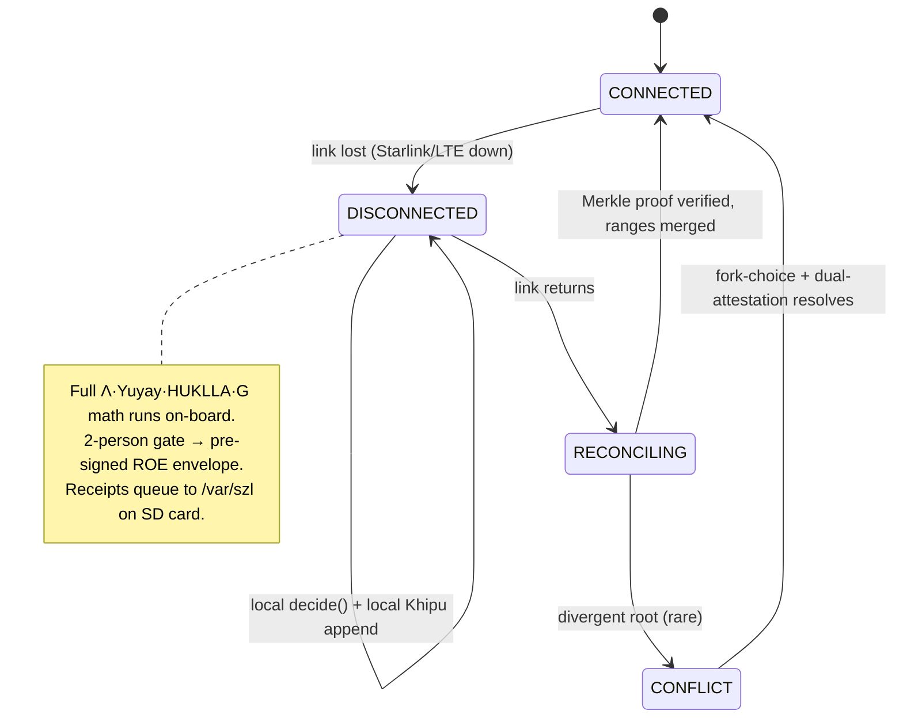
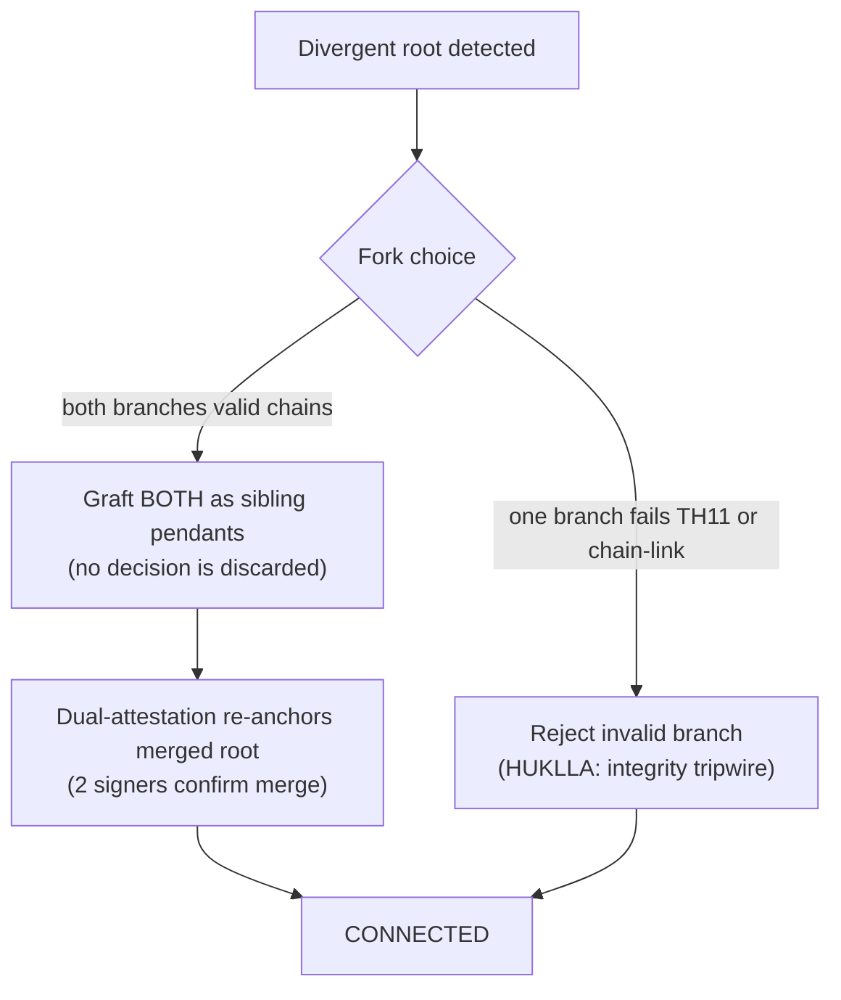

# DISCONNECTED_OPS_PROTOCOL — edge survival when Starlink/LTE is lost

**Layer:** PURIQ v12 → `killinchu/architecture/`
**Author:** Yachay, under CTO authority · 2026-06-01
**HARD RULE:** Edge mode is a **1st-class concern** — never assume cloud connectivity.

**Scenario:** A Killinchu drone loses Starlink/LTE in adversary territory. The embedded
anatomy keeps making `Λ · Yuyay₁₃ · e^{-β·HUKLLA} · G` decisions **locally**. The Khipu
chain queues to the **local SD card**. On reconnect, the local chain **reconciles** with
the cloud canonical Khipu DAG via **Merkle proof of inclusion**.

**Pattern references (content-addressed sync):**
- **IPFS** — content addressing: a block's CID *is* the hash of its content, so a leaf is
  self-verifying ([IPFS docs, content addressing](https://docs.ipfs.tech/concepts/content-addressing/)).
- **Filecoin / IPLD** — Merkle-DAG data model with verifiable links between content-addressed
  nodes ([IPLD spec](https://ipld.io/docs/)).
- **Hypercore** — append-only, signed log with Merkle-tree integrity and efficient
  replication of *only the missing range* ([Hypercore protocol](https://docs.holepunch.to/building-blocks/hypercore)).

Our local Khipu chain is exactly this shape: an **append-only, content-addressed,
Merkle-rooted log** that replicates the missing range on reconnect.

---

## 1 — State machine



---

## 2 — While disconnected: local decision + local Khipu

Nothing about `puriq.decide` changes — every organ is vendored (squash-fs), so
`Λ(x)·Yuyay₁₃(a)·e^{-β·HUKLLA(a)}·G(a)·∏Khipu_i(a)` computes on-board with **no network**.

Two things change:
1. **Candidate generation degrades** from a11oy `/v1/router` (unreachable) to **local
   heuristic templates** (`szl-rosie-companion.propose`). The math is identical; the
   menu of candidate actions is smaller and locally generated. The receipt records
   `candidate_source: "edge-heuristic"` (honest).
2. **2-person gate → pre-signed ROE envelope.** State-changing ops still require
   authorization (HARD RULE), but there is no second human reachable. The drone carries a
   **pre-signed Rules-of-Engagement envelope**, signed by **both** signers *before launch*,
   scoped to the mission.

```python
# szl_killinchu/roe.py  — pre-signed Rules-of-Engagement
@dataclass(frozen=True)
class ROE:
    mission_id: str
    allowed_actions: frozenset[str]    # e.g. {"rtl","hold","orbit_shift<=50m","abort"}
    geofence: "Polytope"               # the same 𝒮_safe used by G(a)
    expiry: str                        # ROE is time-boxed
    signer_a: str; signer_b: str       # two distinct signers (the 2-person gate, pre-applied)
    sig_a: str; sig_b: str             # DSSE PLACEHOLDER until Sigstore (honest)
    def authorizes(self, a: "Action") -> bool:
        return (a.kind in self.allowed_actions
                and self.geofence.contains(a.pose)
                and not self._expired())
```

The ROE is the *offline embodiment* of the 2-person Yuyay gate: two humans authorized a
**bounded envelope** of actions in advance; the drone may act only inside it. Anything
outside the envelope is refused, even at the edge — the drone holds or RTLs instead.

---

## 3 — Local Khipu chain on the SD card (content-addressed)

```
/var/szl/khipu/
├── chain.sqlite           # index: (seq, leaf_cid, prev_root, root, ts)
├── leaves/                # one file per receipt, NAMED BY ITS CID (content address)
│   ├── bafy...a1.json     # leaf CID = sha256(canonical-json(receipt))
│   └── bafy...b2.json
└── HEAD                    # current local Merkle root
```

- Each receipt leaf is **content-addressed** (filename = its hash) — self-verifying, IPFS-style.
- `root = H(prev_root ‖ leaf)` (the YAWAR chain-link, SF-03) advances per append.
- The chain is **append-only**; the squash-fs anatomy is read-only, so a compromised drone
  cannot rewrite history — only append (and any forged append breaks the next reconcile's
  Merkle proof).

---

## 4 — On reconnect: reconciliation by Merkle proof of inclusion

```mermaid
sequenceDiagram
  autonumber
  participant D as Drone (local chain)
  participant C as Cloud canonical Khipu DAG (a11oy)
  Note over D,C: link returns
  D->>C: HELLO {last_synced_root R0, current local HEAD R_local, seq range}
  C->>C: locate R0 in canonical DAG (the fork point)
  C-->>D: {canonical HEAD R_cloud, missing-range request}
  D->>C: send leaves [R0 .. R_local] (only the missing range — Hypercore-style)
  C->>C: for each leaf: verify root' = H(root ‖ leaf) chain-links (SF-03)
  C->>C: verify summation invariant TH11 holds across merged range
  C->>C: graft drone range under the `killinchu` pendant; recompute root
  C-->>D: Merkle PROOF OF INCLUSION {path from each drone leaf → new canonical root}
  D->>D: verify proof; set last_synced_root = R_cloud'; mark CONNECTED
```

**Merkle proof of inclusion** (the core sync primitive):
```python
def verify_inclusion(leaf_cid: str, proof: list[tuple[str,str]], root: str) -> bool:
    """proof = sibling path [(side, sibling_hash), ...] from leaf to root.
    Returns True iff recomputing up the path reaches `root` (Filecoin/IPLD style)."""
    h = leaf_cid
    for side, sib in proof:
        h = sha256((h + sib).encode()).hexdigest() if side == "R" \
            else sha256((sib + h).encode()).hexdigest()
    return h == root
```

After reconcile, the drone's offline decisions are **provably included** in the one
canonical DAG. The audit URL (`GREENE_FACING_AUDIT_URL.md`) can then render the *complete*
mission — including the disconnected stretch — with every decision's Khipu receipt.

---

## 5 — Conflict handling (divergent root — rare)

If the canonical DAG advanced the `killinchu` pendant *for the same drone* while it was
offline (should not happen for a single bird, but possible with re-tasking):



- **No silent loss:** both valid branches are grafted as sibling pendants; the summation
  invariant is recomputed over the union. Nothing a drone lawfully decided is discarded.
- **Invalid branch** (broken chain-link or TH11 failure) trips a HUKLLA integrity tripwire
  and is rejected — that branch's receipts get `Khipu_i=0`, so they could never have been
  selected anyway (**INV-3**).
- The merge itself is a **state-changing op** ⇒ dual-attestation (2 signers) re-anchors the
  merged root.

---

## 6 — What survives disconnection (the guarantee table)

| Capability | Connected | Disconnected (edge) |
|---|---|---|
| `Λ·Yuyay·HUKLLA·G·Khipu` decision | ✓ | ✓ (vendored organs) |
| Candidate generation | a11oy `/v1/router` (frontier) | local heuristic templates |
| 2-person Yuyay gate | live, 2 humans | pre-signed ROE envelope |
| Khipu receipt per action | → canonical DAG | → local SD chain (queued) |
| RTL safety reflex | ✓ | ✓ (always in ROE) |
| Swarm consensus | ✓ | ✓ drone-to-drone (no cloud — see SWARM doc) |
| Frontier-LLM mission compose | ✓ (T4) | ✗ (degraded — honest) |

---

## 7 — Honest labels
- ROE signatures are **DSSE PLACEHOLDER** until Sigstore lands (v11 §9); the ROE
  authorizes by **hash-bound envelope**, not yet by verified signature.
- Reconcile verifies the **hash chain + summation invariant TH11**, not signatures yet.
- Offline candidate generation is **local heuristics**, explicitly recorded in the receipt
  (`candidate_source: edge-heuristic`) — we do not claim frontier reasoning at the edge.
- Content-addressing follows IPFS/IPLD/Hypercore *patterns*; we do not embed those stacks —
  we implement the same Merkle-DAG + missing-range-replication shape in `szl-khipu`.

— Yachay, 2026-06-01. Edge is first-class. Local decide, queued Khipu, Merkle reconcile.
