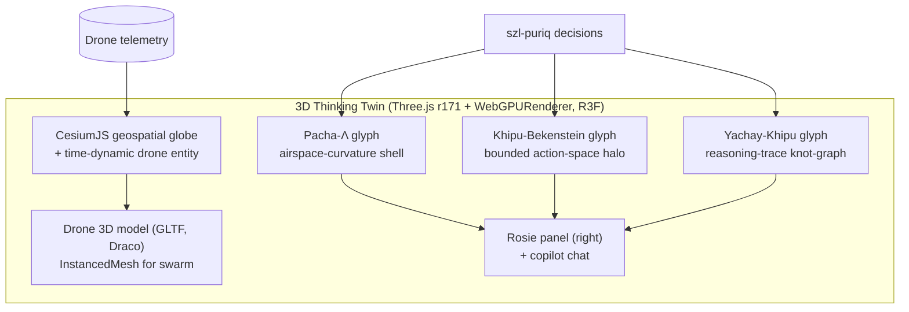
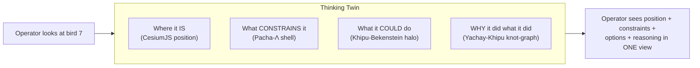

# FRONTIER_GLYPHS_IN_TWIN — the 3D drone twin becomes a *thinking* twin

**Layer:** PURIQ v12 → `killinchu/architecture/`
**Author:** Yachay, under CTO authority · 2026-06-01
**References:** `270_FRONTIER_CORPUS_DEEP_SCRAPE.md` (the three constructs, §6);
`450_3D_LEADERS_ADOPTION.md` (WebGPU/Three.js r171, CesiumJS, Deck.gl, Anduril Lattice
pattern, `3d-force-graph` for brain-jack mesh).

**Goal:** integrate Rosie's **three frontier glyphs** into the 3D drone twin so the twin
doesn't just *render position* — it *renders the drone's reasoning*. The three glyphs:

1. **Pacha-Λ** (*pacha* = time/space/world) — temporal-axis Λ; shows **airspace curvature
   constraints** around the drone.
2. **Khipu-Bekenstein** — entropy/bandwidth cap on receipt-DAG growth; **bounds the action
   space** displayed (`|𝒜| ≤ N_Bek`).
3. **Yachay-Khipu Operator** (*yachay* = knowledge) — knot-summation retrieval invariant;
   shows the **reasoning trace**.

These come from `270_FRONTIER_CORPUS` §6, sourced to Bekenstein (Phys. Rev. D 23, 287,
1981), Witten (Comm. Math. Phys. 121, 351, 1989), Reidemeister (1927), and the Inka khipu
summation structure (Urton 2003).

---

## 1 — The thinking-twin scene graph



**Stack choices (from `450_3D_LEADERS_ADOPTION.md`):**
- **WebGPURenderer** (Three.js r171, `import { WebGPURenderer } from 'three/webgpu'`,
  auto-fallback to WebGL2) — WebGPU is Baseline in all browsers as of Jan 2026.
- **CesiumJS** globe + time-dynamic entity tracking for geospatial drone position
  (the drone-tracking winner stack).
- **Deck.gl** `ScatterplotLayer`/`ArcLayer` for FAA/telemetry overlays.
- **`3d-force-graph`** (vasturiano) for the Yachay-Khipu reasoning-trace knot-graph (the
  brain-jack mesh, 5-line integration).
- **Anduril Lattice** "single unified operational picture" UX pattern — fuse all sensors
  into one 3D model.

---

## 2 — Glyph 1: Pacha-Λ — airspace curvature constraints

**What it shows:** a translucent shell around the drone whose *curvature* encodes the
temporal-axis Λ trust field — i.e. where the airspace is "easy" (high Λ: clear, in
geofence, low risk) vs "curved/constrained" (low Λ: near geofence edge, wind shear,
threat proximity). Pacha-Λ is the *spacetime* Λ: it evolves over the mission horizon, so
the shell deforms as predicted constraints approach.

```python
# the field driving the glyph (derived from szl-lambda over a spatial-temporal lattice)
def pacha_lambda_field(drone_pose, horizon_s, lattice) -> ScalarField:
    """Λ evaluated over a space×time lattice around the drone.
    Low Λ ⇒ high 'curvature' ⇒ constrained airspace (geofence/wind/threat)."""
    field = {}
    for cell in lattice.cells(drone_pose, horizon_s):
        x = context_axes_at(cell)                  # geofence margin, wind, threat, energy...
        field[cell] = szl_lambda.aggregate(x.axes, x.weights)   # Λ ∈ [0,1]
    return ScalarField(field)   # rendered as a deformed iso-surface shell
```

```tsx
// PachaLambdaShell.tsx — curvature shell (TSL shader, WebGPU)
function PachaLambdaShell({ field }: { field: ScalarField }) {
  // iso-surface; mesh displacement ∝ (1 - Λ): low Λ pushes the shell inward (constraint)
  const geom = useIsoSurface(field, { displace: (lambda) => 1 - lambda });
  return <mesh geometry={geom}>
    <meshTransmissionMaterial transmission={0.9} thickness={0.4}
      color="#4dd0e1" /* curvature = constraint, cyan deepens where Λ low */ />
  </mesh>;
}
```

Source framing: Pacha-Λ as temporal/retrocausal Λ (`270_FRONTIER_CORPUS` §6); the AdS/CFT
"boundary encodes bulk" analogy motivates the shell-as-constraint-boundary visual.

---

## 3 — Glyph 2: Khipu-Bekenstein — bounded action-space halo

**What it shows:** a halo of discrete "action markers" around the drone — exactly the
candidate actions `a ∈ 𝒜` currently under consideration. The **count is capped** by the
Khipu-Bekenstein bound `|𝒜| ≤ N_Bek(x)` (INV-4): the halo physically *cannot* show more
markers than the information budget allows. As the context budget shrinks (e.g. low
bandwidth, low energy), the halo visibly contracts — the drone has fewer options.

```python
def khipu_bekenstein_actions(x: Context, candidates: list[Action]) -> list[Action]:
    """Cap displayed action space at the Bekenstein bound (entropy cap on DAG growth)."""
    N_bek = szl_killinchu.bekenstein_N(x)         # S/E ≤ 2πR/ℏc analogue → integer cap
    assert len(candidates) <= N_bek               # INV-4 enforced
    return candidates[:N_bek]
```

```tsx
// BekensteinHalo.tsx — one marker per candidate action; count is HARD-capped
function BekensteinHalo({ actions, nBek }: { actions: Action[]; nBek: number }) {
  return <group>
    {actions.slice(0, nBek).map((a, i) => (
      <ActionMarker key={a.id} angle={(i / nBek) * 2 * Math.PI}
        selected={a.selected}            // the argmax glows
        utility={a.U}                    // size ∝ U(a|x)
        gated={a.yuyay13 === 0}          // greyed-out if Yuyay-gated to zero
      />
    ))}
    <RingLabel text={`𝒜 ≤ N_Bek = ${nBek}`} />
  </group>;
}
```

Source: Bekenstein bound (Phys. Rev. D 23, 287, 1981); recent rigor via Casini relative-
entropy proof (arXiv:0804.2182). The halo makes INV-4 *visible*: agency cannot enumerate
an unbounded physical action space.

---

## 4 — Glyph 3: Yachay-Khipu Operator — reasoning trace knot-graph

**What it shows:** the drone's recent reasoning as a **knot-summation graph** — each node
is a `puriq.decide` decision (a Khipu leaf), edges are the chain-links, and the layout is
a Reidemeister-stable knot diagram whose **summation invariant** (top-cord = Σ pendants)
must hold (TH11). The operator literally sees the chain of reasoning that led to the
current state, with the selected (argmax) path highlighted.

```tsx
// YachayKhipuGraph.tsx — brain-jack mesh via 3d-force-graph (vasturiano)
import ForceGraph3D from "3d-force-graph";
function YachayKhipuGraph({ trace }: { trace: TraceEntry[] }) {
  const graph = useMemo(() => ({
    nodes: trace.map(t => ({ id: t.receipt_hash, U: t.U, selected: t.selected,
                             gated: t.yuyay13 === 0, hukulla: t.hukulla })),
    links: trace.slice(1).map((t, i) => ({ source: trace[i].receipt_hash,
                                           target: t.receipt_hash })),  // Khipu chain-link
  }), [trace]);
  // node color: selected=gold, gated=grey, tripwire(hukulla>0)=red; size ∝ U
  return <ForceGraph3DCanvas graph={graph}
           nodeColor={n => n.hukulla > 0 ? "#e53935" : n.gated ? "#9e9e9e"
                          : n.selected ? "#ffd54f" : "#4dd0e1"} />;
}
```

The graph is exactly the per-drone `reasoning_trace` ring buffer from
`ROSIE_COMPANION_IN_KILLINCHU.md` §3. Source framing: Witten (knot invariants from
Chern–Simons, 1989), Reidemeister moves (1927), khipu summation (Urton 2003) —
`270_FRONTIER_CORPUS` §6 Yachay-Khipu operator.

---

## 5 — Putting it together: the thinking twin



| Glyph | Question answered | Backing math | INV |
|---|---|---|---|
| Pacha-Λ shell | "What constrains the drone?" | `Λ(x)` over space×time lattice | INV-2 (Λ-monotone) |
| Khipu-Bekenstein halo | "What can it do right now?" | `|𝒜| ≤ N_Bek(x)` | INV-4 (bounded 𝒜) |
| Yachay-Khipu graph | "Why did it do that?" | Khipu chain + TH11 summation | INV-3 (chain integrity) |

This is the difference between a position display and a *thinking* twin: the operator sees
**position + constraints + options + reasoning** in one fused Anduril-Lattice-style picture.

---

## 6 — Performance + edge notes
- **WebGPURenderer** (r171) with auto WebGL2 fallback; TSL shaders compile to WGSL/GLSL.
- **InstancedMesh/BatchedMesh** keep the swarm under ~50 draw calls (mobile-class GPUs).
- **On-demand rendering** (`frameloop="demand"`) when the twin is static.
- **Edge:** glyphs render from the **local** `reasoning_trace` + local `puriq` field — no
  cloud needed. The twin is a PWA with cached assets, so it works on a disconnected GCS.

---

## 7 — Honest labels
- The three glyphs are **visualizations of existing PURIQ quantities** (`Λ`, `N_Bek`,
  Khipu trace) — they introduce **no new governance math**. Pacha-Λ's "retrocausal/temporal"
  framing is a *rendering metaphor* over the standard `Λ` lattice, not a physics claim.
- Bekenstein/Witten/Reidemeister are cited as **mathematical sources for the construct
  shape**, not as proven properties of the running system (the relevant Lean obligations
  remain `sorry`-tagged).
- Glyph data reconciles to the canonical Khipu DAG; offline it renders from local receipts.

— Yachay, 2026-06-01. The twin thinks. Three glyphs, three questions, one picture. Edge-OK.
