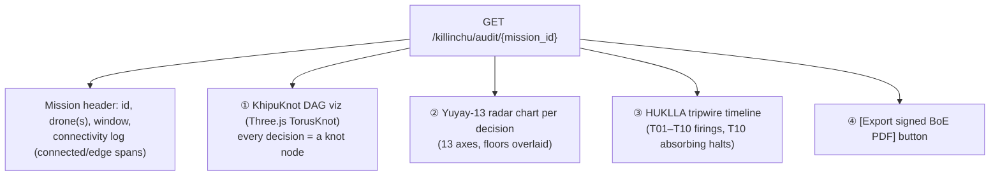
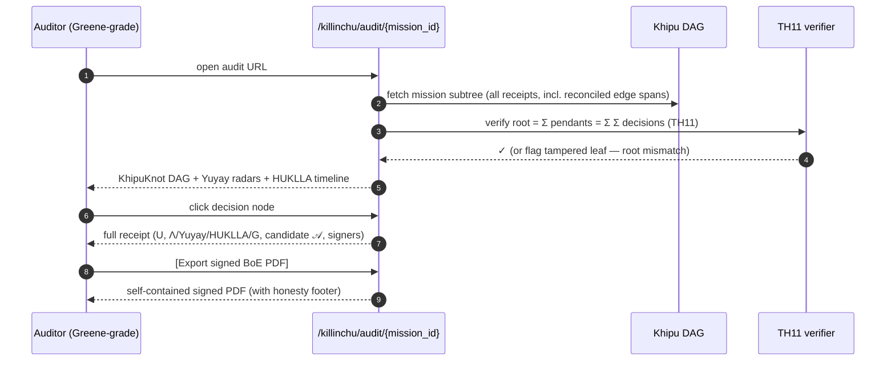

# GREENE_FACING_AUDIT_URL — the `/killinchu/audit/{mission_id}` Series-A demo trick

**Layer:** PURIQ v12 → `killinchu/architecture/`
**Author:** Yachay, under CTO authority · 2026-06-01
**References:** `450_3D_LEADERS_ADOPTION.md` recipe #8 (KhipuKnot Three.js
`TorusKnotGeometry` viz, `rosie-3d/src/components/KhipuKnot.jsx`); `rosie/src/khipu-receipt.ts`
(3-tier DAG + DualAttestation); Doctrine v12 (Yuyay-13, HUKLLA tripwires).

**The trick:** a single URL — `/killinchu/audit/{mission_id}` — renders the **entire
mission as an auditable artifact**: the full Khipu DAG (as an interactive KhipuKnot
Three.js viz), Yuyay scores per decision (radar chart), the HUKLLA tripwire log
(timeline), and a one-click **signed Burden-of-Evidence (BoE) PDF export**. This is the
Andrew-Greene-grade tradecraft auditability that closes a Series-A defense demo: *every
decision the drone made is reconstructable and provable from receipts.*

---

## 1 — Page layout



---

## 2 — Component ① — Khipu DAG as KhipuKnot (Three.js)

The mission's Khipu DAG renders as the **KhipuKnot** viz (recipe #8): each governance
decision is a node on a `TorusKnotGeometry`-styled knot; chain-links are the cords; the
3-tier structure (decision → organ pendant → root) is laid out as nested knots. The
summation invariant (`root = Σ pendants = Σ Σ decisions`, TH11) is shown as a live
checksum that turns **green** when it balances.

```tsx
// killinchu/audit/KhipuKnotDAG.tsx
function KhipuKnotDAG({ dag }: { dag: KhipuDag }) {
  // each decision leaf is a knot node; selected (argmax) path glows gold
  return <Canvas frameloop="demand">
    {dag.pendants.map(p => (
      <OrganPendant key={p.organId} pendant={p}>
        {p.decisions.map(d => (
          <KnotNode key={d.hash} value={d.value} selected={d.selected}
            hukulla={d.hukulla} color={d.hukulla > 0 ? "#e53935"
                                       : d.selected ? "#ffd54f" : "#4dd0e1"} />
        ))}
      </OrganPendant>
    ))}
    <SummationBadge ok={verifySumInvariant(dag)} /> {/* TH11 live check */}
  </Canvas>;
}
```

Clicking any knot node opens that decision's full receipt: `U(a|x)`, the Λ/Yuyay/HUKLLA/G
breakdown, the parent chain-link, the candidate set `𝒜`, and the signers (dual-attestation).

---

## 3 — Component ② — Yuyay-13 radar chart per decision

Each decision gets a **13-axis radar chart** with the floors overlaid (2 sacred at 0.95, 7
structural at 0.90, 4 introspection). The shape makes it instantly obvious whether a
decision *cleared the gate* (all spokes outside the floor ring) or *was gated to zero* (any
spoke inside its floor ⇒ `Yuyay₁₃=0`).

```tsx
// killinchu/audit/YuyayRadar.tsx
function YuyayRadar({ decision }: { decision: DecisionReceipt }) {
  const axes = decision.yuyay_axes;           // 13 values
  const floors = [0.95,0.95, 0.90,0.90,0.90,0.90,0.90,0.90,0.90, 0.90,0.90,0.90,0.90];
  return <RadarChart
    series={[{ name: "score", data: axes }, { name: "floor", data: floors, dashed: true }]}
    highlight={(i) => axes[i] < floors[i] ? "fail" : "pass"}
    caption={`Yuyay₁₃ = ${decision.yuyay13}  (replay-hash bacf5443…631fc5)`} />;
}
```

The replay-hash anchor is shown so an auditor can confirm the gate is the LOCKED
`yuyay_v3` (Doctrine v12 §6).

---

## 4 — Component ③ — HUKLLA tripwire timeline

A horizontal timeline of the mission with **tripwire firings** marked: which of T01–T10
fired, when, on which decision, and whether it was the absorbing **T10 (STOP/undo/revert)**
halt. A clean mission shows an empty timeline (the strongest possible audit result).

```tsx
// killinchu/audit/HuklaTimeline.tsx
function HuklaTimeline({ events }: { events: TripwireEvent[] }) {
  return <Timeline>
    {events.map(e => (
      <Mark key={e.ts} at={e.ts} severity={e.tripwire === "T10" ? "halt" : "warn"}
        label={`${e.tripwire} fired — ${e.reason}`}
        receipt={e.receipt_hash} />   // links into the KhipuKnot node
    ))}
    {events.length === 0 && <Empty>No tripwires fired — clean mission.</Empty>}
  </Timeline>;
}
```

---

## 5 — Component ④ — signed Burden-of-Evidence PDF export

One button exports the entire mission as a **signed BoE PDF**: a self-contained document an
auditor (or a court) can read offline. It contains the DAG (rendered), per-decision Yuyay
radars, the HUKLLA log, the connectivity log (which spans were edge-disconnected), and the
Merkle root + dual-attestation block.

```python
# killinchu/api/audit.py
@router.get("/killinchu/audit/{mission_id}/boe.pdf")
def export_boe(mission_id: str):
    dag = khipu_dag.mission_subtree(mission_id)        # all receipts for this mission
    assert verify_sum_invariant(dag)                   # TH11 must hold to export
    pdf = build_boe_pdf(
        header=mission_header(mission_id),
        dag_render=render_khipuknot_static(dag),       # static frame of the knot viz
        yuyay_radars=[radar(d) for d in dag.decisions],
        hukla_log=tripwire_events(mission_id),
        connectivity=connectivity_spans(mission_id),   # honest: edge vs connected
        merkle_root=dag.root,
        attestation=dag.dual_attestation,              # 2 signers (DSSE PLACEHOLDER)
    )
    return SignedPDF(pdf, footer=("Khipu signature: DSSE PLACEHOLDER — "
                                  "verifies hash chain + TH11, not signature (v11 §9). "
                                  "SLSA L1 (honest)."))
```

The PDF is built with the `office/pdf` skill discipline; **honesty footer is mandatory** —
it states exactly what the signature does and does not prove (hash chain + summation
invariant, **not** a Sigstore signature, until that CI lands).

---

## 6 — The end-to-end audit sequence



---

## 7 — Why this is the Series-A trick (Greene-facing)

- **Every decision is reconstructable.** An auditor doesn't take our word — they replay the
  receipts. The DAG *is* the evidence.
- **Tamper-evident by arithmetic.** TH11 summation means changing any leaf changes the root
  boundary sum — detected without relying on hash-collision resistance alone.
- **Edge spans are visible and reconciled.** The connectivity log shows exactly when the
  drone was disconnected; those decisions are present and Merkle-proven-included.
- **Honest by construction.** The BoE footer states the signature's true status. No
  overclaim — which is itself the credibility signal a defense auditor respects.

---

## 8 — Honest labels
- The Khipu **signature** is **DSSE PLACEHOLDER**; the audit verifies the **hash chain +
  TH11 summation invariant**, not a Sigstore signature, until CI lands (v11 §9).
- SLSA remains **L1 (honest)**; the BoE PDF says so. "SLSA L3" / "fully verified" are BANNED.
- The KhipuKnot viz is a *rendering* of the real DAG; the topology animation is aesthetic
  and does not alter the underlying receipts.
- TH11 is the runtime counterpart of `Lutar/Khipu/SummationInvariant.lean` — the Lean
  obligation status is carried honestly (the runtime check is exact integer arithmetic).

— Yachay, 2026-06-01. One URL, whole mission, provable. Greene-grade. Honest footer.
