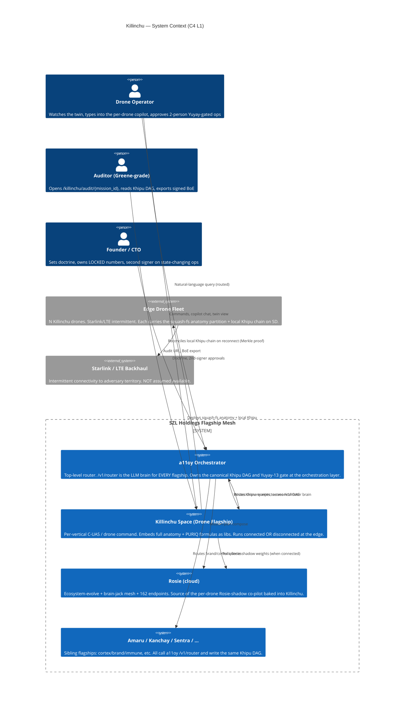
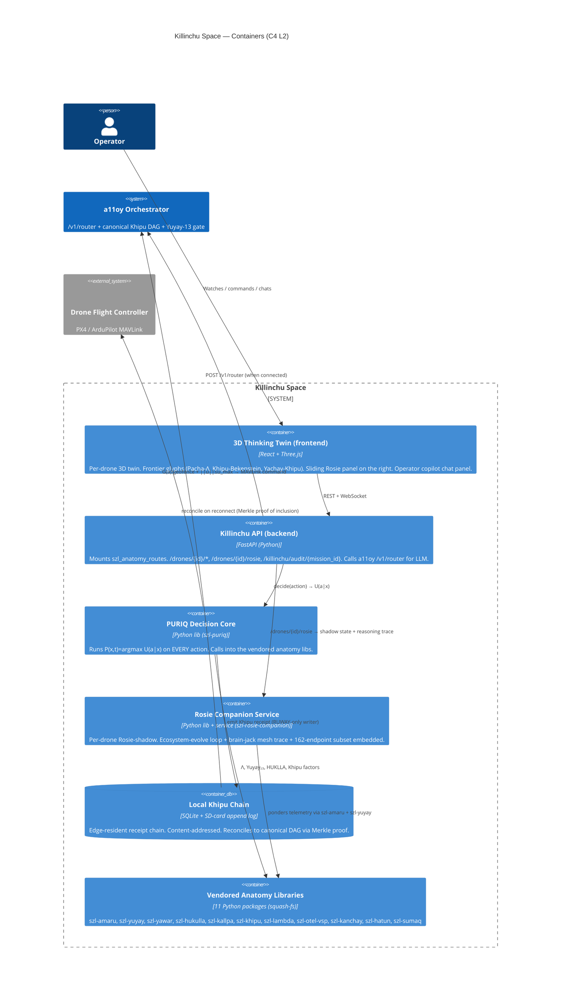
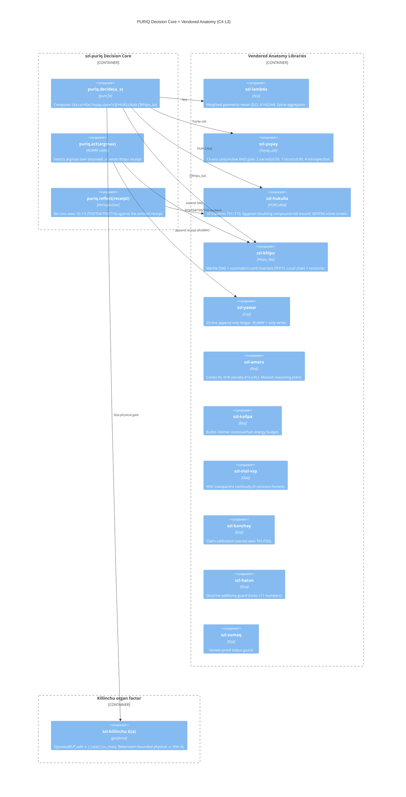
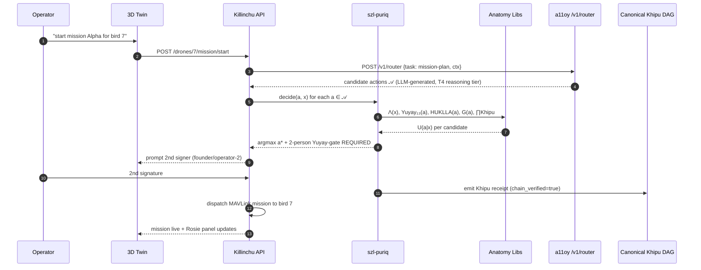
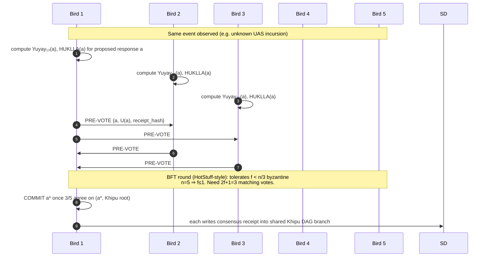
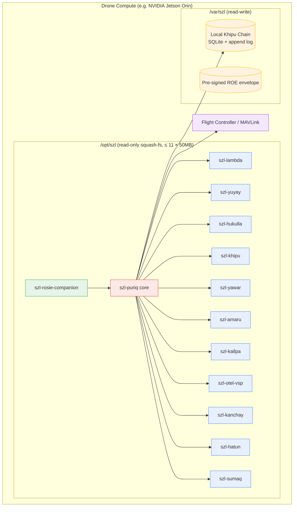

# KILLINCHU — Full-Stack Architecture (C4: Context → Container → Component)

**Layer:** PURIQ v12 integration → `killinchu/`
**Author:** Yachay (Killinchu-support architecture agent), under CTO authority
**Date:** 2026-06-01
**Founder directive (2026-06-01 ~02:05 EDT):** "Fully bake our anatomy into drone flag,
all of our formulas, everything a11oy has in the brain put in the drone flag, but have it
Rosie fully baked in and a11oy can orchestrate."

**Status discipline (Doctrine v12 / v11 LOCKED):** this is an *architecture spec + patch
file* deliverable. Nothing here is "shipped" or "verified". The PURIQ master operator
`P(x,t)` carries its four invariants as **`sorry`-tagged Lean obligations**
(`puriq/formulas/PuriqLean.lean`); we do **not** claim them proven. v11 LOCKED numbers
(749 declarations / 14 unique axioms / 163 sorries / 13-axis `yuyay_v3`, replay-hash
`bacf5443…631fc5`) are preserved verbatim. SLSA remains **L1 (honest)**; the Khipu
signature is **DSSE PLACEHOLDER** until Sigstore lands.

---

## 0 — The one-sentence shape

> **a11oy orchestrates** (top); the **Killinchu Space** is the per-vertical drone
> flagship (center); the **entire SZL anatomy + every PURIQ formula** are *vendored as
> Python libraries* inside Killinchu so it runs **disconnected at the edge**; **Rosie is
> baked in as a co-pilot service** (`szl-rosie-companion`); and **`P(x,t)` runs on every
> action**, each action emitting a **Khipu receipt** that reconciles into the one
> canonical Khipu DAG on reconnect.

The design's load-bearing claim is **edge-survivability**: the same governance math
(`Λ · Yuyay₁₃ · e^{-β·HUKLLA} · ∏Khipu`) executes locally on the drone with **no cloud
dependency**, then reconciles by Merkle proof when a link returns. Cloud is an
*optimisation*, never a *requirement*.

---

## 1 — C4 Level 1: SYSTEM CONTEXT

Who/what touches the Killinchu system.



**Key context facts:**
- a11oy is the *only* LLM brain. Every flagship — including Killinchu — calls
  `POST /v1/router` (the 7-tier open-LLM router, `puriq/llms/A11OY_CODE_ROUTER_SPEC.md`).
- The **edge fleet** is a first-class actor, not a degraded mode. The Starlink/LTE link
  is drawn as *external and intermittent* deliberately.
- There is **one canonical Khipu DAG**. Killinchu (cloud) and every sibling write to it;
  edge drones queue locally and reconcile.

---

## 2 — C4 Level 2: CONTAINER (inside the Killinchu Space)



**Container responsibilities (one line each):**

| Container | Job | Edge-survivable? |
|---|---|---|
| 3D Thinking Twin | Render twin + glyphs + Rosie panel + copilot chat | Yes (PWA, cached) |
| Killinchu API | Route ops; expose endpoints; call a11oy when up | Yes (degrades to local) |
| PURIQ Decision Core | `P(x,t)` on every action | **Yes — runs fully local** |
| Rosie Companion | Per-drone shadow ponder/evolve | Yes (embedded subset) |
| Local Khipu Chain | Queue receipts on SD, reconcile later | **Yes — by design** |
| Vendored Anatomy Libs | All 11 organs as importable Python | **Yes — squash-fs partition** |

---

## 3 — C4 Level 3: COMPONENT (the PURIQ Decision Core + anatomy organs)



**The U(a|x) call graph (the heart of the system):**

```
puriq.decide(a, x):
    L  = szl_lambda.aggregate(x.axes, x.weights)        # Λ(x)  ∈ [0,1]
    Y  = szl_yuyay.score13(a)                           # Yuyay₁₃(a) ∈ {0}∪(0,1]
    H  = szl_hukulla.tripwire_count(a)                  # HUKLLA(a) ∈ ℕ (T01–T10)
    K  = prod(szl_khipu.verify_i(a) for i in chain)     # ∏Khipu_i(a) ∈ {0,1}
    G  = szl_killinchu.geofence_ok(a)                   # G(a) physical ∈ {0,1}
    # organ-specific factor for the acting organ (e.g. Amaru R(a), Kallpa B(a)) folds in:
    F  = organ_factor(a)                                # ∈ (0,1] or {0,1}
    return L * Y * math.exp(-BETA * H) * K * G * F      # U(a|x) ≥ 0
```

`puriq.act` then takes `argmax_{a∈𝒜} U(a|x)` over the **Bekenstein-bounded** action set
and emits a Khipu receipt through RUWAY (the *only* authorized ledger writer, v11 §4).

---

## 4 — DATA FLOW (a): CONNECTED OPS — full a11oy round-trip



Connected mode adds: (i) a11oy generates richer candidate actions via the right LLM tier,
(ii) the receipt goes straight to the canonical DAG, (iii) the Rosie cloud shadow weights
are fresh.

---

## 5 — DATA FLOW (b): DISCONNECTED EDGE OPS — local anatomy + queued Khipu

```mermaid
sequenceDiagram
  autonumber
  participant DRONE as Bird 7 (edge, no Starlink)
  participant LPUR as Local szl-puriq (squash-fs)
  participant LORG as Local Anatomy Libs
  participant SD as Local Khipu Chain (SD card)
  participant FC as Flight Controller

  Note over DRONE: Starlink/LTE LOST in adversary territory
  DRONE->>LPUR: telemetry event (threat detected)
  LPUR->>LORG: Λ(x), Yuyay₁₃(a), HUKLLA(a), G(a) — ALL LOCAL
  LORG-->>LPUR: U(a|x) computed on-board (no cloud)
  LPUR->>LPUR: argmax a* over geofenced 𝒜
  Note over LPUR: 2-person gate degrades to pre-authorized<br/>mission ROE envelope (signed before launch)
  LPUR->>SD: append Khipu receipt (content-addressed, queued)
  LPUR->>FC: G(a)-gated MAVLink command (e.g. RTL / hold)
  Note over SD: chain grows locally; root advances
  Note over DRONE: ... link returns ...
  DRONE->>DRONE: trigger reconcile (see DISCONNECTED_OPS_PROTOCOL.md)
```

**The disconnected guarantee:** every factor of `U(a|x)` is computable on-board because
all 11 organs are vendored. The only thing that changes offline is **the 2-person gate
falls back to a pre-signed Rules-of-Engagement (ROE) envelope** (signed by both signers
*before launch*, scoped to the mission) — so the "2-person Yuyay-gate for state-changing
ops" HARD RULE is honored even with no link. See `DISCONNECTED_OPS_PROTOCOL.md`.

---

## 6 — DATA FLOW (c): SWARM CONSENSUS — 5 Killinchus voting via Yuyay-13 + Khipu DAG



Each drone independently runs the *wise-reasoning* gate (`Yuyay₁₃`) — so consensus is not
just "majority of votes" but "majority of votes **that each independently cleared the
13-axis gate and have HUKLLA(a)=0**". This is the novel piece: collective wise reasoning,
not bare leader-election. The BFT primitive is HotStuff-style; full protocol in
`SWARM_CONSENSUS_PROTOCOL.md`.

---

## 7 — Deployment view (squash-fs partition on the drone)



The anatomy is **read-only** (squash-fs) so a compromised drone cannot rewrite its own
governance math; only `/var/szl` (the local Khipu chain + the pre-signed ROE) is writable.

---

## 8 — Invariant traceability (this architecture ⇄ PURIQ INV-1..4)

| Architecture element | Preserves | How |
|---|---|---|
| `e^{-β·HUKLLA(a)}` in `decide`, β≫0 | **INV-1 halting safety** | tripwire ⇒ utility→0; T10 absorbing |
| `Λ(x)` weighted geo-mean (szl-lambda) | **INV-2 Λ-monotonicity** | A1 `IsMonotone` preserved |
| `∏Khipu_i(a)` + RUWAY-only write | **INV-3 chain integrity** | one broken receipt ⇒ U=0 |
| `G(a)` geofence (szl-killinchu) | **INV-4 Bekenstein bound** | physical 𝒜 finite, geofenced |
| 2-person gate / pre-signed ROE | HARD RULE | state-changing op needs 2 signers |
| Read-only squash-fs anatomy | Tamper resistance | governance math immutable on edge |

---

## 9 — What is NOT claimed (honesty, v11 §9 carried)

- The four PURIQ invariants are **open `sorry`-tagged Lean obligations**, not theorems.
- Λ-uniqueness is **Conjecture 1**, not a theorem (open CAUCHY_ND sorry).
- Khipu signature is **DSSE PLACEHOLDER**; `Khipu_i(a)` verifies the **hash chain**, not
  the signature, until Sigstore CI lands.
- W3C `traceparent` is **in-process only** — cross-mesh trace (Wire D) NOT IMPLEMENTED.
- SLSA remains **L1 (honest)**. "SLSA L3" / "zero sorry" / "fully verified" are BANNED.
- This is a **spec + patches** deliverable. **No push to HF/GitHub.** The Killinchu build
  agent (`opus_killinchu_drone_flagship_build_mpus8anv`) integrates after.

— Yachay, 2026-06-01. Additive over Doctrine v11 LOCKED. No mysticism. Edge-survivable.
