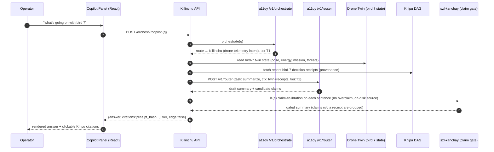

# OPERATOR_COPILOT_UX — per-drone operator chat panel

**Layer:** PURIQ v12 → `killinchu/architecture/`
**Author:** Yachay, under CTO authority · 2026-06-01

**Flow:** operator types *"what's going on with bird 7"* → `a11oy.code` routes to the right
model → queries the drone twin → summarizes **with citations from the Khipu DAG**. Every
claim the copilot makes is backed by a receipt; nothing is asserted without provenance
(the Kanchay `K(a)` claim-calibration gate, SF-09).

---

## 1 — Sequence (mermaid)



**Key UX rules:**
- The copilot **reads**; it does **not** actuate. Any state-changing suggestion routes
  through the Rosie panel's 2-person Yuyay gate (`ROSIE_COMPANION_IN_KILLINCHU.md` §5).
- Every sentence in the answer carries a **Khipu citation** (receipt hash → audit URL).
  A sentence the model wants to say but cannot cite is **dropped by `szl-kanchay`** (SF-09)
  — no overclaim ("bird 7 is 100% safe") can render.
- The chosen LLM **tier is shown** to the operator (T1 for status, T4 for "should I…?"
  reasoning). On the edge, the panel shows `edge: true` and uses the local summarizer.

---

## 2 — React component sketch (`CopilotPanel.tsx`)

```tsx
function CopilotPanel({ droneId }: { droneId: number }) {
  const [msgs, setMsgs] = useState<Msg[]>([]);
  const [q, setQ] = useState("");

  async function ask() {
    setMsgs(m => [...m, { role: "operator", text: q }]);
    const r = await fetch(`/drones/${droneId}/copilot`, {
      method: "POST", body: JSON.stringify({ q }),
    }).then(r => r.json());
    setMsgs(m => [...m, {
      role: "copilot", text: r.answer,
      citations: r.citations,   // [{receipt_hash, label}]
      tier: r.tier, edge: r.edge,
    }]);
    setQ("");
  }

  return (
    <section className="copilot-panel">
      <header>
        Bird {droneId} · Copilot
        {/* honest connectivity + which brain answered */}
        <Pill>{msgs.at(-1)?.edge ? "EDGE (local summarizer)" : `a11oy ${msgs.at(-1)?.tier ?? ""}`}</Pill>
      </header>
      <div className="stream">
        {msgs.map((m, i) => (
          <Bubble key={i} role={m.role}>
            <Markdown>{m.text}</Markdown>
            {m.citations?.map(c => (
              // every claim links to its Khipu receipt in the audit URL
              <a key={c.receipt_hash} className="khipu-cite"
                 href={`/killinchu/audit/${currentMission}#receipt-${c.receipt_hash}`}>
                ⛓ {c.label}
              </a>
            ))}
          </Bubble>
        ))}
      </div>
      <form onSubmit={e => { e.preventDefault(); ask(); }}>
        <input value={q} onChange={e => setQ(e.target.value)}
               placeholder="what's going on with bird 7" />
        <button type="submit">Ask</button>
      </form>
      <footer className="disclaimer">
        Copilot reads only. State-changing actions require the Rosie-panel 2-person gate.
      </footer>
    </section>
  );
}
```

---

## 3 — Backend handler (citations from the Khipu DAG)

```python
# killinchu/api/copilot.py
@router.post("/drones/{drone_id}/copilot")
async def copilot(drone_id: int, body: CopilotQuery):
    route = await a11oy.orchestrate(body.q, ctx_for(drone_id))      # which flagship/tier
    twin  = twin_store.read(drone_id)                              # pose, energy, mission, threats
    receipts = khipu_dag.recent(drone_id, n=20)                    # provenance for citations
    if connectivity() == "CONNECTED":
        draft = await a11oy.router(task="summarize", tier=route.tier,
                                   ctx={"twin": twin, "receipts": receipts, "q": body.q})
    else:
        draft = local_summarizer(twin, receipts, body.q)           # edge degrade (honest)
    # Kanchay claim-calibration: keep only sentences with an on-disk (receipt) source
    answer, citations = szl_kanchay.calibrate(draft, evidence=receipts)
    return {"answer": answer, "citations": citations,
            "tier": route.tier, "edge": connectivity() != "CONNECTED"}
```

`szl_kanchay.calibrate` is the SF-09 gate applied to copilot text: each candidate sentence
must map to a Khipu receipt (twin telemetry receipt, decision receipt, etc.). Sentences
without evidence are dropped, and banned claim patterns ("zero", "100%", "fully verified")
trip `K(a)=0`.

---

## 4 — Example answer (rendered)

> **Operator:** what's going on with bird 7
>
> **Copilot (a11oy T1):**
> Bird 7 is on **orbit hold** at 118 m, 14 min into mission *Alpha* ⛓ `a3f1…`. Energy
> margin is **31%**, trending down ~12%/hr from wind shear at 120 m ⛓ `b9c2…`. Threat
> picture is **nominal**; no HUKLLA tripwires in the last 20 decisions ⛓ `c4d8…`. Rosie
> has a pending proposal to **shift the orbit 40 m NE** (Yuyay 0.93, HUKLLA 0) awaiting a
> second signer ⛓ `e7f0…`.

Each ⛓ links into `/killinchu/audit/alpha#receipt-…`. No claim appears without a receipt.

---

## 5 — Honest labels
- Copilot is **read-only**; actuation requires the Rosie-panel 2-person Yuyay gate.
- The answering brain (a11oy tier) or **edge local summarizer** is always shown — we do not
  pretend a frontier model answered when offline.
- Citations verify the **Khipu hash chain + summation invariant**, not signatures yet
  (DSSE PLACEHOLDER, v11 §9).
- Claim calibration (`szl-kanchay`) enforces the v11 banned-claims register — no
  "100% safe" / "zero risk" text can render.

— Yachay, 2026-06-01. Copilot reads, cites Khipu, never overclaims. Edge-aware.
