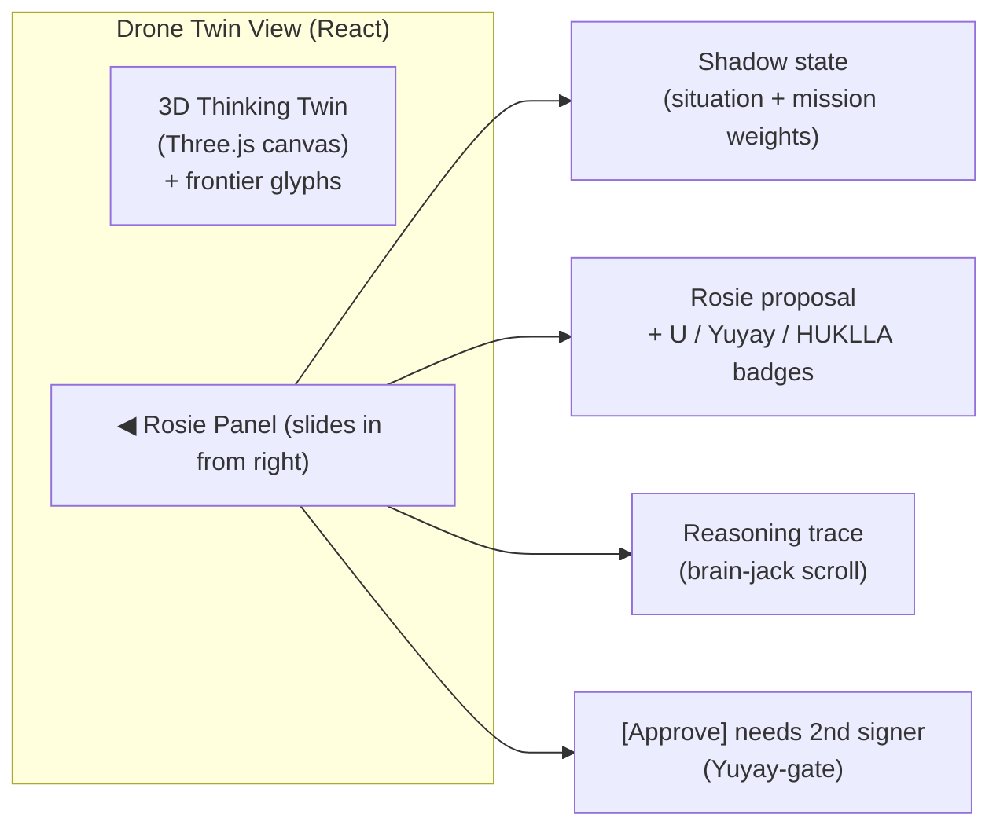

# ROSIE_COMPANION_IN_KILLINCHU — Rosie baked in as per-drone co-pilot

**Layer:** PURIQ v12 → `killinchu/architecture/`
**Author:** Yachay, under CTO authority · 2026-06-01
**Founder directive:** "…but have it Rosie fully baked in and a11oy can orchestrate."

**Grounding (existing Rosie):** Rosie is the **operator console + receipt-DAG admission
surface** of the SZL governed-decision substrate (`rosie/README.md`). It ships the
Khipu-indexed receipt DAG (3-tier pendant tree, summation invariant TH11), CSS-ingress
QEC admission control, dual-attestation, and the operator-facing Gradio console (Span
Explorer / Receipt Verifier / Mesh Health / Doctrine Sweep / Live Formulas). The cloud
Rosie carries the **ecosystem-evolve loop**, the **brain-jack mesh** (live decision-flow
view), and **162 endpoints**.

**This document** specifies how that capability gets **embedded as a co-pilot service
inside Killinchu** as `szl-rosie-companion`, with a **per-drone Rosie shadow** that
ponders telemetry, evolves the mission, and synthesizes per-drone insights — exposed at
`GET /drones/{id}/rosie` and rendered as a sliding **Rosie panel** on every twin view.

---

## 1 — What "fully baked in" means (3 capabilities, embedded)

| Cloud Rosie capability | Embedded in Killinchu as | Edge-survivable? |
|---|---|---|
| **Ecosystem-evolve loop** | per-drone `evolve()` — re-weights mission objectives from telemetry under Yuyay gate | Yes (local) |
| **Brain-jack mesh** (live decision-flow) | per-drone `reasoning_trace` — every `puriq.decide` call streamed into a ring buffer | Yes (local) |
| **162 endpoints** | a **scoped subset** mounted under `/drones/{id}/rosie/*` (see §4); full set when connected | Subset yes |

**Design principle:** the cloud Rosie is the *whole ecosystem's* console. The embedded
companion is *one drone's shadow* — same math, scoped to one bird. Rosie is **co-pilot,
not pilot**: it proposes, `P(x,t)` decides, the 2-person Yuyay gate authorizes. Rosie
**cannot** actuate; it can only feed candidate actions `a ∈ 𝒜` into `puriq.decide`.

---

## 2 — Per-drone Rosie shadow — the three jobs

```mermaid
flowchart LR
  subgraph SHADOW["szl-rosie-companion (per drone N)"]
    PON["ponder(telemetry)\n— reads twin state, sensor feed,\n  threat picture"]
    EVO["evolve(mission)\n— re-weight objectives,\n  propose plan deltas"]
    SYN["synthesize(insights)\n— per-drone narrative +\n  reasoning trace"]
  end
  TEL[(Drone telemetry\n+ twin state)] --> PON
  PON --> EVO
  EVO -->|candidate actions 𝒜| PUR[szl-puriq.decide]
  PUR -->|U(a|x), argmax| EVO
  EVO --> SYN
  SYN --> EP["/drones/{id}/rosie"]
  PUR -->|decision-flow stream| TRACE[(reasoning_trace ring buffer)]
  TRACE --> SYN
```

### 2.1 `ponder(telemetry)` — observe
Reads the drone twin state, sensor feed, and the local threat picture. Uses
`szl-amaru.recall()` (on-device quantized memory index) to pull mission-relevant context.
Pure read — emits no actuation. Produces a *situation summary vector* `x` (the PURIQ
context).

### 2.2 `evolve(mission)` — the ecosystem-evolve loop, per drone
The novel piece. Rosie proposes **plan deltas** (candidate actions `𝒜`) to better satisfy
mission objectives given the pondered situation. Each candidate runs through
`puriq.decide(a, x)`:

```python
def evolve(self, mission: Mission, x: Context) -> EvolveResult:
    candidates = self._propose_deltas(mission, x)   # Rosie generates 𝒜 (LLM via a11oy when up;
                                                     # local heuristic templates when offline)
    scored = [(a, puriq.decide(a, x)) for a in candidates]   # U(a|x) for each
    a_star = max(scored, key=lambda s: s[1])[0]      # argmax — but Rosie does NOT execute
    return EvolveResult(proposal=a_star, scored=scored,
                        requires_two_person_gate=a_star.is_state_changing)
```

Rosie **proposes** `a_star`; execution still requires the 2-person Yuyay gate (or the
pre-signed ROE envelope when disconnected). The objective re-weighting is itself
Yuyay-gated: a proposed mission change that fails any of the 13 axes is dropped before it
ever reaches the operator.

### 2.3 `synthesize(insights)` — per-drone narrative + trace
Produces the human-readable insight ("Bird 7: wind shear at 120m forcing a 12% energy
margin erosion; Rosie recommends shifting the orbit 40m NE — clears Yuyay 0.93, HUKLLA
0") plus the **reasoning trace** (the brain-jack mesh view, scoped to this drone).

---

## 3 — `reasoning_trace` — the brain-jack mesh, embedded

The cloud brain-jack mesh shows the *whole ecosystem's* decision flow live. The embedded
version is a **per-drone ring buffer** that captures every `puriq.decide` call:

```python
@dataclass
class TraceEntry:
    ts: str
    action_summary: str
    Lambda: float          # Λ(x)
    yuyay13: float          # Yuyay₁₃(a) — 0 if gated out
    hukulla: int            # HUKLLA(a) tripwire count
    khipu_ok: bool          # ∏Khipu_i(a) == 1
    geofence_ok: bool       # G(a)
    U: float                # final utility
    selected: bool          # was this the argmax?
    receipt_hash: str       # link into local Khipu chain
```

Capacity: a 4096-entry ring (config). On reconnect, the trace is flushed into the
canonical Khipu DAG (it is *derived from* receipts, so it reconciles by inclusion proof).
This is the data behind the **Yachay-Khipu reasoning-trace glyph** in the 3D twin
(`FRONTIER_GLYPHS_IN_TWIN.md`).

---

## 4 — The endpoint: `GET /drones/{id}/rosie`

Returns the Rosie-shadow's **current state + reasoning trace** for one drone.

```jsonc
// GET /drones/7/rosie  →  200
{
  "drone_id": 7,
  "shadow_state": {
    "pondered_at": "2026-06-01T02:14:33Z",
    "situation": "orbit hold, wind shear 120m, threat picture nominal",
    "mission": {"id": "alpha", "objective_weights": {"coverage":0.4,"energy":0.35,"standoff":0.25}}
  },
  "rosie_proposal": {
    "action": "shift orbit 40m NE",
    "U": 0.71,
    "yuyay13": 0.93, "hukulla": 0, "geofence_ok": true, "khipu_ok": true,
    "requires_two_person_gate": true,
    "status": "AWAITING_2ND_SIGNER"      // honest: not executed
  },
  "reasoning_trace": [ /* last N TraceEntry, brain-jack mesh */ ],
  "connectivity": "EDGE_DISCONNECTED",   // or CONNECTED
  "rosie_source": "embedded-shadow",     // or "cloud-fresh" when synced
  "endpoint_subset": "edge-scoped (24 of 162)"  // honest about scope
}
```

### 4.1 The 162-endpoint subset (honest scoping)
The cloud Rosie exposes 162 endpoints. The drone cannot and should not carry all of them
(many are ecosystem-wide aggregations). The embedded companion mounts a **scoped subset**
— the per-drone-meaningful endpoints — under `/drones/{id}/rosie/*`:

| Embedded endpoint | From cloud-Rosie family | Edge |
|---|---|---|
| `/rosie` | shadow-state aggregate | ✓ |
| `/rosie/trace` | brain-jack decision flow | ✓ |
| `/rosie/evolve` | ecosystem-evolve (scoped) | ✓ (local heuristics) |
| `/rosie/receipts` | Khipu receipt verifier | ✓ |
| `/rosie/doctrine-sweep` | ban-word scan on copilot text | ✓ |
| `/rosie/formulas` | live formula demo (Λ-score) | ✓ |
| `/rosie/mesh-health` | drone-local health | ✓ (this drone only) |
| `/rosie/glyphs` | 3 frontier glyph states | ✓ |
| … (24 total edge-scoped) | … | ✓ |
| (remaining 138) | ecosystem-wide | cloud-only |

**Honest label:** the embedded surface is **24 of 162** edge-scoped endpoints. The full
162 are reachable only when the drone is connected and proxying through a11oy. We do not
claim the full Rosie runs on the drone — we claim the *per-drone-meaningful* subset does.

---

## 5 — UI: the sliding Rosie panel (right side of every twin view)



**React component sketch (`RosiePanel.tsx`):**
```tsx
function RosiePanel({ droneId }: { droneId: number }) {
  const [open, setOpen] = useState(true);
  const { data } = useSWR(`/drones/${droneId}/rosie`, fetcher, { refreshInterval: 2000 });
  return (
    <aside className={`rosie-panel ${open ? "open" : "collapsed"}`}
           style={{ borderLeft: "3px solid #ff7a59" /* Rosie coral accent */ }}>
      <button className="rosie-toggle" onClick={() => setOpen(!open)}>
        {open ? "▶" : "◀ Rosie"}
      </button>
      {open && data && (
        <>
          <ShadowState state={data.shadow_state} />
          <Proposal p={data.rosie_proposal}>
            <Badge ok={data.rosie_proposal.yuyay13 >= 0.90} label={`Yuyay ${data.rosie_proposal.yuyay13}`} />
            <Badge ok={data.rosie_proposal.hukulla === 0} label={`HUKLLA ${data.rosie_proposal.hukulla}`} />
            <Badge ok={data.rosie_proposal.geofence_ok} label="Geofence" />
            <Badge ok={data.rosie_proposal.khipu_ok} label="Khipu ✓" />
          </Proposal>
          {data.rosie_proposal.requires_two_person_gate && (
            <ApproveButton droneId={droneId} disabledUntil="2nd-signer" />
          )}
          <ReasoningTrace entries={data.reasoning_trace} /> {/* brain-jack scroll */}
          <ConnBadge state={data.connectivity} subset={data.endpoint_subset} />
        </>
      )}
    </aside>
  );
}
```

Coral `#ff7a59` is Rosie's existing module accent (`rosie/hf-deploy/app_rosie_tab7.py`).
The panel is present on **every** drone twin view; it collapses to a tab when not in use.

---

## 6 — `szl-rosie-companion` package shape (vendored, edge)

```
szl-rosie-companion/
├── pyproject.toml          # deps: szl-puriq, szl-amaru, szl-yuyay, szl-khipu
├── src/szl_rosie_companion/
│   ├── shadow.py           # ponder / evolve / synthesize
│   ├── trace.py            # reasoning_trace ring buffer (brain-jack mesh)
│   ├── endpoints.py        # the 24 edge-scoped FastAPI routes
│   ├── propose.py          # candidate-action generation (a11oy when up; local templates offline)
│   └── glyphs.py           # frontier-glyph state feed (Pacha-Λ / Khipu-Bekenstein / Yachay-Khipu)
└── tests/
    ├── test_shadow.py      # evolve() proposals are Yuyay-gated; Rosie never actuates
    └── test_trace.py       # every decide() lands exactly one TraceEntry
```

**Size:** ~120 KB pure Python (it leans on already-vendored organs). Fits trivially in the
shared edge partition.

**Test plan:**
1. `evolve()` proposals that fail any Yuyay axis are dropped before reaching the operator.
2. Rosie has **no** actuation path — assert no module imports MAVLink dispatch.
3. Every `puriq.decide` call produces exactly one `TraceEntry`.
4. With `--network=none`, `evolve()` falls back to local heuristic templates and still
   produces a Yuyay-gated proposal (edge-survivable).
5. Reasoning trace reconciles: entries are derivable from local Khipu receipts.

---

## 7 — Honest labels

- Rosie is **co-pilot, not pilot**: it cannot actuate; `P(x,t)` decides; 2-person gate
  authorizes. (HARD RULE preserved.)
- Embedded surface is **24 of 162** endpoints (edge-scoped). Full Rosie is cloud-only.
- The README SLSA-3 badge on the upstream Rosie repo is a **CI badge**, not a verified
  attestation in this context; per v11 §9 our claimed SLSA level remains **L1 (honest)**.
- Offline `evolve()` uses **local heuristic templates**, not a frontier LLM — we say so
  in the endpoint response (`rosie_source: embedded-shadow`).

— Yachay, 2026-06-01. Rosie fully baked in as co-pilot. a11oy orchestrates. Edge-survivable.
