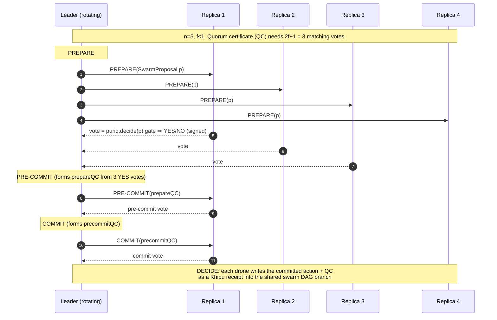
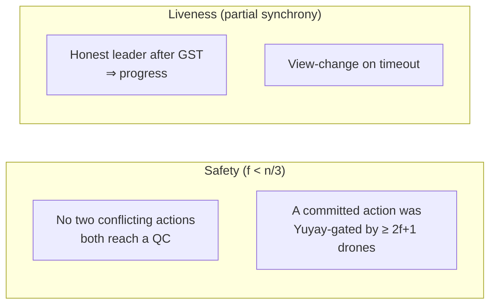
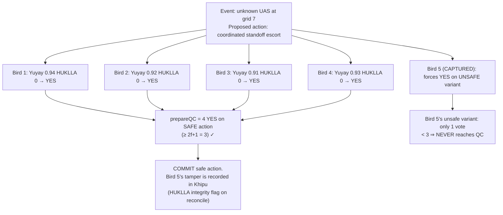

# SWARM_CONSENSUS_PROTOCOL — multi-drone Yuyay-13 collective wise reasoning

**Layer:** PURIQ v12 → `killinchu/architecture/`
**Author:** Yachay, under CTO authority · 2026-06-01

**Claim (novel):** when N Killinchus observe the same event, each independently computes
`Yuyay₁₃(a)` and `HUKLLA(a)` for the proposed response `a`; via a Khipu-DAG BFT consensus
(tolerates `f < n/3` byzantine), they agree on the action. Most C-UAS swarm logic does
**leader-election or majority vote**; ours does **collective wise reasoning** — a YES vote
requires the voter's *own* 13-axis gate to clear with `HUKLLA=0`.

**BFT primitive references:**
- **Raft** — understandable leader-based consensus, but **crash-fault** only (not byzantine)
  ([Ongaro & Ousterhout, *In Search of an Understandable Consensus Algorithm*, USENIX ATC 2014](https://raft.github.io/raft.pdf)).
- **Tendermint** — BFT SMR, `f < n/3`, two-phase pre-vote/pre-commit with locking
  ([Buchman, *Tendermint: Byzantine Fault Tolerance in the Age of Blockchains*, 2016](https://atrium.lib.uoguelph.ca/items/3567a36a-5f3c-4f00-ba6f-30b1c1c8aabe)).
- **HotStuff** — **linear** message complexity, pipelined three-phase commit, basis of
  modern BFT (LibraBFT/DiemBFT) ([Yin et al., *HotStuff: BFT Consensus in the Lens of
  Blockchain*, PODC 2019](https://arxiv.org/abs/1803.05069)).

We adopt a **HotStuff-style three-phase pipeline** (linear messages — important for radio-
constrained edge swarms) with `f < n/3` safety, and we **fuse the Yuyay-13 gate into the
vote validity rule**.

---

## 1 — Why HotStuff (not Raft) for an edge C-UAS swarm

| Property | Raft | Tendermint | **HotStuff (chosen)** |
|---|---|---|---|
| Fault model | crash only | byzantine `f<n/3` | byzantine `f<n/3` |
| Message complexity | O(n) | O(n²) | **O(n) linear** |
| Adversary territory? | unsafe (no BFT) | safe but chatty | **safe + radio-frugal** |
| Pipelining | no | partial | **yes (chained)** |

A drone swarm in adversary territory must assume some drones are **captured/byzantine**
(spoofed telemetry, hijacked). Raft's crash-only model is insufficient. Tendermint's O(n²)
all-to-all is expensive over jammed radio. **HotStuff's linear messaging + BFT safety** is
the right primitive. `n=5 ⇒ f≤1` (tolerates one captured drone); `n=7 ⇒ f≤2`.

---

## 2 — The consensus value: a *gated* action proposal

The value being agreed is not a raw action — it is a **Yuyay-gated, HUKLLA-clean action +
its Khipu root**:

```python
@dataclass(frozen=True)
class SwarmProposal:
    event_id: str               # the shared observation (e.g. UAS incursion hash)
    action: Action              # proposed collective response
    proposer: str               # drone id
    yuyay13: float              # proposer's own gate score (≥0.90 to be valid)
    hukulla: int                # MUST be 0 to be a valid YES candidate
    khipu_root: str             # proposer's local Khipu HEAD (binds to provenance)
```

**Vote-validity rule (the novel fusion):**
```python
def vote(self, p: SwarmProposal, x: Context) -> Ballot:
    d = puriq.decide([p.action, Action.abstain()], x)   # I re-run the math MYSELF
    clean = (d.action is p.action) and (d.hukulla == 0) and (d.yuyay13 >= 0.90)
    return Ballot.YES if clean else Ballot.NO            # YES only if MY gate clears
```

A drone cannot be coerced into a YES vote by majority pressure: it votes YES **only if its
own anatomy independently clears the 13-axis gate with zero tripwires**. A captured drone
voting YES on a bad action is outvoted by `2f+1` honest drones whose gates correctly
return NO.

---

## 3 — Three-phase HotStuff-style protocol (with Yuyay fusion)



- **PREPARE:** leader broadcasts the proposal. Each replica **runs `puriq.decide` itself**
  and votes YES only if its own gate clears (HUKLLA=0, Yuyay≥0.90).
- **PRE-COMMIT:** leader aggregates `2f+1` YES votes into a `prepareQC` (quorum certificate).
- **COMMIT:** second QC locks the value (safety: no two conflicting values can both reach
  QC under `f<n/3`).
- **DECIDE:** each drone appends the committed `(action, QC, khipu_root)` to the shared
  swarm Khipu DAG branch as a **dual-attested** receipt (the QC *is* the multi-signer
  attestation — `2f+1` signers, exceeding the 2-person minimum).

**Leader rotation** (HotStuff view-change): if the leader is byzantine/silent, a view
timeout rotates leadership (round-robin by drone id). Liveness under partial synchrony.

---

## 4 — Safety & liveness (honest statements)



- **Safety:** standard HotStuff quorum-intersection argument — any two QCs share ≥ one
  honest drone, preventing conflicting commits, for `f < n/3`. *(We state this as the
  inherited HotStuff theorem; our `sorry`-tagged Lean obligation `swarm_bft_safety` records
  the fusion-specific part — that the gated-vote rule does not weaken quorum intersection.)*
- **Wise-reasoning property (novel):** a committed action carries `≥ 2f+1` independent
  Yuyay-13 clearances with HUKLLA=0. So the swarm cannot collectively commit an action that
  a quorum's anatomy flagged. *(Lean obligation `swarm_gated_quorum`, `sorry`-tagged.)*
- **Liveness:** guaranteed only after GST (global stabilization time) under partial
  synchrony — **honest limitation**: under sustained jamming the swarm **holds/RTLs** (the
  safe default) rather than committing, which is the correct C-UAS behavior.

---

## 5 — Edge integration: this runs **drone-to-drone, no cloud**

Swarm consensus is a **first-class disconnected capability**. Drones form an ad-hoc mesh
(e.g. mesh-radio / MAVLink-over-mesh) and run the protocol peer-to-peer:

```python
# szl_killinchu/swarm.py
class SwarmConsensus:
    def __init__(self, drone_id, peers, f):  # n = len(peers)+1, f < n/3
        self.qc_threshold = 2 * f + 1
    def propose(self, event, action, x) -> Optional[CommittedAction]:
        p = self._make_proposal(event, action, x)   # includes my gate score
        prepare_qc = self._collect(self._broadcast("PREPARE", p), self.qc_threshold)
        if not prepare_qc: return None               # not enough clean YES votes
        precommit_qc = self._collect(self._broadcast("PRE-COMMIT", prepare_qc), self.qc_threshold)
        if not precommit_qc: return None
        committed = self._collect(self._broadcast("COMMIT", precommit_qc), self.qc_threshold)
        if committed:
            szl_yawar.append({"swarm_commit": event.id, "action": action.summary,
                              "qc_signers": committed.signers}, szl_khipu.head())
            return committed
        return None
```

On reconnect, each drone's swarm-DAG branch reconciles into the canonical Khipu DAG via
the same Merkle proof of inclusion as single-drone ops (`DISCONNECTED_OPS_PROTOCOL.md`);
the QC (multi-signer attestation) satisfies the dual-attestation requirement.

---

## 6 — Worked example: 5 drones, 1 captured



The captured drone cannot force the unsafe action (1 < 2f+1=3), and its attempt is
**receipted** — on reconcile, the divergent vote trips a HUKLLA integrity tripwire and is
flagged for the operator/auditor.

---

## 7 — Honest labels
- BFT safety is the **inherited HotStuff theorem**; our fusion-specific obligations
  (`swarm_bft_safety`, `swarm_gated_quorum`) are **`sorry`-tagged**, not proven.
- Liveness holds only after GST (partial synchrony). Under sustained jamming the swarm
  **holds/RTLs** — it does not commit. This is intentional, not a bug.
- QC signatures are **DSSE PLACEHOLDER** until Sigstore; the QC currently binds by hash +
  vote aggregation, not verified signatures.
- `f < n/3` is the standard BFT bound; with 5 drones we tolerate exactly 1 byzantine.

— Yachay, 2026-06-01. Collective wise reasoning, not bare majority. HotStuff BFT. Edge-native.
