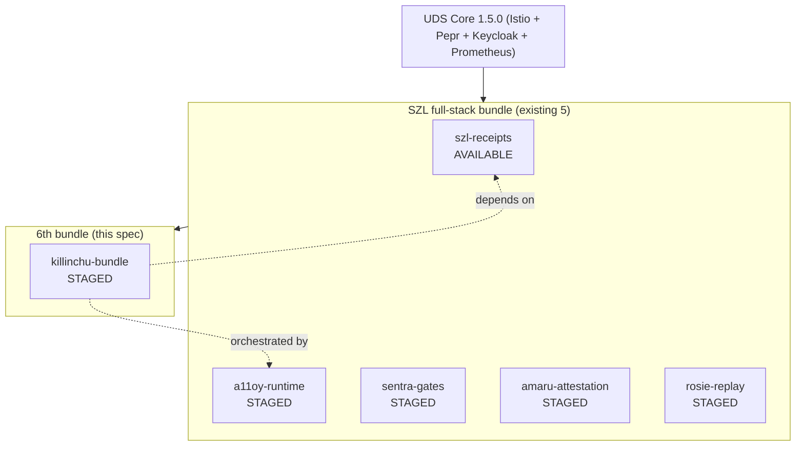

# UDS_ALLIES_PACKAGING — Killinchu as a UDS Zarf bundle (the 6th bundle)

**Layer:** PURIQ v12 → `killinchu/architecture/`
**Author:** Yachay, under CTO authority · 2026-06-01
**References:** `szl-uds-deployment-fresh/uds-bundle.yaml` (catalog-grade 0.3.1, UDS Core
1.5.0); `bundles/szl-full-stack/uds-bundle.yaml` (the existing **5-package** full-stack
composition); Andrew Greene Option-A endorsement (2026-05-22).

**Goal:** Killinchu is a **UDS Zarf bundle from day one** — signed, airgap-deployable, on
the Defense Unicorns UDS Core, with Anchore image scanning and Chainguard distroless base
images. Per existing SZL UDS doctrine. We map the existing **5-bundle structure** and add a
**6th bundle: `killinchu-bundle.tar.zst`**.

**Allies referenced (real, cited):**
- **Defense Unicorns UDS Core** — secure runtime baseline (Istio, Pepr/UDS Operator,
  Keycloak, Prometheus) ([UDS Core releases](https://github.com/defenseunicorns/uds-core/releases)).
- **Zarf** — airgap package/deploy ([Zarf / uds-cli](https://github.com/defenseunicorns/uds-cli)).
- **Anchore** — image vulnerability scanning ([Anchore](https://anchore.com/)).
- **Chainguard** — distroless, low/zero-CVE base images ([Chainguard Images](https://www.chainguard.dev/chainguard-images)).

---

## 1 — The existing 5 packages → add the 6th



| # | Package | Role | Status |
|---|---|---|---|
| 1 | `szl-receipts` | governance receipt server + Pepr admission webhook | AVAILABLE |
| 2 | `a11oy-runtime` | orchestration kernel + policy gates | STAGED (FA-001) |
| 3 | `sentra-gates` | immune/threat gates | STAGED |
| 4 | `amaru-attestation` | cortex attestation | STAGED |
| 5 | `rosie-replay` | receipt-DAG replay/console | STAGED |
| **6** | **`killinchu-bundle`** | **drone flagship: anatomy libs + puriq core + rosie-companion + twin** | **STAGED** |

The 6th bundle follows the **same honest STAGED discipline**: it is labeled STAGED until
its Zarf package exists and its container is pushed (a follow-up by the build agent — **not
this agent**).

---

## 2 — `killinchu-bundle` package shape

```mermaid
flowchart LR
  subgraph KB["killinchu-bundle (Zarf package)"]
    API[killinchu-api\n(FastAPI + szl_anatomy_routes)]
    PUR[szl-puriq + 11 anatomy libs\n(vendored, squash-fs)]
    ROS[szl-rosie-companion]
    TWIN[killinchu-twin\n(static Three.js/CesiumJS PWA)]
    EDGE[killinchu-edge-image\n(squash-fs anatomy for drones)]
  end
  KB --> RECEIPTS[szl-receipts\n(Khipu DAG writer)]
  KB --> A11OY[a11oy-runtime\n(/v1/router + /v1/orchestrate)]
```

**Components (optionalComponents in the bundle):**
| Component | Image base | Scanned | Notes |
|---|---|---|---|
| `killinchu-api` | Chainguard `python:latest` distroless | Anchore | mounts anatomy libs |
| `killinchu-puriq` | Chainguard distroless | Anchore | decision core |
| `killinchu-rosie-companion` | Chainguard distroless | Anchore | co-pilot service |
| `killinchu-twin` | Chainguard `nginx` distroless static | Anchore | PWA, offline-cached |
| `killinchu-edge-squashfs` | OCI artifact (not a running pod) | Anchore | squash-fs anatomy for drone flash |

---

## 3 — Bundle YAML (the 6th entry — patch to szl-full-stack)

The patch file is at `patches/killinchu-bundle.uds-bundle.yaml`. Entry shape (mirrors the
existing STAGED discipline of packages 2–5):

```yaml
  # ─────────────────────────────────────────────────────────────────
  # Package 6: killinchu-bundle
  # Status: STAGED — awaiting Zarf package creation + container push.
  #   Build/push owned by opus_killinchu_drone_flagship_build_mpus8anv (NOT this agent).
  # ─────────────────────────────────────────────────────────────────
  - name: killinchu-bundle
    description: >
      [STAGED: awaiting container push + Zarf package create]
      Killinchu drone flagship: vendored SZL anatomy (11 organs) + szl-puriq decision
      core (P(x,t) on every action) + szl-rosie-companion co-pilot + 3D thinking twin.
      Airgap-deployable; edge squash-fs artifact for disconnected drones.
    repository: ghcr.io/szl-holdings/killinchu
    ref: uds-v0.3.1
    # BLOCKER: cannot deploy until container pushed to GHCR + cosign-signed (FA-001/FA-002).
    optionalComponents:
      - name: killinchu-api
        description: FastAPI + szl_anatomy_routes (/drones/*, /killinchu/audit/*)
      - name: killinchu-puriq
        description: Decision core — runs P(x,t) on every drone action
      - name: killinchu-rosie-companion
        description: Per-drone Rosie shadow co-pilot
      - name: killinchu-twin
        description: 3D thinking twin PWA (Three.js/CesiumJS, offline-cached)
      - name: killinchu-edge-squashfs
        description: OCI artifact — squash-fs anatomy for drone flash (not a pod)
    overrides:
      killinchu-bundle:
        killinchu-puriq:
          values:
            - path: puriq.beta            # halt-penalty rate β (v12 param, not LOCKED)
              value: 12.0
            - path: puriq.twoPersonGate   # HARD RULE: 2 signers for state-changing ops
              value: true
            - path: puriq.edgeRoeRequired # edge ops require pre-signed ROE envelope
              value: true
        killinchu-api:
          values:
            - path: a11oyRouter.url       # single LLM brain endpoint
              value: "http://a11oy-runtime:8080/v1/router"
            - path: khipu.writer          # RUWAY is the only writer
              value: "ruway"
```

---

## 4 — Airgap + signing + scanning (the allies pipeline)

```mermaid
flowchart LR
  SRC[killinchu source] --> BUILD[Chainguard distroless build]
  BUILD --> SCAN[Anchore scan\n(CVE gate)]
  SCAN -->|pass| SIGN[cosign sign\n(FA-002: org key)]
  SIGN --> ZARF["zarf package create\n(airgap .tar.zst)"]
  ZARF --> BUNDLE["uds create →\nkillinchu-bundle.tar.zst"]
  BUNDLE --> DEPLOY["uds deploy --confirm\n(airgapped UDS Core)"]
  DEPLOY --> EDGE["flash killinchu-edge-squashfs\nto drone /opt/szl (read-only)"]
```

- **Chainguard distroless** base ⇒ minimal attack surface, low/zero CVEs.
- **Anchore** CVE gate in CI ⇒ a failing scan blocks the bundle (immune posture).
- **cosign** signing ⇒ **STAGED (FA-002)**: `uds deploy` succeeds; `cosign verify` on the
  bundle artifact **fails until the org key is provisioned** — stated honestly, exactly as
  the existing bundle does for `szl-receipts`.
- **Airgap:** the whole bundle is a single `killinchu-bundle.tar.zst`; no registry access
  needed at deploy time — matches the disconnected-ops ethos at the *deployment* layer too.

---

## 5 — Edge artifact: `killinchu-edge-squashfs`

The drone does not run a Kubernetes pod. The edge component is an **OCI artifact** carrying
the read-only squash-fs anatomy partition(s) from `EMBEDDED_ANATOMY_LIBRARIES.md`:

```
killinchu-edge-squashfs (OCI artifact)
├── szl-anatomy-pure.sqfs      # 9 pure organs (≤50MB, vast headroom)
├── szl-amaru.sqfs             # quantized memory index (≤50MB)
├── szl-otel-vsp.sqfs          # OTel SDK (≤50MB)
└── manifest.json              # CIDs + sizes; CI asserts each ≤ 52428800 bytes
```

Flashed to the drone's `/opt/szl` as **read-only**; `/var/szl` (local Khipu chain +
pre-signed ROE) is the only writable area. Pulling/verifying the artifact uses cosign +
Anchore the same way as the pods.

---

## 6 — Deploy commands (mirrors existing bundle docs)

```bash
# build (build agent — NOT this agent):
zarf package create packages/killinchu-bundle/
uds create bundles/szl-full-stack/        # now composes 6 packages
# deploy (airgapped):
uds deploy uds-bundle-szl-full-stack-amd64-0.3.1.tar.zst --confirm
# edge flash:
oras pull ghcr.io/szl-holdings/killinchu-edge-squashfs:uds-v0.3.1
cosign verify ghcr.io/szl-holdings/killinchu-edge-squashfs:uds-v0.3.1   # STAGED: fails until FA-002
flash-squashfs ./szl-anatomy-*.sqfs /dev/drone-opt
```

---

## 7 — Honest labels (carried, mandatory)
- The 6th bundle is **STAGED** until its container is pushed + Zarf package created —
  **this agent does NOT push.** Owner: `opus_killinchu_drone_flagship_build_mpus8anv`.
- **cosign signing is STAGED (FA-002)**: `uds deploy` works; `cosign verify` on the bundle
  **fails** until the org key is provisioned. Stated exactly as the existing bundle states it.
- UDS Core ref pinned to **1.5.0-upstream** (public images, no DoD registry needed for the
  demo), consistent with the existing bundle.
- SLSA remains **L1 (honest)**; the Anchore/cosign pipeline does not change the claimed
  SLSA level. "SLSA L3" is BANNED.
- Defense Unicorns / Anchore / Chainguard are referenced as **upstream allies/tools**; no
  endorsement beyond Greene's documented Option-A is claimed.

— Yachay, 2026-06-01. 6th bundle, signed + airgap + distroless + scanned. STAGED, honest.
