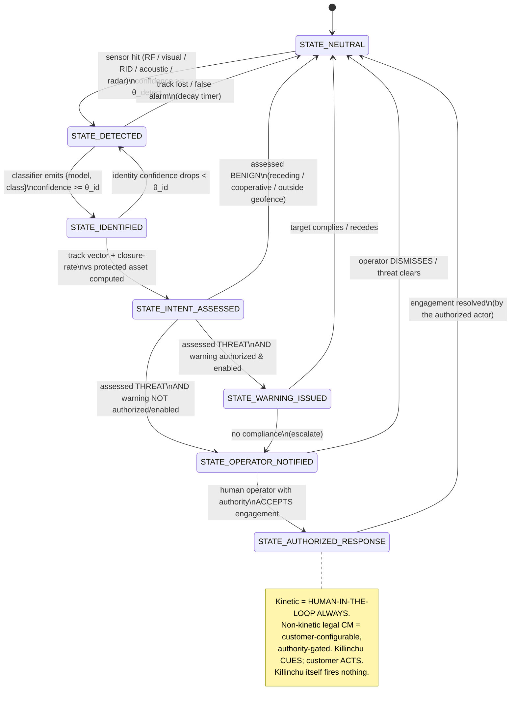

# COMPANION DEFENSE PROTOCOL — ROE-Gated, Khipu-Receipted State Machine

> Killinchu C-UAS Knowledge Base · **Author:** Yachay-extension · **Compiled:** 2026-05-31
>
> Translates the founder's intent — *"if an enemy gets close to our companion or our drones, what do
> we do?"* — into a **rules-of-engagement (ROE) gated finite state machine** where **every transition
> emits a chain-verified Khipu receipt**, kinetic response is **always human-in-the-loop**, and
> non-kinetic legal countermeasures are **customer-configurable and authority-gated**.
>
> This is the operational embodiment of `LEGAL_CYBER_BOUNDARY.md`: Killinchu senses, classifies,
> assesses intent, warns (if authorized), and **hands a targeting-quality, signed solution to the
> customer who has the authority to act.** We never fire. The protocol makes that boundary
> machine-enforced, not just a policy memo.

---

## 0. Design rules (non-negotiable)

1. **No state may issue a kinetic effect.** The terminal state delivers an *authorized-response cue*
   to the customer; a human with Title 10/50 / §124n authority decides and acts.
2. **Non-kinetic legal countermeasures** (e.g. an authorized warning broadcast in an allowed band)
   are **OFF by default**, enabled only when (a) the customer holds the authority and (b) ROE config
   explicitly permits — see G5 in `LEGAL_CYBER_BOUNDARY.md`.
3. **Every transition emits a Khipu receipt** with `chain_verified=true` required for the next state
   to be reachable (Doctrine v11/v12 receipt-DAG integrity).
4. **No transmit** anywhere in the default path except the authority-gated warning (G1/G5).
5. **13-axis Yuyay gating** is evaluated before any state that produces an external effect
   (WARNING / OPERATOR_NOTIFIED / AUTHORIZED_RESPONSE), consistent with PURIQ.

---

## 1. State machine (Mermaid)



---

## 2. Per-state definition + entry condition + Khipu receipt schema

Each state, on entry, emits a Khipu receipt. Receipts share a **common envelope**, then carry a
**state-specific `body`**.

### 2.0 Common Khipu receipt envelope

```json
{
  "khipu_version": "v12",
  "receipt_id": "khipu:sha256:<hex>",
  "prev_receipt_id": "khipu:sha256:<hex|null>",
  "chain_verified": true,
  "ts_utc": "2026-05-31T18:22:01.300Z",
  "engagement_id": "uuid",
  "track_id": "uuid",
  "state": "STATE_*",
  "actor": "killinchu-fsm@<deployment>",
  "yuyay_13": { "sacred": [..2..], "structural": [..7..], "introspection": [..4..], "pass": true },
  "hukla_tripwires": { "violations": 0, "ids": [] },
  "dsse_signature": "PLACEHOLDER",   // honest: Sigstore CI signing not yet wired (Doctrine v11)
  "body": { /* state-specific, below */ }
}
```
> **Honesty note:** per Doctrine v11, the DSSE signature is currently a **PLACEHOLDER** (Sigstore CI
> not wired). The receipt *chain* (`prev_receipt_id` + `chain_verified`) is real; cryptographic
> signing is a tracked debt, not hidden.

---

### 2.1 STATE_NEUTRAL
- **Meaning:** no qualifying track; system watching.
- **Entry condition:** initial state, or return after resolution / benign assessment / track loss.
- **Effect:** none (pure observe).
- **Receipt body:**
```json
{ "reason": "init|track_lost|benign|warning_complied|operator_dismissed|engagement_resolved",
  "watch_sectors": ["N","NE",...], "sensors_online": ["rf","acoustic","eo_ir","rid_rx"] }
```

### 2.2 STATE_DETECTED
- **Meaning:** at least one sensor reports a candidate aerial track above detection threshold.
- **Entry condition:** `fused_detection.confidence >= θ_detect` from RF / visual / RID / acoustic /
  (optional) radar (see `DETECTION_LAYERS.md` §7 feature schema).
- **Effect:** start track; slew EO/IR to RF/acoustic bearing for confirmation.
- **Receipt body:**
```json
{ "detection_id": "uuid",
  "sensors_triggered": ["rf","acoustic"],
  "rf": { "peak_freq_hz": 2437e6, "rssi_dbm": -71.2, "aoa_deg": 137.0, "aoa_sigma_deg": 5.0,
          "modulation_family": "OcuSync" },
  "remote_id_received": false,
  "fused_bearing_deg": 138.0,
  "confidence": 0.74, "theta_detect": 0.60 }
```

### 2.3 STATE_IDENTIFIED
- **Meaning:** classifier has a model/class hypothesis with sufficient confidence.
- **Entry condition:** `classification.confidence >= θ_id`; emits `{predicted_class, predicted_model,
  us_group_estimate}` keyed to `ADVERSARY_DRONE_CATALOG.md`.
- **Effect:** attach identity to track; if Remote-ID claim disagrees with RF/radar track → set
  `rid_inconsistent` (possible spoof; `DETECTION_LAYERS.md` §6).
- **Receipt body:**
```json
{ "predicted_class": "fpv_attack|isr_fixed_wing|loitering_munition|commercial_quad|friendly|decoy|unknown",
  "predicted_model": "Shahed-136|DJI_Mavic_3E|Orlan-10|...",
  "us_group_estimate": 3,
  "remote_id": { "received": false, "rid_inconsistent": false },
  "is_friendly": false,
  "confidence": 0.88, "theta_id": 0.75 }
```

### 2.4 STATE_INTENT_ASSESSED
- **Meaning:** intent computed from kinematics relative to the protected asset (companion / our drone).
- **Entry condition:** track vector + **closure rate** vs asset + geofence breach + altitude/speed
  envelope evaluated → label `BENIGN` or `THREAT`.
- **Decision logic (example, customer-tunable ROE):**
  `THREAT` if `closure_rate_to_asset > c_min` AND `range < r_geofence` AND `not is_friendly`
  AND (`altitude/speed in threat envelope` OR `predicted_class in {fpv_attack, loitering_munition}`).
  Else `BENIGN`.
- **Effect:** branch — BENIGN → STATE_NEUTRAL; THREAT → WARNING (if authorized) else OPERATOR_NOTIFIED.
- **Receipt body:**
```json
{ "assessment": "BENIGN|THREAT",
  "kinematics": { "range_m": 430.0, "closure_rate_mps_to_asset": 9.1, "speed_mps": 14.2,
                  "altitude_m_agl": 88.0, "heading_deg": 318.0 },
  "geofence_breached": true,
  "protected_asset": "companion-01",
  "roe_rule_fired": "THREAT_ENVELOPE_FPV",
  "warning_authorized": false, "warning_enabled": false }
```

### 2.5 STATE_WARNING_ISSUED  *(authority-gated, off by default)*
- **Meaning:** a **legal** warning is broadcast in an allowed band (e.g. an authorized RID-based
  warn-the-operator action) — only if `warning_authorized && warning_enabled`.
- **Entry condition:** assessment=THREAT AND warning authorized+enabled AND Yuyay-13 pass AND 0 HUKLLA
  violations. (If not authorized/enabled → skip directly to OPERATOR_NOTIFIED.)
- **Effect:** the only transmit in the system; constrained to allowed bands; logged verbatim.
  *Legal basis & limits:* 6 USC §124n(b)(1)(B) authorizes warnings only for authorized actors —
  Killinchu performs this **on behalf of an authorized customer**, never unilaterally (see
  `LEGAL_CYBER_BOUNDARY.md` §1.2).
- **Receipt body:**
```json
{ "warning_method": "remote_id_broadcast|audible|visual",
  "band": "allowed-RID-broadcast",
  "authorized_by": "customer-authority-token-id",
  "message": "Unauthorized UAS, you are entering protected airspace; depart immediately.",
  "yuyay_pass": true, "hukla_violations": 0 }
```

### 2.6 STATE_OPERATOR_NOTIFIED
- **Meaning:** the human operator (customer, with authority) is presented the full evidence package
  and asked for a decision.
- **Entry condition:** assessment=THREAT (and warning not authorized/enabled, or warning issued with
  no compliance).
- **Effect:** push the **targeting-quality solution** (fused track, identity, bearing/position,
  closure, full receipt chain) to the operator console. **Killinchu takes no action itself.**
- **Receipt body:**
```json
{ "notified_operator": "operator-id|C2-endpoint",
  "evidence_package_ref": "khipu-chain:engagement_id",
  "targeting_solution": { "lat": 40.7128, "lon": -74.0060, "alt_m_agl": 88.0,
                          "bearing_deg": 138.0, "range_m": 410.0, "closure_mps": 9.4 },
  "recommended_options": ["monitor","authorized_warning","cue_to_customer_effector"],
  "decision_pending": true }
```

### 2.7 STATE_AUTHORIZED_RESPONSE
- **Meaning:** the authorized human operator has **accepted** an engagement. Killinchu records the
  decision and **cues** the customer's authorized system.
- **Entry condition:** explicit operator acceptance with valid authority token. **Kinetic = human in
  the loop, ALWAYS.** Non-kinetic legal CM = customer-configurable.
- **Effect:** emit the cue to the **customer's** effector/C2 (Lattice, FAAD-C2, etc.). **Killinchu
  itself fires nothing**; it hands over the signed solution. The customer's system, under the
  customer's authority, performs (or declines) the effect.
- **Receipt body:**
```json
{ "operator_decision": "ACCEPT",
  "authority_token": "title10|title50|usc124n-cert-id",
  "human_in_loop": true,
  "response_type": "cue_to_customer_kinetic|authorized_non_kinetic|monitor_only",
  "cue_target_system": "customer-C2-endpoint",
  "killinchu_fired_effect": false,
  "yuyay_pass": true, "hukla_violations": 0 }
```

---

## 3. Thresholds & ROE config (customer-tunable)

| Param | Meaning | Default | Notes |
|---|---|---|---|
| `θ_detect` | min fused confidence to leave NEUTRAL | 0.60 | per-sensor floors apply |
| `θ_id` | min classification confidence | 0.75 | drops back to DETECTED below |
| `c_min` | min closure rate (m/s) to count as approaching | 2.0 | sign convention: + = closing |
| `r_geofence` | protected-asset geofence radius (m) | 500 | per asset |
| `threat_envelope` | altitude/speed/class rules | catalog §1 + class | FPV/LM auto-elevate |
| `warning_authorized` | customer holds §124n/warn authority | **false** | hard gate (G5) |
| `warning_enabled` | customer turned warning on | **false** | hard gate (G5) |
| `decay_timer_s` | track-loss → NEUTRAL | 8 | tunable |

---

## 4. Mapping to the legal boundary (machine-enforced)

| FSM element | Legal guardrail enforced |
|---|---|
| All states observe only (except 2.5) | G1 receive-only |
| STATE_IDENTIFIED decodes broadcast ID only | G2 no content interception |
| No state accesses the drone | G3 no drone access; CFAA §1030 |
| No jam/spoof/HPM/kinetic in any state | G4; 47 USC §302a/§333; 18 USC §§32,1367 |
| STATE_WARNING_ISSUED gated by authority+enable | G5; 6 USC §124n(b)(1)(B) |
| STATE_AUTHORIZED_RESPONSE cues customer, `killinchu_fired_effect:false` | G8 human-in-loop; arms-supplier model |
| Every transition → Khipu receipt, chain_verified | G7 auditable evidence |

---

## 5. Why this is the right shape

- It is the **falcon's discipline**: watch (NEUTRAL) → spot (DETECTED) → recognize (IDENTIFIED) →
  judge (INTENT) → warn (if allowed) → call the handler (OPERATOR_NOTIFIED) → the handler decides
  (AUTHORIZED_RESPONSE). The falcon never strikes on its own when a handler exists.
- It converts the founder's protective instinct ("defend our companion/drones") into a **defensible,
  signed, auditable** process that protects the asset **and** the company — because the strike
  decision lives with the legally authorized human, and the whole chain is receipted evidence.
- It is demo-ready for Warhacker: live Remote-ID/RF detection → classify → intent → operator
  notify → (mock) customer-cue, with the Khipu DAG visible in the 3D anatomy, and a red banner that
  reads **"Killinchu cues; the authorized customer acts."**

— Signed: **Yachay-extension**, 2026-05-31.
