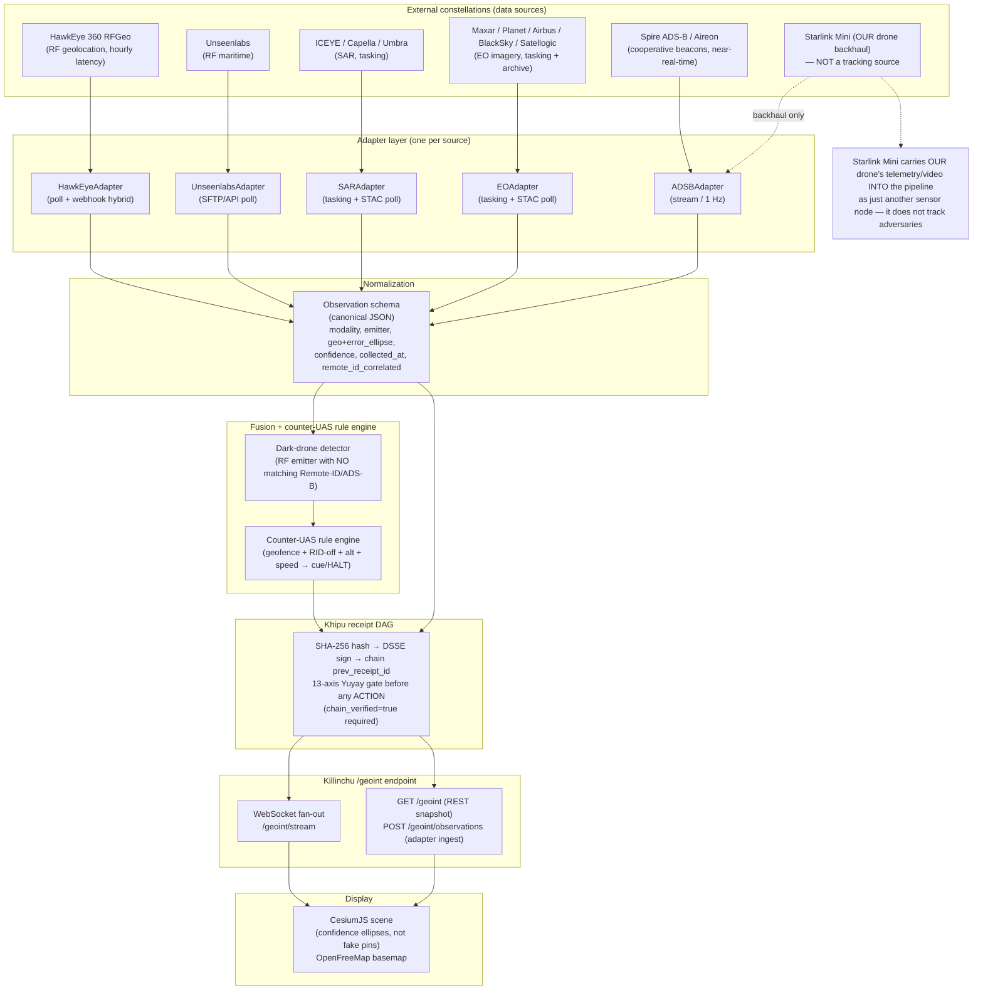

# AGGREGATION ARCHITECTURE — how constellations feed Killinchu /geoint

**Author:** Yachay-extension · 2026-05-31

Every constellation is an **Adapter**. Adapters emit normalized **Observations**. Observations are **Khipu-receipted** before they surface. The **CesiumJS** scene subscribes to a **WebSocket fan-out**. This reuses the Wamani/Vessels substrate (OpenFreeMap → Cesium, Khipu DAG, dark-vessel→dark-drone logic) additively.

---

## 1. System diagram



---

## 2. Contracts

### 2.1 Adapter interface (every source implements)
```
Adapter:
  poll() -> [RawDetection]        # slow loop, matches source latency
  on_webhook(payload) -> [RawDetection]   # event-driven when supported
  normalize(RawDetection) -> Observation
```
Polling cadence is **per-source**, NOT uniformly 1 Hz:
- ADS-B/AIS (Spire/Aireon): true stream / ~1 Hz.
- HawkEye/Unseenlabs RF: poll every 5–15 min (data arrives hours late; 1 Hz would be wasteful).
- SAR/EO tasking: poll STAC catalog every 1–5 min for new scene availability.

### 2.2 Observation (normalized, canonical JSON) — see HAWKEYE360_DEEP_DIVE §5.2 for the full RF example. Common fields: `obs_id, source, modality, geo{lat,lon,error_ellipse}, confidence, collected_at, delivered_at, remote_id_correlated`.

### 2.3 Khipu receipt (Zero-Bandaid Law)
Every Observation → `SHA-256(canonical_json)` → DSSE sign → chain `prev_receipt_id`. Any **action** (cue/HALT) additionally requires the 13-axis Yuyay gate and `chain_verified=true` (per PURIQ_CHARTER master formula `∏_i Khipu_i(a)`).

### 2.4 /geoint endpoint
- `POST /geoint/observations` — adapters push receipted Observations.
- `GET /geoint` — REST snapshot of current scene state.
- `WS /geoint/stream` — WebSocket fan-out; Cesium subscribes; renders error ellipses honestly.

---

## 3. Data-rate budget (back-of-envelope, 1 Hz polling assumption)

Assumptions: one normalized Observation JSON ≈ **1 KB** (RF detection with metadata + ellipse + receipt header). Imagery/SAR scenes are NOT streamed at 1 Hz — only their *metadata/footprint* Observations are; the heavy pixels stay in object storage and are fetched on demand.

| Constellation | Realistic event rate | If polled at 1 Hz (metadata only) | MB/hr at 1 Hz | Realistic MB/hr (true cadence) |
|---|---|---|---|---|
| HawkEye 360 RF | a few detections/AOI/pass (hours apart) | 1 KB × 3600/hr = 3.6 MB/hr (mostly empty polls) | **3.6 MB/hr** | <0.1 MB/hr (poll 5–15 min) |
| Unseenlabs RF | <1 MB/acquisition, few/pass | 3.6 MB/hr | **3.6 MB/hr** | <0.1 MB/hr |
| Spire/Aireon ADS-B | hundreds–thousands of aircraft updates/s globally; per-AOI far less | ~tens of msgs/s × 0.3 KB | **~10–50 MB/hr** (regional AOI) | same (this one really is streamy) |
| SAR (ICEYE/Capella) metadata | scene footprints on tasking | 3.6 MB/hr (mostly empty) | **3.6 MB/hr** | <0.5 MB/hr (poll catalog) |
| EO (Maxar/Planet) metadata | scene footprints on tasking | 3.6 MB/hr | **3.6 MB/hr** | <0.5 MB/hr |
| **Pixel payloads (out-of-band)** | per SAR/EO scene | — | — | **10s–100s of MB per scene**, fetched on demand to S3, never on the 1 Hz bus |

**Totals (control/metadata bus):**
- Naive "everything at 1 Hz": ~5 sources × 3.6 MB/hr + ADS-B ≈ **~30–70 MB/hr** of mostly-empty polling.
- Realistic per-cadence bus: **~10–55 MB/hr**, dominated entirely by ADS-B; RF/SAR/EO metadata is negligible (<1 MB/hr each).
- **The big bytes are imagery pixels** (10s–100s MB/scene). Design rule: **the WebSocket bus carries Observations (KB), never pixels.** Pixels go to object storage; the scene lazy-loads a tile/clip by reference. This keeps the Cesium client and the fan-out cheap.

**Bandwidth verdict:** The aggregation control plane is trivially light (tens of MB/hr). The only real bandwidth cost is on-demand imagery retrieval, which is bounded by how many SAR/EO scenes you actually task — a *cost* problem (see COST_MODEL_2026.md), not a streaming-throughput problem.

---

## 4. Honest failure modes
- **Latency mismatch:** RF/SAR/EO are hours-to-days; the scene must show *staleness* (timestamp + age badge) so operators don't mistake a 3-hr-old ellipse for a live track.
- **Ellipse honesty:** never render an RF fix as a sharp pin; always the confidence ellipse.
- **Source outage:** each Adapter is independent; one dead feed degrades gracefully (others keep flowing). Khipu chain records the gap.
- **Backpressure:** if ADS-B floods, throttle at the Adapter, not the bus; coalesce per-ICAO to one Observation per N seconds.

— Yachay-extension
