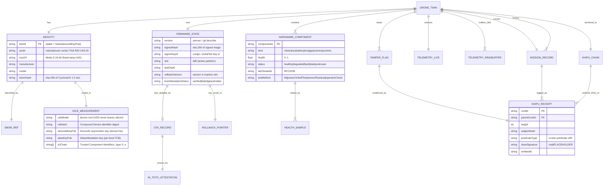

# DIGITAL_TWIN_SCHEMA — The Killinchu Drone Twin

**Layer:** Killinchu (air-domain extension of the maritime YAWAR/VSP organs)
**Doctrine:** v12 (PURIQ). Every twin field that changes emits a Khipu receipt cord.
**Status discipline:** NO MOCKS. Every field below maps to a real telemetry stream, a real
attestation primitive, or the curated drone DB. Unwired fields are tagged `PLACEHOLDER` honestly
(per Doctrine v11/v12 DSSE-signature debt), never hidden.
**Sign-off:** Yachay-extension (CTO authority).

> Quechua: *Killinchu* = American kestrel (Falco sparverius) — sharpest-eyed Andean falcon.
> The twin is the kestrel's-eye model of one airframe: identity, health, firmware, mission,
> telemetry, and its full receipt chain.

---

## 0. Design principles

1. **One canonical object per airframe.** `DroneTwin` is the single source of truth, keyed by the
   hardware-rooted DICE identity, NOT by a mutable serial or hostname. A re-flash that changes the
   measured firmware changes the DICE-derived `aliasKeyPub` (see `DRONE_IDENTITY_PROVENANCE.md`), so
   the identity is *cryptographically bound to the running TCB*, exactly as the
   [TCG DICE Layering Architecture r19](https://trustedcomputinggroup.org/wp-content/uploads/DICE-Layering-Architecture-r19_pub.pdf)
   specifies ("an identity that cannot exist without a precise chain of TCB components").
2. **Health is a measured number, not a vibe.** Every hardware subsystem carries a `health ∈ [0,1]`
   plus a `lastTestedAt` timestamp and the `method` that produced it. A health value with no recent
   test is treated as `stale` and rendered grey, not green.
3. **Every state transition is receipted.** The twin embeds a `khipuChain` — the append-only DSSE
   receipt DAG that already powers maritime detection in vessels. A twin without a verifiable chain
   tail scores zero under the PURIQ master formula and trips HUKLLA T03 (receipt-gap).
4. **Maritime parity.** Field shapes mirror the live `VesselTwin`
   (`web/src/data/fleet-twin.ts`) so the existing fleet UI, receipt DAG, and OpenFreeMap overlays
   reuse without re-derivation (per `470_WAMANI_DRONE_PIVOT_PLAN.md`).

---

## 1. Entity-Relationship diagram



---

## 2. Canonical `DroneTwin` JSON Schema (Draft 2020-12)

`schema/drone-twin.schema.json`:

```json
{
  "$schema": "https://json-schema.org/draft/2020-12/schema",
  "$id": "https://szlholdings.dev/killinchu/schema/drone-twin.schema.json",
  "title": "DroneTwin",
  "description": "Canonical per-airframe digital twin for Killinchu. Doctrine v12 (PURIQ).",
  "type": "object",
  "required": ["twinId", "identity", "hardware", "firmware", "mission", "telemetry", "khipuChain"],
  "additionalProperties": false,
  "properties": {

    "twinId": {
      "type": "string",
      "description": "Stable id = lowercase hex sha-256 of identity.dice.deviceIdKeyPub. Survives reflash; dies on silicon swap.",
      "pattern": "^[0-9a-f]{64}$"
    },

    "identity": {
      "type": "object",
      "required": ["serial", "manufacturer", "model", "dice", "sbomHash"],
      "additionalProperties": false,
      "properties": {
        "serial":       { "type": "string", "description": "Manufacturer serial / ASTM F3411 UAS-ID (Basic-ID type 0)." },
        "icao24":       { "type": ["string","null"], "pattern": "^[0-9A-Fa-f]{6}$", "description": "Mode-S 24-bit address (fixed-wing UAS, ADS-B-capable). Null for quads." },
        "faaRemoteId":  { "type": ["string","null"], "description": "FAA Remote ID serial or session id (ASTM F3411-22a Basic-ID)." },
        "manufacturer": { "type": "string" },
        "model":        { "type": "string", "description": "FK -> DRONE_FLEET_DB model id." },
        "uasGroup":     { "type": "integer", "minimum": 1, "maximum": 5, "description": "DoD UAS Group 1-5." },
        "dice": {
          "type": "object",
          "description": "TCG DICE hardware root of trust. UDS itself is NEVER stored in the twin.",
          "required": ["cdiHash", "deviceIdKeyPub", "aliasKeyPub", "tciChain"],
          "additionalProperties": false,
          "properties": {
            "cdiHash":        { "type": "string", "pattern": "^[0-9a-f]{64}$", "description": "Compound Device Identifier digest (one-way fn of UDS + layer-0 TCI)." },
            "deviceIdKeyPub": { "type": "string", "description": "DeviceID public key (PEM/JWK) — authenticates device+firmware." },
            "aliasKeyPub":    { "type": "string", "description": "Alias/Attestation public key — re-derived every boot from current CDI; changes if running TCB changes." },
            "tciChain":       { "type": "array", "items": { "type": "string", "pattern": "^[0-9a-f]{64}$" }, "description": "Trusted Component Identifiers, layer 0..n (NIST SP 800-193 measured boot chain)." }
          }
        },
        "sbomHash":     { "type": "string", "pattern": "^[0-9a-f]{64}$", "description": "sha-256 of the CycloneDX 1.5 HBOM+SBOM document for this build." },
        "sbomRef":      { "type": "string", "format": "uri", "description": "URI/OCI ref to the CycloneDX 1.5 doc." }
      }
    },

    "hardware": {
      "type": "object",
      "description": "Per-subsystem health. Each value is a measured number with a test method and timestamp.",
      "additionalProperties": false,
      "patternProperties": {
        "^(motors|escs|battery|imu|gps|camera|comms)$": {
          "type": "array",
          "items": { "$ref": "#/$defs/component" }
        }
      },
      "properties": {
        "motors":  { "type": "array", "items": { "$ref": "#/$defs/component" } },
        "escs":    { "type": "array", "items": { "$ref": "#/$defs/component" } },
        "battery": { "type": "array", "items": { "$ref": "#/$defs/component" } },
        "imu":     { "type": "array", "items": { "$ref": "#/$defs/component" } },
        "gps":     { "type": "array", "items": { "$ref": "#/$defs/component" } },
        "camera":  { "type": "array", "items": { "$ref": "#/$defs/component" } },
        "comms":   { "type": "array", "items": { "$ref": "#/$defs/component" } }
      }
    },

    "firmware": {
      "type": "object",
      "required": ["version", "signedHash", "slot", "bootAttestationStatus"],
      "additionalProperties": false,
      "properties": {
        "version":              { "type": "string" },
        "signedHash":           { "type": "string", "pattern": "^[0-9a-f]{64}$" },
        "signerKeyId":          { "type": "string", "description": "cosign key id (build) / ArduPilot bootloader public key fingerprint (device)." },
        "slot":                 { "type": "string", "enum": ["A", "B"], "description": "Active A/B partition." },
        "lastOtaAt":            { "type": ["string","null"], "format": "date-time" },
        "rollbackVersion":      { "type": ["string","null"], "description": "Version resident in inactive slot — the rollback target." },
        "rollbackHash":         { "type": ["string","null"], "pattern": "^[0-9a-f]{64}$" },
        "bootAttestationStatus":{ "type": "string", "enum": ["verified", "failed", "placeholder"], "description": "DICE/secure-boot result of the running image. 'placeholder' = attestation not yet wired (honest)." },
        "lastOtaRecordId":      { "type": ["string","null"], "description": "FK -> OTA_RECORD (see SECURE_OTA.md)." }
      }
    },

    "mission": {
      "type": "object",
      "required": ["allTime"],
      "additionalProperties": false,
      "properties": {
        "current": { "$ref": "#/$defs/missionRecord" },
        "last":    { "$ref": "#/$defs/missionRecord" },
        "allTime": {
          "type": "object",
          "properties": {
            "sortieCount":     { "type": "integer", "minimum": 0 },
            "flightHours":     { "type": "number", "minimum": 0 },
            "distanceKm":      { "type": "number", "minimum": 0 },
            "firstFlightAt":   { "type": ["string","null"], "format": "date-time" },
            "missionLogRefs":  { "type": "array", "items": { "type": "string" }, "description": "FKs -> MISSION_RECORD ids (full archive)." }
          }
        }
      }
    },

    "telemetry": {
      "type": "object",
      "required": ["live", "ring30d"],
      "additionalProperties": false,
      "properties": {
        "live":   { "$ref": "#/$defs/telemetrySample", "description": "Most-recent sample (push from MAVLink GLOBAL_POSITION_INT(33)/SYS_STATUS(1)/ATTITUDE(30))." },
        "ring30d": {
          "type": "object",
          "description": "30-day fixed-capacity ring buffer of downsampled telemetry. Oldest evicted on overflow; eviction emits a Khipu summary cord.",
          "properties": {
            "capacity":   { "type": "integer", "description": "Max samples retained." },
            "head":       { "type": "integer" },
            "windowDays": { "type": "integer", "const": 30 },
            "samples":    { "type": "array", "items": { "$ref": "#/$defs/telemetrySample" } }
          }
        }
      }
    },

    "tamperFlags": {
      "type": "array",
      "description": "Active tamper/hack detections. Each references a HUKLLA tripwire T11-T20 (see TAMPER_HACK_DETECTION.md).",
      "items": {
        "type": "object",
        "required": ["signal", "tripwire", "severity", "raisedAt", "receiptCordId"],
        "properties": {
          "signal":        { "type": "string", "enum": ["secure-boot-attestation","firmware-merkle-mismatch","mavlink-anomaly","rf-fingerprint-deviation","accelerometer-spoof","gps-spoof","unexpected-ota","geofence-violation","mission-deviation","unauthorized-mavlink-command"] },
          "tripwire":      { "type": "string", "pattern": "^T(1[1-9]|20)$" },
          "severity":      { "type": "string", "enum": ["info","warn","halt"] },
          "confidence":    { "type": "number", "minimum": 0, "maximum": 1 },
          "raisedAt":      { "type": "string", "format": "date-time" },
          "receiptCordId": { "type": "string", "description": "FK -> KHIPU_RECEIPT evidencing the detection." }
        }
      }
    },

    "khipuChain": {
      "type": "object",
      "description": "Append-only DSSE receipt DAG anchoring this twin. Identical topology to maritime YAWAR.",
      "required": ["tailCordId", "tailHeight", "chainVerified"],
      "properties": {
        "tailCordId":    { "type": "string" },
        "tailHeight":    { "type": "integer", "minimum": 0 },
        "chainVerified": { "type": "boolean", "description": "Khipu summation invariant holds (top-cord == sum of pendant cords). False trips HUKLLA T05." },
        "receipts":      { "type": "array", "items": { "$ref": "#/$defs/khipuReceipt" } }
      }
    }
  },

  "$defs": {
    "component": {
      "type": "object",
      "required": ["componentId", "health", "status", "lastTestedAt"],
      "additionalProperties": false,
      "properties": {
        "componentId":  { "type": "string" },
        "label":        { "type": "string", "description": "e.g. 'motor-FL', 'esc-3', 'gps-primary'." },
        "health":       { "type": "number", "minimum": 0, "maximum": 1 },
        "status":       { "type": "string", "enum": ["healthy","degraded","fault","stale","unknown"] },
        "lastTestedAt": { "type": "string", "format": "date-time" },
        "testMethod":   { "type": "string", "enum": ["bit","powerOnSelfTest","sensorResidual","escTelemetry","batteryBMS","operatorCheck"] },
        "metrics":      { "type": "object", "description": "Subsystem-specific raw metrics (e.g. {rpm, tempC} for motor; {cycleCount, soh, cellImbalanceV} for battery; {satellites, hdop, fixType} for gps).", "additionalProperties": true },
        "meshNodeIds":  { "type": "array", "items": { "type": "string" }, "description": "glTF mesh/node names this component maps to, for the 3D viewer heatmap." }
      }
    },
    "missionRecord": {
      "type": "object",
      "properties": {
        "missionId":  { "type": "string" },
        "status":     { "type": "string", "enum": ["planned","active","deviating","completed","aborted","exception"] },
        "role":       { "type": "string", "enum": ["isr","strike","logistics","training","counter-uas","mapping","other"] },
        "startedAt":  { "type": ["string","null"], "format": "date-time" },
        "endedAt":    { "type": ["string","null"], "format": "date-time" },
        "plannedDag": { "type": "string", "description": "Hash of the planned waypoint/command DAG (used by mission-deviation T19 and remote-control replay)." },
        "geofence":   { "type": "object", "description": "GeoJSON polygon + altitude band for this mission." },
        "logRefs":    { "type": "object", "properties": { "binLog": {"type":["string","null"]}, "tlog": {"type":["string","null"]}, "ulog": {"type":["string","null"]} }, "description": "Forensic artifacts (see REMOTE_FORENSICS.md)." }
      }
    },
    "telemetrySample": {
      "type": "object",
      "required": ["t"],
      "properties": {
        "t":          { "type": "string", "format": "date-time" },
        "lat":        { "type": ["number","null"], "description": "deg (MAVLink GLOBAL_POSITION_INT lat/1e7)." },
        "lon":        { "type": ["number","null"] },
        "altMslM":    { "type": ["number","null"] },
        "altAglM":    { "type": ["number","null"] },
        "groundSpeedMs": { "type": ["number","null"] },
        "headingDeg": { "type": ["number","null"] },
        "batteryV":   { "type": ["number","null"] },
        "batteryPct": { "type": ["number","null"] },
        "motorRpm":   { "type": "array", "items": { "type": "number" } },
        "gpsFixType": { "type": ["integer","null"], "description": "0 none .. 3 3D .. 5 RTK float .. 6 RTK fixed (PX4 convention)." },
        "gpsSats":    { "type": ["integer","null"] },
        "rfLinkPct":  { "type": ["number","null"], "description": "RC/telemetry link quality 0..100." },
        "rssiDbm":    { "type": ["number","null"] },
        "snrDb":      { "type": ["number","null"] }
      }
    },
    "khipuReceipt": {
      "type": "object",
      "required": ["cordId", "height", "subjectHash", "dsseSignature"],
      "properties": {
        "cordId":        { "type": "string" },
        "parentCordId":  { "type": ["string","null"] },
        "height":        { "type": "integer", "minimum": 0 },
        "subjectHash":   { "type": "string", "pattern": "^[0-9a-f]{64}$" },
        "predicateType": { "type": "string", "format": "uri", "description": "in-toto predicate type URI (e.g. https://slsa.dev/provenance/v1, https://cyclonedx.org/bom)." },
        "dsseSignature": { "type": "string", "description": "DSSE envelope signature, or literal 'PLACEHOLDER' where Sigstore CI not yet wired (Doctrine v11 honest debt)." },
        "emittedAt":     { "type": "string", "format": "date-time" }
      }
    }
  }
}
```

---

## 3. Worked example (abridged, real field shapes)

```json
{
  "twinId": "9f2c…  (sha-256 of deviceIdKeyPub)",
  "identity": {
    "serial": "1581F4F2F4A12-KESTREL-014",
    "icao24": null,
    "faaRemoteId": "1581F4F2F4A12",
    "manufacturer": "Holybro",
    "model": "x500-v2-pixhawk6x",
    "uasGroup": 1,
    "dice": {
      "cdiHash": "c1d9…",
      "deviceIdKeyPub": "-----BEGIN PUBLIC KEY-----\nMFkw…",
      "aliasKeyPub": "-----BEGIN PUBLIC KEY-----\nMFkw…",
      "tciChain": ["aa00…(bootrom)", "bb11…(bootloader)", "cc22…(px4-nuttx)"]
    },
    "sbomHash": "5e8a…",
    "sbomRef": "oci://ghcr.io/szlholdings/killinchu/sbom/x500-v2@sha256:5e8a…"
  },
  "hardware": {
    "motors": [
      { "componentId": "m-FL", "label": "motor-FL", "health": 0.97, "status": "healthy",
        "lastTestedAt": "2026-05-31T14:02:11Z", "testMethod": "escTelemetry",
        "metrics": { "rpm": 6120, "tempC": 41 }, "meshNodeIds": ["arm_FL_motor"] },
      { "componentId": "m-RR", "label": "motor-RR", "health": 0.62, "status": "degraded",
        "lastTestedAt": "2026-05-31T14:02:11Z", "testMethod": "escTelemetry",
        "metrics": { "rpm": 5180, "tempC": 73 }, "meshNodeIds": ["arm_RR_motor"] }
    ],
    "battery": [
      { "componentId": "batt-0", "label": "6S-pack", "health": 0.81, "status": "healthy",
        "lastTestedAt": "2026-05-31T14:00:00Z", "testMethod": "batteryBMS",
        "metrics": { "soh": 0.81, "cycleCount": 142, "cellImbalanceV": 0.03 } }
    ],
    "gps": [
      { "componentId": "gps-0", "label": "gps-primary", "health": 0.93, "status": "healthy",
        "lastTestedAt": "2026-05-31T14:02:09Z", "testMethod": "sensorResidual",
        "metrics": { "satellites": 14, "hdop": 0.7, "fixType": 6 } }
    ]
  },
  "firmware": {
    "version": "PX4 v1.15.4 (git a1b2c3d)",
    "signedHash": "7c44…",
    "signerKeyId": "cosign:szl-ota-l3",
    "slot": "A",
    "lastOtaAt": "2026-05-20T09:11:00Z",
    "rollbackVersion": "PX4 v1.15.2 (git 0f9e8d7)",
    "rollbackHash": "6b33…",
    "bootAttestationStatus": "verified",
    "lastOtaRecordId": "ota-2026-05-20-0911"
  },
  "tamperFlags": [
    { "signal": "mavlink-anomaly", "tripwire": "T13", "severity": "warn",
      "confidence": 0.74, "raisedAt": "2026-05-31T14:01:55Z", "receiptCordId": "cord-88421" }
  ],
  "khipuChain": { "tailCordId": "cord-88421", "tailHeight": 88421, "chainVerified": true }
}
```

---

## 4. Mapping to live maritime parity

| `VesselTwin` field (`fleet-twin.ts`) | `DroneTwin` analogue | Note |
|---|---|---|
| `imo` / `mmsi` | `identity.icao24` / `identity.faaRemoteId` | hardware-rooted id is `twinId` (new, stronger) |
| `readinessScore` | derived = min/weighted-mean of `hardware.*.health` | computed, not stored |
| `certExpiries[]` | `firmware` attestation + `identity.sbomRef` | provenance replaces paper certs |
| `anomalyFlags[]` | `tamperFlags[]` | now tripwire-typed (T11-T20) |
| `externalDataConnectors[]` | telemetry source bindings (MAVLink/ADS-B/RemoteID) | same connector pattern |
| `currentLat/Lon/speed/heading` | `telemetry.live.*` | same fields, air units |

The vessels fleet UI, receipt DAG renderer, and OpenFreeMap overlay therefore consume `DroneTwin`
with a thin adapter — the additive pivot promised in `470_WAMANI_DRONE_PIVOT_PLAN.md`.

---

## 5. Honest status (Zero-Bandaid Law)

- **DICE fields are spec-complete but device-dependent.** Real values require a Pixhawk-class board
  with a DICE/RIoT-capable secure element or an emulated DICE layer; on boards without one,
  `dice.*` is populated `PLACEHOLDER` and `firmware.bootAttestationStatus = "placeholder"`. This is
  surfaced, never hidden (matches the Doctrine v11 DSSE-PLACEHOLDER posture in `killinchu_research_notes.md` §5.5).
- **Telemetry fields are real** — they decode from `pymavlink`-parsed MAVLink frames (HEARTBEAT(0),
  SYS_STATUS(1), GPS_RAW_INT(24), ATTITUDE(30), GLOBAL_POSITION_INT(33)) per
  [MAVLink common message set](https://mavlink.io/en/messages/common.html).
- **SBOM hash is real** — produced by a CycloneDX 1.5 generator over the firmware tree.

---

## Primary sources

- TCG, *DICE Layering Architecture* r19 — UDS, CDI, DeviceID/Alias, TCI, layer-0 convention: <https://trustedcomputinggroup.org/wp-content/uploads/DICE-Layering-Architecture-r19_pub.pdf>
- TCG, *DICE Attestation Architecture* (X.509 evidence/endorsement extensions): <https://trustedcomputinggroup.org/resource/dice-attestation-architecture/>
- NIST SP 800-193, *Platform Firmware Resiliency Guidelines* (measured boot, RTU/RTD/RTRec): <https://csrc.nist.gov/pubs/sp/800/193/final>
- OWASP CycloneDX 1.5 (HBOM + SBOM object model): <https://cyclonedx.org/specification/overview/> · <https://cyclonedx.org/news/cyclonedx-v1.5-released/>
- MAVLink common message set: <https://mavlink.io/en/messages/common.html>
- ASTM F3411-22a, *Remote ID and Tracking* (UAS-ID / Basic-ID): <https://www.astm.org/f3411-22a.html>
- PX4 GPS fix-type convention (Flight Review): <https://docs.px4.io/main/en/log/flight_review>

*Signed: Yachay-extension · Doctrine v12 (PURIQ) · 2026-05-31*
