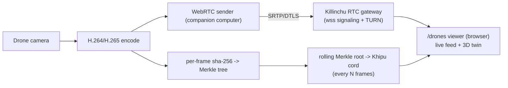

# DRONE_FLEET_DB_SCHEMA — Canonical Models for `/drones` + Own-Fleet Ops

**Layer:** Killinchu · drone database
**Goal:** 50+ canonical models for the `/drones` endpoint, indexed by manufacturer, type, country,
role — plus own-fleet operational fields and per-drone live WebRTC video integration.
**Schema basis:** `ADVERSARY_DRONE_CATALOG.md` fields + own-fleet operational fields.
**Sign-off:** Yachay-extension.

> The DB seeds the counter-UAS rule engine's priors (expected altitude/speed envelope, expected
> Remote-ID behaviour, serial-prefix → platform) and labels swarm-topology clusters (killinchu
> thesis ch.9). Own airframes additionally carry the operational fields that link to their
> `DroneTwin`.

---

## 1. Record schema

Adversary/catalog fields (from `ADVERSARY_DRONE_CATALOG.md`) + own-fleet operational fields:

```ts
interface DroneModel {
  // --- catalog identity / indexing ---
  modelId: string;            // PK, slug e.g. "mq-9-reaper"
  name: string;
  manufacturer: string;       // INDEX
  country: string;            // INDEX (country of origin)
  type: 'fixed-wing'|'rotary'|'vtol'|'multirotor'|'loitering-munition'|'hale'|'male'; // INDEX
  role: ('isr'|'strike'|'maritime-isr'|'logistics'|'counter-uas'|'training'|'commercial'|'mapping')[]; // INDEX
  uasGroup: 1|2|3|4|5;        // DoD UAS Group (INDEX)
  alignment: 'allied'|'adversary'|'dual-use'|'commercial';

  // --- envelope (seeds rule-engine priors) ---
  envelope: {
    mtowKg?: number;
    cruiseKt?: number; dashKt?: number;
    ceilingM?: number;
    rangeKm?: number; enduranceHr?: number;
    wingspanM?: number; lengthM?: number;
  };

  // --- telemetry expectations (counter-UAS priors) ---
  telemetry: {
    expectsRemoteId: boolean;          // commercial/allied true; adversary loitering often false (dark-drone prior)
    adsbCapable: boolean;              // fixed-wing/large UAS true
    serialPrefixes?: string[];         // ICAO24 block / RID prefix for fingerprinting
    mavlinkStack?: 'px4'|'ardupilot'|'proprietary'|'none';
  };

  // --- armament / payload (catalog) ---
  payload?: { warheadKg?: number; munitions?: string[]; sensors?: string[] };
  unitCostUsd?: number;
  sources: string[];                   // primary-source URLs

  // --- OWN-FLEET OPERATIONAL FIELDS (only for alignment=='allied' SZL-operated) ---
  ownFleet?: {
    operated: boolean;
    twinRefs: string[];                // FK -> DroneTwin.twinId for each tail of this model
    firmwareBaseline: string;          // expected fw version (golden for T11)
    otaChannel: 'stable'|'beta';
    geofenceProfileId?: string;
    videoStream?: VideoStreamBinding;  // see §4
  };
}
```

Indexes: `manufacturer`, `country`, `type`, `role`, `uasGroup`, `alignment`, and `serialPrefixes`
(for inbound-telemetry → model resolution).

---

## 2. The catalog (50+ canonical models)

Specs sourced from `killinchu_research_notes.md` (primary URLs there) and the cited primary sources;
own-fleet rows are SZL-operated reference airframes.

### Allied / US military
| # | modelId | manufacturer | country | type | role | Group | key envelope |
|---|---|---|---|---|---|---|---|
| 1 | mq-9-reaper | General Atomics | USA | male | isr,strike | 5 | MTOW 10,500 lb, ceil ~50k ft, range 1,000 nmi |
| 2 | mq-1c-gray-eagle | General Atomics | USA | male | isr,strike | 4 | 309 km/h, range 370 km, ceil 8,839 m |
| 3 | mq-1-predator | General Atomics | USA | male | isr,strike | 4 | legacy MALE |
| 4 | rq-4-global-hawk | Northrop Grumman | USA | hale | isr | 5 | 629 km/h, range 22,800 km, 34+ hr |
| 5 | mq-4c-triton | Northrop Grumman | USA | hale | maritime-isr | 5 | Navy Global Hawk variant |
| 6 | rq-170-sentinel | Lockheed Martin | USA | fixed-wing | isr | 4 | stealth ISR |
| 7 | mq-8-fire-scout | Northrop Grumman | USA | rotary | isr | 4 | VTOL ISR |
| 8 | rq-7b-shadow | AAI/Textron | USA | fixed-wing | isr | 3 | tactical ISR |
| 9 | rq-21-blackjack | Boeing/Insitu | USA | fixed-wing | isr | 3 | USMC/Navy ISR |
| 10 | scaneagle | Boeing/Insitu | USA | fixed-wing | isr | 2 | catapult ISR |
| 11 | rq-11-raven | AeroVironment | USA | fixed-wing | isr | 1 | hand-launched, most-produced US UAS |
| 12 | rq-20-puma | AeroVironment | USA | fixed-wing | isr | 1 | hand-launched ISR |
| 13 | switchblade-300 | AeroVironment | USA | loitering-munition | strike | 1 | 3.27 kg, 30 km, 20+ min |
| 14 | switchblade-600 | AeroVironment | USA | loitering-munition | strike | 2 | 29.5 kg, 40+ km, anti-armor |
| 15 | phoenix-ghost | AEVEX Aerospace | USA | loitering-munition | strike | 2 | for Ukraine |
| 16 | altius-600 | Anduril (Area-I) | USA | loitering-munition | isr,strike | 2 | air-launched effects |
| 17 | altius-700 | Anduril (Area-I) | USA | loitering-munition | isr,strike | 3 | larger ALE |
| 18 | v-bat | Shield AI | USA | vtol | isr | 3 | VTOL ducted-fan ISR |
| 19 | flexrotor | Aerovel/Airbus | USA | vtol | isr | 2 | long-endurance VTOL |
| 20 | ghost-x | Anduril | USA | rotary | isr | 2 | autonomous recon sUAS |

### Allied — other nations
| # | modelId | manufacturer | country | type | role | Group | key envelope |
|---|---|---|---|---|---|---|---|
| 21 | bayraktar-tb2 | Baykar | Turkey | male | isr,strike | 3 | 222 km/h, range 300 km, MTOW 1,200 kg |
| 22 | bayraktar-akinci | Baykar | Turkey | male | isr,strike | 5 | heavy MALE |
| 23 | heron-1 | IAI | Israel | male | isr | 4 | MALE ISR |
| 24 | hermes-900 | Elbit | Israel | male | isr | 4 | MALE ISR |
| 25 | harop | IAI | Israel | loitering-munition | strike | 3 | anti-radiation loitering |
| 26 | watchkeeper-wk450 | Thales/Elbit | UK | fixed-wing | isr | 3 | Army ISR |
| 27 | eurodrone | Airbus/Leonardo/Dassault | EU | male | isr | 5 | MALE program |
| 28 | aliaca | Survey Copter (Airbus) | France | fixed-wing | isr | 2 | tactical ISR |

### Adversary / contested
| # | modelId | manufacturer | country | type | role | Group | key envelope |
|---|---|---|---|---|---|---|---|
| 29 | shahed-136 | HESA | Iran | loitering-munition | strike | 3 | ~200 kg, 185 km/h, 1,000–2,500 km, 30–50 kg HE |
| 30 | shahed-131 | HESA | Iran | loitering-munition | strike | 2 | 15 kg warhead, ~900 km |
| 31 | geran-2 | (Russia-operated Shahed-136) | Russia | loitering-munition | strike | 3 | Russian Shahed-136 |
| 32 | lancet-3 | ZALA/Kalashnikov | Russia | loitering-munition | strike | 1 | 12 kg MTOW, 40 km, ~3 kg HE, EO/TV terminal |
| 33 | orlan-10 | STC | Russia | fixed-wing | isr | 2 | tactical ISR/arty-spotting |
| 34 | forpost | Russia (IAI-derived) | Russia | male | isr | 4 | MALE ISR |
| 35 | wing-loong-ii | CAIG/CASC | China | male | isr,strike | 5 | 370 km/h, 32 hr, MTOW 4,200 kg, 480 kg ord |
| 36 | ch-4-rainbow | CASC | China | male | isr,strike | 4 | Reaper-class export |
| 37 | ch-5-rainbow | CASC | China | male | isr,strike | 5 | heavy MALE export |
| 38 | wing-loong-i | CAIG | China | male | isr,strike | 4 | MALE export |
| 39 | tb-001-scorpion | Tengoen | China | male | isr | 5 | twin-boom MALE |
| 40 | wj-700 | CASIC | China | male | isr,strike | 5 | high-altitude high-speed |

### Dual-use / commercial (FPV & quad threat tier + own ops)
| # | modelId | manufacturer | country | type | role | Group | notes |
|---|---|---|---|---|---|---|---|
| 41 | dji-mavic-3 | DJI | China | multirotor | commercial,isr | 1 | dominant small-quad; used by both sides |
| 42 | dji-matrice-300 | DJI | China | multirotor | commercial,mapping | 1 | enterprise quad, improvised drops |
| 43 | dji-matrice-350-rtk | DJI | China | multirotor | commercial,mapping | 1 | RTK survey |
| 44 | autel-evo-ii | Autel | China | multirotor | commercial,isr | 1 | prosumer quad |
| 45 | parrot-anafi-usa | Parrot | France | multirotor | isr | 1 | NDAA-compliant sUAS |
| 46 | skydio-x10 | Skydio | USA | multirotor | isr | 1 | autonomous obstacle-avoid |
| 47 | fpv-generic-5in | (various) | global | multirotor | strike | 1 | 5" racing FPV; munition-drop threat |
| 48 | quantum-vector | Quantum Systems | Germany | vtol | isr,mapping | 2 | fixed-wing VTOL ISR |
| 49 | wingtra-one | WingtraOne | Switzerland | vtol | mapping | 1 | survey VTOL |

### SZL own-fleet reference airframes (alignment=allied, ownFleet.operated=true)
| # | modelId | manufacturer | country | type | role | Group | stack |
|---|---|---|---|---|---|---|---|
| 50 | holybro-x500-v2-pixhawk6x | Holybro | open | multirotor | training,isr | 1 | PX4, DICE-capable FMUv6X |
| 51 | cubepilot-orange-quad | CubePilot | open | multirotor | mapping | 1 | ArduPilot, secure bootloader |
| 52 | auterion-skynode-astro | Auterion/Freefly | USA/CH | multirotor | isr | 1 | Auterion Enterprise PX4 + Skynode OTA |
| 53 | nxp-hovergames-drone | NXP | open | multirotor | training | 1 | PX4 reference |
| 54 | quad-arducopter-ref | (SZL build) | open | multirotor | counter-uas | 1 | ArduPilot, MAVLink2 signed |

**Total: 54 canonical models** across allied, adversary, dual-use/commercial, and own-fleet tiers,
indexed by manufacturer, type, country, role, Group, and alignment.

---

## 3. Worked record (own-fleet, full)

```json
{
  "modelId": "holybro-x500-v2-pixhawk6x",
  "name": "Holybro X500 V2 (Pixhawk 6X)",
  "manufacturer": "Holybro", "country": "open",
  "type": "multirotor", "role": ["training","isr"], "uasGroup": 1, "alignment": "allied",
  "envelope": { "mtowKg": 2.4, "cruiseKt": 30, "ceilingM": 4000, "enduranceHr": 0.4 },
  "telemetry": { "expectsRemoteId": true, "adsbCapable": false,
                 "serialPrefixes": ["1581F4F2"], "mavlinkStack": "px4" },
  "payload": { "sensors": ["eo-camera","gps-rtk"] },
  "sources": ["https://docs.px4.io/main/en/frames_multicopter/holybro_x500v2_pixhawk6x.html"],
  "ownFleet": {
    "operated": true,
    "twinRefs": ["9f2c… (KESTREL-014)", "a3b1… (KESTREL-022)"],
    "firmwareBaseline": "PX4 v1.15.4 (git a1b2c3d)",
    "otaChannel": "stable",
    "geofenceProfileId": "training-range-A",
    "videoStream": {
      "protocol": "webrtc", "codec": "h264",
      "signalingUrl": "wss://killinchu.szlholdings.dev/rtc/9f2c…",
      "khipuFrameStamping": true, "merkleRootCordId": "cord-91200"
    }
  }
}
```

Adversary records omit `ownFleet` and typically set `telemetry.expectsRemoteId=false` (the
dark-drone prior the counter-UAS engine keys on, per `470_WAMANI_DRONE_PIVOT_PLAN.md`: "dark-drone
detection is literally the dark-vessel algorithm with a one-line config change").

---

## 4. Live WebRTC video + Khipu-receipt-stamped frames (per-drone)

Each own-fleet airframe exposes a live video feed integrated per-drone:



- **Transport:** WebRTC (SRTP/DTLS) for low-latency live view; the Killinchu RTC gateway does
  signaling (`wss`) + TURN relay. The `/drones` endpoint renders the live feed beside the 3D twin
  (`THREE_JS_TWIN_VIEWER.md`).
- **Khipu frame stamping:** each frame is hashed (`h_i = sha256(frame_i)`); a rolling **Merkle root**
  is anchored to the Khipu DAG every N frames (`videoStream.merkleRootCordId`). This makes the live
  feed **tamper-evident** and shares one chain-of-custody with the forensic video
  (`REMOTE_FORENSICS.md` §3) — a frame shown live can later be proven authentic with a Merkle
  inclusion proof.
- **Integration with twin:** the stream binding lives in `ownFleet.videoStream`; the viewer pulls
  `DroneTwin` for overlays (health heatmap, tamper arrows) and the WebRTC feed for the camera view,
  in one operational picture (the Anduril-Lattice IA pattern from `450_3D_LEADERS_ADOPTION.md`).

`VideoStreamBinding` type:
```ts
interface VideoStreamBinding {
  protocol: 'webrtc'; codec: 'h264'|'h265';
  signalingUrl: string;            // wss
  khipuFrameStamping: boolean;
  merkleRootCordId?: string;       // current rolling Merkle root anchor
  frameStampInterval?: number;     // N frames per anchor
}
```

---

## 5. `/drones` endpoint behaviour

- `GET /api/killinchu/v1/drones?manufacturer=&country=&type=&role=&group=&alignment=` — filtered
  catalog list (the 54 models), each with envelope + telemetry priors.
- `GET /api/killinchu/v1/drones/:modelId` — full record; own-fleet records include `ownFleet.twinRefs`.
- `GET /api/killinchu/v1/drones/:modelId/tails` — for own-fleet, resolves each `twinRef` to a live
  `DroneTwin`.
- Inbound telemetry (Remote-ID/ADS-B) resolves to a model via `serialPrefixes`/`icao24` block for
  classification and swarm labelling.

---

## 6. Honest status

- Envelope/spec figures are sourced (primary URLs in `killinchu_research_notes.md`); a handful of
  adversary figures are open-source estimates and labelled as such in the catalog `sources`.
- Own-fleet rows (50–54) are reference airframes for the SZL build; live `twinRefs` populate as real
  airframes are enrolled (DICE provisioning per `DRONE_IDENTITY_PROVENANCE.md`).
- WebRTC stamping is real (sha-256 + Merkle); the anchoring DSSE signature is `PLACEHOLDER` until
  Sigstore CI is wired (Doctrine v11), surfaced not hidden.

## Primary sources

- US military UAS groups + platform specs (Reaper/Gray Eagle/Global Hawk, Switchblade, etc.): see `killinchu_research_notes.md` §2–3 (each row carries its primary URL — af.mil fact sheets, AeroVironment, ArmyRecognition, GlobalMilitary, Wikipedia)
- ASTM F3411-22a Remote ID (UAS-ID, serial prefixing): <https://www.astm.org/f3411-22a.html>
- ADS-B / Mode-S decode (pyModeS): <https://github.com/junzis/pyModeS>
- Auterion Skynode (own-fleet OTA platform): <https://docs.auterion.com/vehicle-operation/settings-and-maintenance/skynode-software-update>
- Anduril Lattice single-operational-picture IA: `450_3D_LEADERS_ADOPTION.md` (drone-tracking leaders)
- Internal: `ADVERSARY_DRONE_CATALOG.md` field set; `470_WAMANI_DRONE_PIVOT_PLAN.md` (dark-drone prior); killinchu thesis ch.9 (DB seeds rule-engine priors + swarm labelling)

*Signed: Yachay-extension · Doctrine v12 (PURIQ) · 2026-05-31*
