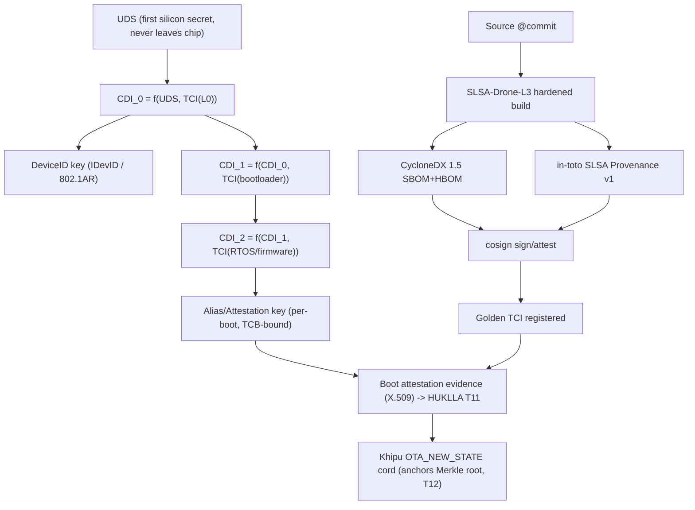

# DRONE_IDENTITY_PROVENANCE — Hardware Root of Trust to First Silicon

**Layer:** Killinchu · identity & provenance sub-doctrine
**Goal:** Every drone, every boot, a full provenance chain from the running firmware all the way down
to first silicon — cryptographically, not by paperwork.
**Defines:** **SLSA-Drone-L3** as a new SZL sub-doctrine.
**Sign-off:** Yachay-extension.

> The drone's identity is not its serial sticker. It is the DICE-derived key that *cannot exist*
> without a precise chain of TCB components — so the identity itself attests the running stack.

---

## 1. DICE / RIoT hardware identity

DICE (Device Identifier Composition Engine) is a hardware Root of Trust. Per the
[TCG DICE Layering Architecture r19](https://trustedcomputinggroup.org/wp-content/uploads/DICE-Layering-Architecture-r19_pub.pdf):

- **UDS (Unique Device Secret)** — the per-device hardware secret, provisioned at manufacture, that
  **never leaves the silicon**. This is "first silicon" — the bottom of our chain.
- **CDI (Compound Device Identifier)** — "a secret value resulting from the application of a
  cryptographic one-way function to a combination of a DICE Layer's secret value and the measurement
  of the subsequent DICE Layer." The initial CDI is computed by the DICE HRoT from UDS + the
  measurement of layer 0.
- **TCI (Trusted Component Identifier)** — the digest (measurement) of each component's
  firmware/software; for non-measurable components, a hardware product identifier may be used.
- **DeviceID key** — "an asymmetric key that authenticates a combination of device and firmware,"
  derived from the CDI. Enrollable as an IEEE 802.1AR **IDevID/LDevID**.
- **Alias / Attestation key** — re-derived every boot from the *current* CDI; because the CDI folds
  in each layer's TCI, the Alias key **changes if any measured layer changes**. This is RIoT's
  layered-identity property: "an identity that cannot exist without a precise chain of TCB
  components."

X.509 attestation evidence and endorsement extensions follow the
[TCG DICE Attestation Architecture](https://trustedcomputinggroup.org/resource/dice-attestation-architecture/)
and certificate shapes the [DICE Certificate Profiles](https://trustedcomputinggroup.org/wp-content/uploads/DICE-Certificate-Profiles-v1.1_pub.pdf).

**Layering for a Pixhawk-class drone (layer 0 convention = layer receiving the first CDI):**

```
[ Silicon: UDS ] --(one-way fn + measure L0)--> CDI_0
   L0  BootROM / immutable first-stage     -> DeviceID key (IDevID)   [device+fw identity]
   L1  Secure bootloader (ArduPilot/PX4)   -> CDI_1 = f(CDI_0, TCI(L1))
   L2  RTOS (NuttX) / firmware             -> CDI_2 = f(CDI_1, TCI(L2)) -> Alias key (per-boot)
   L3  Mission/payload app                 -> CDI_3 = f(CDI_2, TCI(L3))
```

Each arrow is a measured-boot step; the Alias key at the top is presented as the drone's attestation
identity (HUKLLA **T11**). Verifying it against golden TCIs proves the *entire* stack from silicon up.

---

## 2. CycloneDX 1.5 SBOM + HBOM

Every firmware build ships a [CycloneDX 1.5](https://cyclonedx.org/specification/overview/) bill of
materials. CycloneDX 1.5 captures software, **hardware devices (HBOM)**, ML models, source, and
configurations, with manufacturer, license, and full **pedigree/provenance** per component, plus a
dependency graph
([CycloneDX v1.5 release](https://cyclonedx.org/news/cyclonedx-v1.5-released/)). For a drone we emit:
- **SBOM** — every firmware package + transitive dependency (PX4/ArduPilot modules, libraries).
- **HBOM** — flight controller SoC, IMU/GPS/baro chips, ESCs, radio, camera — the physical parts.
- `metadata.component` = the drone build; `metadata.manufacturer`/`supplier` populated.
- `sbomHash` (sha-256 of the doc) lands in the twin's `identity.sbomHash` and is referenced by the
  OTA provenance subject.

CycloneDX is also a recognized in-toto predicate type (`https://cyclonedx.org/bom`), so the SBOM
slots directly into the attestation chain.

---

## 3. in-toto attestation chain

[in-toto](https://github.com/in-toto/attestation/blob/main/spec/predicates/link.md) statements bind
every step of the supply chain to a subject digest:
- **build** → SLSA Provenance v1 predicate (subject = firmware digest) — see `SECURE_OTA.md`.
- **SBOM** → CycloneDX predicate (subject = firmware digest).
- **forensic capture** → forensic-bundle predicate (subject = artifact digests) — see `REMOTE_FORENSICS.md`.
- **field attestation** → DICE evidence (subject = Alias key) bridging build-time provenance to
  run-time identity.

The set of statements forms the provenance graph; cosign verifies authenticity, and the digests
chain into the Khipu DAG.

---

## 4. SLSA-Drone-L3 (new sub-doctrine)

**Definition.** SLSA-Drone-L3 is SZL's binding of [SLSA v1.1 Build L3](https://slsa.dev/spec/v1.1/levels)
("hardened build platform … non-falsifiable provenance") to drone firmware, plus drone-specific
device-side requirements. A firmware artifact is **SLSA-Drone-L3** iff:

| Req | Source of requirement | Binding for drone firmware |
|---|---|---|
| D1 | SLSA L1 | Provenance exists (SZL already at L1) |
| D2 | SLSA L2 | Provenance signed by a hosted platform (cosign) |
| D3 | SLSA L3 | Build on a **hardened, isolated** platform; provenance **platform-generated**, non-falsifiable |
| D4 | SLSA L3 | Hermetic, reproducible firmware build (PX4/ArduPilot deterministic build) |
| D5 | CycloneDX 1.5 | SBOM+HBOM emitted and attested with the artifact |
| D6 | TCG DICE | Artifact's golden TCI chain registered; device boot-attests (T11) |
| D7 | NIST SP 800-193 | RTU/RTD/RTRec present: signed updates, boot-time integrity verify, signed recovery image |
| D8 | Killinchu | New-state Khipu receipt anchors the firmware Merkle root (T12) on commit |

D1–D4 are the standard SLSA ladder (this is the **L1→L3 upgrade** of SZL's path, correcting the
previously mis-claimed L3 noted in Doctrine v11). D5–D8 are the drone-specific extensions that make
the provenance *verifiable on the airframe at boot*, not just at build time.

---

## 5. NIST SP 800-193 mapping (platform firmware resiliency)

[NIST SP 800-193](https://csrc.nist.gov/pubs/sp/800/193/final) defines three properties, each backed
by a Root of Trust; SLSA-Drone-L3 satisfies them:

| NIST property | Root of Trust | Killinchu mechanism |
|---|---|---|
| **Protection** | RTU (Root of Trust for Update) | OTA images authenticated by digital signatures (cosign + ArduPilot signed bootloader); critical params updated only via authorized channels (T17, T20) |
| **Detection** | RTD (Root of Trust for Detection) | DICE measured boot verifies firmware integrity at boot (T11); Merkle re-verify (T12) |
| **Recovery** | RTRec (Root of Trust for Recovery) | A/B rollback to last-good attested slot; recovery image verified by signature (`SECURE_OTA.md` §7) |

---

## 6. Full chain to first silicon (one diagram)



Build-time provenance (right) and run-time identity (left) **meet at the golden TCI**: the build
declares what the measured stack *should* be; DICE proves what it *is*; the Khipu cord records the
agreement. That junction is the full chain "to first silicon."

---

## 7. Honest status

- DICE/RIoT requires a DICE-capable secure element or an emulated DICE layer. Stock Pixhawk boards
  vary; where absent, identity falls back to ArduPilot signed-bootloader + manufacturer serial and
  `dice.*` is `PLACEHOLDER` (surfaced).
- SLSA-Drone-L3 D3/D4 require building the hardened isolated CI; SZL is honestly at **L1** today
  (Doctrine v11), and this sub-doctrine is the defined upgrade path, not a shipped claim.
- CycloneDX SBOM generation is available today; HBOM completeness depends on supplier part data.

## Primary sources

- TCG DICE Layering Architecture r19 (UDS, CDI, DeviceID, TCI, layered identity): <https://trustedcomputinggroup.org/wp-content/uploads/DICE-Layering-Architecture-r19_pub.pdf>
- TCG DICE Attestation Architecture (X.509 evidence/endorsement): <https://trustedcomputinggroup.org/resource/dice-attestation-architecture/>
- TCG DICE Certificate Profiles v1.1: <https://trustedcomputinggroup.org/wp-content/uploads/DICE-Certificate-Profiles-v1.1_pub.pdf>
- OWASP CycloneDX 1.5 (SBOM/HBOM, pedigree/provenance): <https://cyclonedx.org/specification/overview/> · <https://cyclonedx.org/news/cyclonedx-v1.5-released/>
- in-toto attestation framework: <https://github.com/in-toto/attestation/blob/main/spec/predicates/link.md>
- SLSA v1.1 build levels: <https://slsa.dev/spec/v1.1/levels>
- NIST SP 800-193 Platform Firmware Resiliency (RTU/RTD/RTRec): <https://csrc.nist.gov/pubs/sp/800/193/final>
- ArduPilot Secure Firmware (signed bootloader): <https://ardupilot.org/dev/docs/secure-firmware.html>

*Signed: Yachay-extension · Doctrine v12 (PURIQ) · 2026-05-31*
